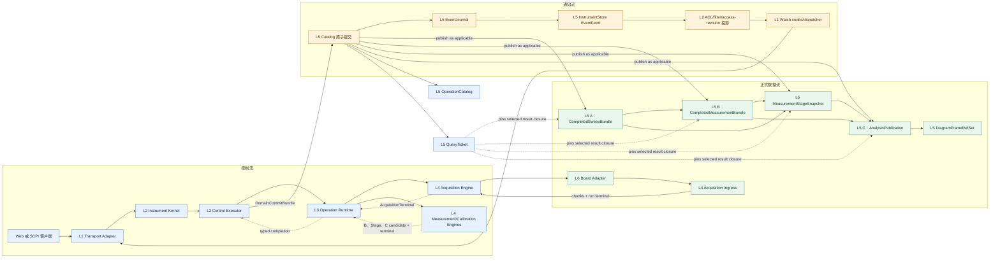
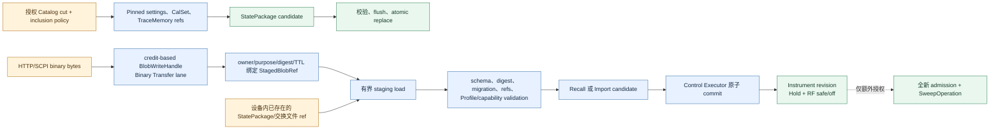

# VNA 端到端数据流与生命周期契约

> 状态：候选架构 v0.1；本文冻结跨层数据与所有权边界，不冻结尚待黄金数据验证的数值算法、厂商 SCPI 方言或公司底软 ABI。

本文回答的不是“某个类调用哪个函数”，而是一次 VNA 工作从 Web/SCPI 命令进入，到单板接收机观测、校准、迹线、Marker、Limit、Diagram、查询与导出之间，**什么数据以什么身份、由谁拥有、何时成为正式事实、失败时谁可以继续使用旧结果**。如果还不清楚每个 Module 属于哪一层，请先读 [VNA 分层架构与跨层流动](layered-architecture.md)；方法级 accepted/terminal/lease 规则见[跨层 Interface 契约](interface-contracts.md)，底软回调和单板字段见 [Board Adapter 契约](board-adapter-contract.md)；整体范围仍以 [整体系统架构](system-architecture.md) 和 [176 项功能对齐矩阵](feature-alignment-matrix.md) 为准。

本文统一采用以下跨层读法：Command/Query 从 L1 进入 L2；L2 把冻结工作交给 L3，L3 调度 L4；单板 chunk 从 L6 进入 L4；L4 只返回 candidate/typed result，经 L3 回到 L2；只有 L2 可以用 `DomainCommitBundle` 让 L5 的正式事实原子可见；Query Result/Event 再由 L5 经 L2/L1 返回。Preview 由 L2/L3 签发的 `AuthorizedPreviewPublisher` 从 L4 进入有界 Hub，再由 L1 消费授权 mailbox；不是 L4 直连 Web callback。

## 1. 先冻结三条正交的流

系统中同时存在三条流，不能用一个 `completed`、一个全局 busy 标志或一个消息总线混在一起：

| 流 | 传递内容 | 权威来源 | 不传递什么 |
|---|---|---|---|
| 控制流 | 外部 `CommandEnvelope`、内核内部 revision/precondition、Operation、取消、deadline、完成 fence | Instrument Kernel、Control Executor、OperationCatalog | 大数组、浏览器视图状态和外部 revision |
| 正式数据流 | Manifest、A/B/Stage/C、Calibration Observation、质量平面、不可变 Buffer | Measurement Data Store / SnapshotCatalog | “当前选择”、Socket、JSON、厂商 SDK 对象 |
| 通知流 | 内部 catalog revision/event cursor、对象 ID、状态变化摘要、显式 gap；公共投影只含业务事件与不透明 Watch token | EventJournal → InstrumentStore EventFeed → L2 Watch 投影 → L1 Dispatcher | 正式事实所有权、等待正确性、数组载荷和公共 revision |

`Operation` 表示工作生命周期，不是数据；`Event` 表示“某事实已经提交”的提示，不是事实；`QueryTicket` 表示某个调用者访问已冻结结果的能力，也不是数据。三者都可以引用同一 Snapshot ID，但互不拥有对方。



### 1.1 Web 与 SCPI 只在边界上不同

Transport 先完成认证、语法和 wire codec，再把两种入口归一成相同的有类型 Envelope：

```cpp
struct RequestContext {
    RequestId request_id;
    AuthenticatedActorRef actor;
    SessionId session;
    CompatibilityProfileRevision profile;
    MonotonicDeadline deadline;
    SessionSequence sequence;
    Optional<CausalPredecessor> predecessor;
};

struct CommandEnvelope {
    TargetSelector target;
    OptionalIdempotencyKey idempotency;
    TypedCommand command;
};

struct QueryEnvelope {
    TargetSelector target;
    TypedQuery query;
};
```

`RequestContext` 作为 `submit/admit` 的独立参数，是 transport-auth、session、Profile、deadline 和因果顺序的唯一来源；Envelope 不再内嵌第二份 context，也不接收 Web/SCPI 提供的 revision。SCPI parser context、selection 与错误队列仍是 Session 状态，但 Adapter 不能把字符串路径直接传进业务模块；Web JSON DOM、HTTP 对象也不能穿过 Kernel Interface。Kernel 在 Control Admission Cut 中重新验证权限，从同一权威 Catalog cut 解析确切 target ID，并冻结内部 Profile revision、对象 revisions、typed stage、父 refs 和 ordering；Adapter 既不能选择“当前数组”，也不能读取 revision 后代客户端补入。普通配置窄 patch 在该 cut 的最新状态上应用；同字段以后接受且成功提交者生效，失败命令不产生状态变化，也不要求客户端重试 revision。`QueryAdmission` 是 `InlineResult | ReadyTicket | PendingTicket | RejectedQuery` 的有类型和，只有有硬大小上限的状态/metadata 可以 inline。

领域 commit 产生的通知统一为：

```cpp
struct EventRecord {
    EventCursor cursor;
    CatalogRevision catalog_revision;
    EventKind kind;
    TypedObjectRef subject;
    OptionalRevision new_revision;
    VisibilityScope visibility;
    BoundedEventProjection projection;
};
```

Event projection 只能是有上限的摘要，不能因某个 Web 页面需要方便就塞入数组或私有字段。

`EventRecord` 是 L2/L5 内部事实，不直接作为 Web wire schema。L2 只投影稳定对象 ID、业务事件、有界业务摘要与不透明 `WatchResumeToken`；`catalog_revision`、`new_revision`、内部 cursor/boot/epoch 不序列化给 Web，SCPI raw TCP 也不接收该事件流。

## 2. 正式数据对象不是“一条数组”

项目采用 A/B/Stage/C 四种角色，其中 Stage 是 A/B 的惰性分支，不是与 A/B/C 并列的第四代发布层：

| 对象 | 含义 | 直接生产者 | 典型消费者 | 正式性与失败边界 |
|---|---|---|---|---|
| `ReceiverObservationChunk` | 底软一次回调交付的部分接收机复数观测与质量 | Board Adapter | Acquisition Ingress / Builder | 临时对象；不能直接被查询、校准或画图 |
| `PreviewTile` | 从当前 chunk 有界派生的暂态显示数据 | Preview 子图 | Web Preview 通道 | 可合并、抽稀、丢弃；永不晋升为正式结果 |
| A `CompletedSweepBundle` | 一个 Logical Sweep 的完整采集事实 | Network Observation Builder | RF graph、校准采集、receiver-stage query | 全部 required observations 与 terminal ledger 闭合后才发布 |
| `AverageAccumulatorSnapshot` | 某一 average generation 的不可变累加状态 | Measurement Publication lane | 下一次 average update、诊断 | 失败/取消 Sweep 不改变它；clear 建立新 generation |
| B `CompletedMeasurementBundle` | 按 Profile 完成 ratio、平均、用户修正等后的网络测量事实 | Measurement Pipeline | Live Trace、网络查询、校准验证、导出 | 每个被接受贡献必须发布；RF graph 失败不覆盖 last-good B |
| `MeasurementStageSnapshot` | 从 canonical A/B roots 按完整 graph revision 惰性物化的非 Trace 阶段 | Stage Materializer | Trace、Touchstone、receiver/raw/corrected query | 不串联另一个 Stage 作为父；中间节点是私有缓存实现 |
| `CalibrationObservationSnapshot` | 某校准步骤一次可求解的正式观测 | Calibration Acquisition flow | Calibration Solver | 绑定标准件、方法、实际轴、路由、独立平均闭包与本 attempt 的 A/受许可 Stage；排除 DUT B 和用户修正 |
| `TraceEvaluationSnapshot` | 一条 Trace 在冻结输入与 pipeline/projection 上的全分辨率结果 | Trace Evaluator | Marker、typed single-publication evaluator、导出 | 不包含 Diagram 像素或浏览器抽稀 |
| C `AnalysisPublication` | Trace、Marker、普通 Limit、Ripple 与明确几何等单次子结果的原子闭包 | Control Executor 提交 evaluator candidate | Diagram、SCPI raw analysis query | 单 Trace/单次 evaluator 失败不回滚 B 或其他 C；已发布 children 永不被后续 Sweep 改写 |
| `ProductionQualificationSequence` | policy/context 下的 next ordinal、有界 pending raw bundle 队列和 Active/Faulted 状态 | 武装策略的 raw C commit；生产 commit 消费队首 | Production Qualification Evaluator、准入和审计 | raw C 与 queue append 同一 commit；只允许处理队首，失败不得跳项；满队列在参与轮次开始前拒绝或 Hold |
| `ProductionQualificationSnapshot` | 连续 N、锁存、bin、批次/QMS 的跨发布派生事实 | Production Qualification Evaluator + Control Executor commit | Web/SCPI production query、Handler、报告 | 只消费 sequence 队首 ordered raw result refs 与 prior state；成功提交同批消费队首并推进 cursor，失败不回滚或改写 C/raw result |
| `DiagramFrameRefSet` | 运行期 Diagram 刷新选择的确切 C publication 集合 | Display/View selector | Browser renderer | 只选择结果，不拥有测量或分析数据，也不改写 Workspace revision |

Production Qualification 是从 C/raw results 派生的独立事实，不是 A/B/Stage/C 之外的新测量数据层，也不是 Diagram 状态。它的顺序状态和提交失败边界必须单独建模。

`SnapshotHeader` 只统一稳定 ID、schema、build、commit revision、时间、Profile refs 与质量摘要；各层使用有类型的 provenance variant，不能把所有来源塞入一个可任意扩展的字符串字典。`OperationId`、`LogicalSweepId`、`BoardRunId`、`CompletedSweepSnapshotId`、`CompletedMeasurementSnapshotId`、`MeasurementStageSnapshotId`、`AnalysisPublicationId`、`QueryTicketId` 和 digest 都是不同类型，禁止隐式转换。

### 2.1 A 层完成账本

A 不是收到一个 terminal 回调就把当前数组封口。每个候选 A 都维护一组 `BoardRunEvidence`；默认单板集合只有一个元素，可选组合扫频才有多个。每个元素包含：

- `manifest_id + BoardRunId + run_generation`；
- 从该 `PreparedExecutionManifest` 展开的 expected observation map；
- 实际收到的 source-state、receiver path、axis range、point coverage；
- chunk sequence 范围、重复/缺失/乱序检查；
- 唯一 run terminal、RF/post-run readback 与诊断证据；
- 逐 Sweep、逐 receiver 或逐 point 的真实 Quality Plane。

`CompletedSweepBundle` 再绑定 `LogicalSweepId + BoardRunEvidence[]`。只有所有账本全部闭合、实际轴/路由/配置 revision 相容且 terminal 成功，Builder 才能产生 A candidate。缺块、重复冲突、必要方向失败、terminal 后回调或无法确认 run generation 时都不发布 A。

### 2.2 质量与数据同路传播

质量不是日志里的附言，也不能靠一个 `valid` 布尔值覆盖所有层。每个正式数值对象携带有类型的 `QualityPlane`：

```cpp
struct QualityPlane {
    QualityLayout layout;                 // Sweep / receiver / path / point / matrix element
    ReadOnlyBuffer<ValidityCode> validity;
    ReadOnlyBuffer<QualityFlags> flags;
    BoundedMetricPlanes metrics;
    QualityTransformRevision transform;
};
```

某一层没有逐点质量时就声明实际 granularity，不能伪造与数组等长的数据。ratio 除零、接收机过载、失锁、插值、病态矩阵、插补和 average count 都通过 graph 节点的 `quality transform` 形成下一层质量；Diagram 只呈现它，不重新判定。

## 3. 真正的字节如何移动

### 3.1 从底软回调到 A

1. Real/Mock/Replay Adapter 把底软数据规范化为 `ReceiverObservationChunk`。若底软 buffer 的生命周期可以转移，chunk 持有 move-only `AcquisitionChunkLease`；若底软要求回调返回后立即复用内存，Adapter 必须在回调边界把数据复制到项目固定 Buffer Pool。未得到底软 ABI 证据前不承诺零拷贝。
2. `BoardRunSink` 把该 lease **唯一移动**到有界 Acquisition Ingress。Adapter 在移动后不再读写；terminal 后不得再投递。正式 chunk 不能像 Preview 一样丢弃：启动前的 Manifest/reservation 必须覆盖最大在途量；若底软声明可背压则按契约限流，否则任何意外 ingress/pool overflow 都使本次 run 失败并走 abort/drain，绝不能丢块后仍发布 A。
3. Network Observation Builder 是 chunk 数据的唯一长期拥有者。它校验 generation、sequence、manifest coverage、axis 与质量，并把合格 segment 组合进私有 A candidate。
4. Preview 不能与 Builder 同时消费同一个 move-only lease。它只能在 Builder 持有期间同步读取有界 `ChunkReadView`，或接收已经复制/派生且有独立所有权的 `PreviewTile`。Preview 队列满时丢 tile，不阻塞 Builder，也不延长 driver buffer 生命周期。
5. 唯一 terminal 与最后一个 chunk 建立 happens-before；账本闭合后，Builder 把 Buffer seal 为只读，并把 Buffer 所有权装入 A `PublicationCandidateBatch`，只向同层 `AcquisitionEngine` 返回 sealed candidate + ledger 或失败证据。`AcquisitionEngine` 再把自己从 `AcquisitionLeaseSet` 一直持有的 `AcquisitionContinuationOwner`、`PreviewFinalizationOwnerSet` 与 Builder 结果组装成封闭 `AcquisitionTerminal`，先回到 L3 Runtime，再由预留的 completion registration 交付 `RuntimeWorkCompletion` 给 L2 Control Executor；Builder 不能拥有或制造 continuation/Preview owner，L4 也不能绕过 L3 直接调用 L2。candidate 自带 `CandidateCommitLease`，L2 使用独立的 `DomainCommitPermit` 原子发布，不复用已被 Runtime dispatch 消费的 `WorkDispatchPermit`。成功提交后，该 Buffer 由 A/Data Store 继续拥有，任何 pool 都不得复用仍被 A 引用的内存；若 Builder 选择复制到预留的不可变 Snapshot Buffer，则只在复制与校验完成后释放原 lease。失败或取消时，L4 只归还未发布 Buffer、丢弃私有 candidate，并把 `PreviewFinalizationOwnerSet` 经 typed terminal 送回 L2；L2 在失败事实 commit 后才发送 Discarded/Failed，不制造补零 A。

```mermaid
sequenceDiagram
    participant BS as "公司底软或 Mock"
    participant BA as "Board Adapter"
    participant AI as "Acquisition Ingress"
    participant NB as "Network Observation Builder"
    participant AE as "L4 AcquisitionEngine"
    participant PV as "Preview 子图"
    participant RT as "L3 Operation Runtime"
    participant CE as "Control Executor"
    participant IS as "L5 InstrumentStore"

    BS->>BA: "a/b chunk + 底软质量"
    alt "底软允许转移 buffer 生命周期"
        BA->>AI: "move AcquisitionChunkLease"
    else "底软回调后立即复用 buffer"
        BA->>AI: "copy once into BufferPool and move lease"
    end
    AI->>NB: "move ReceiverObservationChunk"
    NB-->>PV: "bounded ChunkReadView 或独立 PreviewTile"
    PV-->>PV: "限速、抽稀；拥塞时丢弃"
    BA->>AI: "唯一 run terminal"
    AI->>NB: "terminal after final chunk"
    NB->>NB: "闭合 coverage、sequence、axis、quality ledger"
    alt "完整且成功"
        NB->>AE: "sealed A candidate + closed ledger"
        AE->>RT: "AcquisitionSucceeded: A candidate + retained continuation + Preview owner"
        RT->>CE: "RuntimeWorkCompletion via pre-reserved registration"
        CE->>CE: "split StoreJoinOwner; retain RuntimeEscrow + Preview"
        CE->>IS: "commit A + StoreJoinRequest + Operation patch + Event"
        IS->>IS: "install A; atomically form A + frozen-parent closure"
        IS-->>CE: "CommitSucceeded + Store-only handoff"
        CE->>CE: "combine handoff + RuntimeEscrow for successor dispatch"
    else "缺块、取消或失败"
        NB->>AE: "failure evidence; no candidate"
        AE->>RT: "AcquisitionFailed + retained PreviewFinalizationOwnerSet"
        RT->>CE: "typed Failed RuntimeWorkCompletion"
        CE->>IS: "commit authoritative failure fact"
        IS-->>CE: "CommitReceipt"
        CE-->>PV: "Discarded/Failed after commit"
    end
```

### 3.2 从 A 到 B、Stage 和 C

Worker 不直接修改 Catalog，也不直接发 Event。Control Executor 在派发前原子取得全部父输入的 `OperationInputLeaseSet`（公共接口名为 `PinnedInputSet`）和输出 reservation；worker 返回封闭的 `ProcessingSucceeded | ProcessingFailed | ProcessingDraining` terminal，只有成功分支携带不可见 `PublicationCandidateBatch`：

```cpp
ProcessingTerminal run(FrozenProcessingJob&& job,
                       PinnedInputSet&& inputs,
                       OutputReservation&& output,
                       ExecutionContext& context) noexcept;
```

- `BuildMeasurement` 从一个新 A 和冻结的 accumulator/correction/profile 输入产生同一 batch 内的 B 与新 accumulator candidates；
- `MaterializeStage` 从 canonical A/B roots 与一份完整 RF/network graph revision 产生最终 Stage；
- `EvaluateAnalysis` 从 B 或 `MeasurementStageInput`，以及 Frozen/Imported/Derived/Accumulator supplemental refs，产生 Trace/Marker/SegmentedLimit/Ripple/其他明确 typed evaluator/C batch candidate；它只做无状态单次求值。

跨发布 `ProductionQualificationEvaluator` 是独立工作：Control Executor 冻结 policy revision、sequence ID、expected ordinal、queue-entry ref、source/DUT context、队首 ordered raw refs、prior-state 与 reset/retry 规则并 pin 输入；worker 只返回新的 `ProductionQualificationSnapshot` candidate。它不读取 B/Trace 当前值，不进入 C batch，也不把结果写回任何 raw child。L2 只在队首与 prior state 仍匹配时，把 candidate、队首消费、cursor/state 推进和 production Head 原子提交。

`MeasurementStageSnapshot` 的 provenance 始终保存 canonical A/B roots。一个请求即使包含多级 fixture → renormalize → mixed-mode → gate，Materializer 也从 roots 按完整 graph revision 运行到目标 stage；Stage 不把另一个 Stage 当成正式父对象。内部中间结果可以缓存，但缓存淘汰不改变正式谱系。

`AnalysisInputRefSet` 的 primary source 至少允许：

```text
LiveMeasurementInput(measurement_snapshot_id)
MeasurementStageInput(measurement_stage_snapshot_id)
FrozenInput(frozen_or_memory_snapshot_id)
ImportedInput(imported_data_snapshot_id)
DerivedInput(ordered_upstream_analysis_publication_ids, generation_policy)
```

Memory Math、Hold 或 Ensemble Statistics 再添加有类型的 supplemental refs。所有父输入必须在派发前一次性 pin 成功；不能先读一个父，再等待另一个父时让前者被 retention 回收。取消或超时后若不可中断 worker 转入 Drain，`PinnedInputSet`、output reservation 和 lane capacity 一并转移，直到真实 terminal。成功返回时，batch 接管一个 `CandidateCommitLease`，在 Control Executor commit 或放弃整批之前继续保活所有结构共享的父 Buffer 与输出 reservation；worker return 与 publication commit 之间没有无主窗口。

```mermaid
flowchart LR
    A["A：完整采集事实"] --> Build["BuildMeasurement job"]
    Acc["冻结 Average accumulator"] --> Build
    Corr["Correction Set + MatchReport"] --> Build
    Build --> B["B：网络测量事实"]

    A --> Materialize["MaterializeStage job"]
    B --> Materialize
    Graph["完整 RF 或 Network graph revision"] --> Materialize
    Materialize --> Stage["MeasurementStageSnapshot"]

    B --> Evaluate["EvaluateAnalysis job"]
    Stage --> Evaluate
    Static["Frozen / Imported / Derived / Accumulator refs"] --> Evaluate
    TraceDef["Trace + Projection + Marker + typed evaluator revisions"] --> Evaluate
    Evaluate --> Trace["TraceEvaluationSnapshot"]
    Trace --> Marker["MarkerEvaluationSnapshot<br/>including typed metrics"]
    Trace --> Limit["SegmentedLimitResultSnapshot"]
    Trace --> Ripple["RippleTestResultSnapshot"]
    Trace --> Geometry["Explicit typed result<br/>for example Circle"]
    Marker --> MetricLimit["Optional MetricThresholdResultSnapshot"]
    Trace --> C["C：AnalysisPublication 原子闭包"]
    Marker --> C
    Limit --> C
    Ripple --> C
    Geometry --> C
    MetricLimit --> C

    C -->|"armed only; append ordinal in same raw commit"| Sequence["Bounded ProductionQualificationSequence<br/>ordered pending raw bundles"]
    Sequence -->|"head only; no overtaking"| Qualify["ProductionQualificationEvaluator"]
    Policy["Policy + source/DUT context<br/>reset/retry rules + prior state"] --> Qualify
    Qualify -->|"success consumes head + advances cursor atomically"| Production["ProductionQualificationSnapshot<br/>independent fact; never rewrites C"]

    classDef fact fill:#e9f7ef,stroke:#37845a,color:#173a27
    classDef job fill:#e8f1ff,stroke:#3973ac,color:#142b42
    classDef definition fill:#fff3dc,stroke:#b47618,color:#4b310d
    class A,Acc,Corr,B,Stage,Static,Trace,Marker,Limit,Ripple,Geometry,MetricLimit,C,Sequence,Production fact
    class Build,Materialize,Evaluate,Qualify job
    class Graph,TraceDef,Policy definition
```



### 3.3 提交与 current/last-good 分开

Snapshot 不可变，但“当前显示哪一个”是可变选择，因此权威 Catalog 另有 Head：

```text
ChannelMeasurementHead
  = {last_good_b, latest_attempt, status, revision}

ChannelAverageHead
  = {generation, current_accumulator_snapshot_id, count, complete, revision}

TraceAnalysisHead
  = {last_good_c, latest_attempted_input, status, revision}
```

Control Executor 不按“先写 Snapshot、再改 Head、最后发 Event”的顺序暴露中间状态，而是把一次领域事实组织为一个 `DomainCommitBundle`：

```cpp
struct DomainCommitBundle {
    PublicationCandidateBatch publications; // direct Ready/state-only commit 时可为空
    DomainCatalogPatchSet domain;
    HeadPatchSet heads;
    OperationAndFencePatchSet operations;
    InstrumentStatusPatchSet instrument_status;
    ScpiSessionStatePatchSet scpi_sessions;
    WaitRegistryPatchSet wait_registry;
    QueryTicketPatchSet query_tickets;
    ResultPinRequestSet result_pins;
    LifecycleTerminalReservationInstallSet lifecycle_terminals; // 仅初始可见 lifecycle
    PendingResultPinReservationInstallSet pending_result_pins;  // 仅 Pending Ticket admission
    ContinuationStoreJoinRequestSet acquisition_continuations;
    EventRecordBatch events;
    RetentionDeltaSet retention;
};

struct CommitSucceeded {
    CommitReceipt receipt;
    ContinuationStoreHandoffSet continuation_store_handoffs;
};

struct CommitFailed {
    StoreError error;
    DomainCommitAbortReceipt consumed_owners;
};

using CommitResult = Variant<CommitSucceeded, CommitFailed>;

CommitResult InstrumentStore::commit(DomainCommitBundle&& bundle,
                                     DomainCommitPermit&& permit) noexcept;
```

`DomainCatalogPatchSet` 是 Instrument/Channel/CalibrationSession/AnalysisTrace/Diagram/Frame 等小型可变领域 revision 的有类型 patch 集合；它不接收任意 key/value，也不代替不可变 publication。公开 `InstrumentStore::commit` 在同一 Catalog revision 内校验全部 expected revisions、配额与引用，然后由内部 Measurement Data Store/Domain Commit Coordinator 全成或全败地使 publication、领域 revision、Head、Operation/Fence、Instrument Status Register、SCPI Session State、WaitRegistry predicate/wakeup、QueryTicket/ResultPin、EventJournal sequence 和 retention delta 可见。任何 Operation/Pending Ticket/Drain 在首次可见前都预留并随初始 commit 安装自己的 `LifecycleTerminalReservationSet`；后续 publication bundle 失败时旧 reservation 仍在 L5，L2 必须 reconcile 已有终态或在同一有界 Control turn 内提交不带 candidate 的 state-only Failed bundle，普通资源错误不得留下 Pending/Publishing，只有 Store 完整性故障才 fail-stop。A commit 前，L2 把 continuation 拆成 Store-owned join owner 与由自己持有的 Runtime escrow；Store 事务只把新 A candidate 与 purpose-specific 冻结依赖转换成 `ContinuationStoreHandoff`，L2 再与 escrow 组合派发。`DomainCommitBundle/CommitResult` 不得包含或透传 `ReservedWorkDispatch`、`RuntimeCompletionRegistration` 或 Preview owner；失败时 Store 消费 candidate/Store owner，L2 恰好一次释放 escrow。Event 只能在该 revision 成功后经 InstrumentStore EventFeed、L2 授权投影与 L1 mailbox 看见，等待正确性不依赖 Dispatcher。领域提交保证的是内存与 Catalog 可见性的原子性，具体持久化级别由 Product/Profile 另行规定。

特别地，接受一次平均贡献时，B、new accumulator、`ChannelAverageHead`、`ChannelMeasurementHead`、Operation/Fence、相关 status/wait predicate 和事件必须在同一 bundle 中提交；发布可提升的当前 Live C 时，Trace/Marker/全部已声明 typed evaluator children、`TraceAnalysisHead` 和事件必须同批提交。若 C 是武装生产序列的参与项，该 raw commit 还要使用参与工作开始前预留的 slot（Live 输入最迟在 RF start 前取得），把 `sequence_id + ordinal + raw bundle refs` 原子追加到 `ProductionQualificationSequence`；不能先让 C 可见再临时申请队列容量。`ProductionQualificationSnapshot` 使用后续独立 bundle，固定队首 entry、ordered raw refs 与 prior state，并在成功时同批消费队首、推进 cursor/state 和 Head；该 bundle 失败不撤销 raw C，队首与上一 production Head 都保留。direct Ready admission 在创建 Ticket 的同一 commit 中取得精确 `ResultPinLease`；Pending Query 则在 admission 时为每个 caller 独立安装 `PendingResultPinReservation`，共享 publication commit 只把仍有效 Ticket 的 reservation 转成精确 lease。单个 caller 的 quota/cancel/TTL 不得回滚共享 publication或其他 Ticket。任一 publication commit 失败，整批 candidate 不可见并释放 `CandidateCommitLease`；若已有可见 Operation/Ticket，随后必须用已安装的 terminal reservation 提交失败 attempt/status/wait/Event，不能把终态化写成可选诊断，也不得改写 last-good Snapshot。

`TraceAnalysisHead` 不会被任意成功 C 推进。后台当前 Live 求值可携带 `HeadPromotionPolicy::RequireCurrent{trace_revision, source_binding_revision, input_generation}`，其 compare-and-set 只有仍匹配当前选择时才允许提交；针对历史 B/Stage 的 exact query 默认 `HeadPromotionPolicy::None`，只发布 C、使自己的 Ticket Ready，不更新 Head。若用户要显示该历史结果，应显式切换 `DiagramFrameRefSet` 或 Trace Source，而不是让一次读取产生隐藏的“当前结果倒退”。

浏览器看到 stale 是 Head 与当前配置/最新 attempt 的关系，不是对历史快照做原地标记。

当前 `last_good_b/last_good_c`、`ChannelAverageHead` 与 Active/Faulted `ProductionQualificationSequence` 的 pending raw refs 是受 ProductProfile 上限约束的 retention root；正在使用的 `PinnedInputSet`、`TypedSnapshotLeaseSet`、`CandidateCommitLease`、purpose-specific `AcquisitionContinuationOwner/ContinuationStoreHandoff`、Query/Reader lease，以及 CalibrationSession 中已接受但尚未完成生命周期转换的 Observation closure 也会阻止其所需 payload 被回收。生产 transition 成功消费队首，或显式 reset/new sequence 把未消费 entry 终结为带原因的 `AbandonedByReset` 后，才释放对应 pin；不能通过普通 retention 静默淘汰失败队首。已经物化且自包含的 child 在不再承诺重算时可允许祖先大 payload 过期，但祖先 tombstone、digest 和最小 provenance 必须保留。`DiagramFrameRefSet` 本身只含软引用，不额外无限 pin 历史 C。浏览器打开数据时仍通过 QueryTicket 获取有配额的 ResultPinLease；若它尝试读取已退出 Head 且已过 retention 的旧 frame，明确得到 Gone 并 resnapshot。

Marker 的 `Invalid/Incomplete` 与单次 evaluator 的 `Indeterminate` 是成功计算出的领域结果，可以随 C 原子发布；普通 Limit、Ripple 和明确几何/Metric evaluator 都必须声明参与点和无效数据规则，任一参与点过载、缺失、NaN 或质量无效，或者零参与点、空输入、没有任何有效参与数据时，结果携原因以 `Indeterminate` 发布，绝不能空数据 Pass。`ProductionQualificationPolicy` 可按冻结规则派生 Fail，但不能改写原始三态或映射 Pass。只有输入闭包不一致、evaluator 内部失败、资源失败或 Catalog batch commit 失败才使新 C 整批不可见。

## 4. Single、Continuous 与 Average 的同一条主链

一次正常测量的控制顺序是：

```mermaid
sequenceDiagram
    participant CL as "Web 或 SCPI"
    participant IK as "Instrument Kernel"
    participant CE as "Control Executor"
    participant OR as "L3 Operation Runtime"
    participant AC as "Acquisition Module"
    participant BA as "Board Adapter"
    participant IS as "L5 InstrumentStore"
    participant MP as "Measurement Pipeline"

    CL->>IK: "提交 Typed Command"
    IK->>CE: "校验权限、revision、Profile"
    CE->>IS: "read one authorized CatalogCut"
    IS-->>CE: "frozen Channel/Profile/Capability/Topology input"
    CE->>CE: "bounded SweepAdmissionPlanner.plan"
    CE->>OR: "reserve_work acquisition + required successor claims"
    OR-->>CE: "ReservedWorkDispatch set"
    CE->>IS: "pin purpose deps + reserve A/B outputs + Sweep terminal fact capacity"
    IS-->>CE: "Store owners + LifecycleTerminalReservationSet or reject"
    CE->>CE: "stateful ResourceArbiter all-or-none pre-admit"
    CE->>IS: "commit SweepOperation Accepted + install lifecycle terminal reservation"
    alt "initial commit failed"
        IS-->>CE: "CommitFailed; no Operation visible"
        CE->>CE: "release complete PendingSweepAdmission; no dispatch"
        CE-->>IK: "SubmitRejected(mapped error)"
        IK-->>CL: "rejected; no OperationId"
    else "initial commit succeeded"
        IS-->>CE: "CommitReceipt; Store owns terminal reservation"
        Note over CE: "CE retains execution owners as CommittedNotDispatched"
        CE-->>IK: "Accepted OperationId"
        IK-->>CL: "Accepted; not completed"
        CE->>OR: "dispatch FrozenSweepJob + WorkPermitSet + RuntimeCompletionRegistration; retain WorkId mapping"
        OR->>AC: "run(job, leases, context)"
        AC->>BA: "prepare with derived PrepareAuthorization; L4 retains lease"
        BA-->>AC: "PreparedExecutionManifest"
        AC->>AC: "validate + zero-allocation local exact finalization"
        AC->>AC: "consume ExactFinalizationCapability; form AcquisitionRunResourceSet; retain pre-admitted AcquisitionContinuationOwner"
        AC->>BA: "start with one-shot StartAuthorization + RunDeliveryGrant"
        BA-->>AC: "chunks、phase、唯一 terminal"
        AC-->>OR: "AcquisitionSucceeded: A candidate + continuation owner + Preview owner"
        OR-->>CE: "Runtime PublishableTerminal"
        CE->>CE: "split StoreJoinOwner; retain RuntimeEscrow + Preview"
        CE->>IS: "commit A + StoreJoinRequest + Operation phase + Event"
        alt "A commit failed"
            IS-->>CE: "CommitFailed + candidate/Store-owner abort receipt"
            CE->>CE: "release RuntimeEscrow exactly once; retain Preview until failure fact"
            CE->>IS: "state-only SweepOperation Failed via installed terminal reservation"
            IS-->>CE: "Terminal CommitReceipt | AlreadyTerminal"
            CE->>CE: "finalize Preview Failed/Discarded"
        else "A commit succeeded"
            IS->>IS: "install A; join pre-pinned Store closure; no Runtime capability"
            IS-->>CE: "CommitSucceeded + ContinuationStoreHandoff"
            CE->>OR: "dispatch BuildMeasurement + WorkPermitSet + RuntimeCompletionRegistration; retain WorkId mapping; Runtime holds Preview escrow"
            OR->>MP: "run BuildMeasurement"
            MP-->>OR: "ProcessingSucceeded: B + accumulator candidates"
            OR-->>CE: "Runtime PublishableTerminal"
            CE->>IS: "commit B + accumulator + Heads + Operation/Fence/Status/Wait + Event"
            alt "B commit failed"
                IS-->>CE: "CommitFailed + candidate abort receipt"
                CE->>IS: "state-only SweepOperation Failed via installed terminal reservation"
                IS-->>CE: "Terminal CommitReceipt | AlreadyTerminal"
                CE->>CE: "finalize B/C Preview Failed/Discarded"
            else "B commit succeeded"
                IS-->>CE: "measurement CommitReceipt"
                CE->>CE: "finalize B-target Preview with B ref"
                CE-->>CL: "SweepOperation terminal 或 fence wake"
                Note over CE: "B commit 后同一有界 Control turn 内独立 exact-C admission"
                CE->>OR: "reserve_work EvaluateAnalysis claim"
                OR-->>CE: "ReservedWorkDispatch or reject"
                alt "reserve + pin/output/terminal + Pending commit 全成功"
                    CE->>IS: "pin B/Stage inputs + reserve C output/lifecycle terminal"
                    CE->>IS: "commit exact-C Pending Operation + install reservation"
                    IS-->>CE: "CommitReceipt; Store owns C terminal reservation"
                    CE->>OR: "dispatch EvaluateAnalysis + WorkPermitSet + RuntimeCompletionRegistration; retain WorkId mapping; Runtime holds C Preview escrow"
                    OR->>MP: "run EvaluateAnalysis"
                    MP-->>OR: "ProcessingSucceeded: Trace、Marker、Limit、C candidates"
                    OR-->>CE: "Runtime PublishableTerminal + Preview escrow"
                    CE->>IS: "commit C closure + optional CAS TraceAnalysisHead + Event"
                    alt "C commit succeeded"
                        IS-->>CE: "analysis CommitReceipt"
                        CE->>CE: "finalize C Preview with C ref"
                    else "C commit failed"
                        IS-->>CE: "CommitFailed + candidate abort receipt"
                        CE->>IS: "state-only EvaluateTraceOperation Failed via terminal reservation"
                        IS-->>CE: "Terminal CommitReceipt | AlreadyTerminal"
                        CE->>CE: "finalize C Preview by frozen fallback/Failed"
                    end
                else "任一 exact-C admission/initial commit 步骤失败"
                    CE->>CE: "release local owners; no C Operation; execute frozen CPreviewFallback"
                end
            end
        end
    end
```

Single、Continuous、Groups 只是父 Operation 的调度政策不同；每轮 Logical Sweep 仍产生独立 `SweepOperation`、A、B 与唯一终态。Continuous 不能把所有轮次揉成一个不断被覆盖的数组。

### 4.1 原生 Average 发布规则

项目原生规则冻结为“每个成功贡献都有可观察的正式 B，完成事件另算”，这样 Diagram 能显示逐轮收敛，自动化又能等待明确 factor：

| 模式 | 接受贡献后的 B | 完成语义 |
|---|---|---|
| `FiniteBatch` | 每个成功贡献发布 `B_n`，记录 generation/count；`n < factor` 时 `average_complete=false` | `n == factor` 的 B 置 true，并发布一次 `average.completed` |
| `SlidingWindow` | warm-up 每轮发布 B，并记录 `window_fill`；窗口满后以固定 ring 移出最老贡献再发布新 B | complete/update fence 由冻结 Profile 定义，不能假设到 factor 后停止 |
| `Cumulative` | 每个成功贡献发布带有界 accumulator provenance 的新 B | 通常无自然终点；只允许 Profile 定义显式 fence |
| `VendorRunning` | 按目标固件验证过的 update kernel/state schema 发布 | 完成/保持/重启语义完全由 Compatibility Profile 冻结 |

- failed、cancelled、缺 observation、实际轴不相容或质量政策拒绝的 Sweep 不更新 accumulator，也不增加 accepted count；
- clear 原子建立新 generation 与新的 `ChannelAverageHead`；旧 B/A/C 保持可解释，旧 generation 的 in-flight Stage/C 不得越过 expected generation/revision 覆盖新 Head；
- 每个被接受贡献都必须原子发布 B 与对应 accumulator 状态；Continuous/Average 过载时，普通显示型 Live C 可以采用 latest-wins 合并，**不保证每个 B 都自动产生 C**。针对某个确切 B/Stage 的 Web/SCPI 查询进入非合并的 `EvaluateTraceOperation`（相同确切输入的并发查询仍可 single-flight）。若 `ProductionQualificationPolicy` 已武装，每个参与轮次的冻结 evaluator bundle 和 sequence queue slot 都是不可合并的必达后继；raw C/result 与 ordinal 同批入队，策略只处理队首，失败项不得被后来结果越过。队列无容量时在参与工作开始前拒绝或 Hold，Live 输入最迟在 RF start 前完成轻量预留；策略不能从缺失 UI C 猜测一次结果。最终 factor 的 B 具有更高分析优先级；自动化若需要普通 C，必须显式查询并 pin 该确切结果，而不是只等待 B 事件。C provenance 记录 average generation/count/complete；
- 只等待完整 factor 的调用绑定 `AverageSequenceOperation` fence；若还要求分析结果，则 fence 完成后对该最终 B 发起 exact C query；
- 底软内部 average 只有被 Board/Compatibility Profile 明确声明且上层不会重复平均时才能使用。

## 5. 校准数据流不借用 DUT 的“当前结果”

Calibration Session 的采集、求解、绑定和验证是四个阶段：

```mermaid
flowchart LR
    Plan["CalibrationMethodSpec + Session revisions"] --> Step["CalibrationStep"]
    Step --> Attempt["AcquisitionAttempt<br/>独立 AveragePolicy"]
    Attempt --> CalA["正式 A 与所需 Stage refs"]
    Standard["StandardInstance + Model revisions"] --> ObsCandidate["Observation candidate + QualityReport"]
    CalA --> ObsCandidate
    ObsCandidate --> Quality["Control Executor<br/>step quality acceptance + commit"]
    Quality --> Observation["CalibrationObservationSnapshot"]
    Observation --> Solve["Calibration Solver<br/>pins all accepted observations"]
    Solve --> CalCommit["PublicationCandidateBatch + CandidateCommitLease<br/>Control Executor validation + commit"]
    CalCommit --> Set["CorrectionSetRevision<br/>原子发布"]
    Set --> Binding["Channel CorrectionBinding"]

    VerifyPlan["VerificationPlanRevision"] --> VerifySweep["独立 verification acquisition"]
    Set --> VerifySweep
    VerifySweep --> VerifyB["明确应用目标 Set 的 B"]
    VerifyB --> VerifyEval["Verification evaluator"]
    VerifyEval --> VerifyCommit["Control Executor commit"]
    VerifyCommit --> VerifyResult["VerificationResult<br/>Pass / Fail / Indeterminate"]

    classDef definition fill:#fff3dc,stroke:#b47618,color:#4b310d
    classDef operation fill:#e8f1ff,stroke:#3973ac,color:#142b42
    classDef fact fill:#e9f7ef,stroke:#37845a,color:#173a27
    class Plan,Standard,VerifyPlan definition
    class Step,Attempt,ObsCandidate,Quality,Solve,CalCommit,Binding,VerifySweep,VerifyEval,VerifyCommit operation
    class CalA,Observation,Set,VerifyB,VerifyResult fact
```



`CalibrationObservationSnapshot` 至少绑定 session/step/attempt、标准件/模型 revision、方法、实际轴/路由/端口拓扑、质量/有效性，以及独立 average 的 policy、generation、accepted count、complete 与有界 contribution closure。Observation 可以引用由 `CalibrationMethodSpec` 明确允许的 Stage，但该 Stage 的 canonical roots 必须**恰好**是本次 `AcquisitionAttempt` 接受的 A 集合，graph/stage revision 也必须属于该方法；不得把当前或用户选择的 `CorrectionSet`、任何 DUT B、Channel last-good 或 Display selection 带入求解输入。CalibrationSession 在 solve/abort/按政策完成 retention transition 前，把已接受 Observation 及其所需 closure 作为 retention root；Solver 再一次性 pin 全部被接受 observation 和输出 reservation后运行，返回 `CalibrationSucceeded | CalibrationFailed | CalibrationDraining`，只有成功分支携带持有 `CandidateCommitLease` 的 CorrectionSet `PublicationCandidateBatch`。用户此时切换 Channel、修改 DUT Trace 或继续 Continuous Sweep 都不会改变问题输入。

求解成功只产生不可变 Correction Set；Set 与 Observation 都保留逐板 identity/capability/path condition/evidence 集合。将 Set 选给 Channel 和 enable correction 是单独 Command；每次执行的 correction match 接收非空 `PreparedExecutionManifestSet`（默认单板长度为 1），逐板判断后形成聚合 `CorrectionMatchReport`，不能只比较第一块板。校准验证重新采集独立 verification artifact，并让 B 明确记录“应用了哪个目标 CorrectionSetRevision”；它不能读取当前 Channel 恰好 last-good 的某个 DUT B，也不能把用于求解的同一数据静默当作独立验证证据。

## 6. Diagram、Marker、单次判定与生产资格策略如何融入数据流

Diagram 是正式结果的消费者，不是数据处理层。完整路径是：

```text
A/B 或其他 typed source
→ 可选 MeasurementStageSnapshot
→ TraceEvaluationSnapshot
→ MarkerEvaluationSnapshot
  + SegmentedLimitResultSnapshot
  + RippleTestResultSnapshot
  + 明确类型的 Metric/Geometric Result
→ AnalysisPublication
  ├→ DiagramFrameRefSet → TracePlacement scale/style/overlay → 浏览器像素
  └→ 已武装策略：raw commit 原子追加 ProductionQualificationSequence ordinal
      → sequence head + ProductionQualificationPolicy + prior state
      → ProductionQualificationSnapshot + 原子 cursor 推进
      → Web/SCPI production query、Handler、报告
```

规则如下：

- Marker、普通 Limit、Ripple、明确的 Metric/Geometric evaluator 和统计只读取全分辨率 `TraceEvaluationSnapshot`；Diagram decimation、光标像素和 Preview 不能成为其输入；
- C 原子闭包让同一 Trace 的曲线、Marker 和所有已启用单次结果总是引用同一个 AnalysisInputRefSet 与 evaluator-set 组合；Flatness 保持 Marker/Metric，Ripple 独立于普通 Segment，Circle 等必须声明明确坐标域，禁止万能 Mask；
- `ProductionQualificationPolicy` 只消费 `ProductionQualificationSequence` 队首已提交 raw refs 和 prior state，另发 Snapshot。普通 UI C 可合并；被策略跟踪的每轮 evaluator bundle 不可合并。策略求值/提交失败保留队首并按相同 canonical key 有界重试，后来 raw 只能排队不能越过；预算耗尽进入 Faulted，显式 reset/new sequence 后才能继续，且全程不回滚 C 或改写原始三态；
- `DiagramFrameRefSet` 为每个 Placement 固定确切 `analysis_publication_id`。普通视觉刷新可以采用“每 Placement 最新可用”，但必须呈现 generation、时间与 stale；
- 跨 Trace Marker coupling、共享单次聚合、Math 或需要同代比较时，使用更严格的 synchronization policy 先形成相容 C，再原子切换 FrameRefSet，不能因“看起来叠在同一张图”就混用不同代次；
- Preview 只作为带明确 provisional 样式的 overlay。L4/Diagram 不宣布正式替换；L4 Acquisition 归还 `PreviewFinalizationOwnerSet`，B/C 工作期间由 L3 Runtime escrow 持有。L2 只在目标 A/B/已独立 admission 的 exact C 提交成功后以 typed publication ref 发送 `SupersededByFormalResult`。C-target owner 在 B commit 后才尝试有界 exact-C admission；失败时按冻结 policy 以 B ref、`FormalUnavailable` 或 Discarded 立即终结，不无限等 C；失败/取消在失败事实 commit 后由 L2 发送 Discarded/Failed，并继续显示 last-good FrameRefSet；
- 删除 Diagram 或 Placement 不删除 A/B/C/Production Snapshot。删除 AnalysisTrace 不改写历史结果；停用/删除生产策略必须先显式终结其 active sequence，未消费 entry 以 `AbandonedByReset` 原因留审计后释放 pin，不能把删除当作静默跳项。历史 Snapshot 仍按 retention 存在。

## 7. Web、SCPI、查询与导出读取同一事实

### 7.1 QueryTicket 与结果闭包

一个 Query 在接受时解析并冻结 target、selection scope、Profile、typed stage、snapshot refs 和 authorization。raw analysis target 固定 `analysis_publication_id + raw_result_id`；production target 固定 `production_qualification_snapshot_id` 及其 source evidence closure。Web/SCPI Adapter 不能自动把一种 target 替换成另一种。之后有两种路径：

1. 结果已物化：在同一 `DomainCommitBundle` 中创建 Ticket、取得精确 `ResultPinLease` 并把 Ticket 置为 Ready；配额/closure/revision 失败同步 Rejected，不创建 Ticket；
2. 结果未物化：先由 Runtime `reserve_work` 取得 queue/worker permit 与可靠 completion registration，再由 InstrumentStore 原子取得全部 `PinnedInputSet`、output reservation、可见 lifecycle 的 terminal reservation，并为该 caller 按 output-claim 上界取得独立 `PendingResultPinReservation`；全部成功后才创建或加入 Operation 并提交 Pending Ticket。任一资源或初始 commit 失败都释放此前 owner，不留下 Pending/幽灵 Operation，也不 dispatch。结果 candidate 与共享 Operation 事实提交时，只把当前 cut 上仍有效 Pending Ticket 的 reservation 转换为精确 `ResultPinLease`；配额不足的 caller 在 join 前已被拒绝，取消/TTL 只释放自己的 reservation。确切 B/Stage 的查询不会被 Live latest-wins 队列合并掉，也默认不提升 `TraceAnalysisHead`。

`ResultPinLease` pin 的不是单个顶层 ID，而是自包含的 `ResultClosure`：raw closure 包含 C publication、Trace/Marker/typed evaluator children、axis/quality 和结构共享 Buffer；production closure 包含 policy/state、ordered source evidence 以及复核决定所需的有界诊断。它不要求无限保留所有祖先 payload；祖先 tombstone、digest 与最小 provenance 继续存在，已经物化的自包含 child 仍可读取。若请求需要重新计算而祖先 payload 已被 retention 回收，则明确返回 `PayloadExpired/Gone`，由调用者重新选择当前 Snapshot，不能从 Event ID 猜数据。

`open_read` 通过 Store `open_result(ticket, authorization, permit)` 在同一原子动作中把 Ticket 从 Ready 转为 Reading，并把 ResultPinLease 转换为 `QueryReadHandle` 内部的 `ReaderLease`，不是先释放再申请。Transport 只持完整的受限 handle/codec，不接触或拆出 lease 实现；完成、断线、超时或 cancel 后把完整 handle 连同 `ReadTerminal` 移回 L2，Store `finish_result` 消费它并原子完成 Reading→Consumed/Failed/Abandoned 与 ReaderLease 释放，不取消其他调用者共享的求值 Operation。

```mermaid
sequenceDiagram
    participant CL as "Web 或 SCPI"
    participant IK as "Instrument Kernel"
    participant CE as "Control Executor"
    participant OR as "L3 Operation Runtime"
    participant IS as "L5 InstrumentStore"
    participant WK as "Stage 或 Analysis worker"
    participant TX as "Binary Transfer Lane"

    CL->>IK: "QueryEnvelope"
    IK->>CE: "校验并冻结 target、Profile、typed refs、权限"
    alt "结果闭包已存在"
        CE->>IS: "reserve lifecycle terminal; commit Ticket Ready + exact ResultPin + install reservation"
        alt "direct Ready commit succeeded"
            IS->>IS: "internal pin exact ResultClosure + install Ready"
            IS-->>CE: "CommitReceipt + ReadyTicket"
            CE-->>IK: "ReadyTicket"
        else "pin quota/closure/revision validation failed"
            IS-->>CE: "CommitRejected(mapped QueryAdmissionError)"
            CE-->>IK: "RejectedQuery; no Ticket"
        end
    else "需要物化"
        CE->>OR: "reserve_work Stage/Analysis claim"
        OR-->>CE: "ReservedWorkDispatch or reject without Pending"
        CE->>IS: "pin inputs + reserve output/lifecycle terminal/caller ResultPin upper bound"
        IS-->>CE: "Store owners + PendingResultPinReservation | StoreError"
        alt "StoreError"
            CE->>CE: "release locally-held ReservedWorkDispatch + all acquired Store owners; no Pending"
            CE-->>IK: "RejectedQuery(map_store_admission_error(error)); no Ticket"
            Note over CE: "quota/output capacity => ResourceExhausted; expired parent => PayloadExpired/Gone"
        else "Store resources acquired"
            CE->>IS: "commit Pending + shared OperationId + install lifecycle/pin reservations"
            alt "Pending commit failed"
                IS-->>CE: "CommitFailed; no lifecycle visible"
                CE->>CE: "release ReservedWorkDispatch + PinnedInputSet + OutputReservation + reservations"
                CE-->>IK: "RejectedQuery(map_store_admission_error(error)); no Ticket; no dispatch"
            else "Pending commit succeeded"
                IS-->>CE: "CommitReceipt; Store owns lifecycle/pin reservations"
                CE->>OR: "dispatch FrozenProcessingJob + WorkPermitSet + RuntimeCompletionRegistration; retain WorkId mapping"
                OR->>WK: "run(job, inputs, output, context)"
                WK-->>OR: "closed ProcessingTerminal"
                alt "Publishable"
                    OR-->>CE: "Publishable RuntimeWorkCompletion via pre-reserved registration"
                    CE->>IS: "commit result + convert active PendingResultPinReservations + Event"
                    alt "publication commit succeeded"
                        IS->>IS: "install result + exact pins + Pending to Ready"
                        IS-->>CE: "CommitReceipt + ReadyTicket set"
                    else "publication commit failed"
                        IS-->>CE: "CommitFailed + candidate abort receipt; reservations remain"
                        CE->>IS: "state-only Ticket/Operation Failed via installed terminal reservation"
                        IS-->>CE: "Terminal CommitReceipt | AlreadyTerminal"
                        Note over CE,IS: "Store integrity failure here => Instrument fail-stop"
                    end
                else "Failed"
                    OR-->>CE: "Failed RuntimeWorkCompletion; resources released"
                    CE->>IS: "state-only Ticket/Operation Failed + Event via installed reservation"
                    IS-->>CE: "Terminal CommitReceipt | AlreadyTerminal"
                else "Draining"
                    OR-->>CE: "DrainingHandoff with complete owner + DrainId"
                    CE->>IS: "state-only Ticket Failed + Operation/Drain fact via installed reservation"
                    IS-->>CE: "Terminal CommitReceipt | AlreadyTerminal"
                    Note over OR: "Runtime/Drain keeps all owners until unique DrainTerminal"
                end
            end
        end
    end
    opt "Ticket Ready"
        CL->>IK: "open_read once"
        IK->>CE: "build QueryReadAuthorization + ReaderPermit"
        CE->>IS: "open_result(ticket, move auth, move permit)"
        IS->>IS: "atomic Ready to Reading + ResultPin to ReaderLease"
        IS-->>CE: "ReadOpened(QueryReadHandle)"
        CE->>TX: "move QueryReadHandle"
        TX-->>CL: "metadata + bounded binary stream"
        TX->>CE: "move complete QueryReadHandle + ReadTerminal"
        CE->>IS: "finish_result(move handle, terminal)"
        IS->>IS: "atomic Reading terminal + ReaderLease release"
        IS-->>CE: "ReadFinishReceipt"
    end
```

Web metadata 使用 JSON，复数/迹线/文件大数组走独立 binary stream；SCPI 使用 ASCII 或 IEEE definite-length block。两者读取同一 QueryReadHandle，传输过程中新的 Sweep、selection 变化或 Diagram 切换都不能撕裂结果。

### 7.2 Event 只负责通知

一次 Catalog commit 同时形成 `CatalogRevision` 和 `EventCursor{boot_id, epoch, sequence}`。Event 只携带小型 metadata 和 typed IDs，不携带全分辨率数组，也不 pin payload：

- Web 收到 `measurement.completed` 后按需 Query B/C；初始页面使用同一 Catalog cut 的 `InitialViewSnapshot + cursor`；
- SCPI fence/WaitRegistry 由 Operation terminal predicate 在 commit 时直接唤醒，不依赖 Event Dispatcher；raw TCP 不发送 unsolicited event 字节；
- Event retention gap 或慢客户端溢出返回显式 `ResnapshotRequired`；客户端重新获取权威快照；
- Event 到达时相关 payload 可能已经因 retention 过期，Query 必须正常返回 Gone，而不是让 Event 隐式拥有数据。

### 7.3 文件与 Blob

Export Operation 在接受时冻结确切 A/B/Stage/C refs，并在生成、flush、rename 全程持有 `TypedSnapshotLeaseSet`，其语义等同于面向导出的 PinnedInputSet。Touchstone 读取同代完整矩阵 B/Stage；CSV 可以读取明确的 B、Stage 或 C；报告同时 pin 数据、验证结果和模板 revision。

Export/Diagnostic worker 成功只返回待 L2 验证并提交的 `BlobResultRef` candidate；它不会直接把文件句柄交给 Transport。提交后的 blob 由普通 QueryTicket 固定，`open_read` 返回 opaque snapshot/blob reader variant 的 `QueryReadHandle`，内部 `BlobReadLease` 覆盖慢下载全程，最后仍由 `finish_read(Consumed|Failed|Abandoned)` 消费。路径、文件描述符和临时文件只存在于 Store/Persistence/File Adapter Implementation。失败不会原地覆盖上一有效文件，Finalizing 原子区之外的 cancel 会终止输出并释放相应资源。

### 7.4 State Save/Recall 与外部导入

文件 parser、migration 或 codec 都不能直接修改在线 Instrument Catalog：



State Save 按 inclusion profile 冻结一个授权 Catalog cut，并在序列化与文件 commit 全程 pin 所含 Correction Set、Trace Memory 或其他 blob；不把运行中的 Operation、Socket selection、账号/密钥或 Preview 写成可恢复事实。外部 Recall/Import 的大字节先通过 `begin_blob_write/write_blob_chunk/finish_blob_write` 形成 `StagedBlobRef`；Command 只携带该有界 ref，并再次校验 owner、purpose、digest、TTL 和单次消费政策。Recall 在 staging 中完成全部校验后只提交一个 `RecallCandidate`；Control Executor 将其展开为同一 `DomainCommitBundle` 内的 `DomainCatalogPatchSet`、可选静态 publications、Head/Status/Operation/Event/retention patches，失败时保持整个旧 Instrument revision。成功默认进入 `RestoreInHoldSafeOff`，不会复活旧 Operation、Armed/WaitingTrigger、Continuous generation 或 RF-on。若明确授权 `ExplicitRestoreRunState`，也必须在安全 commit 后重新走 `SweepAdmissionPlanner → Runtime/Store conservative reservation → ResourceArbiter pre-admission → new Operation dispatch → Board prepare → local exact finalization → start`。

Touchstone/CSV、Cal Kit、Limit、Fixture 等导入同样先产生有类型 candidate：数据文件可形成 `ImportedDataSnapshot`，领域文件可形成新的 definition revision；只有显式后续 Command 才把它绑定到 Trace、Channel 或 Calibration Session。解析一个文件绝不能把半验证数组直接塞进当前 B/C 或修改现有 Correction Set。

## 8. 多单板数据流的边界

默认一个 Logical Sweep 只绑定一个 `BoardSession + BoardRunId`。Board Adapter 始终只代表一块板，不在 Adapter 内偷偷组合多板数据。

只有 Product Profile 和参与板卡能力证明同一 Coherence Domain、timebase lock、同步 trigger/epoch、skew 上界及实际轴兼容时，`CompositeSweepCoordinator` 才可以：

1. 首次 dispatch 前全有或全无取得跨板保守 envelope；prepare 后为每块板持有独立 Prepared Manifest、`AcquisitionRunResourceSet` 内的 board execution sublease 和 BoardRunId；
2. 在 start 前完成全组 admission；
3. 任一成员失败时 fan-out abort/safe-state，等待所有真实 terminal；
4. 在 all-terminal barrier 后验证轴、epoch、相位/时钟与 coverage ledger；
5. 只发布一个绑定 `LogicalSweepId + BoardRunEvidence[]` 的 A，数组中逐板保存 manifest、BoardRunId、run_generation 与完成账本，并在 A provenance 中保存 parent manifest set；否则完全不发布。

这项能力未被公司底软证明前保持关闭；Mock 可以覆盖成功、skew 越界、timebase unlock、单板迟到 terminal 和安全通道失败。

## 9. 失败时究竟保留什么

| 失败位置 | 新事实 | Head/旧事实 | 通知与调用者行为 |
|---|---|---|---|
| commit 前 planning/reserve/pin/pre-admit 失败 | 无 A/B/C，不创建 Operation | last-good 不变 | 同步 admission rejection；无幽灵 Operation/数据完成事件 |
| Operation commit 后 Board prepare/Manifest finalization 失败 | 无 A/B/C | last-good 不变 | cleanup 真实 terminal 后 Operation Failed，或持 owner 进入 Draining；无数据完成事件 |
| chunk 缺失、乱序冲突、run 失败 | 无 A；L4 归还 Preview finalization owner，L2 在失败事实 commit 后终结 generation | last-good B/C 不变并显示 stale | Sweep Failed；诊断保留 ledger 摘要 |
| A 成功、RF graph/correction 失败 | A 保留，无新 B | ChannelMeasurementHead 的 attempt/status 更新，last-good B 不变 | measurement 不完成；receiver-stage query 可按权限读 A |
| Average contribution 被拒绝 | A 可保留，accumulator/B 不推进 | 同 generation 旧 B/C 不变 | count 不增加；报告拒绝原因 |
| B 成功、某 Trace evaluator 失败 | B 保留，无该 Trace 新 C | 其他 Trace 可正常发布；失败 Trace last-good C stale | 独立 analysis failure event/Operation terminal |
| Marker Invalid 或任一单次 evaluator Indeterminate | 新 C 可以成功发布 | Head 指向新 C | 返回有类型领域状态和原因，不伪装为系统异常或空数据 Pass |
| C batch commit 失败 | 新 C 全部不可见 | 旧 C 保留 | 不允许半套 Trace/Marker/SegmentedLimit/Ripple/typed result；已有 EvaluateTrace Operation/Ticket 用预留 terminal fact capacity 转 Failed |
| Production qualification 求值或 commit 失败 | 原始 C/raw result 保持可见；不发布半套 production snapshot；失败 queue entry 仍为队首 | 旧 ProductionQualification Head、sequence cursor 与原始结果不变 | 独立生产 Operation/Ticket 失败；相同 policy/context/ordinal/raw/prior-state 幂等重试，后续 entry 不得越过；预算耗尽原子置 Faulted，必须显式 reset/new sequence；不把缺失轮次猜成 Pass/Fail，也不回滚 C |
| 任一 DomainCommitBundle 校验/写入失败 | 该 bundle 的 publication、领域 revision、Head、Operation/Fence、Status/SCPI Session/WaitRegistry、Ticket/ResultPin、Event 与 retention delta 全部不可见 | 旧 revision 完整保留；CandidateCommitLease 在 abort 后释放；已安装的 lifecycle terminal reservation 仍有效 | 初始 commit 失败则无 lifecycle/dispatch；已有可见 lifecycle 时必须 reconcile 已有终态或 state-only commit Failed，满足 Wait/Fence 并发失败 Event；普通错误不得无限 Pending，Store integrity fault 才 fail-stop |
| Event gap | Snapshot 不受影响 | Head/Catalog 仍权威 | 客户端 resnapshot，不能猜增量 |
| Query 客户端断线 | Snapshot 不受影响 | 只释放该 Ticket/ReaderLease | 共享 Operation 不被误杀 |
| Export/文件系统失败 | 无新的最终文件 | 上一有效文件与输入 Snapshot 不变 | Operation Failed；清理单个 staging artifact 按安全流程执行 |
| 跨板任一成员失败 | 不发布组合 A | last-good 不变 | fan-out abort/safe-state 并等待 all-terminal |

## 10. Deep Module 接口与所有权约束

### 10.1 InstrumentStore 与内部事实 Module

L2 只依赖一个公开 `InstrumentStore` transaction boundary；Measurement Data Store、Domain Commit Coordinator、Catalog 与 EventJournal 都是其内部实现，不分别暴露给 Control Executor。Store 隐藏 Buffer、Snapshot graph、parent closure、retention、tombstone、质量平面和 pin 配额，也不向 worker 暴露发布入口：

```cpp
Result<CatalogCut, StoreError> read_catalog(
    const CatalogReadRequest& request,
    const CatalogReadPermit& permit) const noexcept;

Result<PinnedInputSet, StoreError> pin_inputs(
    const TypedInputRefSet& refs,
    InputPinPermit&& permit) noexcept;

Result<OutputReservation, StoreError> reserve_outputs(
    const OutputClaim& claim,
    OutputReservePermit&& permit) noexcept;

Result<LifecycleTerminalReservationSet, StoreError>
reserve_lifecycle_terminals(
    const LifecycleTerminalClaimSet& claims,
    LifecycleTerminalReservePermit&& permit) noexcept;

Result<PendingResultPinReservation, StoreError>
reserve_pending_result_pin(
    const PendingResultPinClaim& claim,
    ResultPinReservePermit&& permit) noexcept;

OpenResultReadResult open_result(QueryTicketId ticket,
                                 QueryReadAuthorization&& authorization,
                                 ReaderPermit&& permit) noexcept;

ReadFinishReceipt finish_result(QueryReadHandle&& handle,
                                ReadTerminal terminal) noexcept;

CommitResult InstrumentStore::commit(
    DomainCommitBundle&& bundle,
    DomainCommitPermit&& permit) noexcept;

EventFeedSubmission begin_event_feed(
    const EventFeedRequest& request,
    EventFeedPermit&& permit,
    EventFeedRegistration&& registration) noexcept;

StopEventFeedResult stop_event_feed(
    EventFeedControlHandle&& control) noexcept;
```

`ResultPinLease` 的新建只作为 `DomainCommitBundle.result_pins` 的一部分发生，并与 Ready Ticket 一起留在 Store，不能在 Ticket 已经 Ready 后再补 pin，也不先移给 L2。direct Ready 使用精确 request；Pending Ticket 创建前则由 `reserve_pending_result_pin` 按 caller 和保守 closure 上界占住配额，初始 commit 后 reservation 留在 Store，Pending→Ready 时只做无普通容量失败的精确转换。`reserve_lifecycle_terminals` 同样发生在任何可见 Operation/Ticket/Drain 的初始 commit 前，安装后保证后续 terminal fact 可提交。`open_result` 按 Ticket + 授权原子完成 Ready→Reading 与 ResultPin→ReaderLease；`finish_result` 消费 handle，并同批完成 Reading 终态与 ReaderLease 释放。`begin_event_feed` 则在一个有界动作中建立 EventJournal replay cut → live feed，交付有序 metadata/gap/唯一 terminal；Kernel 再做 Watch ACL/filter 投影。`stop_event_feed` 的封闭结果是 `StopAccepted | AlreadyTerminal | StopRejected<ReclaimedEventFeedControlHandle>`；Accepted 不是 terminal，registration 保活到唯一 feed terminal，Rejected 必须归还 control handle。只有 Control Executor 能取得 catalog/commit/input/reader/feed permit。Worker 不能越过它发布 Snapshot 或 Event，Transport 不能直接请求 Buffer 指针。这样既保住跨 Catalog 的原子可见性，也可以在不改变上层模块的情况下替换内存池、持久化后端或 retention 实现。

### 10.2 所有权总表

| 资源 | 谁创建 | 谁长期拥有 | 如何转移/释放 |
|---|---|---|---|
| 底软回调 buffer | 底软 | 取决于 ABI；默认不能跨回调 | 可转移才包装 lease，否则复制一次进 BufferPool |
| `AcquisitionChunkLease` | Adapter/BufferPool | Builder，成功时转 A candidate/InstrumentStore | move-only；成功提交后随 A 的只读 Buffer 生命周期释放，或复制进预留 Snapshot Buffer 后释放；仅失败/取消时直接归还 pool |
| `AuthorizedPreviewPublisher` / `PreviewTile` | L2/L3 admission / Preview tap | L4 Acquisition producer → bounded PreviewHub；随后 `PreviewFinalizationOwnerSet` 经 Acquisition terminal 回 L2，B/C 工作期间由 Runtime preview escrow 持有 | publisher 绑定 Operation/generation/access scope；tile 可丢并报告 gap；A/B commit 后以 typed ref 终结，C-target 只在 B commit 后有界 exact-C admission 成功时移交，失败立即按 fallback；失败事实 commit 后 Discarded/Failed，Drain 整体转交；不进入 L5 |
| A/B/Stage/C 不可变 Buffer | InstrumentStore/BufferPool 的预留，由 Builder/Worker 填充 | commit 前由 candidate lease、commit 后由 InstrumentStore | Snapshot refs + graph-aware retention；读者只持 lease，结构共享所有权在 commit 时整体转交 |
| `PinnedInputSet` | InstrumentStore | 当前 Operation/Drain | worker terminal 或所有权转交后释放 |
| `OutputReservation` | `InstrumentStore` | 运行时由 Operation/Drain，返回后由 CandidateCommitLease | candidate commit 后转为正式占用；整批失败且真实 worker terminal 后释放；Runtime/预算 Module 另行签发 `ReservedWorkDispatch`/BudgetHandle/WorkspaceBudget，不与此重复 |
| `PublicationCandidateBatch` / `CandidateCommitLease` | Worker 在真实 terminal 返回 | Control Executor 待提交队列 | commit 成功时把 Buffer/共享结构转入 InstrumentStore；整批 abort 时统一释放，禁止逐对象半提交 |
| `AcquisitionContinuationOwner` | L2 在 RF start 前按 Sweep purpose 聚合 | AcquisitionRunResourceSet → AcquisitionSucceeded；A commit 前由 L2 拆分 | 正常拆为 Store join owner + Runtime escrow；Acquisition 失败/Drain 前不得半套释放 |
| `ContinuationStoreJoinOwner` / `ContinuationStoreHandoff` | `InstrumentStore` pins/output/`ContinuationJoinReservation` 由 L2 聚合 / A commit 转换 | commit 时唯一进入 L5 的 continuation 部分 | 使用预留的新 A pin/bytes/closure/quota slot，与新 A 原子合成 complete inputs/output handoff；失败由 Store abort receipt 证明消费 |
| `ContinuationRuntimeEscrow` | `OperationRuntime::reserve_work` | L2 → Acquisition owner；A commit 调用期间留在 L2 | commit 成功后与 Store handoff 组合派发；失败恰好释放一次；永不进 L5 |
| `PreReservedBoardCallSet` | stateful pre-admission | AcquisitionLeaseSet → AcquisitionRunResourceSet/cleanup/Drain | 逐板保留 prepare/run call/worker/queue slot 和 sink registrations；Operation commit 后不再临时 acquire |
| `LifecycleTerminalReservationSet` | InstrumentStore 初始 admission | 初始 commit 后由 Store 内 Operation/Ticket 持有，含 work 声明的 contingency child Drain slot | 成功/失败/取消/Drain handoff 及 child terminal；未用 child slot 随父 terminal 释放；普通资源错误不得耗尽，Store integrity fault 才 fail-stop |
| `PendingResultPinReservation` | InstrumentStore，按 caller/target/closure 上界 | Pending commit 后由对应 QueryTicket 持有 | Pending→Ready 转精确 ResultPinLease并退还余量；cancel/TTL/access failure 释放；不与其他 waiter 共用 |
| `ResultPinLease` | `InstrumentStore::commit` | Store 内的 QueryTicket | Ready TTL/cancel，或原子转为仅封装在 QueryReadHandle 内的 ReaderLease；L2 不接触 |
| `QueryReadHandle` / 内部 `ReaderLease` | Store `open_result` | Binary Transfer Lane | opaque snapshot/blob reader；完成、断线或 timeout 时把完整 handle + ReadTerminal 移回 L2，Store `finish_result` 消费并原子释放；内部 BlobReadLease 不穿出 |
| `BlobWriteHandle` / `StagedBlobRef` | Kernel upload admission / successful finish | Binary Transfer Lane / staging Catalog | credit + quota + owner/purpose/digest/TTL；Completed 产 ref，Failed/Abandoned/Drain 持有 cleanup 到真实 terminal |
| Event feed / Watch registration | InstrumentStore / Kernel | 内层 replay→live feed → 外层授权 Watch mailbox | gap/access change/stop 后各自唯一 terminal；不拥有任何 Snapshot payload |

## 11. 必须先通过的端到端验收场景

1. **单轮二端口**：F/R chunks 乱序投递但 sequence/coverage 可重组时发布一份 A/B；缺一个 required receiver 时不发布 A。
2. **driver buffer 立即复用**：Mock 在回调返回后覆盖原内存，最终 A hash 仍正确，证明 copy/lease 边界有效。
3. **Preview 拥塞与授权变化**：浏览器暂停读取，Preview gap 增长但 Acquisition Ingress、A/B deadline 与 Buffer Pool 不被反压；session/ACL revision 改变立即终止该 consumer 且不取消 Sweep。
4. **Finite Average**：每个被接受贡献在一个 commit 中发布 B、accumulator 与两个 Channel Head，count 和 `average_complete` 正确；普通 Live C 在过载时可合并而不承诺逐 B 发布；对任一指定 B 的 exact query 都能得到对应非合并 C；武装生产策略后，参与轮次的 raw evaluator bundle 不得被该合并优化丢弃；第 factor 次只发一次 `average.completed`，且其 C 求值优先级更高；失败贡献不计数。
5. **Average clear 竞态**：clear 与旧 generation 的 stage/C worker 并发，旧 Snapshot 可读但不能覆盖新 Head。
6. **惰性 Stage**：同一 canonical roots + graph 的并发 Touchstone/SCPI query 只计算一次；回收内部中间 cache 后最终 Stage 仍可读。
7. **历史精确查询不倒退 Head**：当前 Head 已指向较新 Live C 时，对旧 B/Stage 的 exact query 能发布并读取历史 C，但 `TraceAnalysisHead` 保持不变；只有仍匹配 current token 的 Live candidate 可 CAS 提升 Head。
8. **C 原子闭包**：Marker Invalid，以及普通 Limit、Ripple、明确 Circle 的 Indeterminate 能成功发布；分别注入参与点无效、非参与无效及有效 Fail+参与点无效，验证各 typed evaluator、Flatness/Ripple 分型、无万能 Mask 和三态原因；再注入每类 evaluator 内部错误，确认不出现半套 C。
9. **Ready 与多 waiter 隔离**：direct Ready 配额不足同步 Rejected 且无 Ticket；三个 caller join 同一 single-flight 时各自持 `PendingResultPinReservation`，让其中一个 quota 失败、cancel 或 TTL，只终止该 Ticket，shared publication 与另外两个 Ready/open/read closure 不受影响。
10. **publication commit 故障终态化**：分别在 A/B/C、Calibration、Export 与 Query result commit 注入 validation/write failure；candidate/Head/Event 全败且 last-good 不变，已有 Operation/Ticket 必须通过已安装 terminal reservation 进入 Failed/AlreadyTerminal，Wait/Fence 被满足，绝不永久 Pending/Publishing；再注入 Store integrity failure 时 Instrument fail-stop 并拒绝新工作。
11. **Event gap**：暂停 Dispatcher、淘汰 Journal 后，SCPI fence 仍按时完成，Web 被要求 resnapshot，权威 Snapshot/Head 不丢。
12. **校准隔离**：DUT Continuous Sweep、Channel selection 和 Trace 修改不能改变已接受 CalibrationObservation；求解失败不覆盖旧 Set。
13. **校准验证**：结果能反查目标 Set、verification standard、独立 A/B 与 tolerance revision；当前 Channel 绑定切换不重解释历史报告。
14. **Diagram 多代次**：普通 overlay 明示每 Placement generation/stale；coupled Marker/typed evaluator 只在同步政策满足时原子切 frame；production badge 只引用独立 production snapshot，不能替换 raw overlay。
15. **导出期间新 Sweep**：Touchstone/CSV/报告全程 hash 对应同一 refs；cancel/断线不泄漏 input/blob lease，也不留下已宣称成功的半文件。
16. **可选跨板**：任何成员失败、skew 越界或 timebase unlock 都不发布组合 A，并完成 fan-out abort/safe-state/all-terminal。
17. **生产资格顺序与隔离**：按 ordinal 提交三个参与轮次的 raw results，确认 raw C 与 queue append 原子，覆盖连续 N、Pass/Fail/Indeterminate 转移、reset、锁存、bin/QMS 和策略/上下文切换；让第二次 production commit 失败并继续产生第三次 raw，确认第二项保持队首、第三项不能越过，使用同一 canonical key 重试成功后才依次推进。再覆盖 retry 耗尽进入 Faulted、显式 reset/new sequence、队列满时 RF 前拒绝/Hold；全程 raw ID/hash 永不改变、上一 production Head 保留，Web/SCPI 对 raw 和 production 两类 target 分别一致。

## 12. 当前刻意不冻结的内容

以下内容不影响本文的跨层所有权契约，仍需后续证据或实测：

- 公司底软 buffer 是否可转移、回调线程、最大 chunk、abort/terminal 细节和真实质量字段；
- 各板卡 a/b 定义、实际轴量化、receiver topology 与多板 coherence 能力；
- 各校准方法的 Observation 精确 stage、误差方程、权重、uncertainty 和黄金数据；
- Keysight/R&S/CMT 目标型号的 Average stage、running kernel、SCPI completion/query 兼容语义；
- MinGW 与公司 AArch64 SDK 上的 Buffer alignment、Eigen、HTTP、JSON、文件系统与容量上限；
- Product Profile 是否开放跨板组合、Ensemble Statistics、复杂 Z0、报告等 Pro 功能。

这些门禁可以改变某个 graph、Profile 或 Adapter 实现，但不能改变以下已冻结边界：Preview 不正式、A/B/Stage/C 不可变、Worker 不直接发布、Event 不拥有事实、Query 读取 closure、失败不覆盖 last-good、Diagram 不做测量判定。
