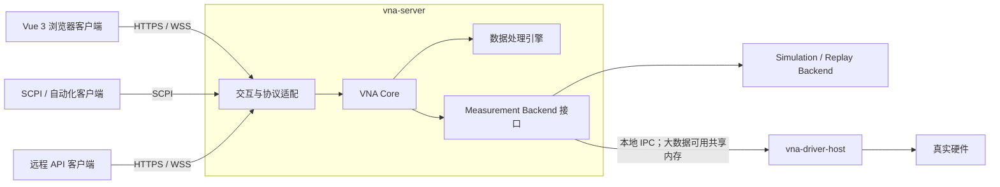
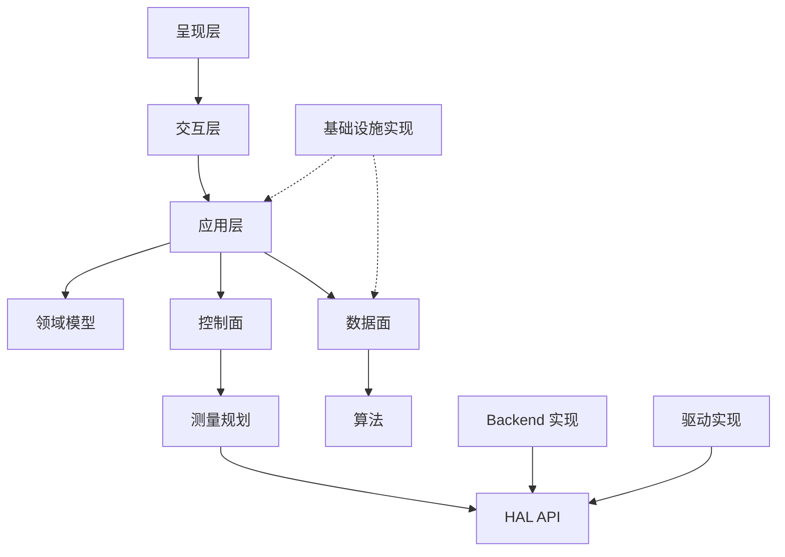
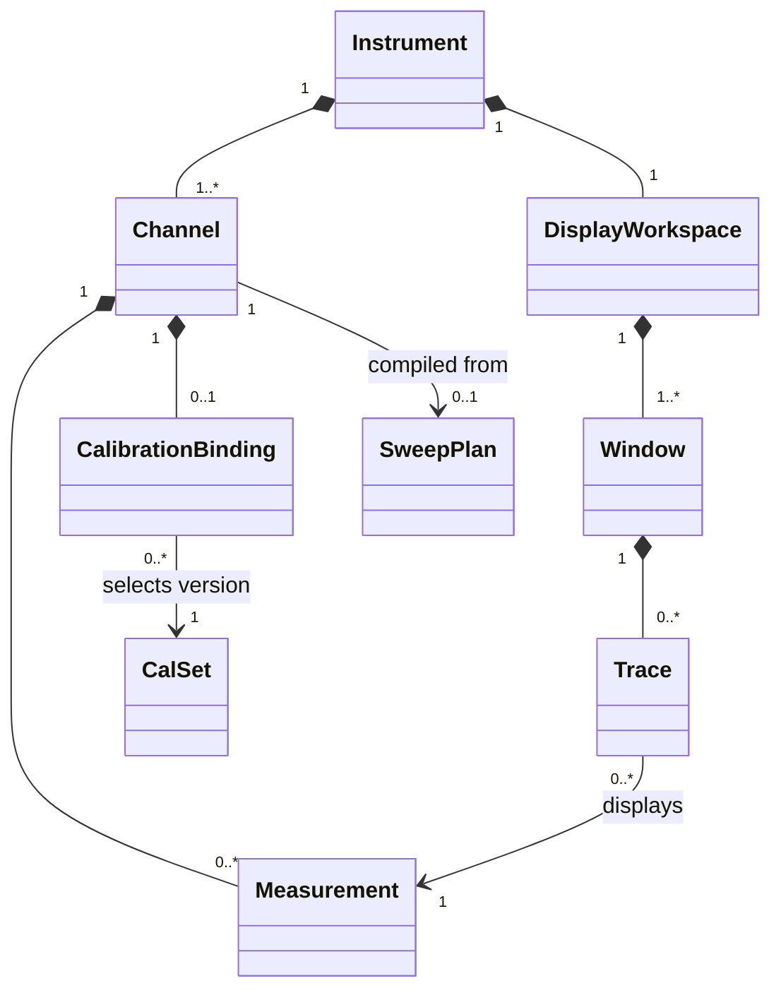
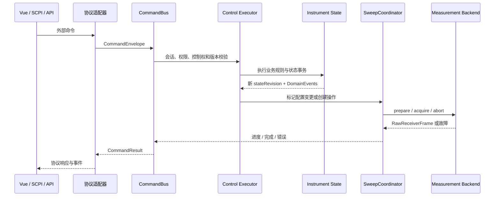
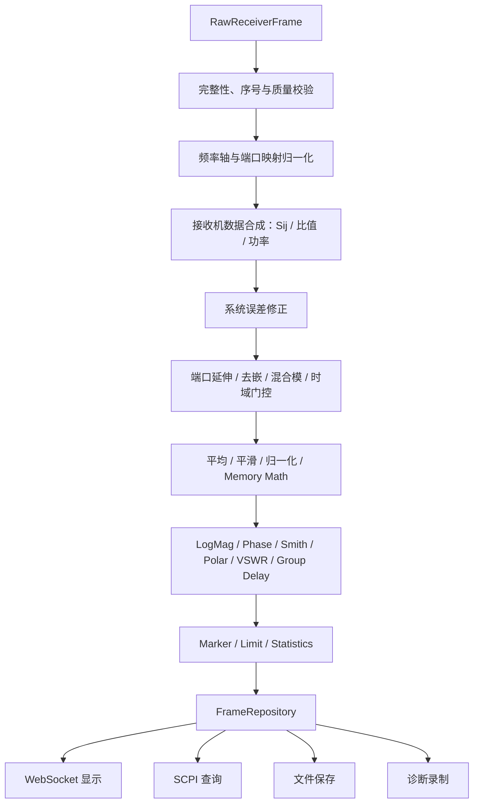
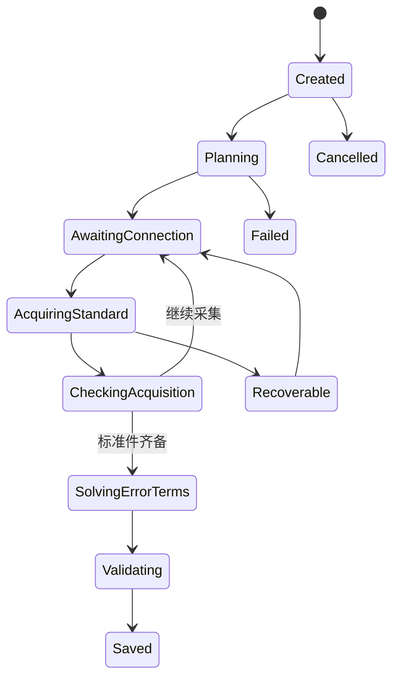

# 矢量网络分析仪总体软件架构

> 状态：初始架构基线
>
> 日期：2026-07-31
>
> 范围：绿地设计，不考虑任何既有实现或迁移约束

## 1. 目标

本系统面向可持续演进的商用级 VNA 软件。架构首先保证测量语义、状态一致性和数据可追溯性，再逐步扩展真实硬件、完整校准、远程自动化和高级网络分析能力。

首要目标：

- 浏览器、SCPI、远程 API 和调试入口共享同一个业务内核。
- 命令控制流和测量数据流形成两条职责明确、可关联追踪的主干。
- 真实硬件、仿真、回放和代理后端可以替换，而不改写业务与呈现逻辑。
- 原始接收机数据、测量定义、校准结果、迹线格式和窗口布局分别建模。
- 每一帧数据都能追溯到产生它的状态版本、扫频计划、校准版本和命令。
- 第一阶段在无硬件条件下完成可验证的端到端测量闭环。

当前不追求：

- 第一阶段复制所有商用仪表功能。
- 以微服务拆分强关联的仪表状态和测量流程。
- 在前端实现测量规划、校准算法或仪表状态真值。
- 用仿真直接生成最终 dB 曲线来绕过真实处理链。

## 2. 架构原则

1. **单一业务真值**：仪表领域状态只由 VNA Core 持有和修改。
2. **统一入口**：所有外部协议先转换为内部 Command 或 Query，不直接调用驱动。
3. **控制面串行、数据面并行**：状态修改按仪表串行化；不可变数据帧可并行处理。
4. **配置按扫频边界生效**：扫频中途提交的配置在下一次扫频生效，数据帧始终携带对应状态版本。
5. **能力驱动**：业务层根据 Backend 提供的 CapabilitySet 校验功能，前端只将其用于展示裁剪。
6. **测量与显示分离**：Measurement 定义测量内容，Trace 定义其显示方式，Window 只负责布局。
7. **仿真契约等价**：Simulation Backend 与 Hardware Backend 实现同一测量后端契约。
8. **完成数据不可变**：采集完成后的每一级数据帧均为逻辑不可变对象。
9. **可观测性内建**：命令、操作、扫频、帧和会话从第一阶段开始使用关联标识。
10. **最小可运行闭环优先**：先完成垂直切片，再扩展功能宽度。

## 3. 系统上下文与部署形态



第一阶段中，Simulation Backend 与 `vna-server` 同进程运行。接入真实硬件时，驱动进入独立的 `vna-driver-host`，用于隔离厂商 SDK、权限、资源占用和崩溃。VNA Core 保持模块化单体，不按协议或业务功能拆成分布式服务。

本地页面也通过 `localhost` 上的 HTTP/WebSocket 访问服务端，不提供另一套进程内页面接口。

## 4. 运行维度

“本地、远程、调试、仿真”不是四个互斥模式，而是三个正交维度：

| 维度 | 取值 | 含义 |
| --- | --- | --- |
| Access | Local / Remote | 客户端从何处访问仪表 |
| Backend | Hardware / Simulation / Replay / Proxy | 测量由谁执行 |
| Diagnostic | Normal / Debug | 是否启用诊断、录制和故障注入能力 |

组合方式示例：

- 本地真实硬件调试：`Local + Hardware + Debug`
- 远程仿真演示：`Remote + Simulation + Normal`
- CI 故障测试：`Local + Simulation + Debug`
- 离线问题复现：`Local + Replay + Debug`

业务代码不得散布 `if local`、`if simulation` 或 `if debug`。访问差异由协议和部署配置处理，测量差异由 Backend 多态处理，诊断能力由装饰器或独立服务处理。

## 5. 逻辑分层

### 5.1 呈现层

基线技术：Vue 3、TypeScript、Vite、Pinia、Vue Router、Web Worker，以及适合高频曲线绘制的 Canvas 或 WebGL。

职责：

- 测量、激励、响应、校准、文件、系统和诊断工作区。
- 展示服务端状态镜像、测量帧、操作进度和错误。
- 发送用户意图，维护纯页面状态和短期交互状态。
- 根据 CapabilitySet 隐藏或禁用不可用功能。

边界：

- Pinia 不是仪表状态的最终真值。
- 不直接访问驱动或 Backend。
- 不决定激励端口和接收机组合。
- 不实现校准或测量合成算法。
- 不依赖高频 REST 轮询刷新曲线。

### 5.2 交互层

交互层是协议适配层，负责身份、会话、解析、编码、流控和版本协商，不承载 VNA 业务规则。

| 协议 | 用途 |
| --- | --- |
| REST | 状态快照、低频配置命令、查询、任务创建、文件元数据 |
| WebSocket | 状态补丁、领域事件、操作进度、错误和二进制测量帧 |
| SCPI | 仪表自动化控制和兼容性接口 |
| HTTP 文件流 | 上传、下载和大文件传输 |
| 本地 IPC | VNA Core 与 Driver Host 的控制消息 |
| 共享内存 | 可选的大体量原始数据跨进程通道 |

文件传输层只搬运字节。文件合法性、项目版本迁移、CalSet 激活兼容性和覆盖规则属于业务或存储模块。

### 5.3 业务核心层

业务核心拥有领域状态、不变量、命令处理、查询、操作生命周期、扫频协调、测量规划、校准工作流和显示模型。

建议模块：

```text
core/
├── domain/             # Instrument、Channel、Measurement 等领域对象与不变量
├── application/        # 用例编排、Command/Query Handler
├── control-plane/      # 命令队列、状态事务、事件发布
├── data-plane/         # 数据处理图、帧仓库和数据分发
├── measurement/        # 测量需求、扫频规划和协调
├── calibration/        # 校准会话、算法契约和 CalSet 管理
├── display-model/      # Trace、Window、Marker、Limit
├── operation/          # 长操作、取消、进度和完成语义
├── project/            # 项目保存、恢复和版本迁移
└── capability/         # 能力模型和功能校验
```

### 5.4 硬件抽象层

HAL 面向完整测量能力，而不是寄存器、SPI 或 ADC 的薄包装。它负责：

- 查询能力。
- 将 SweepPlan 编译为后端可执行计划。
- 准备、采集和中止扫频。
- 缓存硬件配置并只下发差异。
- 仲裁连续扫频、单次扫频、校准、自检、调试和升级等资源竞争。
- 将后端错误统一映射为领域可理解的故障。

### 5.5 驱动层

驱动层操作源、接收机、开关、触发、时钟、FPGA 和总线。它不理解 Channel、Measurement、Trace、Marker 或 Window。

### 5.6 横切基础设施

持久化、日志、追踪、安全、配置和插件注册为横切能力。它们通过明确接口服务于各层，不反向拥有领域规则。

## 6. 模块依赖规则



约束：

- 领域模型不依赖网络、数据库、UI、HAL 实现或驱动。
- 协议模块只依赖公开应用契约，不依赖具体 Handler 或领域对象内部结构。
- 算法模块接收显式数据结构和参数，不读取全局仪表状态。
- Backend 实现依赖 HAL API；HAL API 不依赖任何具体 Backend。
- 驱动宿主只暴露硬件能力和执行契约，不暴露厂商 SDK 类型。
- 模块的公开接口位于模块根部，内部实现不得被跨模块直接引用。

## 7. 核心领域关系

详细定义见 [领域语言](../CONTEXT.md)。



必须成立的不变量：

- Measurement 必须属于一个 Channel。
- Trace 必须引用一个 Measurement。
- 增加 Trace 不得自动增加硬件扫频次数。
- 同一 Channel 内共享激励状态的测量应合并采集。
- Window 不拥有测量配置，也不触发扫频。
- 完成的数据帧不可变。
- 已保存的 CalSet 不可原地修改，只能创建新版本。
- 只有 CommandBus 能够发起仪表领域状态修改。

## 8. 控制面：命令控制流



内部命令信封至少包含：

```cpp
struct CommandEnvelope {
    CommandId commandId;
    SessionId sessionId;
    InstrumentId instrumentId;
    std::optional<std::uint64_t> expectedStateRevision;
    std::chrono::milliseconds timeout;
    CommandPriority priority;
    CommandPayload payload;
};
```

关键语义：

- `expectedStateRevision` 不匹配时返回明确冲突，禁止静默覆盖。
- 命令成功表示业务状态已提交；涉及长操作时返回 `operationId`，完成由事件或同步 Query 表达。
- 频率、点数、IFBW、功率等配置不会在当前扫频中途生效。
- `INIT;*OPC?` 只有在采集、完整性校验、校准修正和 FrameRepository 提交全部完成后才结束。
- Abort 是有状态操作：请求中止、后端确认、资源释放和最终状态都必须可观察。

## 9. 数据面：测量数据流

数据处理采用可编译、可缓存的有向无环图。多个 Trace 可以复用同一份中间结果。



处理节点缓存键至少由以下信息构成：

```text
input_frame_id
+ processor_type
+ processor_parameter_hash
+ calset_revision
+ fixture_revision
```

浏览器可以接收为屏幕分辨率抽取后的显示数据，但 Marker、Limit、SCPI 查询和文件保存必须基于完整分辨率数据。

## 10. 扫频规划与测量后端

Measurement Planner 根据启用的 Measurement 计算最小激励端口集合和接收机需求。Sweep Plan Compiler 再结合 CapabilitySet 生成可执行计划。Trace 不参与采集规划。

例如同时测量 S11、S21、S12、S22 时：

- 源端口 1 激励一次，获取 S11 和 S21 所需接收机数据。
- 源端口 2 激励一次，获取 S12 和 S22 所需接收机数据。
- 同一 Measurement 的 LogMag、Phase 和 Smith Trace 共享校准后复数数据。

后端核心契约：

```cpp
class IMeasurementBackend {
public:
    virtual CapabilitySet capabilities() const = 0;
    virtual Task<PreparedSweep> prepare(
        const SweepPlan& plan,
        CancellationToken token) = 0;
    virtual Task<RawReceiverFrame> acquire(
        const PreparedSweep& sweep,
        CancellationToken token) = 0;
    virtual Task<void> abort(SweepId sweepId) = 0;
    virtual BackendHealth health() const = 0;
};
```

Backend 类型：

- **Simulation**：从 Touchstone、解析电路模型或确定性信号模型产生原始接收机数据。
- **Replay**：严格重放已录制的命令、时序和原始数据。
- **Hardware**：通过 Driver Host 控制真实硬件。
- **Proxy**：代理另一台 VNA 或远程测量服务。

Debug 能力以装饰器包装任意 Backend，用于记录、故障注入、条件暂停和单步执行，不创建独立的“调试后端”。

## 11. 状态、事件和数据契约

首次连接获取完整 `StateSnapshot`；正常运行接收按版本排序的 `StatePatch` 与领域事件；断线重连时按 revision 补差量，差量不可用则重新获取快照。

统一帧头至少包含：

```cpp
struct FrameHeader {
    FrameId frameId;
    SweepId sweepId;
    ChannelId channelId;
    std::uint64_t stateRevision;
    CalSetId calSetId;
    std::uint64_t calSetRevision;
    FrequencyAxisId frequencyAxisId;
    std::uint64_t sequenceNumber;
    Timestamp startedAt;
    Timestamp completedAt;
    FrameCompleteness completeness;
    QualityFlags qualityFlags;
};
```

所有链路统一携带适用的关联标识：

```text
command_id
operation_id
sweep_id
channel_id
state_revision
frame_id
session_id
measurement_id
trace_id
```

因此可以从异常 Trace 反查到 ProcessedFrame、RawReceiverFrame、SweepPlan、HardwareProgram、Command 和 Session。

## 12. 并发、背压与资源仲裁

| 执行器 | 职责 |
| --- | --- |
| Control Executor | 按 Instrument 串行修改领域状态 |
| Acquisition Executor | 准备、触发、采集和中止 |
| Processing Pool | 校准、去嵌、格式转换、Marker 和 Limit |
| Network Event Loop | REST、WebSocket 和 SCPI I/O |
| Storage Worker | 保存项目、数据、CalSet 和日志 |
| Driver Event Loop | 中断、DMA、总线和驱动回调 |

背压策略按消费语义确定：

| 消费场景 | 策略 |
| --- | --- |
| 浏览器连续扫频 | 客户端落后时只保留最新显示帧 |
| 单次扫频 | 不允许丢失 |
| 校准采集 | 不允许丢失 |
| SCPI 查询 | 返回完整且已完成的数据帧 |
| 数据录制 | 阻塞、有限缓存或落盘，不得静默丢失 |
| 调试回放 | 严格保持原始顺序 |

Resource Arbiter 统一协调连续扫频、单次扫频、校准采集、自检、调试访问、Preset、Abort 和固件升级，禁止各模块自行争抢硬件。

## 13. 仿真层级

### L0：协议与界面仿真

固定或简单生成结果，用于最早期打通 Vue、REST、WebSocket 和 SCPI。它是临时垂直切片，不是最终仿真模型。

### L1：测量行为仿真

输出 RawReceiverFrame，支持：

- Touchstone DUT、RLC、电缆和滤波器等模型。
- 频率插值、端口映射和接收机噪声。
- 方向性、源匹配、负载匹配和跟踪误差。
- 动态范围、相位漂移和温漂。
- 固定随机 Seed，确保测试可重复。

### L2：时序与故障仿真

支持丢帧、序号异常、超时、过载、源未稳幅、开关失败、驱动断连、数据截断、延时抖动和指定步骤故障，用于 CI、诊断和恢复逻辑验证。

## 14. SCPI 子系统

SCPI 采用声明式命令树，不使用巨型 `if-else` 或 `switch-case`：

```text
Lexer
  → Parser
  → Command Tree Registry
  → Parameter Converter
  → Internal Command / Query
  → Response Encoder
```

声明信息应可复用于命令解析、帮助、参数范围校验、测试用例、覆盖率报告和自动化 SDK。SCPI 会话模块集中维护输入队列、输出队列、错误队列、状态寄存器以及 `*CLS`、`*OPC`、`*OPC?`、`*WAI` 等同步语义。

协议解析器不得包含测量业务逻辑，也不得使用固定 sleep 实现完成同步。

## 15. 校准子系统

校准由三个独立部分组成：

```text
Calibration Workflow
+ Calibration Algorithm
+ CalSet Repository
```

校准会话状态：



前端向导只渲染后端给出的步骤。CalSet 保存校准方法、端口映射、频率轴、功率、IFBW、CalKit、标准件模型、原始采集引用、误差项、算法版本、验证结果和完整性校验值；激活前必须检查适用性。

## 16. 持久化与文件

语义对象：

| 对象 | 内容 |
| --- | --- |
| Instrument State | 系统、Channel、Measurement、Trace、Window 设置 |
| CalSet | 校准定义、误差项、来源和验证结果 |
| DataSet | 原始、校准后或格式化测量数据 |
| Project | 状态、CalSet/DataSet 引用、布局和用户信息 |

建议存储形态：

- SQLite：索引、元数据、状态快照和用户设置。
- 分块二进制或 HDF5：原始接收机数据、N 端口复数矩阵和历史数据。
- Touchstone、CSV、图片：标准导出。
- `.vnaproj`：带 manifest 和显式版本号的项目包。

禁止直接把 C++ 对象内存表示序列化到磁盘。所有持久化格式必须版本化，并提供前向迁移路径。

## 17. 错误、质量与可观测性

错误按来源分类并保留原始原因：协议错误、业务校验错误、冲突、操作取消、Backend 故障、驱动故障、数据质量异常和存储错误。

质量标志至少预留：

- Source Unleveled
- Receiver Overload
- Calibration Invalid / Interpolated
- Partial Data
- Trigger Timeout
- Temperature Warning
- Simulation Data
- Replay Data

结构化日志不得以自由文本作为唯一关联方式。日志、指标和追踪都应携带统一关联标识，且不得默认记录密码、令牌或完整敏感文件内容。

## 18. 目标工程目录

```text
vna-platform/
├── apps/
│   ├── vna-server/
│   ├── vna-driver-host/
│   ├── vna-simulator/
│   └── vna-cli/
├── frontend/
├── contracts/
│   ├── commands/
│   ├── queries/
│   ├── events/
│   ├── frames/
│   ├── scpi/
│   └── schemas/
├── core/
├── protocols/
│   ├── web-api/
│   ├── websocket/
│   ├── scpi/
│   ├── file-transfer/
│   └── ipc/
├── algorithms/
├── hal/
│   ├── api/
│   ├── capabilities/
│   ├── sweep-compiler/
│   ├── state-cache/
│   ├── resource-arbiter/
│   └── backends/
├── drivers/
├── infrastructure/
└── tests/
    ├── unit/
    ├── contract/
    ├── algorithm-golden/
    ├── scpi-conformance/
    ├── simulation/
    ├── replay/
    ├── fault-injection/
    ├── performance/
    └── end-to-end/
```

目录表达逻辑边界，不要求每个目录对应独立进程或动态库。只在形成稳定接口和独立发布需求后才拆分物理组件。

## 19. 验证策略

- **领域单元测试**：不变量、状态转换、版本冲突和命令结果。
- **契约测试**：所有 Backend 运行同一套 prepare/acquire/abort/capability 测试。
- **算法金样测试**：使用公开理论值、已知网络模型和固定 Seed 数据。
- **SCPI 一致性测试**：长短命令、单位、队列、状态寄存器和同步语义。
- **仿真端到端测试**：从命令到原始帧、处理、WebSocket/SCPI 输出的完整链路。
- **Replay 回归测试**：固定命令日志和原始数据重现问题。
- **故障注入测试**：超时、丢帧、断连、过载和取消恢复。
- **性能测试**：扫频吞吐、处理延迟、内存上限和慢客户端背压。

真实硬件接入前，Hardware Backend 和 Simulation Backend 必须通过相同契约测试；硬件专属测试只补充电气和时序验证。

## 20. 架构红线

- Vue、REST、SCPI、CLI 不得直接调用驱动。
- SCPI Parser 不得包含业务逻辑。
- Trace 不得直接触发采集。
- Measurement 不得与 Trace 合并建模。
- 大体量复数数组不得长期使用 JSON 传输。
- 运行维度不得通过散布模式分支实现。
- CalSet 不得原地修改。
- 数据帧不得缺少 `stateRevision`。
- 测量同步不得依赖固定 sleep。
- 仿真不得只产生最终显示曲线。
- 驱动不得理解显示与分析对象。
- 页面曲线刷新不得依赖高频 REST 轮询。

## 21. 已记录的关键决策

- [ADR-0001：采用模块化单体业务内核](adr/0001-modular-monolith-core.md)
- [ADR-0002：所有外部入口映射到统一内部契约](adr/0002-unified-internal-contracts.md)
- [ADR-0003：仿真后端输出原始接收机帧](adr/0003-simulate-raw-receiver-frames.md)

第一阶段的具体范围和验收标准见 [第一阶段实施范围](phase-1.md)。
