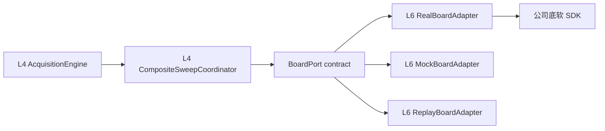

# VNA Board Adapter Interface 与合同测试契约

> 状态：候选契约 v0.1。本文冻结上层与单板 Adapter 之间必须共同遵守的语义；底软字段、时限和物理安全能力仍需公司接口说明与 HIL 证据补齐。本文不实现底软，也不把 Mock 行为冒充真实硬件事实。

## 1. seam 的位置与责任

`BoardPort` 是 L4 Acquisition 拥有、由 L6 Real/Mock/Replay Adapter 实现的真实 seam。它只处理“一块板的一次有限执行”，不认识 Instrument、Channel、AnalysisTrace、Marker、Limit、Diagram、Calibration Session、Web 或 SCPI。



Board Adapter 必须隐藏：

- SDK ABI、handle、错误码和线程模型；
- configure/prepare/start/abort 的厂商调用顺序；
- 同步、阻塞或 callback 型 SDK 到统一 accepted/terminal 模型的转换；
- callback buffer 转移或一次复制；
- 厂商 receiver/route/quality 到项目类型的规范化；
- Prepared staging、rollback、迟到 callback、重复 terminal 和热拔处理；
- 固定 call/run/prepared slot、worker、dispatcher 和安全通道实现。

Board Adapter 不得拥有：

- 多 Trace 需求合并和 Sweep Compiler；
- ResourceGraph、跨板 coherence/barrier 与公平调度；
- Correction Set 匹配和处理内存预留；
- A/B/Stage/C Builder、DomainCommit 或 Event；
- Continuous/Groups 的无限循环；
- 用户校准、Marker、Limit、Diagram 或协议副作用。

## 2. 三种 Interface 方案与选型

### 2.1 方案 A：三入口类型和

该方案只暴露 `snapshot()`、`submit(ClosedVariant)` 和 `request_safety()`。它的 Interface 最小，Real/Mock/Replay 新增普通动作时只扩充封闭 variant，且不会出现 `vendor_command(string)`。

问题是 `submit` 很容易成长为 Adapter 内部命令总线：prepare、start、rollback、abort、health 和 recovery 的输入归还、call terminal 与目标 run terminal 都要在一个大事件 variant 中分流。方法少不自动等于 Depth 高；Acquisition 必须学习更多组合规则才能正确使用。

### 2.2 方案 B：完全显式状态机

该方案为 prepare、release、run、abort、safe-state、kill、health、recover、rejoin 和 close 分别提供 `begin_*`。它最容易审计 accepted/terminal 和 token 所有权，也最适合底软事实尚不完整时发现差异。

问题是普通 Acquisition 会看到过多维护状态和细粒度方法。若继续加入厂商 arm、route、DMA、trigger 等微步骤，Interface 就会退化成 SDK 的浅镜像。

### 2.3 方案 C：单一有限 run + Manifest gate

该方案让调用者只执行 `run(request, gate, sink)`；Adapter 内部 prepare 后通过 continuation 把 actual Manifest 交给 L4，L4 在首次 dispatch 前已有的保守 envelope 内完成本地 exact finalization 与多板 barrier 后再授予 start。

正常 Single 路径最短，也不会把 SDK Prepared handle 暴露出来。但 continuation 的存活、超时、显式 reject、回调重入和多板决策暂存都需要另一套状态机；若错误地让析构自动 rollback，又会把外部控制动作藏进 RAII。

### 2.4 选择：显式两阶段 + 三个权限分面

本项目采用混合方案：

- `BoardExecutionPort` 显式保留 `L2 conservative admission → prepare → actual Manifest 校验/单调收窄（零新分配）→ start`；
- `BoardSafetyPort` 独立承载 safe-state 与 emergency kill，不能共用普通容量；
- `BoardMaintenancePort` 承载主动 health probe、recover、rejoin 和 close，不污染正常采集表面；
- `OpenedBoard` 把三个分面绑定到同一 `BoardSessionId + session_epoch`；
- Adapter 私有 Prepared handle 只以 move-only typed token 出现，厂商微步骤仍不可见。

选择理由不是“函数数目居中”，而是实际责任：L4 必须在 actual Manifest 出现后完成 Correction match、验证实际需求未超过既有 envelope、把保守 owner 单调收窄成 exact resource set，并完成可选多板 barrier，所以该决策点不能藏进万能 `run()`；它不得在持有 Prepared token 时反向申请处理容量。安全与恢复又具有不同权限、lane 和物理证据，不能混入普通 submit FIFO。

## 3. 可移植类型与版本规则

逻辑 C++17 Interface 只使用项目类型：

```cpp
namespace vna::board {

template<class Value, class Error>
class Result;

template<class T, std::size_t Max>
class BoundedVector;

template<class T>
class ArrayView;

template<std::size_t Max>
class FixedString;

struct BoardId;
struct BoardSessionId;
struct BoardSessionEpoch;
struct PrepareCallId;
struct BoardRunId;
struct BoardSafetyCallId;
struct BoardMaintenanceCallId;
struct PreparedExecutionId;
struct ManifestId;
struct CapabilityRevision;
struct TopologyEpoch;
struct BoardOperationalEpoch;
struct RunGeneration;
struct MonotonicDeadline;

struct Complex64 {
    double real;
    double imag;
};

} // namespace vna::board
```

规则：

- 所有跨 seam 方法视为 `noexcept`；异常在 Adapter 内转换成 `BoardError`。
- 不使用 C++20 coroutine、`std::span` 或 `std::stop_token`。
- 不出现 SDK、Eigen、JSON、`httplib`、OS path/socket/thread/file handle。
- `BoardContractVersion{major,minor}` 是语义/schema 版本，不是动态 C++ ABI。
- Adapter 与 Interface 在同一目标中静态编译；不加载跨 MinGW/AArch64 或跨编译器 C++ 插件。
- major 不兼容；minor 只能增加 capability-gated 可选字段/variant。未知 required variant 必须拒绝。
- 不提供 `vendor_command`、字符串 opcode、blob 或任意 key/value escape hatch。

## 4. BoardProvider 与 OpenedBoard

```cpp
class BoardProvider {
public:
    virtual Result<BoardInventorySnapshot, BoardError>
    discover(const BoardDiscoveryRequest& request) noexcept = 0;

    virtual Result<OpenedBoard, BoardError>
    open(const BoardOpenRequest& request,
         BoardAdapterBindings bindings) noexcept = 0;
};

struct BoardOpenRequest {
    BoardSelector selector;
    BoardContractVersionRange accepted_contracts;
    ProductProfileRevision product_profile;
    MonotonicDeadline deadline;
};

class OpenedBoard {
public:
    OpenedBoard(OpenedBoard&&) noexcept;
    OpenedBoard(const OpenedBoard&) = delete;

    BoardExecutionPort& execution() noexcept;
    BoardSafetyPort& safety() noexcept;
    BoardMaintenancePort& maintenance() noexcept;
    const CapabilitySnapshot& initial_capabilities() const noexcept;

private:
    OwnedBoardSession owner_; // 保证三个分面在 OpenedBoard 移动后仍稳定
};
```

`discover` 和 `open` 有硬上界，返回有界 inventory；不得泄漏设备路径或 SDK handle。发现结果不是永久事实，`open` 后以 Session epoch 和 capability revision 为准。

`BoardAdapterBindings` 在 composition root 注入：

- 项目固定 `AcquisitionBufferPool`；
- 单调 `PlatformClock`；
- 从固定池分配的 sink registration/dispatcher；
- 有界 Adapter diagnostics sink。

这些是 Adapter Implementation 的依赖，不成为每次 run 的调用参数。

### 4.1 显式 close 与析构

`OwnedBoardSession` 的析构不能调用阻塞 SDK、等待 run 或声称 RF 已关闭。正常关机必须通过 MaintenancePort 执行 close Operation：

```text
stop admission
→ abort/drain active prepare/run
→ independent safe-state/readback
→ close SDK session
→ close terminal
→ destroy OwnedBoardSession
```

若进程内代码在仍有外部义务时销毁 owner，Implementation 只能把固定资源转交进程级 fail-safe supervisor 并锁存 contract violation/quarantine；这不是正常控制路径，也不能保证物理安全。

## 5. CapabilitySnapshot

`CapabilitySnapshot` 是版本化事实，不是几十个 getter，也不是根据板卡型号散布的 `if`：

```cpp
struct CapabilitySnapshot {
    BoardContractVersion contract;
    BoardIdentity identity;
    BoardSessionId session_id;
    BoardSessionEpoch session_epoch;
    CapabilityRevision revision;
    TopologyEpoch topology_epoch;
    BoardOperationalEpoch operational_epoch;
    StrongDigest digest;
    MonotonicTime captured_at;

    PortTopologyCapability ports;
    ReceiverTopologyCapability receivers;
    WaveConventionCapability wave_convention;
    StimulusCapability stimulus;
    SweepCapability sweep;
    OnBoardAveragingCapability on_board_averaging;
    TriggerCapability trigger;
    RouteCapability routes;
    QualitySchemaCapability quality;
    CoherenceCapability coherence;
    ChunkDeliveryCapability chunk_delivery;
    AbortCapability abort;
    RfSafetyCapability safety;
    HealthCapability health;
    BoardCapacityLimits limits;
};
```

### 5.1 必填语义

Capability 至少覆盖：

1. identity、硬件/固件/底软/Adapter 版本；
2. Physical/Logical Port、source state、receiver path、route、辅助观测；
3. `a/b` label/direction、source/receive identity、complex unit、Z0、normalization、pre-applied factory correction；
4. frequency/power/IFBW/points/Segment/route 的范围、离散值和量化规则；
5. Linear/Log/Segmented/CW/Power Sweep 与实际轴回读；
6. 底软内部 average 是否存在、能否关闭、实际 enable/mode/factor/counter、input stage、sample boundary、update kernel 与 clear/reset/readback；
7. trigger source/scope/granularity、外触发等待和 consumption；
8. chunk ownership、最大块、最大在途量、callback concurrency、backpressure；
9. overload/unlock/unleveled/temperature/timebase 等 quality/health schema；
10. prepare、abort、safe-state、kill、readback 和 recovery 的支持状态及声明上界；
11. Clock/Coherence Domain、timebase lock、同步 trigger/epoch、skew 与 actual-axis guarantee；
12. fixed prepare/run/safety/maintenance slot 和资源互斥关系。

每一项使用 `Supported | Unsupported | TemporarilyUnavailable | Unknown`，不能把 Unknown 当 false 后又在 Mock 中默认支持。`wave_convention` 的关键字段未知时，不得启用可比较 S 参数、绝对 receiver 测量或跨板相干结果。

### 5.2 缓存与主动探测

ExecutionPort 的 `capabilities()` 和 MaintenancePort 的 `cached_health()` 只返回 Adapter 缓存快照，必须标 freshness，且不能在调用线程触发 SDK I/O。需要新证据时发起有终态的 health/self-test Operation；不得轮询 cached snapshot 代替 terminal 或 RF readback。

## 6. PreparedExecutionManifest

Sweep Compiler 产生 `SweepIntent + ConservativeResourceClaim`；Board prepare 才产生实际执行事实：

```cpp
struct PreparedExecutionManifest {
    ManifestId id;
    PreparedExecutionId prepared_id;
    BoardSessionId session_id;
    BoardSessionEpoch session_epoch;
    CapabilityRevision capability_revision;
    TopologyEpoch topology_epoch;
    BoardOperationalEpoch operational_epoch;
    StrongDigest intent_digest;
    StrongDigest manifest_digest;

    RequestedToActualStimulus stimulus;
    ActualPowerPlan power;
    ActualIfBandwidthPlan if_bandwidth;
    ActualRoutePlan routes;
    ActualTriggerPlan trigger;
    ActualSourceStatePlan source_states;
    ExpectedObservationMap expected_observations;
    OnBoardAveragingState on_board_averaging;

    ChunkDeliveryContract chunks;
    ExactBoardResourceClaim exact_resources;
    RunTimingBounds timing;
    PostRunStateContract post_run_state;
    CoherenceExecutionEvidence coherence;
    BoundedVector<ManifestWarning, kMaxManifestWarnings> warnings;
};
```

Manifest 必须不可变并可序列化，用于：

- requested→actual 读回；
- correction applicability；
- exact hardware、Buffer 与 opaque `AcquisitionContinuationAttestation`；普通测量映射到 B `MeasurementPublication`，校准/验证映射到各自必达后继，授权 raw/diagnostic 才可 A-only；Stage/C 是后续按需工作；
- Builder expected observation/coverage ledger；
- 多板 actual axis/coherence barrier；
- A 的 `BoardRunEvidence` provenance；
- Mock golden 与 Real trace 对照。

项目原生路径要求底软内部 average 被明确关闭并有 actual readback；只有 Compatibility Profile 冻结其 input stage、sample boundary、mode/update kernel、factor/counter 与 clear generation 后，才允许显式委托。状态 Unknown、声称关闭但无 readback，或 Manifest 与 Capability 不一致时不得 start，避免与上层 Average 隐式叠加。

prepare 不得启动 RF、采集或留下不可回滚持久配置。Manifest 超出 conservative claim、capability/topology/operational epoch 改变或 required actual 字段未知时，prepare 失败或后续 admission 拒绝，不能截断后继续。

## 7. 统一 submission 与 terminal 规则

全部 `begin_*` 使用同一语义：

```cpp
template<class AcceptedToken, class ReclaimedInputs>
using Submission = Variant<
    AcceptedSubmission<AcceptedToken>,
    RejectedSubmission<BoardError, ReclaimedInputs>
>;
```

- Rejected：Adapter 没有接触 SDK、没有副作用、不保存 Sink、不产生 callback；所有 move-only 输入随 `ReclaimedInputs` 归还。
- Accepted：Adapter 接管输入和 Sink；之后无论立即成功、失败、超时或 hot-unplug，都必须恰好一次匹配 call/run generation 的 terminal。
- 如果 Adapter 已开始任何 SDK 工作，就只能 Accepted 后异步失败，不能同步伪装 Rejected。
- submission 本身严格有界，不在调用线程执行阻塞 SDK。
- 所有 Sink callback 都必须发生在 `begin_*` 返回之后；禁止 inline callback 和由此产生的调用者重入。
- accepted token/request receipt 只是控制能力，不拥有正式数据。

请求型方法如 abort 的直接回执只有：

```cpp
enum class RequestDisposition {
    Accepted,
    Rejected,
    AlreadyRequested,
    AlreadyTerminal,
    UnknownTarget
};
```

它不表示目标 prepare/run 已终止，也不表示 RF safe。

## 8. 选定的逻辑 Interface

### 8.1 BoardExecutionPort

```cpp
class BoardExecutionPort {
public:
    virtual CapabilitySnapshot capabilities() const noexcept = 0;
    virtual BoardExecutionSnapshot inspect() const noexcept = 0;

    virtual void isolate_contract_violation(
        BoardContractViolation violation) noexcept = 0;

    virtual PrepareSubmission begin_prepare(
        PrepareCallId call,
        SweepIntent intent,
        PrepareAuthorization&& authorization,
        PrepareSinkRegistration&& sink) noexcept = 0;

    virtual RequestReceipt request_prepare_abort(
        PrepareCallId call,
        const AbortRequest& request) noexcept = 0;

    virtual DiscardSubmission begin_discard_prepared(
        PreparedStartToken&& prepared,
        const DiscardPreparedRequest& request) noexcept = 0;

    virtual RunSubmission begin_run(
        BoardRunId run,
        RunGeneration generation,
        PreparedStartToken&& prepared,
        StartAuthorization&& authorization,
        RunDeliveryGrant&& delivery,
        BoardRunSinkRegistration&& sink) noexcept = 0;

    virtual RequestReceipt request_abort(
        BoardRunId run,
        RunGeneration generation,
        const AbortRequest& request) noexcept = 0;
};
```

`isolate_contract_violation` 只接收固定大小、不可执行的首错证据，并在 Board callback 返回后的 L4 Runtime 步骤调用；不得在 callback 栈内反向进入 L2 或 Store。实现必须幂等，锁存后拒绝新的 execution reservation。该入口只做当前 Session 的软件 containment，不等于 recovery、rejoin 或 RF-safe 证明；当前 Mock 只能通过关闭旧会话并重新 open 得到不同 `BoardSessionId` 的健康会话。

Prepare 终态是封闭 variant，Accepted 后不得假设必然成功：

```cpp
struct PreparedExecution {
    PreparedStartToken start_token;       // move-only；内含预留 cleanup slot/terminal route，只能 run 或 discard
    PreparedManifestLease manifest;       // 可保留到 A candidate/失败收尾
};

using PrepareTerminal = Variant<
    PrepareSucceeded<PreparedExecution>,
    PrepareFailed<PrepareCleanupEvidence>,
    PrepareDraining<BoardPrepareDrainOwner, DrainId>
>;
```

只有 `PrepareFailed` 携带的 cleanup evidence 证明 SDK job/staging/registration 已真实 terminal 时，L4 才能释放执行 owner 并经 `AcquisitionFailed` 归还 Preview owner。若 SDK call 卡死、回滚未终结、hot-unplug 仍留义务或安全性无法证明，Adapter 返回 `PrepareDraining`；L4 必须把 `BoardPrepareDrainOwner` 与自己持有的完整 `AcquisitionLeaseSet/Preview` 聚合成 `AcquisitionDraining`，不能返回普通失败。

拆分 token 与 Manifest lease 的原因：`begin_run` 消费一次性板内 Prepared state，但 L4 仍必须持有不可变 Manifest 建立 ledger 和 A provenance。prepare admission 已把稳定 discard terminal mailbox/registration 封装进 token；若 begin_run 同步 Rejected，Adapter 归还仍含 cleanup route 的 token、authorization、delivery 和 run sink registration；若 Accepted，Adapter 在接管 token 时原子退役其 discard route，之后只有 BoardRunSink terminal 才结束板侧 run 义务。

`begin_discard_prepared` 是显式 rollback。`PreparedStartToken` 析构不得阻塞或偷偷声称 rollback 完成；正常路径必须 discard 并等待 terminal。异常析构只锁存 contract violation，把内部 slot 转入 Drain/Quarantine。

### 8.2 BoardSafetyPort

```cpp
class BoardSafetyPort {
public:
    virtual SafetySubmission begin_safe_state(
        BoardSafetyCallId call,
        SafeStateRequest request,
        SafetyAuthorization&& authorization,
        BoardSafetySinkRegistration&& sink) noexcept = 0;

    virtual KillSubmission begin_emergency_kill(
        BoardSafetyCallId call,
        EmergencyKillRequest request,
        EmergencyKillAuthorization&& authorization,
        BoardKillSinkRegistration&& sink) noexcept = 0;
};
```

SafetyPort 使用不与 prepare/run/recovery 共用的 `BoardSafetyLane`、固定队列和控制路径。每个 `OpenedBoard` 在建立 Session 时就为 safety supervisor 永久保留 `BoardSafetyRouteLease` 与物理独立的 `BoardKillRouteLease`，它们管理可重用的固定 one-shot sink slots，普通 Acquisition/Prepare/Maintenance 永不可借用。每次 begin 从 route lease 取出 move-only `BoardSafetySinkRegistration`/`BoardKillSinkRegistration`；Rejected 必须完整归还，Accepted 后只在唯一 terminal callback 返回且 producer 已静默时才自动归还/reset slot，Draining 或任何未终态义务期间保持 checked-out；route lease 本身从不 move 给 Adapter。fault/timeout 路径因此不存在普通池容量失败。safety supervisor 在调用前就按安全等级合并同板并发请求；已有等价/更强请求时使用已有 `RequestDisposition::AlreadyRequested`，不定义另一个未冻结终态。Emergency kill 还必须能越过 SafetyLane 卡死；如果真实硬件不存在这样的物理独立路径，Capability 必须是 Unsupported/Unknown，产品只能进入受监护工程 Profile。

safe-state request accepted、kill 已动作和可信 RF readback 是三个不同事实。只有 Safety terminal 中满足请求等级的独立 readback 才能形成 `VerifiedRfOff/VerifiedSafe`。软件 quarantine、run failure 或 kill ack 本身不能证明 RF 安全。

### 8.3 BoardMaintenancePort

```cpp
class BoardMaintenancePort {
public:
    virtual HealthSnapshot cached_health() const noexcept = 0;

    virtual HealthSubmission begin_health_probe(
        BoardMaintenanceCallId call,
        HealthProbeRequest request,
        HealthAuthorization&& authorization,
        HealthSinkRegistration&& sink) noexcept = 0;

    virtual RecoverySubmission begin_recovery(
        BoardMaintenanceCallId call,
        RecoveryRequest request,
        RecoveryAuthorization&& authorization,
        RecoverySinkRegistration&& sink) noexcept = 0;

    virtual RequestReceipt request_recovery_abort(
        BoardMaintenanceCallId call,
        const AbortRequest& request) noexcept = 0;

    virtual Result<RejoinResult, BoardError> rejoin(
        RejoinAuthorization&& authorization) noexcept = 0;

    virtual CloseSubmission begin_close(
        BoardMaintenanceCallId call,
        CloseRequest request,
        CloseAuthorization&& authorization,
        CloseSinkRegistration&& sink) noexcept = 0;
};
```

Recovery terminal 成功只表示硬件步骤完成，Session 进入 `AwaitingRejoin`。`rejoin` token 必须绑定：

- recovery terminal；
- 新 capability/session epoch；
- fresh health probe；
- 可信 safe-state terminal；
- `FaultUnsafeRf` 所需的人工/物理清除证明。

`RejoinResult` 不是一个裸 epoch：

```cpp
struct RejoinResult {
    BoardSessionEpoch session_epoch;
    CapabilitySnapshot capabilities;
    HealthSnapshot health;
    SafeStateEvidence safe_state;
    RecoveryTerminalId recovery_terminal;
    StrongDigest evidence_digest;
};
```

只有 L2 接收这组同代证据并原子更新 ResourceGraph/Catalog 后，新的 admission 才可使用该 Session。Adapter 不能自行发布“仪器恢复”。

## 9. authority token 与 TOCTOU

```cpp
struct AcquisitionContinuationAttestation; // id/digest/expiry 的非 owning proof；不含上层 owner
class PrepareAuthorization;  // session/capability/topology/operational epoch + conservative claim + expiry
class StartAuthorization;    // prepared id/manifest digest + operational epoch + board execution authority + reservation attestations
class SafetyAuthorization;   // actor/policy + independent lane budget
class EmergencyKillAuthorization; // actor/kill policy + physically independent kill route + epoch
class HealthAuthorization;   // session/operational epoch + health probe kind + maintenance policy
class RecoveryAuthorization; // quarantine/fault state + operator policy
class RejoinAuthorization;   // recovery + safe + health + capability evidence
class CloseAuthorization;    // admission stopped + all calls drained + safe evidence
```

全部 Authorization token（不含纯值 `AcquisitionContinuationAttestation`）：

- move-only、one-shot；
- 由拥有相应权威的上层 Module 构造，Adapter 只能验证和消费；
- 绑定 Session epoch、boot ID、deadline 和预期 digest；
- 不可序列化给 Web/SCPI，也不能由 Mock 绕过；
- mismatch 返回稳定错误，不尝试“按当前值修正”。

`PrepareAuthorization`/`StartAuthorization` 都只是从 L4 仍持有的 lease 派生出的不可拥有 proof。签发/移动 authorization 不消费、转移或缩短 `PreAdmissionLease`/`AcquisitionRunResourceSet` 的生命周期；前者在 prepare 期间继续由 L4 持有，并在 local exact finalization 时与其他保守 owner 一起被消费/升级。L6 永远不能凭 authorization 释放或扩容上层资源。

`StartAuthorization` 使 prepare/start 间的以下变化不能静默穿透：capability/topology/operational epoch、Manifest、精确硬件资源、Buffer ingress、opaque `AcquisitionContinuationAttestation` 和多板 start barrier。该 attestation 只是绑定 continuation reservation 的 ID/digest/expiry proof，不拥有 `AcquisitionContinuationOwner`，也不是另一套 work claim。L6 不解释 B、Calibration 或 A-only 领域 kind，也不拥有或释放 L4/L5 reservation；这些所有权始终留在 `AcquisitionRunResourceSet`，不能随 token 移入 L6。普通测量中 Stage/C materialize/analysis 是 B 发布后的独立按需 Operation，不能因其容量饱和阻止 RF start。`BoardOperationalEpoch` 专门表示可能改变 Prepared staging 或 RF/route 状态、但未必改变 Capability schema 的动作；safe-state、kill、recovery、close、hot-unplug/reopen 在接受时必须先推进该 epoch 或关闭 admission，因此并发的旧 `begin_run` 稳定拒绝。

### 9.1 token 失效与清理矩阵

Start 权限失效不能让 Prepared 资源变成无法清理的孤儿。`PreparedStartToken` 内含 start identity 与 cleanup identity：前者受 capability/topology/deadline 约束，后者只用于把同一旧 Session 中的 Prepared 资源交回 Adapter。

| 变化 | 还能 start | 必须如何清理 | 是否允许新 admission |
|---|---|---|---|
| StartAuthorization 过期/不匹配 | 否；`begin_run` Rejected 并归还全部输入 | 旧 ExecutionPort 的保留 cleanup slot 必须接受 `begin_discard_prepared` | 取决于当前 capability/safety |
| capability/topology revision 改变 | 否 | cleanup identity 不随 revision 失效；discard 后等待唯一 terminal | 用新 revision 重新 prepare |
| safety/kill/recovery/close 被接受或 operational epoch 改变 | 否 | 旧 token 仍通过 cleanup identity discard；已启动 run 走 abort/safe/all-terminal | 否；直到动作终态和新 admission |
| Board 进入 Quarantined/FaultSafe/FaultUnsafeRf | 否 | discard/abort 属于受保留控制路径，不能被普通 admission gate 拒绝 | 否；直到合格 rejoin |
| recovery/reopen 开始 | 否 | 所有旧 prepare/run/token 必须先 terminal 或转入旧 Session 的 Drain owner；否则不得 rejoin | 否 |
| session epoch 被替换 | 否 | 新 Session 不接受旧 token；旧 `OwnedBoardSession`/fail-safe supervisor 继续拥有 cleanup 到 terminal | 只有 RejoinResult 提交后 |
| close 请求 | 否 | 所有 Prepared token、run、safety/maintenance call 必须先 terminal；未闭合时不得签发 CloseAuthorization | 否 |

prepare 成功 terminal 在交付 `PreparedStartToken` 的同时必须已经把 cleanup slot 和稳定 discard terminal registration 封装进 token；这些能力来自 prepare admission 的保留槽，不在 discard 调用时临时申请。prepare-abort 与 prepare-success 竞态仍只有一个 prepare terminal：若 abort 获胜则没有 token；若 success 获胜，terminal 必须交付 token，调用者观察到 cancel 后立即走 discard，不能把 abort receipt 当作清理完成。

`begin_discard_prepared` 使用 token 内上述预留 cleanup 容量和 terminal route，不能因普通队列满、StartAuthorization stale/expired、quarantine、operational epoch 改变或 RF fault而同步拒绝。对同一旧 Session 的合法 token，它总是消费 token并 Accepted，随后通过内嵌 registration 交付唯一 `Discarded | AlreadyReleased | CleanupFailed` terminal。若设备已移除或 SDK 无法回滚，它仍产生 typed terminal，并把旧 slot/worker/registration 义务转入 Drain/Quarantine；只有伪造/错误 Session 的 token 可以 Rejected 并完整归还。session epoch 被替换前，所有旧 token 必须已经 terminal 或由旧 Session supervisor 接管。

## 10. ReceiverObservationChunk 与 Buffer 所有权

```cpp
struct ReceiverObservationChunk {
    ManifestId manifest_id;
    PreparedExecutionId prepared_id;
    BoardRunId run_id;
    RunGeneration run_generation;
    ChunkSequence sequence;

    SubSweepId sub_sweep;
    SourceStateId source_state;
    ReceiverPathId receiver_path;
    WaveDescriptorId wave;
    PointRange points;
    ActualAxisSlice axis;
    TriggerEpochObservation trigger_epoch;
    TimebaseObservation timebase;

    AcquisitionChunkLease payload;
    ChunkQualityView quality;
};
```

`AcquisitionChunkLease` 是 move-only，数值、axis slice 的可变长 backing 和 `ChunkQualityView` 中的全部 View 生命周期都从属于它：

- 底软 buffer 可转移时，Adapter 包装可证明在 Session 关闭后仍能正确 release 的 lease；
- 底软 callback 返回即复用时，Adapter 必须在回调返回前复制一次到已预留项目 BufferPool；
- 未取得底软 ABI 证据前默认复制，不承诺零拷贝；
- Adapter 调用 `on_chunk(std::move(chunk))` 后不得读写 payload；
- Builder 是唯一长期拥有者；Preview 只读取有界 `ChunkReadView` 或接收独立 `PreviewTile`；
- 热路径不逐点分配、不逐点虚调用、不逐点日志；按 chunk 做 O(1) 元数据规范化，最坏一次 payload copy。

`BoardRunSink::on_chunk` 的 ownership 规则必须无歧义：调用即把 lease 移给 Sink，无论 Sink 返回何种 disposition 都不退回 Adapter。

```cpp
enum class ChunkIngressDisposition {
    Accepted,
    AbortRunCapacityBreach,
    AbortRunProtocolViolation
};
```

若正式 ingress 意外满或实际数据超 Manifest，Sink 仍接管当前 lease，然后要求整轮失败并进入 abort/drain；不得丢 chunk 后继续成功。只有 Preview queue 可以 latest-wins、合并或丢弃。

## 11. BoardRunSink 与唯一终态

```cpp
class BoardRunSink {
public:
    virtual void on_phase(const BoardRunPhaseEvent& event) noexcept = 0;
    virtual ChunkIngressDisposition on_chunk(
        ReceiverObservationChunk&& chunk) noexcept = 0;
    virtual void on_terminal(BoardRunTerminal&& terminal) noexcept = 0;
};
```

`PrepareSinkRegistration` 和 `BoardRunSinkRegistration` 来自第一次 Sweep admission 已保留的固定 slot；它们与 Adapter 内部 prepare/run call/worker/queue capacity 一起放入 `PreReservedBoardCallSet`，不在 Operation commit 后临时 acquire。Accepted 后 registration 由 Adapter 持有到 terminal callback 返回，不使用无界 `shared_ptr` 或每 run heap allocation。已有效 pre-admission 的合法 begin 不能因普通 fixed pool/queue 耗尽而 Rejected；容量不足必须在 Sweep Operation commit 前拒绝整个 admission。

同一 run 的事件契约：

1. Adapter 将任意 SDK callback 线程线性化为 per-run event order；
2. phase 只有 `Starting/Armed/WaitingTrigger/Acquiring/Draining`，并标 `DirectlyObserved | AdapterInferred`；
3. sequence 严格单调；重复 chunk 由 Adapter 或 Builder 识别，冲突重复是协议错误；
4. 最后一个 chunk callback 返回后，SDK producer 必须已经静默，Adapter 不可逆地 retire/revoke `RunDeliveryGrant`；这两件事都 happens-before terminal callback 开始；
5. terminal callback 一开始，L4 即可把 backing `AcquisitionRunResourceSet` 交给 Builder/candidate/Drain，因此 Adapter、SDK 和任何迟到 callback 此后都不得触碰 grant、ingress backing、payload/axis/quality view；
6. Accepted run 恰好一次 terminal；
7. terminal 后不得再调用 phase/chunk/terminal；迟到 SDK callback 在 Adapter 内按 session epoch/run generation 丢弃并聚合诊断；
8. callback 不在 SDK mutex 下执行，不 inline 反调 Kernel，不做网络、文件、JSON 或 Eigen；
9. Sink 只做有界验证和 move 到预留 ingress，不能等待 Catalog commit。

```cpp
struct BoardRunTerminal {
    BoardRunId run_id;
    RunGeneration generation;
    RunTerminalKind kind;
    SequenceSummary sequence;
    BoardDeliverySummary delivery;
    BoardQualitySummary quality;
    PostRunStateEvidence post_run_state;
    Optional<BoardError> error;
    MonotonicTime terminal_time;
};
```

Board run Completed 只说明板侧执行已完成。L4 仍要验证 Manifest expected observation map、coverage、actual axis、必要 sub-sweep、质量和可选多板 barrier，全部闭合后才能产生 A candidate。

## 12. 正常 Single Sweep 调用

```mermaid
sequenceDiagram
    participant A as "AcquisitionEngine"
    participant E as "BoardExecutionPort"
    participant F as "Local Exact Finalizer / Composite Coordinator"
    participant S as "BoardSafetyPort"

    A->>E: "begin_prepare(call, intent, PrepareAuthorization, sink)"
    E-->>A: "Accepted"
    E-->>A: "Prepare terminal: PreparedStartToken + ManifestLease"
    A->>F: "validate Manifest; narrow pre-reserved envelope; optional multi-board barrier"
    F-->>A: "AcquisitionRunResourceSet + StartAuthorization + RunDeliveryGrant"
    A->>E: "begin_run(run, generation, token, authorization, delivery, sink)"
    E-->>A: "Accepted"
    E-->>A: "phase + move-only chunks"
    alt "successful target terminal + complete coverage"
        E-->>A: "unique BoardRunTerminal"
        A->>A: "seal A PublicationCandidateBatch"
    else "failed target terminal arrives first"
        E-->>A: "unique failed BoardRunTerminal"
        A->>S: "begin_safe_state when post-run evidence is insufficient"
        S-->>A: "independent safety terminal"
    else "cancel/timeout before target terminal"
        A->>E: "request_abort(run)"
        A->>S: "begin_safe_state(RF-off + readback)"
        E-->>A: "target run terminal"
        S-->>A: "independent safety terminal"
    end
```

正常伪代码：

```cpp
// L2 已完成 bounded planning、Runtime/Store reservation 和 stateful
// ResourceArbiter all-or-none pre-admission；L4 只消费冻结结果。
SweepIntent intent = frozen_job.take_intent();
PrepareAuthorization pre =
    admission.board_pre_admission.issue_prepare_authorization(
        frozen_job.plan_digest());

PrepareSubmission submitted = execution.begin_prepare(
    ids.next_prepare(),
    std::move(intent),
    std::move(pre),
    admission.board_calls.take_pre_reserved_prepare_sink());

if (submitted.is_rejected()) {
    // Rejected 是零 callback；收回 intent/auth/sink，绝不等 prepare_terminal。
    ReclaimedPrepareInputs reclaimed = submitted.take_rejected_inputs();
    discard_rejected_prepare_intent(std::move(reclaimed.intent));
    retire_rejected_prepare_authorization(
        std::move(reclaimed.authorization));
    admission.board_calls.restore_prepare_sink(
        std::move(reclaimed.sink));
    return fail_after_synchronous_prepare_rejection(
        reclaimed.error,
        std::move(admission)); // 释放执行 owner，Preview owner 仍经 Failed terminal 回 L2
}

// Accepted: wait exactly one prepare terminal on Acquisition event loop.
PrepareTerminal prepare_terminal = await_prepare_terminal();
if (prepare_terminal.is_failed()) {
    return fail_after_real_prepare_terminal(
        prepare_terminal.failed().error,
        std::move(prepare_terminal.failed().cleanup_evidence),
        std::move(admission));
}
if (prepare_terminal.is_draining()) {
    return AcquisitionDraining::combine(
        std::move(prepare_terminal.draining().owner),
        std::move(admission),
        prepare_terminal.draining().drain_id);
}

PreparedExecution prepared =
    std::move(prepare_terminal.succeeded().prepared);
const auto& manifest = prepared.manifest.get();

validate_manifest(manifest, frozen_job);
ExactFinalizationResult finalization =
    finalize_without_allocation(
        manifest,
        frozen_job.plan_digest(),
        std::move(admission));
if (finalization.is_rejected()) {
    // Rejected 分支完整归还 admission owners；在 discard terminal 前不得释放/重新准入。
    PreparedFailureCleanupOwner cleanup(
        std::move(prepared),
        std::move(finalization.rejected().reclaimed_admission));
    DiscardSubmission discard = execution.begin_discard_prepared(
        cleanup.take_start_token(),
        DiscardPreparedRequest::manifest_outside_envelope());
    if (discard.is_rejected()) {
        // Rejected 是零 callback；先收回 token，不等待不会到来的 terminal。
        cleanup.restore_start_token(
            std::move(discard.rejected().reclaimed_prepared));
        ContractFaultDrainHandoff handoff =
            transfer_whole_cleanup_owner_to_drain_or_quarantine(
                std::move(cleanup), discard.rejected().error);
        return AcquisitionDraining{
            handoff.take_drain_owner(), handoff.drain_id()};
    }
    PreparedCleanupCompletion cleanup_result =
        await_discard_or_transfer_whole_owner_to_drain(std::move(cleanup));
    if (cleanup_result.is_draining()) {
        return AcquisitionDraining{
            cleanup_result.take_drain_owner(), cleanup_result.drain_id()};
    }
    return AcquisitionFailed::after_cleanup_terminal(
        finalization.rejected().error,
        cleanup_result.terminal_evidence());
}

ExactFinalization finalized = std::move(finalization.finalized());
AcquisitionRunResourceSet resources = std::move(finalized.resources);
RunDeliveryGrant delivery = resources.ingress().make_delivery_grant();
StartAuthorization start = std::move(finalized.start_authorization);

RunSubmission run = execution.begin_run(
    ids.next_run(),
    next_generation(),
    std::move(prepared.start_token),
    std::move(start),
    std::move(delivery),
    resources.board_calls().take_pre_reserved_run_sink());

if (run.is_rejected()) {
    // 零 callback；收回 token/auth/grant/sink，重建完整 cleanup owner。
    ReclaimedRunInputs reclaimed = run.take_rejected_inputs();
    retire_rejected_start_authorization(
        std::move(reclaimed.authorization));
    resources.ingress().reclaim_and_retire_delivery_grant(
        std::move(reclaimed.delivery));
    resources.board_calls().restore_run_sink(
        std::move(reclaimed.sink));
    PreparedFailureCleanupOwner cleanup(
        std::move(reclaimed.prepared),
        std::move(prepared.manifest),
        std::move(resources));
    return discard_prepared_or_transfer_whole_owner_to_drain(
        execution,
        std::move(cleanup),
        DiscardPreparedRequest::start_rejected(reclaimed.error));
}

// L4 keeps resources + prepared.manifest. L6 receives only a producer grant.
// Rejected returns token/auth/grant/sink; Accepted retires the grant before terminal callback.
// Candidate/continuation, release, or a named Drain receives every resource owner.
```

上述 `PreparedStartToken` 来自同一 `OpenedBoard.Execution` 的合法 prepare terminal，因此按契约 discard 应当 Accepted。若 Adapter 仍返回 Rejected，这是 capability/session 契约故障：Rejected 分支零 callback，调用者必须把归还的 token 重新并入 `PreparedFailureCleanupOwner`，再将 prepared manifest lease、reclaimed admission、token 和 cleanup/terminal 义务整体转给 Drain/Quarantine。不得继续等 callback，也不得直接返回 `AcquisitionFailed` 并释放 owner。

`AcquisitionRunResourceSet` 持有 A Builder/Buffer、ingress backing storage、剩余的 pre-reserved Board call/sink owners，以及 RF start 前按 Sweep purpose 取得的 opaque `AcquisitionContinuationOwner`：非 A-only variant 内部分为 Store join owner 与 Runtime escrow，`AuthorizedAOnlyCompletionOwner` 不产生空 handoff，两者对 L6 均不可见。`RunDeliveryGrant` 只允许单个 Board producer 向该 ingress 移动 chunk，不允许 L6 释放或扩容 backing resources，并必须在 terminal callback 开始前不可逆失效。callback 只进入预留事件队列；Acquisition event loop 完成 Builder、abort、safety 和 candidate/continuation/Drain 的唯一所有权交接。

`ExactFinalizationResult` 是 `Finalized{AcquisitionRunResourceSet, StartAuthorization}` 与 `Rejected{FinalizationError, ReclaimedAcquisitionAdmission}` 的封闭 variant。Rejected 不得因函数入参已 move 就析构 pre-admission、purpose pins、Buffer/continuation capacity、尚未消费的 Board call/sink registration 或 Preview publisher；这些 owner 与 Prepared token/Manifest 聚合进 `PreparedFailureCleanupOwner`，一直保留到 discard 唯一 terminal，或整体转入具名 Drain。只有真实 cleanup terminal 才允许返回 `AcquisitionFailed` 并重新 admission；若发生 handoff，必须返回 `AcquisitionDraining{owner,DrainId}`，不能用普通失败假装资源已经释放。

## 13. cancel、deadline、Drain 与 RF 安全

三个经常被错误合并的事实必须始终分开：

```text
request_abort() == Accepted
≠ target BoardRunTerminal
≠ RF safe-state terminal/readback
```

cancel/timeout/fault 时：

1. request_abort 定向到 `BoardRunId + generation`；
2. `AcquisitionRunResourceSet`、Manifest、Builder、Buffer credit 和 sink 保持到目标真实 terminal；
3. 同时按 PostRunStateContract/安全政策发起独立 safe-state；
4. run worker 卡死时转显式 Drain/Quarantine，不补建无限线程；
5. SafetyLane 卡死时仍尝试物理独立 kill/interlock；
6. 有可信 readback 则形成 `FaultSafe`，可进入受控 recovery；
7. 无法证明 RF safe/off 则锁存 `FaultUnsafeRf`，禁止全部普通 RF Operation 和 remote recover；
8. L2 通过 `DomainCommitBundle` 提交 fault/status/audit，Adapter 不直接发布仪器状态。

`FaultUnsafeRf` 只能由授权人员物理断电/隔离、独立 readback 与产品政策规定的 rejoin evidence 清除。软件 quarantine 只阻止调度，不能冒充安全证明。

close 同样不是一个无条件 SDK 调用。只有在停止新 admission、全部 prepare/run/Drain/sink 已 terminal、Prepared token 已消费，并取得满足产品政策的 safe-state evidence 后，L2 才能签发 `CloseAuthorization`。`begin_close` Accepted 后以唯一 Close terminal 报告 SDK close 的真实结果；Close terminal 成功前不得销毁 `OwnedBoardSession`，失败时继续由 supervisor 持有并保持 quarantine/safety 告警。

## 14. Continuous 与多板

### 14.1 Continuous 是有限轮次的重复

BoardPort 不提供 `StartContinuous`。每一轮都有新的：

- `BoardRunId + generation`；
- 新的 PreparedStartToken；Adapter 可以复用私有量化缓存并重新签发同 digest Manifest，但不能复用已经消费的 token；
- 新的 conservative admission、Manifest 内本地 exact finalization 和 `StartAuthorization`；
- chunks、唯一 terminal、A/B publication；
- 公平调度机会。

Real Adapter 可以缓存量化、路由或下载表格，但缓存命中不能绕过 capability epoch、处理预留和 start authorization。这样不会重新出现被持续覆盖的“当前数组”。

### 14.2 多板只在 L4 编排

`CompositeSweepCoordinator` 对每块板分别：

1. 取得 Capability 和 Prepared Manifest；
2. 持有 PreparedStartToken/ManifestLease；
3. 验证 identity/capability、actual axis、Clock/Coherence Domain、timebase lock、trigger epoch/skew；
4. 验证每块板 Manifest 的 exact claim 都能在首次 dispatch 前全组取得的硬件/Buffer/processing envelope 内单调收窄，不再申请新 reservation；
5. 全组 prepare、Manifest 验证和 local exact finalization 成功后，才 fan-out 调用各板 `begin_run`；该 fan-out 不是硬件原子操作，Coordinator 必须记录每块板的 `Accepted | Rejected | NotSubmitted`；
6. 若全部 Accepted，进入正常 all-terminal barrier；若出现部分 Accepted/部分 Rejected，则立即对已启动成员发起 abort + 独立 safe-state，对 Rejected/NotSubmitted 成员归还或 discard Prepared token；
7. 部分启动收尾必须等待所有已启动 run terminal、所有 discard terminal 和所需 safety terminal，期间所有 Manifest/resource/ingress owner 继续保活；不能因第一块板已经产出数据而发布部分 A；
8. 全部正常 terminal 后验证 coverage；成功只产生一个含 `BoardRunEvidence[]` 的 A candidate，任何 prepare/start/run/discard/safety 失败都完全不发布。

单个 Board Adapter 永远不接收 board array，也不把多板数据补齐、插值或合成为网络矩阵。

## 15. 状态模型

不得用一个巨大 `BoardState` 枚举表达所有组合。Session 至少有三个正交平面：

```cpp
enum class AvailabilityState {
    Accepting,
    Draining,
    Quarantined,
    Recovering,
    AwaitingRejoin,
    Closing,
    Closed
};

enum class RfSafetyState {
    Unknown,
    VerifiedRfOff,
    VerifiedSafe,
    RfMayBeOn,
    TransitioningToSafe,
    FaultSafe,
    FaultUnsafeRf
};

enum class HealthState {
    Healthy,
    Degraded,
    Faulted,
    Unknown
};
```

每个 prepare/run/safety/maintenance call 另有自己的 typed state 和唯一 terminal。`inspect()` 只返回有界 active-call 摘要和计数，不无限保存 terminal 历史，也不能作为同步正确性的轮询原语；正式 Operation/Health/Fault/Audit 历史在 L5。

## 16. 错误模型

```cpp
enum class BoardErrc {
    InvalidIntent,
    Unsupported,
    StaleSessionEpoch,
    StaleCapability,
    StaleTopologyEpoch,
    StaleOperationalEpoch,
    AuthorizationMismatch,
    AuthorizationAlreadyConsumed,
    Busy,
    ResourceExhausted,
    Quarantined,
    UnsafeRfLatched,
    DeadlineExpired,
    DeviceRemoved,
    DriverFault,
    BufferContractViolation,
    DeliveryContractExceeded,
    EventOrderViolation,
    RfStateUnconfirmed,
    RecoveryRejected,
    ContractViolation,
    InternalAdapterFault,
    Closed
};
```

`BoardError` 包含 stable code、phase、severity、retry class、safety impact、相关 typed IDs 和有界 detail variant。厂商错误码只作诊断字段，不能成为 L4 分支条件；错误文本不能被协议层解析。

必须区分：

- submission rejection：未接触 SDK、无副作用、零 callback；
- accepted call terminal failure：已接触底软，必须走唯一 terminal；
- run completion：板侧执行结论；
- L4 A candidate failure：coverage/组合/Builder 结论；
- L5 publication failure：原子 commit 结论。

## 17. MockBoardAdapter

Mock 是完整 Adapter，不是返回一条理想 S11 的函数。生产 `BoardExecutionPort` 中不加入故障注入开关；测试通过独立 `MockBoardControl` seam 配置场景：

```cpp
class MockBoardControl {
public:
    virtual void load_profile(MockCapabilityProfile profile) noexcept = 0;
    virtual void load_scenario(MockScenario scenario) noexcept = 0;
    virtual void advance(VirtualDuration delta) noexcept = 0;
    virtual MockObservationSnapshot observations() const noexcept = 0;
};
```

MockScenario 至少覆盖：

- N-port DUT network、receiver `a/b`、虚拟 system error terms；
- 确定性噪声、漂移、温度、量化、overload/unlock/unleveled；
- 不同 capability/route/wave convention 和动态 revision；
- callback buffer 返回后立即覆写；
- chunk 正常、分块变化、重复、冲突、缺失、迟到、超量；
- external trigger 等待、超时和 trigger epoch；
- prepare/start/abort 延迟、拒绝、accepted 后卡死；
- hot-unplug、timebase unlock、coherence/skew 故障；
- SafetyLane 正常、卡死、readback 失败；kill 支持/不支持/失败；
- 底软内部 average 的 Unsupported/Unknown/已关闭/实际启用、readback 不一致、stage/boundary/mode/factor/counter 与 clear generation；
- health/recovery/rejoin/close 的成功、同步拒绝、accepted 后失败或卡死、session/capability/operational epoch 变化；
- recovery 成功但 rejoin 证据不完整、`FaultUnsafeRf` 未人工清除、active run/Prepared/Drain 未闭合时的 unsafe-close；
- 固定 slot、Buffer、ingress、diagnostic quota 耗尽。

虚拟时钟和随机种子必须可重放；测试不依赖 wall clock sleep。

## 18. ReplayBoardAdapter

Replay 保存和重放**契约级**记录，不序列化 SDK 指针或私有结构：

- contract/capability/schema versions；
- Intent digest 与 Prepared Manifest；
- Execution/Discard/Abort、Safety/Kill、Maintenance/Rejoin/Close 三个权限分面的全部 submission、同步 receipt、事件和唯一 terminal；
- run phase/chunk/quality/terminal 与 producer-grant retirement 边界；
- monotonic relative timing、fault script 和安全/health evidence；
- health/recovery/rejoin/close 的 submission、request receipt、唯一 terminal 与 `RejoinResult` 证据包；
- session/capability/topology/operational epoch 变化及 close 后禁止再 callback 的边界；
- payload digest 与可选受控 receiver data。

新请求与记录的 capability、Intent 或 Manifest 不兼容时明确拒绝，不能静默重采样、改轴或伪造缺失 receiver。Replay 可选择 real-time、accelerated 或 step 模式，但事件顺序和 terminal 契约保持相同。

## 19. Real/Mock/Replay 共同合同测试

同一 suite 必须从公开 Interface 验证：

1. discover/open 有界，Session 只代表一块板；
2. cached capability/health 带 revision、epoch 和 freshness，调用不触发 SDK I/O；
3. Rejected submission 零 callback并归还 move-only 输入；归还的 intent/proof 恰好退役或丢弃一次，sink/grant/token 回到明确 owner；Accepted 的首个 callback 必须晚于 submission 返回；
4. Accepted call 恰好一次 terminal；
5. prepare 不启动 RF，actual Manifest 内部一致且不超过授权 claim；
6. stale session/capability/topology/operational epoch/token 被稳定错误码拒绝；
7. StartAuthorization 只能消费一次，Manifest digest 不匹配不能 start；
8. PreparedStartToken 只能 run 或 discard 一次；
9. callback buffer 立即覆写后，Acquisition 收到的 payload、actual axis 与 quality views 的 hash/typed values 仍正确；
10. per-run phase/chunk/terminal 线性化；最后 chunk callback 返回、SDK producer 静默和 `RunDeliveryGrant` retirement 均 happens-before terminal callback；
11. terminal callback 开始后 Adapter/SDK/迟到 callback 不再触碰 ingress backing 或 payload/axis/quality，迟到/重复事件也不进入下一 generation；
12. abort accepted 后目标 terminal 可以延迟，期间资源不复用；
13. abort 与自然 terminal 竞态只有一个确定 target terminal；
14. 正式 ingress/pool/Manifest 超界导致整轮失败，不丢块后成功；
15. Preview 饱和不反压正式采集；
16. run/prepare/recovery worker 卡死时 SafetyLane 仍保留容量；
17. SafetyLane 卡死时独立 kill path 仍按 capability 可调用；
18. 无可信 readback 时保持 `FaultUnsafeRf`；
19. recovery success 未 rejoin 时仍拒绝 RF work；RejoinResult 携带同代 capability/health/safe/recovery evidence；
20. capability/topology 改变使旧 token 不可 start 但仍可 discard；session epoch 替换前旧义务必须 terminal/Drain；
21. `AcquisitionContinuationAttestation` 缺失、过期或 digest 不匹配时，`begin_run` Rejected、零 SDK/RF/副作用，并归还 token/authorization/grant/sink 后显式 discard；Adapter 不解释其领域 kind，也不接触对应 `AcquisitionContinuationOwner`；
22. 普通测量映射到 B continuation，校准/验证映射到自己的必达后继，只有授权 raw/diagnostic 可 A-only；Stage/C queue 饱和不阻止已具备 required continuation 的 start，也不能侵占普通测量 B 保留容量；
23. fixed slot/queue/pool 用尽时稳定 ResourceExhausted，不动态扩容；
24. Continuous 每轮都有有限 run、Manifest、terminal；
25. 多板组合只出现在 L4 coordinator；双板 fan-out 出现一个 Accepted、一个 Rejected 时，已启动板 abort/safe、未启动 token discard，等待全部 terminal 且不发布部分 A；
26. 底软内部 average 未知、无法关闭/readback 或与 Manifest 不一致时禁止原生 start；显式兼容 Profile 才能按冻结 stage/boundary/mode/factor/counter/clear generation 委托，且不得与上层 Average 静默叠加；
27. Mock/Replay 能确定性重现 recovery/rejoin/close 的成功、拒绝、卡死、epoch 变化与 unsafe-close；
28. 缺少 CloseAuthorization 或仍有 active/prepared/drain 时拒绝 close；完整 drain/safe 后才允许 Close terminal 与析构；
29. Adapter 不生成 A/B/C、不调用 Kernel、不发布 Event。
30. 将普通 prepare/run sink 和 Adapter call pool 压到临界时，Sweep 要么在 Operation commit 前 admission Rejected，要么已 Accepted 的 Sweep 必能使用 pre-reserved registration/call slot 进入 prepare、start 并交付唯一 terminal；不得 post-commit 普通 ResourceExhausted。
31. 填满全部普通 Acquisition/Prepare/Maintenance sink/queue 后，每板永久保留的 Safety registration/lane 仍能发起 safe-state；若 Capability 声明独立 kill，SafetyLane 卡死后 kill route 仍交付唯一 terminal。

合同测试使用 Mock/Replay 可以全自动运行；Real Adapter 必须在 HIL 夹具上运行可实现的同一断言。Mock 通过不关闭真实底软 E4 门禁。

## 20. Real Adapter HIL 与底软签字清单

首块真实板接入前，需要底软负责人提供并由目标机测试证明：

| 主题 | 必须回答/测量的事实 |
|---|---|
| Interface/ABI | SDK 版本、C/C++ ABI、初始化/关闭、线程安全、错误模型 |
| callback | 线程、并发、先后、terminal、迟到事件、最大回调执行预算 |
| buffer | 所有权、对齐、最大块、回调返回后生命周期、release、是否可零拷贝 |
| wave | `a/b` 定义、source/receiver/path、单位、Z0、归一化、factory correction |
| actual readback | frequency/power/IFBW/axis/route/timing 哪些是真实、哪些仅 requested |
| logical sweep | source states、required/optional observations、F/R 轴和完整终态 |
| 内部 average | 是否存在且可关闭、actual enable/readback、input stage、sample boundary、mode/update kernel、factor/counter、clear/reset generation |
| trigger | 外触发等待、消费粒度、epoch、timeout、abort 行为 |
| quality | overload/unlock/unleveled/temperature/timebase 的粒度和锁存规则 |
| prepare | 是否纯计算、是否 staging、回滚、最大时限、定向 abort、卡死行为 |
| abort | out-of-band 能力、accepted/terminal、各 phase 最大延迟、迟到 callback |
| RF safety | RF-off/safe 命令、独立 lane、可信 readback、最大时限 |
| kill/interlock | 是否与 SafetyLane 物理独立、幂等、动作证据、人工处置 |
| health/recover | probe 侵入性、hotplug、reopen、capability revision、rejoin 条件 |
| coherence | Clock/Coherence Domain、timebase lock、同步 epoch、skew、actual-axis guarantee |
| capacity | points/chunks/in-flight/run slots、内存、吞吐、P99/P99.9、长稳 |

未知字段保持 Unknown 并关闭相关 capability。不得为赶进度让 Real Adapter 填入 Mock 的推荐值。

## 21. 构建与依赖

```text
vna_acquisition
    -> vna_board_port
    -> vna_domain_primitives
    -> vna_buffer_port
    -> vna_clock_port

vna_board_real_<family>
    -> vna_board_port
    -> vendor_sdk                  private

vna_board_mock
    -> vna_board_port
    -> virtual_clock              private

vna_board_replay
    -> vna_board_port
    -> replay_reader              private

vna_app composition root
    -> statically selects adapters
```

- public Interface headers必须同时由项目指定 MinGW-w64 和公司 AArch64 Linux SDK 编译。
- Real Adapter 不进入 MinGW 目标；Mock/Replay 不依赖公司 SDK。
- Adapter 不依赖 Eigen、cpp-httplib、JSON、Web/SCPI 或 L5 Store。
- 每个 Adapter 的静态注册、capability profile 和合同版本都进入构建清单。

## 22. 本契约的完成门槛

Board 契约从“候选”进入首板冻结版本前，必须同时满足：

1. 底软签字清单逐项有 Supported/Unsupported/Unknown 与证据；
2. public headers 在 MinGW 和 AArch64 SDK 编译；
3. Mock/Replay 全部合同测试通过；
4. Real Adapter 在 HIL 上通过可执行合同测试，缺失项形成明确 capability gate；
5. callback buffer poison、abort race、late callback、slot exhaustion 和 SafetyLane 故障注入通过；
6. 最大 Profile 的 Manifest、A Builder/Buffer、ingress 与 purpose-specific frozen dependency/required-post-acquisition processing/publishing/output/continuation reservation 在 start 前可证明；普通测量的 B 必达，Stage/C 容量不作为 RF start 门禁；
7. RF-off/readback/kill 的安全评审与人工处置流程签字；
8. 至少一条 Single Sweep 从 Real Adapter 的 `a/b` 形成完整 A provenance，失败时不发布部分 A；
9. Mock 与 Real 的 Capability/Manifest/Terminal trace 可以字段级对照；
10. 未闭合事实没有被默认值、日志文本或产品 UI 隐藏。
