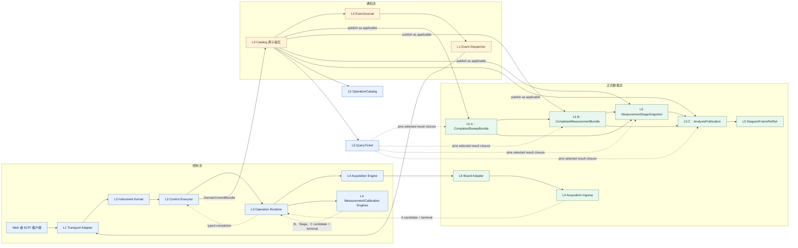
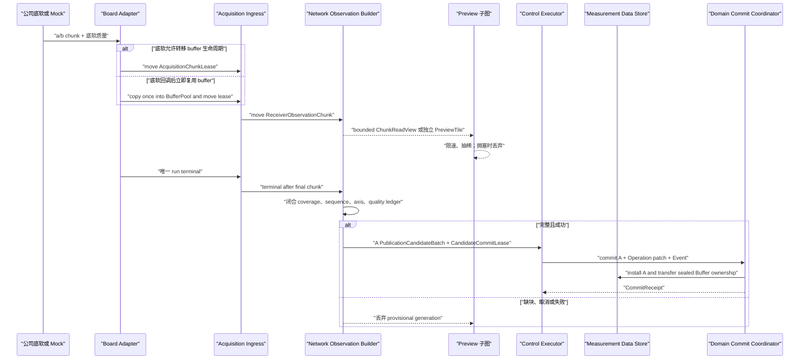
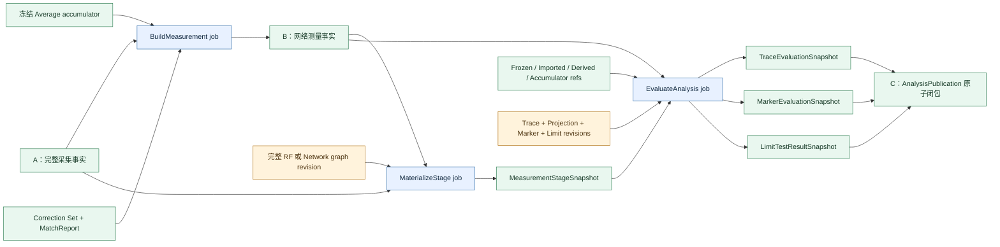
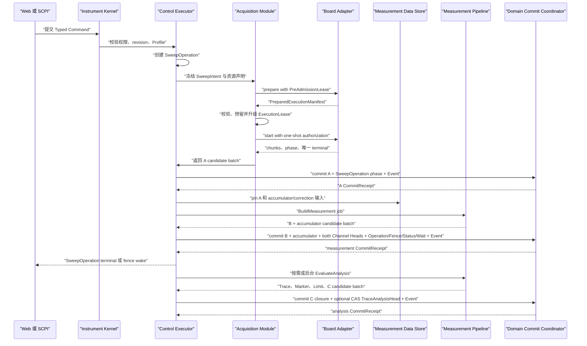
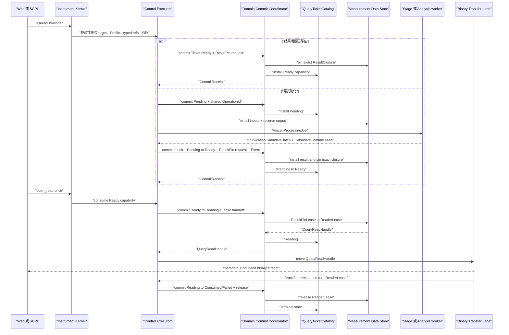
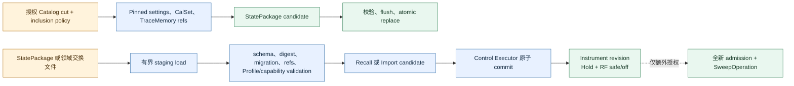

# VNA 端到端数据流与生命周期契约

> 状态：候选架构 v0.1；本文冻结跨层数据与所有权边界，不冻结尚待黄金数据验证的数值算法、厂商 SCPI 方言或公司底软 ABI。

本文回答的不是“某个类调用哪个函数”，而是一次 VNA 工作从 Web/SCPI 命令进入，到单板接收机观测、校准、迹线、Marker、Limit、Diagram、查询与导出之间，**什么数据以什么身份、由谁拥有、何时成为正式事实、失败时谁可以继续使用旧结果**。如果还不清楚每个 Module 属于哪一层，请先读 [VNA 分层架构与跨层流动](layered-architecture.md)；整体范围仍以 [整体系统架构](system-architecture.md) 和 [176 项功能对齐矩阵](feature-alignment-matrix.md) 为准。

本文统一采用以下跨层读法：Command/Query 从 L1 进入 L2；L2 把冻结工作交给 L3，L3 调度 L4；单板 chunk 从 L6 进入 L4；L4 只返回 candidate/typed result，经 L3 回到 L2；只有 L2 可以用 `DomainCommitBundle` 让 L5 的正式事实原子可见；Query Result/Event 再由 L5 经 L2/L1 返回。Preview 是 L4→L1 的独立可丢旁路。

## 1. 先冻结三条正交的流

系统中同时存在三条流，不能用一个 `completed`、一个全局 busy 标志或一个消息总线混在一起：

| 流 | 传递内容 | 权威来源 | 不传递什么 |
|---|---|---|---|
| 控制流 | `CommandEnvelope`、revision、Operation、取消、deadline、完成 fence | Instrument Kernel、Control Executor、OperationCatalog | 大数组和浏览器视图状态 |
| 正式数据流 | Manifest、A/B/Stage/C、Calibration Observation、质量平面、不可变 Buffer | Measurement Data Store / SnapshotCatalog | “当前选择”、Socket、JSON、厂商 SDK 对象 |
| 通知流 | catalog revision、event cursor、对象 ID、状态变化摘要、显式 gap | EventJournal + Dispatcher | 正式事实所有权、等待正确性和数组载荷 |

`Operation` 表示工作生命周期，不是数据；`Event` 表示“某事实已经提交”的提示，不是事实；`QueryTicket` 表示某个调用者访问已冻结结果的能力，也不是数据。三者都可以引用同一 Snapshot ID，但互不拥有对方。



### 1.1 Web 与 SCPI 只在边界上不同

Transport 先完成认证、语法和 wire codec，再把两种入口归一成相同的有类型 Envelope：

```cpp
struct RequestContext {
    RequestId request_id;
    AuthenticatedActorRef actor;
    SessionId session_id;
    MonotonicDeadline deadline;
    SessionOrderingToken ordering;
};

struct CommandEnvelope {
    RequestContext context;
    ExpectedRevisionSet expected;
    OptionalIdempotencyKey idempotency;
    TypedCommand command;
};

struct QueryEnvelope {
    RequestContext context;
    TargetSelector target;
    TypedQuery query;
};
```

SCPI parser context、selection 与错误队列仍是 Session 状态，但 Adapter 不能把字符串路径直接传进业务模块；Web JSON DOM、HTTP 对象也不能穿过 Kernel Interface。Kernel 接受时重新验证权限，并冻结确切 target ID、Profile revision、typed stage、父 refs 和 ordering；不能信任 Adapter 自己选择的“当前数组”。`QueryAdmission` 是 `InlineResult | ReadyTicket | PendingTicket | RejectedQuery` 的有类型和，只有有硬大小上限的状态/metadata 可以 inline。

领域 commit 产生的通知统一为：

```cpp
struct EventRecord {
    EventCursor cursor;
    CatalogRevision catalog_revision;
    EventKind kind;
    TypedObjectRef subject;
    OptionalRevision new_revision;
    VisibilityScope visibility;
    BoundedEventProjection projection;
};
```

Event projection 只能是有上限的摘要，不能因某个 Web 页面需要方便就塞入数组或私有字段。

## 2. 正式数据对象不是“一条数组”

项目采用 A/B/Stage/C 四种角色，其中 Stage 是 A/B 的惰性分支，不是与 A/B/C 并列的第四代发布层：

| 对象 | 含义 | 直接生产者 | 典型消费者 | 正式性与失败边界 |
|---|---|---|---|---|
| `ReceiverObservationChunk` | 底软一次回调交付的部分接收机复数观测与质量 | Board Adapter | Acquisition Ingress / Builder | 临时对象；不能直接被查询、校准或画图 |
| `PreviewTile` | 从当前 chunk 有界派生的暂态显示数据 | Preview 子图 | Web Preview 通道 | 可合并、抽稀、丢弃；永不晋升为正式结果 |
| A `CompletedSweepBundle` | 一个 Logical Sweep 的完整采集事实 | Network Observation Builder | RF graph、校准采集、receiver-stage query | 全部 required observations 与 terminal ledger 闭合后才发布 |
| `AverageAccumulatorSnapshot` | 某一 average generation 的不可变累加状态 | Measurement Publication lane | 下一次 average update、诊断 | 失败/取消 Sweep 不改变它；clear 建立新 generation |
| B `CompletedMeasurementBundle` | 按 Profile 完成 ratio、平均、用户修正等后的网络测量事实 | Measurement Pipeline | Live Trace、网络查询、校准验证、导出 | 每个被接受贡献必须发布；RF graph 失败不覆盖 last-good B |
| `MeasurementStageSnapshot` | 从 canonical A/B roots 按完整 graph revision 惰性物化的非 Trace 阶段 | Stage Materializer | Trace、Touchstone、receiver/raw/corrected query | 不串联另一个 Stage 作为父；中间节点是私有缓存实现 |
| `CalibrationObservationSnapshot` | 某校准步骤一次可求解的正式观测 | Calibration Acquisition flow | Calibration Solver | 绑定标准件、方法、实际轴、路由、独立平均闭包与本 attempt 的 A/受许可 Stage；排除 DUT B 和用户修正 |
| `TraceEvaluationSnapshot` | 一条 Trace 在冻结输入与 pipeline/projection 上的全分辨率结果 | Trace Evaluator | Marker、Limit、导出 | 不包含 Diagram 像素或浏览器抽稀 |
| C `AnalysisPublication` | Trace、Marker、Limit 子结果的原子闭包 | Control Executor 提交 evaluator candidate | Diagram、SCPI Trace/Marker/Limit query | 单 Trace 失败不回滚 B 或其他 C |
| `DiagramFrameRefSet` | 运行期 Diagram 刷新选择的确切 C publication 集合 | Display/View selector | Browser renderer | 只选择结果，不拥有测量或分析数据，也不改写 Workspace revision |

`SnapshotHeader` 只统一稳定 ID、schema、build、commit revision、时间、Profile refs 与质量摘要；各层使用有类型的 provenance variant，不能把所有来源塞入一个可任意扩展的字符串字典。`OperationId`、`LogicalSweepId`、`BoardRunId`、`CompletedSweepSnapshotId`、`CompletedMeasurementSnapshotId`、`MeasurementStageSnapshotId`、`AnalysisPublicationId`、`QueryTicketId` 和 digest 都是不同类型，禁止隐式转换。

### 2.1 A 层完成账本

A 不是收到一个 terminal 回调就把当前数组封口。每个候选 A 都维护一组 `BoardRunEvidence`；默认单板集合只有一个元素，可选组合扫频才有多个。每个元素包含：

- `manifest_id + BoardRunId + run_generation`；
- 从该 `PreparedExecutionManifest` 展开的 expected observation map；
- 实际收到的 source-state、receiver path、axis range、point coverage；
- chunk sequence 范围、重复/缺失/乱序检查；
- 唯一 run terminal、RF/post-run readback 与诊断证据；
- 逐 Sweep、逐 receiver 或逐 point 的真实 Quality Plane。

`CompletedSweepBundle` 再绑定 `LogicalSweepId + BoardRunEvidence[]`。只有所有账本全部闭合、实际轴/路由/配置 revision 相容且 terminal 成功，Builder 才能产生 A candidate。缺块、重复冲突、必要方向失败、terminal 后回调或无法确认 run generation 时都不发布 A。

### 2.2 质量与数据同路传播

质量不是日志里的附言，也不能靠一个 `valid` 布尔值覆盖所有层。每个正式数值对象携带有类型的 `QualityPlane`：

```cpp
struct QualityPlane {
    QualityLayout layout;                 // Sweep / receiver / path / point / matrix element
    ReadOnlyBuffer<ValidityCode> validity;
    ReadOnlyBuffer<QualityFlags> flags;
    BoundedMetricPlanes metrics;
    QualityTransformRevision transform;
};
```

某一层没有逐点质量时就声明实际 granularity，不能伪造与数组等长的数据。ratio 除零、接收机过载、失锁、插值、病态矩阵、插补和 average count 都通过 graph 节点的 `quality transform` 形成下一层质量；Diagram 只呈现它，不重新判定。

## 3. 真正的字节如何移动

### 3.1 从底软回调到 A

1. Real/Mock/Replay Adapter 把底软数据规范化为 `ReceiverObservationChunk`。若底软 buffer 的生命周期可以转移，chunk 持有 move-only `AcquisitionChunkLease`；若底软要求回调返回后立即复用内存，Adapter 必须在回调边界把数据复制到项目固定 Buffer Pool。未得到底软 ABI 证据前不承诺零拷贝。
2. `BoardRunSink` 把该 lease **唯一移动**到有界 Acquisition Ingress。Adapter 在移动后不再读写；terminal 后不得再投递。正式 chunk 不能像 Preview 一样丢弃：启动前的 Manifest/reservation 必须覆盖最大在途量；若底软声明可背压则按契约限流，否则任何意外 ingress/pool overflow 都使本次 run 失败并走 abort/drain，绝不能丢块后仍发布 A。
3. Network Observation Builder 是 chunk 数据的唯一长期拥有者。它校验 generation、sequence、manifest coverage、axis 与质量，并把合格 segment 组合进私有 A candidate。
4. Preview 不能与 Builder 同时消费同一个 move-only lease。它只能在 Builder 持有期间同步读取有界 `ChunkReadView`，或接收已经复制/派生且有独立所有权的 `PreviewTile`。Preview 队列满时丢 tile，不阻塞 Builder，也不延长 driver buffer 生命周期。
5. 唯一 terminal 与最后一个 chunk 建立 happens-before；账本闭合后，Builder 把 Buffer seal 为只读，并把 Buffer 所有权随 A candidate 交回 Control Executor，由后者持 permit 原子发布。成功提交后，该 Buffer 由 A/Data Store 继续拥有，任何 pool 都不得复用仍被 A 引用的内存；若 Builder 选择复制到预留的不可变 Snapshot Buffer，则只在复制与校验完成后释放原 lease。失败或取消才归还未发布 Buffer，并丢弃私有 candidate 和所有 Preview，不制造补零 A。



### 3.2 从 A 到 B、Stage 和 C

Worker 不直接修改 Catalog，也不直接发 Event。Control Executor 在派发前原子取得全部父输入的 `OperationInputLeaseSet`（公共接口名为 `PinnedInputSet`）和输出 reservation；worker 只产生不可见 `PublicationCandidateBatch`：

```cpp
PublicationCandidateBatch run(const FrozenProcessingJob& job,
                              PinnedInputSet&& inputs,
                              OutputReservation&& output,
                              ExecutionContext& context);
```

- `BuildMeasurement` 从一个新 A 和冻结的 accumulator/correction/profile 输入产生同一 batch 内的 B 与新 accumulator candidates；
- `MaterializeStage` 从 canonical A/B roots 与一份完整 RF/network graph revision 产生最终 Stage；
- `EvaluateAnalysis` 从 B 或 `MeasurementStageInput`，以及 Frozen/Imported/Derived/Accumulator supplemental refs，产生 Trace/Marker/Limit/C batch candidate。

`MeasurementStageSnapshot` 的 provenance 始终保存 canonical A/B roots。一个请求即使包含多级 fixture → renormalize → mixed-mode → gate，Materializer 也从 roots 按完整 graph revision 运行到目标 stage；Stage 不把另一个 Stage 当成正式父对象。内部中间结果可以缓存，但缓存淘汰不改变正式谱系。

`AnalysisInputRefSet` 的 primary source 至少允许：

```text
LiveMeasurementInput(measurement_snapshot_id)
MeasurementStageInput(measurement_stage_snapshot_id)
FrozenInput(frozen_or_memory_snapshot_id)
ImportedInput(imported_data_snapshot_id)
DerivedInput(ordered_upstream_analysis_publication_ids, generation_policy)
```

Memory Math、Hold 或 Ensemble Statistics 再添加有类型的 supplemental refs。所有父输入必须在派发前一次性 pin 成功；不能先读一个父，再等待另一个父时让前者被 retention 回收。取消或超时后若不可中断 worker 转入 Drain，`PinnedInputSet`、output reservation 和 lane capacity 一并转移，直到真实 terminal。成功返回时，batch 接管一个 `CandidateCommitLease`，在 Control Executor commit 或放弃整批之前继续保活所有结构共享的父 Buffer 与输出 reservation；worker return 与 publication commit 之间没有无主窗口。



### 3.3 提交与 current/last-good 分开

Snapshot 不可变，但“当前显示哪一个”是可变选择，因此权威 Catalog 另有 Head：

```text
ChannelMeasurementHead
  = {last_good_b, latest_attempt, status, revision}

ChannelAverageHead
  = {generation, current_accumulator_snapshot_id, count, complete, revision}

TraceAnalysisHead
  = {last_good_c, latest_attempted_input, status, revision}
```

Control Executor 不按“先写 Snapshot、再改 Head、最后发 Event”的顺序暴露中间状态，而是把一次领域事实组织为一个 `DomainCommitBundle`：

```cpp
struct DomainCommitBundle {
    PublicationCandidateBatch publications; // direct Ready/state-only commit 时可为空
    DomainCatalogPatchSet domain;
    HeadPatchSet heads;
    OperationAndFencePatchSet operations;
    InstrumentStatusPatchSet instrument_status;
    ScpiSessionStatePatchSet scpi_sessions;
    WaitRegistryPatchSet wait_registry;
    QueryTicketPatchSet query_tickets;
    ResultPinRequestSet result_pins;
    EventRecordBatch events;
    RetentionDeltaSet retention;
};

CommitReceipt commit(DomainCommitBundle&& bundle,
                     DomainCommitPermit&& permit);
```

`DomainCatalogPatchSet` 是 Instrument/Channel/CalibrationSession/AnalysisTrace/Diagram/Frame 等小型可变领域 revision 的有类型 patch 集合；它不接收任意 key/value，也不代替不可变 publication。`DomainCommitCoordinator` 在同一 Catalog revision 内校验全部 expected revisions、配额与引用，然后全成或全败地使 publication、领域 revision、Head、Operation/Fence、Instrument Status Register、SCPI Session State、WaitRegistry predicate/wakeup、QueryTicket/ResultPin、EventJournal sequence 和 retention delta 可见；Event 只能在该 revision 成功后被 Dispatcher 看见，等待正确性不依赖 Dispatcher。领域提交保证的是内存与 Catalog 可见性的原子性，具体持久化级别由 Product/Profile 另行规定。

特别地，接受一次平均贡献时，B、new accumulator、`ChannelAverageHead`、`ChannelMeasurementHead`、Operation/Fence、相关 status/wait predicate 和事件必须在同一 bundle 中提交；发布可提升的当前 Live C 时，结果闭包、`TraceAnalysisHead` 和事件必须同批提交；无论 direct Ready admission 还是 Pending→Ready，QueryTicket 的 Ready 状态与目标 `ResultPinLease` 都必须在同一 bundle 内成功。任一前置条件失败，整批 candidate 不可见并释放 `CandidateCommitLease`；随后可以另行提交失败 attempt/status/diagnostic，但不得改写 last-good Snapshot。

`TraceAnalysisHead` 不会被任意成功 C 推进。后台当前 Live 求值可携带 `HeadPromotionPolicy::RequireCurrent{trace_revision, source_binding_revision, input_generation}`，其 compare-and-set 只有仍匹配当前选择时才允许提交；针对历史 B/Stage 的 exact query 默认 `HeadPromotionPolicy::None`，只发布 C、使自己的 Ticket Ready，不更新 Head。若用户要显示该历史结果，应显式切换 `DiagramFrameRefSet` 或 Trace Source，而不是让一次读取产生隐藏的“当前结果倒退”。

浏览器看到 stale 是 Head 与当前配置/最新 attempt 的关系，不是对历史快照做原地标记。

当前 `last_good_b/last_good_c` 与 `ChannelAverageHead` 是受 ProductProfile 上限约束的 retention root；正在使用的 `PinnedInputSet`、`TypedSnapshotLeaseSet`、`CandidateCommitLease`、Query/Reader lease，以及 CalibrationSession 中已接受但尚未完成生命周期转换的 Observation closure 也会阻止其所需 payload 被回收。已经物化且自包含的 child 在不再承诺重算时可允许祖先大 payload 过期，但祖先 tombstone、digest 和最小 provenance 必须保留。`DiagramFrameRefSet` 本身只含软引用，不额外无限 pin 历史 C。浏览器打开数据时仍通过 QueryTicket 获取有配额的 ResultPinLease；若它尝试读取已退出 Head 且已过 retention 的旧 frame，明确得到 Gone 并 resnapshot。

Marker 的 `Invalid/Incomplete` 与 Limit 的 `Indeterminate` 是成功计算出的领域结果，可以随 C 原子发布；只有输入闭包不一致、evaluator 内部失败、资源失败或 Catalog batch commit 失败才使新 C 整批不可见。

## 4. Single、Continuous 与 Average 的同一条主链

一次正常测量的控制顺序是：



Single、Continuous、Groups 只是父 Operation 的调度政策不同；每轮 Logical Sweep 仍产生独立 `SweepOperation`、A、B 与唯一终态。Continuous 不能把所有轮次揉成一个不断被覆盖的数组。

### 4.1 原生 Average 发布规则

项目原生规则冻结为“每个成功贡献都有可观察的正式 B，完成事件另算”，这样 Diagram 能显示逐轮收敛，自动化又能等待明确 factor：

| 模式 | 接受贡献后的 B | 完成语义 |
|---|---|---|
| `FiniteBatch` | 每个成功贡献发布 `B_n`，记录 generation/count；`n < factor` 时 `average_complete=false` | `n == factor` 的 B 置 true，并发布一次 `average.completed` |
| `SlidingWindow` | warm-up 每轮发布 B，并记录 `window_fill`；窗口满后以固定 ring 移出最老贡献再发布新 B | complete/update fence 由冻结 Profile 定义，不能假设到 factor 后停止 |
| `Cumulative` | 每个成功贡献发布带有界 accumulator provenance 的新 B | 通常无自然终点；只允许 Profile 定义显式 fence |
| `VendorRunning` | 按目标固件验证过的 update kernel/state schema 发布 | 完成/保持/重启语义完全由 Compatibility Profile 冻结 |

- failed、cancelled、缺 observation、实际轴不相容或质量政策拒绝的 Sweep 不更新 accumulator，也不增加 accepted count；
- clear 原子建立新 generation 与新的 `ChannelAverageHead`；旧 B/A/C 保持可解释，旧 generation 的 in-flight Stage/C 不得越过 expected generation/revision 覆盖新 Head；
- 每个被接受贡献都必须原子发布 B 与对应 accumulator 状态；Continuous/Average 过载时，后台 Live C 可以采用 latest-wins 合并，**不保证每个 B 都自动产生 C**。针对某个确切 B/Stage 的 Web/SCPI 查询进入非合并的 `EvaluateTraceOperation`（相同确切输入的并发查询仍可 single-flight），最终 factor 的 B 具有更高分析优先级；自动化若需要 C，必须显式查询并 pin 该确切结果，而不是只等待 B 事件。C provenance 记录 average generation/count/complete；
- 只等待完整 factor 的调用绑定 `AverageSequenceOperation` fence；若还要求分析结果，则 fence 完成后对该最终 B 发起 exact C query；
- 底软内部 average 只有被 Board/Compatibility Profile 明确声明且上层不会重复平均时才能使用。

## 5. 校准数据流不借用 DUT 的“当前结果”

Calibration Session 的采集、求解、绑定和验证是四个阶段：

```mermaid
flowchart LR
    Plan["CalibrationMethodSpec + Session revisions"] --> Step["CalibrationStep"]
    Step --> Attempt["AcquisitionAttempt<br/>独立 AveragePolicy"]
    Attempt --> CalA["正式 A 与所需 Stage refs"]
    Standard["StandardInstance + Model revisions"] --> ObsCandidate["Observation candidate + QualityReport"]
    CalA --> ObsCandidate
    ObsCandidate --> Quality["Control Executor<br/>step quality acceptance + commit"]
    Quality --> Observation["CalibrationObservationSnapshot"]
    Observation --> Solve["Calibration Solver<br/>pins all accepted observations"]
    Solve --> CalCommit["PublicationCandidateBatch + CandidateCommitLease<br/>Control Executor validation + commit"]
    CalCommit --> Set["CorrectionSetRevision<br/>原子发布"]
    Set --> Binding["Channel CorrectionBinding"]

    VerifyPlan["VerificationPlanRevision"] --> VerifySweep["独立 verification acquisition"]
    Set --> VerifySweep
    VerifySweep --> VerifyB["明确应用目标 Set 的 B"]
    VerifyB --> VerifyEval["Verification evaluator"]
    VerifyEval --> VerifyCommit["Control Executor commit"]
    VerifyCommit --> VerifyResult["VerificationResult<br/>Pass / Fail / Indeterminate"]

    classDef definition fill:#fff3dc,stroke:#b47618,color:#4b310d
    classDef operation fill:#e8f1ff,stroke:#3973ac,color:#142b42
    classDef fact fill:#e9f7ef,stroke:#37845a,color:#173a27
    class Plan,Standard,VerifyPlan definition
    class Step,Attempt,ObsCandidate,Quality,Solve,CalCommit,Binding,VerifySweep,VerifyEval,VerifyCommit operation
    class CalA,Observation,Set,VerifyB,VerifyResult fact
```



`CalibrationObservationSnapshot` 至少绑定 session/step/attempt、标准件/模型 revision、方法、实际轴/路由/端口拓扑、质量/有效性，以及独立 average 的 policy、generation、accepted count、complete 与有界 contribution closure。Observation 可以引用由 `CalibrationMethodSpec` 明确允许的 Stage，但该 Stage 的 canonical roots 必须**恰好**是本次 `AcquisitionAttempt` 接受的 A 集合，graph/stage revision 也必须属于该方法；不得把当前或用户选择的 `CorrectionSet`、任何 DUT B、Channel last-good 或 Display selection 带入求解输入。CalibrationSession 在 solve/abort/按政策完成 retention transition 前，把已接受 Observation 及其所需 closure 作为 retention root；Solver 再一次性 pin 全部被接受 observation 和输出 reservation 后运行，只返回持有 `CandidateCommitLease` 的 CorrectionSet `PublicationCandidateBatch`。用户此时切换 Channel、修改 DUT Trace 或继续 Continuous Sweep 都不会改变问题输入。

求解成功只产生不可变 Correction Set；Set 与 Observation 都保留逐板 identity/capability/path condition/evidence 集合。将 Set 选给 Channel 和 enable correction 是单独 Command；每次执行的 correction match 接收非空 `PreparedExecutionManifestSet`（默认单板长度为 1），逐板判断后形成聚合 `CorrectionMatchReport`，不能只比较第一块板。校准验证重新采集独立 verification artifact，并让 B 明确记录“应用了哪个目标 CorrectionSetRevision”；它不能读取当前 Channel 恰好 last-good 的某个 DUT B，也不能把用于求解的同一数据静默当作独立验证证据。

## 6. Diagram、Marker 与 Limit 如何融入数据流

Diagram 是正式结果的消费者，不是数据处理层。完整路径是：

```text
A/B 或其他 typed source
→ 可选 MeasurementStageSnapshot
→ TraceEvaluationSnapshot
→ MarkerEvaluationSnapshot + LimitTestResultSnapshot
→ AnalysisPublication
→ DiagramFrameRefSet
→ TracePlacement 的 scale/style/overlay
→ 浏览器像素
```

规则如下：

- Marker、Limit 和统计只读取全分辨率 `TraceEvaluationSnapshot`；Diagram decimation、光标像素和 Preview 不能成为其输入；
- C 原子闭包让同一 Trace 的曲线、Marker、Limit 总是引用同一个 AnalysisInputRefSet 与 revision 组合；
- `DiagramFrameRefSet` 为每个 Placement 固定确切 `analysis_publication_id`。普通视觉刷新可以采用“每 Placement 最新可用”，但必须呈现 generation、时间与 stale；
- 跨 Trace Marker coupling、共享 Limit、Math 或需要同代比较时，使用更严格的 synchronization policy 先形成相容 C，再原子切换 FrameRefSet，不能因“看起来叠在同一张图”就混用不同代次；
- Preview 只作为带明确 provisional 样式的 overlay。正式 C 到达时按 generation 替换；失败/取消时删除该 preview generation，并继续显示 last-good FrameRefSet；
- 删除 Diagram 或 Placement 不删除 A/B/C。删除 AnalysisTrace 才按领域所有权规则处理 Marker/Limit/Placement，而历史 Snapshot 仍按 retention 存在。

## 7. Web、SCPI、查询与导出读取同一事实

### 7.1 QueryTicket 与结果闭包

一个 Query 在接受时解析并冻结 target、selection scope、Profile、typed stage、snapshot refs 和 authorization。之后有两种路径：

1. 结果已物化：在同一 `DomainCommitBundle` 中创建 Ticket、取得 `ResultPinLease` 并把 Ticket 置为 Ready；
2. 结果未物化：先原子创建 Pending Ticket 并创建或加入 Stage/C single-flight Operation；Operation 取得 `PinnedInputSet`，结果 candidate、Ticket Pending→Ready 与 `ResultPinLease` 请求再在同一 commit 中完成。确切 B/Stage 的查询不会被 Live latest-wins 队列合并掉，也默认不提升 `TraceAnalysisHead`。

`ResultPinLease` pin 的不是单个顶层 ID，而是自包含的 `ResultClosure`：例如 C publication、Trace/Marker/Limit children、axis/quality 和所有结构共享 Buffer。它不要求无限保留所有祖先 payload；祖先 tombstone、digest 与最小 provenance 继续存在，已经物化的自包含 child 仍可读取。若请求需要重新计算而祖先 payload 已被 retention 回收，则明确返回 `PayloadExpired/Gone`，由调用者重新选择当前 Snapshot，不能从 Event ID 猜数据。

`open_read` 在同一原子动作中把 Ticket 从 Ready 转为 Reading，并把 ResultPinLease 转换为 `QueryReadHandle` 内部的 `ReaderLease`，不是先释放再申请。Transport 只看到受限 reader/codec，不接触 lease 实现；完成、断线、超时或 cancel 把 ReaderLease 随 terminal 交回关闭路径，由 Reading→Consumed/Failed 的提交释放自己的 Ticket/Reader，不取消其他调用者共享的求值 Operation。



Web metadata 使用 JSON，复数/迹线/文件大数组走独立 binary stream；SCPI 使用 ASCII 或 IEEE definite-length block。两者读取同一 QueryReadHandle，传输过程中新的 Sweep、selection 变化或 Diagram 切换都不能撕裂结果。

### 7.2 Event 只负责通知

一次 Catalog commit 同时形成 `CatalogRevision` 和 `EventCursor{boot_id, epoch, sequence}`。Event 只携带小型 metadata 和 typed IDs，不携带全分辨率数组，也不 pin payload：

- Web 收到 `measurement.completed` 后按需 Query B/C；初始页面使用同一 Catalog cut 的 `InitialViewSnapshot + cursor`；
- SCPI fence/WaitRegistry 由 Operation terminal predicate 在 commit 时直接唤醒，不依赖 Event Dispatcher；raw TCP 不发送 unsolicited event 字节；
- Event retention gap 或慢客户端溢出返回显式 `ResnapshotRequired`；客户端重新获取权威快照；
- Event 到达时相关 payload 可能已经因 retention 过期，Query 必须正常返回 Gone，而不是让 Event 隐式拥有数据。

### 7.3 文件与 Blob

Export Operation 在接受时冻结确切 A/B/Stage/C refs，并在生成、flush、rename 全程持有 `TypedSnapshotLeaseSet`，其语义等同于面向导出的 PinnedInputSet。Touchstone 读取同代完整矩阵 B/Stage；CSV 可以读取明确的 B、Stage 或 C；报告同时 pin 数据、验证结果和模板 revision。

内部/交换文件的大 Blob 读取返回持有 `BlobReadLease` 的 `BlobReadHandle`。路径、文件描述符和临时文件仍封装在 Persistence Module；慢下载不能在无 lease 时继续读已被回收的 blob。失败不会原地覆盖上一有效文件，Finalizing 原子区之外的 cancel 会终止输出并释放相应资源。

### 7.4 State Save/Recall 与外部导入

文件 parser、migration 或 codec 都不能直接修改在线 Instrument Catalog：



State Save 按 inclusion profile 冻结一个授权 Catalog cut，并在序列化与文件 commit 全程 pin 所含 Correction Set、Trace Memory 或其他 blob；不把运行中的 Operation、Socket selection、账号/密钥或 Preview 写成可恢复事实。Recall 在 staging 中完成全部校验后只提交一个 `RecallCandidate`；Control Executor 将其展开为同一 `DomainCommitBundle` 内的 `DomainCatalogPatchSet`、可选静态 publications、Head/Status/Operation/Event/retention patches，失败时保持整个旧 Instrument revision。成功默认进入 `RestoreInHoldSafeOff`，不会复活旧 Operation、Armed/WaitingTrigger、Continuous generation 或 RF-on。若明确授权 `ExplicitRestoreRunState`，也必须在安全 commit 后重新走 Compiler、pre-admission、prepare、reservation 和新的 SweepOperation。

Touchstone/CSV、Cal Kit、Limit、Fixture 等导入同样先产生有类型 candidate：数据文件可形成 `ImportedDataSnapshot`，领域文件可形成新的 definition revision；只有显式后续 Command 才把它绑定到 Trace、Channel 或 Calibration Session。解析一个文件绝不能把半验证数组直接塞进当前 B/C 或修改现有 Correction Set。

## 8. 多单板数据流的边界

默认一个 Logical Sweep 只绑定一个 `BoardSession + BoardRunId`。Board Adapter 始终只代表一块板，不在 Adapter 内偷偷组合多板数据。

只有 Product Profile 和参与板卡能力证明同一 Coherence Domain、timebase lock、同步 trigger/epoch、skew 上界及实际轴兼容时，`CompositeSweepCoordinator` 才可以：

1. 为每块板取得独立 Prepared Manifest、ExecutionLease 和 BoardRunId；
2. 在 start 前完成全组 admission；
3. 任一成员失败时 fan-out abort/safe-state，等待所有真实 terminal；
4. 在 all-terminal barrier 后验证轴、epoch、相位/时钟与 coverage ledger；
5. 只发布一个绑定 `LogicalSweepId + BoardRunEvidence[]` 的 A，数组中逐板保存 manifest、BoardRunId、run_generation 与完成账本，并在 A provenance 中保存 parent manifest set；否则完全不发布。

这项能力未被公司底软证明前保持关闭；Mock 可以覆盖成功、skew 越界、timebase unlock、单板迟到 terminal 和安全通道失败。

## 9. 失败时究竟保留什么

| 失败位置 | 新事实 | Head/旧事实 | 通知与调用者行为 |
|---|---|---|---|
| prepare/admission 失败 | 无 A/B/C | last-good 不变 | Operation Failed；无数据完成事件 |
| chunk 缺失、乱序冲突、run 失败 | 无 A；Preview generation 丢弃 | last-good B/C 不变并显示 stale | Sweep Failed；诊断保留 ledger 摘要 |
| A 成功、RF graph/correction 失败 | A 保留，无新 B | ChannelMeasurementHead 的 attempt/status 更新，last-good B 不变 | measurement 不完成；receiver-stage query 可按权限读 A |
| Average contribution 被拒绝 | A 可保留，accumulator/B 不推进 | 同 generation 旧 B/C 不变 | count 不增加；报告拒绝原因 |
| B 成功、某 Trace evaluator 失败 | B 保留，无该 Trace 新 C | 其他 Trace 可正常发布；失败 Trace last-good C stale | 独立 analysis failure event/Operation terminal |
| Marker Invalid 或 Limit Indeterminate | 新 C 可以成功发布 | Head 指向新 C | 返回有类型领域状态，不伪装为系统异常 |
| C batch commit 失败 | 新 C 全部不可见 | 旧 C 保留 | 不允许半套 Trace/Marker/Limit |
| 任一 DomainCommitBundle 校验/写入失败 | 该 bundle 的 publication、领域 revision、Head、Operation/Fence、Status/SCPI Session/WaitRegistry、Ticket/ResultPin、Event 与 retention delta 全部不可见 | 旧 revision 完整保留；CandidateCommitLease 在 abort 后释放 | 不得用补偿事件伪装成原子提交；可另行提交失败诊断 |
| Event gap | Snapshot 不受影响 | Head/Catalog 仍权威 | 客户端 resnapshot，不能猜增量 |
| Query 客户端断线 | Snapshot 不受影响 | 只释放该 Ticket/ReaderLease | 共享 Operation 不被误杀 |
| Export/文件系统失败 | 无新的最终文件 | 上一有效文件与输入 Snapshot 不变 | Operation Failed；清理单个 staging artifact 按安全流程执行 |
| 跨板任一成员失败 | 不发布组合 A | last-good 不变 | fan-out abort/safe-state 并等待 all-terminal |

## 10. Deep Module 接口与所有权约束

### 10.1 Data Store 与领域提交 Module

`MeasurementDataStore` 隐藏 Buffer、Snapshot graph、parent closure、retention、tombstone、质量平面和 pin 配额；它不向 worker 暴露发布入口：

```cpp
PinnedInputSet pin_inputs(const TypedInputRefSet& refs,
                          InputPinPermit&& permit);

QueryReadHandle open_result(ResultPinLease&& result_pin,
                            ReaderPermit&& permit);

CommitReceipt DomainCommitCoordinator::commit(
    DomainCommitBundle&& bundle,
    DomainCommitPermit&& permit);
```

`ResultPinLease` 的新建只作为 `DomainCommitBundle.result_pins` 的一部分发生，不能在 Ticket 已经 Ready 后再补 pin。只有 Control Executor 能取得 commit/input/reader permit。Worker 不能越过它发布 Snapshot 或 Event，Transport 不能直接请求 Buffer 指针。这样既保住跨 Catalog 的原子可见性，也可以在不改变上层模块的情况下替换内存池、持久化后端或 retention 实现。

### 10.2 所有权总表

| 资源 | 谁创建 | 谁长期拥有 | 如何转移/释放 |
|---|---|---|---|
| 底软回调 buffer | 底软 | 取决于 ABI；默认不能跨回调 | 可转移才包装 lease，否则复制一次进 BufferPool |
| `AcquisitionChunkLease` | Adapter/BufferPool | Builder，成功时转 A candidate/Data Store | move-only；成功提交后随 A 的只读 Buffer 生命周期释放，或复制进预留 Snapshot Buffer 后释放；仅失败/取消时直接归还 pool |
| `PreviewTile` | Preview tap | Preview queue | 独立有界对象；可丢弃 |
| A/B/Stage/C 不可变 Buffer | Data Store/BufferPool 的预留，由 Builder/Worker 填充 | commit 前由 candidate lease、commit 后由 Data Store | Snapshot refs + graph-aware retention；读者只持 lease，结构共享所有权在 commit 时整体转交 |
| `PinnedInputSet` | Data Store | 当前 Operation/Drain | worker terminal 或所有权转交后释放 |
| output reservation | Processing Scheduler/Data Store | 运行时由 Operation/Drain，返回后由 CandidateCommitLease | candidate commit 后转为正式占用；整批失败且真实 worker terminal 后释放 |
| `PublicationCandidateBatch` / `CandidateCommitLease` | Worker 在真实 terminal 返回 | Control Executor 待提交队列 | commit 成功时把 Buffer/共享结构转入 Data Store；整批 abort 时统一释放，禁止逐对象半提交 |
| `ResultPinLease` | Query admission | QueryTicket | Ready TTL/cancel，或原子转 ReaderLease |
| `ReaderLease` | `open_read` | QueryReadHandle/Binary Transfer Lane | 随完成、断线或 timeout terminal 交回，并与 Reading→Consumed/Failed 同批释放 |
| `BlobReadLease` | Persistence | BlobReadHandle | blob 流关闭时释放 |
| Event | EventJournal | 固定容量 Journal | 不拥有任何 Snapshot payload |

## 11. 必须先通过的端到端验收场景

1. **单轮二端口**：F/R chunks 乱序投递但 sequence/coverage 可重组时发布一份 A/B；缺一个 required receiver 时不发布 A。
2. **driver buffer 立即复用**：Mock 在回调返回后覆盖原内存，最终 A hash 仍正确，证明 copy/lease 边界有效。
3. **Preview 拥塞**：浏览器暂停读取，Preview gap 增长但 Acquisition Ingress、A/B deadline 与 Buffer Pool 不被反压。
4. **Finite Average**：每个被接受贡献在一个 commit 中发布 B、accumulator 与两个 Channel Head，count 和 `average_complete` 正确；Live C 在过载时可合并而不承诺逐 B 发布；对任一指定 B 的 exact query 都能得到对应非合并 C；第 factor 次只发一次 `average.completed`，且其 C 求值优先级更高；失败贡献不计数。
5. **Average clear 竞态**：clear 与旧 generation 的 stage/C worker 并发，旧 Snapshot 可读但不能覆盖新 Head。
6. **惰性 Stage**：同一 canonical roots + graph 的并发 Touchstone/SCPI query 只计算一次；回收内部中间 cache 后最终 Stage 仍可读。
7. **历史精确查询不倒退 Head**：当前 Head 已指向较新 Live C 时，对旧 B/Stage 的 exact query 能发布并读取历史 C，但 `TraceAnalysisHead` 保持不变；只有仍匹配 current token 的 Live candidate 可 CAS 提升 Head。
8. **C 原子闭包**：Marker Invalid、Limit Indeterminate 能成功发布；注入 Limit evaluator 内部错误时不出现半套 C。
9. **Ready 与 retention 竞态**：无论 direct Ready admission 还是 Pending→Ready，Ticket Ready 都必能完整 open/read closure；pin 配额不足只返回 ResourceExhausted，不产生悬空 Ready。
10. **Event gap**：暂停 Dispatcher、淘汰 Journal 后，SCPI fence 仍按时完成，Web 被要求 resnapshot，权威 Snapshot/Head 不丢。
11. **校准隔离**：DUT Continuous Sweep、Channel selection 和 Trace 修改不能改变已接受 CalibrationObservation；求解失败不覆盖旧 Set。
12. **校准验证**：结果能反查目标 Set、verification standard、独立 A/B 与 tolerance revision；当前 Channel 绑定切换不重解释历史报告。
13. **Diagram 多代次**：普通 overlay 明示每 Placement generation/stale；coupled Marker/Limit 只在同步政策满足时原子切 frame。
14. **导出期间新 Sweep**：Touchstone/CSV/报告全程 hash 对应同一 refs；cancel/断线不泄漏 input/blob lease，也不留下已宣称成功的半文件。
15. **可选跨板**：任何成员失败、skew 越界或 timebase unlock 都不发布组合 A，并完成 fan-out abort/safe-state/all-terminal。

## 12. 当前刻意不冻结的内容

以下内容不影响本文的跨层所有权契约，仍需后续证据或实测：

- 公司底软 buffer 是否可转移、回调线程、最大 chunk、abort/terminal 细节和真实质量字段；
- 各板卡 a/b 定义、实际轴量化、receiver topology 与多板 coherence 能力；
- 各校准方法的 Observation 精确 stage、误差方程、权重、uncertainty 和黄金数据；
- Keysight/R&S/CMT 目标型号的 Average stage、running kernel、SCPI completion/query 兼容语义；
- MinGW 与公司 AArch64 SDK 上的 Buffer alignment、Eigen、HTTP、JSON、文件系统与容量上限；
- Product Profile 是否开放跨板组合、Ensemble Statistics、复杂 Z0、报告等 Pro 功能。

这些门禁可以改变某个 graph、Profile 或 Adapter 实现，但不能改变以下已冻结边界：Preview 不正式、A/B/Stage/C 不可变、Worker 不直接发布、Event 不拥有事实、Query 读取 closure、失败不覆盖 last-good、Diagram 不做测量判定。
