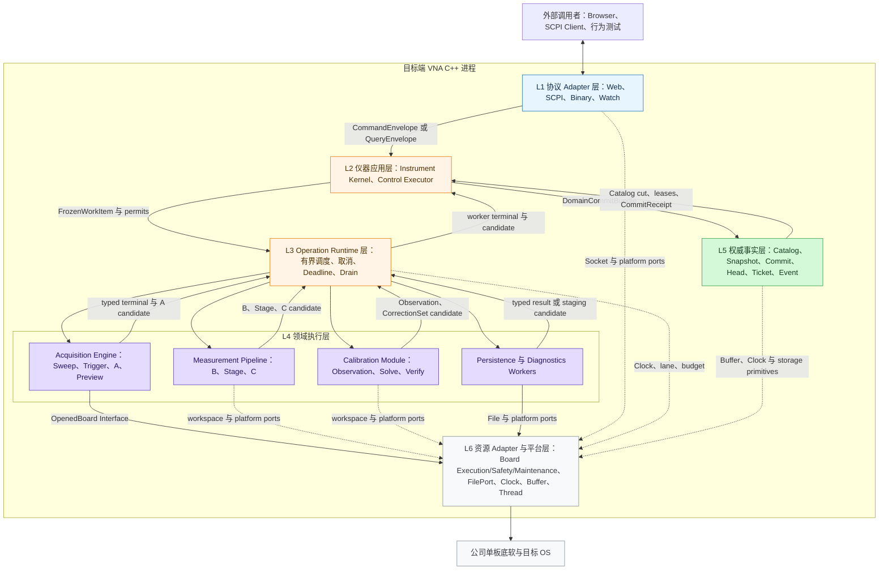
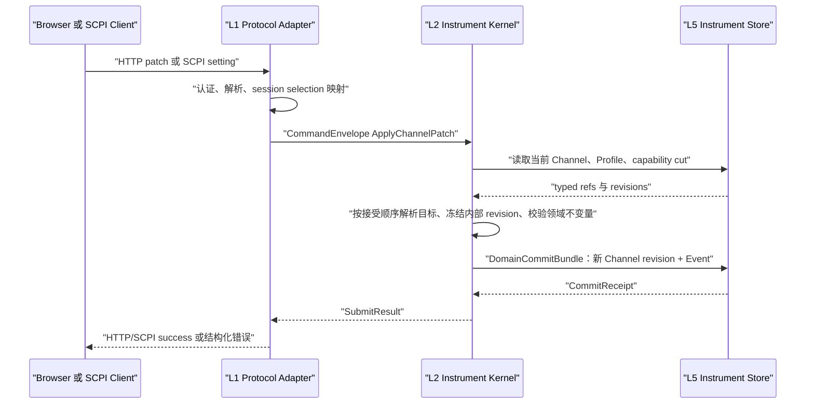
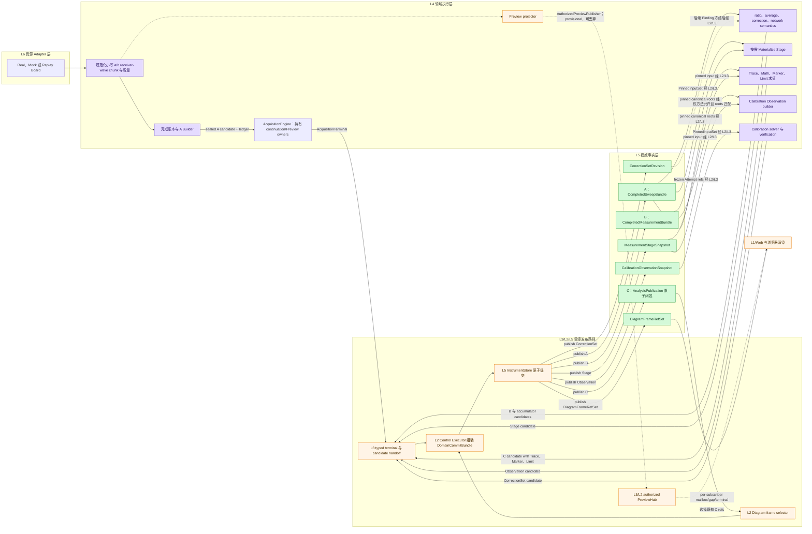

# VNA 分层架构与跨层流动

> 状态：候选架构 v0.1；本文是架构首读入口，先固定职责层、Module、Interface 与 seam，再说明 Command、正式数据、Query 和 Event 如何跨层流动。方法级规则见[跨层 Interface 契约](interface-contracts.md)，Board seam 见 [Board Adapter 契约](board-adapter-contract.md)，详细所有权和失败契约仍以[端到端数据流](data-flow.md)为准。

本文解决一个阅读问题：A/B/Stage/C、Operation、DomainCommit、QueryTicket、Marker、Limit 和 Diagram 都已经有设计，但它们不是同一种东西。若没有先说明“谁负责决策、谁负责执行、谁拥有正式事实”，直接画在一张系统图里就无法沿层追踪。

推荐阅读顺序：

1. 先看本文的六层职责和功能落层；
2. 再沿一条 Sweep Command 看控制如何向下、结果如何向上；
3. 再看 A→B/Stage→C 的正式数据谱系；
4. 最后进入 [整体系统架构](system-architecture.md)、[生命周期契约](data-flow.md) 和 [176 项功能矩阵](feature-alignment-matrix.md) 的细节。

## 1. 六个职责层

这里的“层”表示稳定的职责和依赖方向，不要求像 OSI 一样让每条消息机械穿过全部层。`Instrument Kernel` 是控制主干；`Operation Runtime` 调度 L4 的有界执行 Module；`Instrument Store` 是权威事实库，不是数组必须逐级复制经过的管道。



### 1.1 每层实现什么

| 层 | 主要 Module | 必须实现 | 向相邻层交付 | 明确禁止 |
|---|---|---|---|---|
| L1 协议 Adapter | Web Transport、SCPI Transport、Event/Preview/Binary Transfer | HTTP/TCP 生命周期、认证入口、parser、framing、SCPI session/方言、JSON/二进制/IEEE block 编解码、Watch/Preview 传输 | `CommandEnvelope`、`QueryEnvelope`；反向编码 `SubmitResult`、Ticket、Reader、Event | Channel/校准/Marker/Limit 业务规则；直接调用 Board；保存“当前数组”；把 HTTP、JSON DOM、SCPI 字符串传入核心 |
| L2 仪器应用 | `InstrumentKernel`，其 Implementation 内含唯一 `ControlExecutor`、纯 `SweepAdmissionPlanner`、有状态 `ResourceArbiter` 和各工作流 | 权限、selection/target 解析、Profile/revision 冻结、能力与领域不变量、Sweep planning/全有或全无 pre-admission、Command/Query admission、Operation/Fence、Channel/Trace/Marker/Limit/Diagram/Calibration 定义、组装 `DomainCommitBundle` | `FrozenWorkItem`、执行 permits、typed refs；对外返回 Operation/Ticket/View | 网络/文件 I/O、Eigen 数值计算、阻塞硬件、直接操作厂商 SDK、在回调线程等待 |
| L3 Operation Runtime | Ingress、Scheduler、Worker Lanes、Budget/Deadline、Drain/Quarantine | 固定容量队列与 worker、优先级、公平性、取消、timeout、进度限速、真实 terminal、不可中断工作所有权转交 | 向 L4 派发冻结任务；向 L2 返回 typed terminal/candidate | 解释 Web/SCPI Command、决定领域语义、修改 Catalog/Head、发布 Snapshot/Event、把 accepted 当 terminal |
| L4 领域执行 | Acquisition、Measurement Pipeline、Calibration、Persistence、Diagnostics | actual Manifest 校验/本地收窄与采集成形；A→B/Stage/C；平均、校准、Trace、Marker、Limit、Math；文件 staging/迁移；诊断采集 | `Succeeded / Failed / Draining` typed terminal；仅 Success 携 candidate/result；Acquisition Success/Failed 可显式归还 `PreviewFinalizationOwnerSet`，Processing 期间由 L3 持 Runtime preview escrow，Drain 携完整执行 owner | 读取“当前选中对象”、重新编译/扩容/换板、自己 pin 未授权输入、直接 commit、推进 Head、发布 Event、解释协议、让一个 worker 隐式调用另一个工作流 |
| L5 权威事实 | `InstrumentStore`；内部 Domain/Snapshot/Operation/Query Catalog、Measurement Data Store、Domain Commit Coordinator、Heads、Wait/Status、EventJournal | 不可变 A/B/Stage/C 图、领域 revision、全有或全无提交、pin/reader/retention、QueryTicket、last-good Head、状态与事件序号 | Catalog cut、`PinnedInputSet`、reservation、`CommitReceipt`、Event feed；`ResultPinLease` 留在 Store，只交付 opaque `QueryReadHandle`（内含 ReaderLease） | 执行测量算法、解释协议、调度 Sweep、驱动硬件、根据页面需要改写历史事实 |
| L6 资源 Adapter 与平台 | `BoardPort` seam 的 Real/Mock/Replay Adapter；每块板的 `OpenedBoard` 暴露 Execution/Safety/Maintenance 权限分面；另有 File Adapter、Platform Clock、固定 BufferPool、线程/Socket/日志适配 | 隔离公司 SDK 和 OS 差异；板卡 capability/prepare/start/abort/safe-state/health/recover；文件原子写；单调时钟和有界资源 | Manifest、chunk lease、唯一 terminal、安全/健康证据、文件/平台 typed result | 反调 Kernel、直接 commit/Event、泄漏厂商结构体/Eigen/httplib/JSON 类型、在单板 Adapter 内偷偷组合多板 |

浏览器中的页面和绘图库位于设备进程之外：它们编辑领域对象、呈现正式结果和 provisional Preview，但不产生 VNA 测量真值。

### 1.2 关键 Interface 与真实 seam

| 跨层位置 | Interface | 为什么存在 |
|---|---|---|
| L1 → L2 | `InstrumentKernel::submit/admit/inspect/open_read/finish_read/initial_view/begin_watch` | Web、SCPI 和行为测试都使用同一深 Module Interface；协议差异到此结束 |
| L2 内部 planning/admission | `SweepAdmissionPlanner::plan(FrozenSweepPlanningInput)` + stateful `ResourceArbiter::try_pre_admit(...)` | Planner 纯计算并产生同 digest 的 job/claims/typed refs；Arbiter 才按 topology epoch 全有或全无签发排他 lease |
| L2 → L3 | `OperationRuntime::reserve_work(...) → ReservedWorkDispatch` + `dispatch(FrozenWorkItem, WorkPermitSet, RuntimeCompletionRegistration)` | commit 前同时预留固定 lane/queue 与可靠 completion slot；L2 保留 WorkId 映射，dispatch 时把其 permit 纳入 WorkPermitSet 并单独 move completion registration；隐藏预算、取消、deadline、Drain 和真实 terminal |
| L3 → L4 Acquisition | `AcquisitionEngine::run(FrozenSweepJob, AcquisitionLeaseSet, ExecutionContext)` | 隐藏 actual Manifest validation/finalization、Composite Coordinator、Board/Builder、Preview producer 和安全收尾 |
| L3 → L4 Measurement | `MeasurementPipeline::run(FrozenProcessingJob, PinnedInputSet, OutputReservation, ExecutionContext)` | 隐藏 Eigen、RF graph、平均、修正、Stage、Trace/Marker/Limit 算法 |
| L3 → L4 Calibration | `CalibrationModule::run(FrozenCalibrationJob, PinnedInputSet, OutputReservation, ExecutionContext)` + bounded `match(...)` | 隐藏 Observation 规则、误差项求解、适用性匹配与独立验证算法；Session 流程仍归 L2 |
| L2 → L5 | `InstrumentStore` 的 Catalog read、pin/output/lifecycle-terminal/pending-result-pin reserve、commit、Query open/finish、Event feed begin/stop | L2 只依赖一个 transaction boundary；每个可见 lifecycle 预留终态，每个 Pending waiter 独立预留 ResultPin 上界；Data Store/Commit Coordinator 是其内部实现，Runtime/Preview capability 不进入 bundle/result |
| L4 Acquisition → L6 | `BoardPort` seam 上的 `OpenedBoard{Execution,Safety,Maintenance}` Interface | Real、Mock、Replay 至少三种 Adapter，是真实可替换 seam；显式两阶段执行保留 actual Manifest admission，一组分面只代表一块板 |
| L4 Persistence → L6 | `FileStore` | 目标文件系统与内存测试 Adapter 行为不同，文件 staging 不污染在线 Catalog |

`Runtime → Pipeline` 和 `Kernel → Store` 是 Module Interface，不因为“分层”再包一层空转 Adapter；L2 planning 是 InstrumentKernel 内部的纯/有状态 admission 工作流，Kernel 仍只能通过 L3 Runtime dispatch 调用 L4 执行。真正需要 Adapter 的地方必须至少有两种实现。不得建立 `MarkerManager`、`LimitManager`、`DiagramManager` 等只转发 CRUD 的浅 Module。跨层 accepted/terminal、异常、析构、lease 和 Drain 的共同规则统一见[跨层 Interface 契约](interface-contracts.md)。

### 1.3 不允许的跨层捷径

1. L1 不得直接读取 L5 的裸 Buffer，也不得调用 L4/L6。
2. L3/L4 worker 不得读全局 current selection；任务在 L2 接受时已经冻结目标和 revision。
3. L4 只返回 typed terminal；Success 可含不可见 candidate/result；Failed 已终结并释放全部执行资源、不含 candidate。Acquisition terminal 可显式归还等待 L2 按 commit 结果终结的 Preview owner；Processing 的 Preview escrow 留在 L3，不穿过 L4 调用。Draining 必须转交完整执行 owner，Runtime 再合并 escrow。任何分支都不能直接更新 Catalog、Head、Ticket、Status 或 Event。
4. L6 Board Adapter 只认识逻辑扫频和接收机观测，不认识 Channel、Trace、Marker、Limit 或 Diagram。
5. `Event` 只能从 L5 InstrumentStore EventFeed 经 L2 ACL/filter/access-revision 投影到授权 Watch mailbox，再由 L1 编码；L1 不直读 EventJournal。
6. `PreviewTile` 只能由 L2/L3 下传的 `AuthorizedPreviewPublisher` 进入有界 PreviewHub，再由 L1 消费经过 access-revision 校验的 mailbox；L4 不持 Web callback。它是可丢弃的 provisional 旁路，不能进入 Marker、Limit、校准、SCPI 正式查询或导出。
7. RF-off/interlock 可以在 L6 的独立安全路径越过普通调度；动作结果随后仍要回到 L2/L5 形成权威状态和审计。

## 2. 商用 VNA 功能分别落在哪一层

同一功能通常有“定义、工作流、执行、正式事实、呈现”五种责任，不能因为同名就塞进一个 Manager。

| 功能域 | 定义与决策 | 执行位置 | L5 正式事实 | L1/浏览器呈现 |
|---|---|---|---|---|
| Instrument、Preset、Status | L2 Instrument Domain/Control Policy | Preset/Reset 工作流在 L2/L3 | Instrument revision、Status/Operation Catalog | 状态页、状态命令、错误映射 |
| Channel、Stimulus、Sweep | L2 `Channel@revision` | L3 调度；L4 Acquisition；L6 Board | A/B、ChannelMeasurementHead | Channel 表单、Sweep 控制、进度 |
| Trigger、Continuous、Groups | L2 Policy 与 Operation 定义 | L3 Runtime + L4 Acquisition | Operation/Fence、A/B | Run/Hold、触发与完成状态 |
| Average | L2 `AveragePolicy` 与 clear generation | L4 Acquisition 提供贡献；Measurement Pipeline 做复数累加 | B、AccumulatorSnapshot、AverageHead | factor/count/complete 与收敛显示 |
| S 参数与用户 Correction | L2 MeasurementSpec、CorrectionBinding | L4 Measurement Pipeline 做 ratio、match、修正 | B provenance、CorrectionMatchReport | 测量选择、Correction 状态 |
| Calibration | L2 Kit/Method/Session/Binding 工作流 | L4 Acquisition 采标准件；Calibration Module 求解/匹配/验证 | Observation、CorrectionSet、VerificationResult | 校准向导、质量、应用与验证报告 |
| Trace、Math、Memory、Statistics | L2 AnalysisTrace/Source/Pipeline revision | L4 Measurement Pipeline | TraceEvaluation、C、Accumulator/Frozen refs | Trace 设置与读数 |
| Marker | L2 MarkerDefinition，归属于 AnalysisTrace | L4 Measurement Pipeline 在全分辨率 Trace 上求值 | MarkerEvaluation，属于 C 闭包 | Marker overlay/table；不从像素反算 |
| Limit | L2 LimitDefinition，归属于 AnalysisTrace | L4 Measurement Pipeline 在全分辨率 Trace 上判定 | LimitResult，属于 C 闭包 | Limit 线、Pass/Fail/Indeterminate |
| Diagram、Placement | L2 Workspace/Diagram/Placement 规则 | Frame selector 选择既有 C；浏览器渲染/抽稀 | Workspace revision、DiagramFrameRefSet | 坐标、scale、style、overlay；不做测量判定 |
| Web 与 SCPI | L1 协议/方言/session | 统一调用 L2 Interface | 相同 Operation、Ticket、Snapshot | 不建立第二套业务状态 |
| Query、Export | L2 冻结 typed target | 缺 Stage/C 时 L3/L4 求值；Persistence 生成文件 | QueryTicket、ResultClosure、Blob refs | HTTP binary、SCPI ASCII/IEEE block |
| Save/Recall | L2 决定保存范围和 Recall 政策 | L4 Persistence staging；L6 File Adapter | State revision、Operation/Event；Recall 一次提交 | 文件页和 SCPI State 命令 |
| Diagnostics 与 RF Safety | L2 建立 Operation/锁存状态 | L3 lane；L4 Diagnostics；L6 Board/Platform | Health、Fault、Audit、Operation | 高优先级告警、诊断包、恢复入口 |
| 多板与 Mock | L2 capability gate | L4 Composite Coordinator；L6 每板 Adapter | `BoardRunEvidence[]`、coherence metadata | 单一 Logical Sweep；内部板 run 可诊断 |

几个最容易放错的位置：

- A/B/Stage/C 是正式数据阶段，不是四个软件层。
- Marker/Limit 定义在 L2、计算在 L4、结果在 L5、显示在浏览器；Diagram 从不参与判定。
- Calibration Session 流程在 L2，标准件采集和求解在 L4，Observation/CorrectionSet 在 L5，Channel 只保存 Binding。
- SCPI selected object 是 L1 session/Profile 解析上下文，不是 Channel 或 Snapshot 的所有者。
- Multi-board 由 L4 Acquisition 的 Composite Coordinator 编排；一个 L6 Board Adapter 永远只代表一块板。

## 3. 跨层传递的对象只有这些类别

| 类别 | 允许的路径 | 不允许发生的事 |
|---|---|---|
| Command | Client → L1 parser → `CommandEnvelope` → L2；L2 生成领域 patch 或 FrozenWorkItem | SCPI 字符串、JSON DOM 或 HTTP 对象继续进入 L2 以下 |
| Query | Client → L1 → `QueryEnvelope` → L2；L2 冻结 actor/Profile/typed refs，经 L5 direct Ready 或调度 L4 物化 | Adapter 从“当前数组”直接回答；Query 默认等待未来 Sweep；Engine 解释 Query |
| Work | L2 → `FrozenWorkItem + permits` → L3 → L4 | worker 在运行中重新读取 current Channel/Profile/selection |
| Candidate | L4 → L3 terminal → L2 → `DomainCommitBundle` → L5 | candidate 在 commit 前可见；只提交 batch 的一部分；worker 自己发布 Event |
| Formal Data | L6 chunk → L4 candidate → L3 typed terminal → L2 `DomainCommitBundle` → L5 正式 A/B/Stage/C；反向输入由 L2 从 L5 pin 后经 L3 交给 L4 | Preview 晋升正式；candidate 绕过 L3/L2 直达 L5；Transport 持裸 Buffer；修改已发布 Snapshot |
| Query Result | direct Ready 同批取得精确 `ResultPinLease`；Pending waiter 在 join 前各自安装 `PendingResultPinReservation`，Ready 时无普通容量失败地转换；lease 始终留在 L5，`open_result` 只返回内含 `ReaderLease` 的 opaque `QueryReadHandle` → L1 codec → Client | L1/L2 直接取得内部 lease；多个 waiter 共用一份 pin quota；单 Ticket quota/cancel 回滚共享 publication；Ticket Ready 后再补 pin；网络断开泄漏 handle |
| Event | L2 把 Event batch 放入同一 commit；L5 `InstrumentStore` EventFeed → L2 ACL/filter/access-revision 投影与授权 Watch mailbox → L1 codec → Client | L1 直读 Store/EventJournal；Event 携带大数组、拥有 Snapshot、承担 SCPI fence 正确性 |
| Preview | L2 admission 签发 publisher → L3/L4 Builder/Preview tap → 有界 PreviewHub → L1/Web 授权 mailbox；L6 只提供原始 chunk 来源 | L4 保存 Web callback；进入 L5 正式 Catalog；供 SCPI、Marker、Limit、Calibration 或 Export 使用 |

## 4. 命令如何逐层流动

### 4.1 配置命令不会进入硬件层

以修改 Channel 频率范围为例：



这条路径只到 L5：修改配置不等于执行 Sweep，不得因为用户改了频率就从协议线程隐式启动硬件。

### 4.2 Sweep 是异步 Operation

Web 的 `StartSweep` 与 SCPI 的 `INIT` 在 L1 之后走完全相同的路径：

```mermaid
sequenceDiagram
    participant Client as "Browser 或 SCPI Client"
    participant Protocol as "L1 Protocol Adapter"
    participant Kernel as "L2 Instrument Kernel"
    participant Runtime as "L3 Operation Runtime"
    participant Acquisition as "L4 Acquisition Engine"
    participant Board as "L6 Real 或 Mock Board Adapter"
    participant Compute as "L4 Measurement Pipeline"
    participant Store as "L5 Instrument Store"

    Client->>Protocol: "StartSweep 或 INIT"
    Protocol->>Kernel: "CommandEnvelope StartSweep"
    Kernel->>Store: "read one authorized CatalogCut"
    Store-->>Kernel: "frozen Channel/Profile/Capability/Topology input"
    Kernel->>Kernel: "SweepAdmissionPlanner.plan + 预分配 OperationId"
    Kernel->>Runtime: "reserve_work acquisition + required B claims"
    Runtime-->>Kernel: "ReservedWorkDispatch set or reject"
    Kernel->>Store: "pin purpose deps + reserve A/B outputs + lifecycle terminal"
    Store-->>Kernel: "Store owners + LifecycleTerminalReservationSet or reject"
    Kernel->>Kernel: "ResourceArbiter all-or-none pre-admit"
    Kernel->>Store: "commit SweepOperation Accepted + install terminal reservation"
    alt "initial commit 失败"
        Store-->>Kernel: "CommitFailed；无 Operation"
        Kernel->>Kernel: "释放完整 admission owners；不 dispatch"
        Kernel-->>Protocol: "SubmitRejected"
        Protocol-->>Client: "rejected；无 OperationId"
    else "initial commit 成功"
        Store-->>Kernel: "CommitReceipt；Store 持 terminal reservation"
        Kernel-->>Protocol: "SubmitResult OperationId"
        Protocol-->>Client: "已接受，不冒充已完成"

        Kernel->>Runtime: "dispatch FrozenSweepJob + WorkPermitSet + RuntimeCompletionRegistration; retain WorkId mapping"
        Runtime->>Acquisition: "run"
        Acquisition->>Board: "prepare(derived auth); L4 retains admission owner"
        Board-->>Acquisition: "actual PreparedExecutionManifest"
        Acquisition->>Acquisition: "validate + local exact finalization; zero allocation"
        Acquisition->>Board: "start(StartAuthorization + RunDeliveryGrant)"
        Board-->>Acquisition: "raw receiver-wave 小写 a/b chunks + quality + unique terminal"
        Acquisition-->>Runtime: "AcquisitionSucceeded: A candidate + continuation owner + Preview owner"
        Runtime-->>Kernel: "typed completion"
        Kernel->>Kernel: "split StoreJoinOwner; retain RuntimeEscrow + Preview"
        Kernel->>Store: "commit A + StoreJoinRequest + Operation phase + Event"
        alt "A commit 失败"
            Store-->>Kernel: "CommitFailed + abort receipt"
            Kernel->>Kernel: "释放 RuntimeEscrow；保留 Preview 到失败事实"
            Kernel->>Store: "state-only SweepOperation Failed via terminal reservation"
            Store-->>Kernel: "Terminal CommitReceipt | AlreadyTerminal"
        else "A commit 成功"
            Store-->>Kernel: "CommitSucceeded + ContinuationStoreHandoff"

            Kernel->>Runtime: "BuildMeasurement + Store handoff + RuntimeEscrow; Runtime holds B/C Preview escrow"
            Runtime->>Compute: "run BuildMeasurement"
            Compute-->>Runtime: "B and accumulator candidates"
            Runtime-->>Kernel: "typed completion"
            Kernel->>Store: "commit B + Heads + Fence + Status + Event"
            alt "B commit 失败"
                Store-->>Kernel: "CommitFailed + abort receipt"
                Kernel->>Store: "state-only SweepOperation Failed via terminal reservation"
                Store-->>Kernel: "Terminal CommitReceipt | AlreadyTerminal"
            else "B commit 成功"
                Store-->>Kernel: "CommitReceipt + Event/Wait facts"
                Kernel-->>Protocol: "授权 Web watch record 或 SCPI waiter wake"
                Protocol-->>Client: "measurement completed 或 OPC fence satisfied"

                opt "存在当前 Live Trace"
                    Note over Kernel: "B commit 后同一有界 turn 独立 exact-C admission"
                    Kernel->>Runtime: "reserve_work EvaluateAnalysis"
                    Runtime-->>Kernel: "ReservedWorkDispatch or reject"
                    alt "reserve/pin/output/terminal/Pending commit 全部成功"
                        Kernel->>Store: "pin B/Stage refs + reserve C output/lifecycle terminal"
                        Kernel->>Store: "commit exact-C Pending + install reservation"
                        Store-->>Kernel: "CommitReceipt；Store 持 C terminal reservation"
                        Kernel->>Runtime: "dispatch EvaluateAnalysis + WorkPermitSet + RuntimeCompletionRegistration；保留 WorkId 映射；Runtime 持 C Preview escrow"
                        Runtime->>Compute: "run EvaluateAnalysis"
                        Compute-->>Runtime: "C candidates with Trace, Marker and Limit"
                        Runtime-->>Kernel: "typed completion + Preview escrow"
                        Kernel->>Store: "commit C + optional TraceAnalysisHead + Event"
                        alt "C commit 成功"
                            Store-->>Kernel: "analysis CommitReceipt"
                        else "C commit 失败"
                            Store-->>Kernel: "CommitFailed + abort receipt"
                            Kernel->>Store: "state-only EvaluateTraceOperation Failed"
                            Store-->>Kernel: "Terminal CommitReceipt | AlreadyTerminal"
                        end
                    else "任一 admission/initial commit 步骤失败"
                        Kernel->>Kernel: "释放本地 owner；无 C Operation；立即执行 CPreviewFallback"
                    end
                end
            end
        end
    end
```

这条命令链有五个必须区分的时间点：

1. `StartSweep` 被接受，只产生 OperationId；
2. Board run terminal 到达，只说明底软本轮结束；
3. A 发布，说明完整接收机观测已经形成；
4. B 与 Sweep fence 同批提交，才是原生网络测量完成；
5. 每条 C 可独立晚于 B 完成，不能拖住其他 Trace 或改写 B。

## 5. 正式数据如何逐层流动



读图规则：

- A/B/Stage/C 是 L5 中不同语义的不可变事实，不是四个软件层。
- 小写 `a/b` 是底软上送的接收机复数波量；大写 A/B 是正式快照阶段，二者不能混写。
- Stage 是从 canonical A/B roots 按需物化的分支，不是每轮 Sweep 必经步骤，也不能把另一个 Stage 当 canonical parent。
- Marker、Limit 在 L4 对全分辨率 Trace 求值，并与 Trace 一起形成 C；DiagramFrameRefSet 只选择 C，浏览器最后才做像素抽稀。
- Calibration Step 只能使用本次 Attempt 的完整 A 集合和方法明确允许、roots 完全匹配的 Stage；求解出的 CorrectionSet 由后续 Channel Binding 进入新的 B 路径。
- 多板只会让 A 的 `BoardRunEvidence[]` 包含多个逐板证据；它不会增加新的数据层。任一成员失败或 coherence gate 不通过都不发布组合 A。

### 5.1 字节所有权跨层规则

1. L6 底软 buffer 可转移时包装为 move-only `AcquisitionChunkLease`；不可转移时只在回调边界复制一次到预留 BufferPool。
2. L4 Builder/worker 持有 input/output lease，完成后返回带 `CandidateCommitLease` 的 candidate；candidate 仍不是正式事实。
3. L2 只在 worker 真实 terminal 后组装 `DomainCommitBundle`；L5 成功提交后，Buffer 所有权才转入 Snapshot graph。
4. L5 Snapshot 一经发布不可变；Head 只选择 last-good/current，不修改历史 Snapshot。
5. L2 `open_read` 调用 Store `open_result`，由 Store 在内部把 `ResultPinLease` 原子转换为只封装在 authorized `QueryReadHandle` 内的 `ReaderLease`；L1 只持该 opaque handle 完成编码与传输，L1/L2 永远不直接取得内部 lease 或裸 Buffer 指针。

完整 Buffer、retention、失败和多板规则见 [端到端数据流](data-flow.md)。

## 6. Query 与 Event 如何返回到调用者

Query 是拉取确切事实的能力；Event 只是通知某个事实已经提交。两者不能合并成“事件里顺便带数组”。

```mermaid
sequenceDiagram
    participant Client as "Browser 或 SCPI Client"
    participant Protocol as "L1 Protocol Adapter"
    participant Kernel as "L2 Instrument Kernel"
    participant Store as "L5 Instrument Store"
    participant Runtime as "L3 Operation Runtime"
    participant Compute as "L4 Measurement Pipeline"

    Client->>Protocol: "Trace、Marker、Stage 或 Export Query"
    Protocol->>Kernel: "QueryEnvelope"
    Kernel->>Kernel: "冻结 actor、Profile、typed target 与 refs"

    alt "结果已经物化"
        Kernel->>Store: "reserve lifecycle terminal；commit Ready Ticket + exact ResultPin + install reservation"
        alt "direct Ready commit 成功"
            Store->>Store: "pin exact ResultClosure + install Ready"
            Store-->>Kernel: "CommitReceipt + Ready Ticket"
            Kernel-->>Protocol: "Ready Ticket"
        else "pin quota/closure/revision 校验失败"
            Store-->>Kernel: "CommitRejected(mapped QueryAdmissionError)"
            Kernel-->>Protocol: "RejectedQuery；无 Ticket"
        end
    else "需要 Stage 或 C"
        Kernel->>Runtime: "reserve_work Stage/Analysis claim"
        Runtime-->>Kernel: "ReservedWorkDispatch；失败则无 Pending"
        Kernel->>Store: "pin inputs + reserve output/lifecycle terminal/caller ResultPin 上界"
        Store-->>Kernel: "Store owners + PendingResultPinReservation | StoreError"
        alt "StoreError"
            Kernel->>Kernel: "释放 ReservedWorkDispatch 与已取得的全部 Store owner；不创建 Pending"
            Kernel-->>Protocol: "RejectedQuery(map_store_admission_error(error))"
            Note over Kernel: "quota/output capacity => ResourceExhausted; expired parent => PayloadExpired/Gone"
        else "Store 资源成功"
            Kernel->>Store: "commit Pending + install lifecycle/pin reservations"
            alt "Pending commit 失败"
                Store-->>Kernel: "CommitFailed；无可见 lifecycle"
                Kernel->>Kernel: "释放 Runtime/Store 全部本地 owner"
                Kernel-->>Protocol: "RejectedQuery；无 Ticket；不 dispatch"
            else "Pending commit 成功"
                Store-->>Kernel: "CommitReceipt；Store 持 reservations"
                Kernel->>Runtime: "dispatch FrozenProcessingJob + WorkPermitSet + RuntimeCompletionRegistration；保留 WorkId 映射"
                Runtime->>Compute: "MaterializeStage 或 EvaluateAnalysis"
                Compute-->>Runtime: "closed ProcessingTerminal"
                alt "Publishable"
                    Runtime-->>Kernel: "Publishable RuntimeWorkCompletion"
                    Kernel->>Store: "commit result + convert active PendingResultPinReservations"
                    alt "publication commit 成功"
                        Store->>Store: "install result + exact pins + Pending to Ready"
                        Store-->>Kernel: "CommitReceipt + Ready Ticket set"
                        Kernel-->>Protocol: "授权 watch record 或 waiter wake，若已订阅"
                    else "publication commit 失败"
                        Store-->>Kernel: "CommitFailed + candidate abort receipt"
                        Kernel->>Store: "state-only Ticket/Operation Failed via terminal reservation"
                        Store-->>Kernel: "Terminal CommitReceipt | AlreadyTerminal"
                        Note over Kernel,Store: "Store integrity failure => Instrument fail-stop"
                    end
                else "Failed"
                    Runtime-->>Kernel: "Failed RuntimeWorkCompletion；资源已释放"
                    Kernel->>Store: "state-only Ticket/Operation Failed via terminal reservation"
                    Store-->>Kernel: "Terminal CommitReceipt | AlreadyTerminal"
                else "Draining"
                    Runtime-->>Kernel: "DrainingHandoff + complete owner + DrainId"
                    Kernel->>Store: "state-only Ticket Failed + Operation/Drain fact"
                    Store-->>Kernel: "Terminal CommitReceipt | AlreadyTerminal"
                    Note over Runtime: "Drain 持全部 owner 到唯一 DrainTerminal"
                end
            end
        end
    end

    opt "Ticket Ready"
        Protocol->>Kernel: "inspect + open_read"
        Kernel->>Store: "open_result(ticket, authorization, permit)"
        Store->>Store: "atomic Ready to Reading + ResultPin to ReaderLease"
        Store-->>Kernel: "QueryReadHandle，内部封装 ReaderLease"
        Kernel-->>Protocol: "authorized QueryReadHandle"
        Protocol-->>Client: "HTTP binary 或 SCPI block stream"
        Protocol->>Kernel: "move QueryReadHandle + ReadTerminal"
        Kernel->>Store: "finish_result(move handle, terminal)"
        Store-->>Kernel: "ReadFinishReceipt"
    end
```

Event/等待规则：

- 任一成功 `DomainCommitBundle` 在 L5 同批写入 `EventJournal`；Event 只有 revision、cursor、typed ID 和有界摘要。
- Web 先经 Kernel `initial_view/watch` Interface 取得 `InitialViewSnapshot + cursor`，L1 Authorized Dispatcher 再编码 Event；gap、epoch 或权限集合变化后重新取快照。
- SCPI raw TCP 不插入 unsolicited Event；L5 WaitRegistry 把 ready bucket 移到 WaitReadyQueue，L1 SCPI 状态机再经 Kernel wait/status Interface 恢复 `*OPC?`/`*WAI` 或读取 Status/ESR/STB。这条路径不依赖 EventJournal。
- Event 到达时 payload 可能已经因 retention 过期；客户端再 Query 时得到明确 `PayloadExpired/Gone`，不能把 Event 当数据保活引用。
- Preview 使用独立可丢通道，不进入 EventJournal，也不承担完成语义。

## 7. 其他主流程沿用同一层次

| 主流程 | 逐层路径 | 关键边界 |
|---|---|---|
| Marker/Limit/format 修改 | L1 Command → L2 新 definition revision → L3/L4 基于 last-good B/Stage 求值 → L5 新 C | 不重扫；不经过 Diagram 像素；历史 exact query 不倒退 Trace Head |
| Diagram 修改 | L1 Command → L2 Workspace/Placement validation → L5 revision/frame refs → 浏览器重绘 | 不进入 L3/L4/L6；不改变 Trace、Marker、Limit 正式数值 |
| Calibration Step | L1 → L2 Session/Step workflow → L3/L4 Acquisition → L6 Board → L5 A/Observation | 不继承 DUT 当前 Average/Correction；失败 Step 不覆盖旧 CorrectionSet |
| Calibration Solve/Apply | L2 pin accepted observations → L3/L4 solver → L5 同批发布 Set + Session terminal；Apply 再改 Channel Binding | 求解与应用分离；Session 不是 Channel 开关 |
| Save | L1 → L2 冻结保存范围 → L5 Catalog cut/leases → L3/L4 Persistence → L6 File Adapter | 文件成功替换后再提交 Operation terminal；输入始终固定 |
| Recall | L1 → L2/L3 → L4 staging 解析/迁移 → L2 capability 校验 → L5 一次 `DomainCommitBundle` | staging 不直接改在线 Catalog；默认 Hold + RF safe/off；不复活旧 Operation |
| Diagnostics/Recovery | L1/L2 建立 Operation → L3 独立 lane → L4 Diagnostics → L6 Board/Platform → L5 Fault/Health/Operation | 普通队列不能阻塞 RF safety；unsafe fault 不能被普通 remote recover 清除 |

## 8. 建议的代码与构建边界

目录名服从六层，而不是为每个领域名词创建一个库：

```text
web/                          Browser SPA 与绘图
src/
  protocol/
    web/
    scpi/
  instrument/
    kernel/
    workflows/
    domain/
  runtime/
  engines/
    acquisition/
    measurement/
    persistence/
    diagnostics/
  store/
  ports/
    board/
    file/
    platform/
  adapters/
    board_real/
    board_mock/
    board_replay/
    platform_linux/
    platform_mingw/
```

推荐构建依赖：

```text
vna_protocol_web/scpi  -> vna_instrument
vna_instrument         -> vna_runtime + vna_store + vna_domain_types
vna_runtime            -> vna_engines
vna_acquisition        -> vna_board_port + vna_platform_port
vna_measurement        -> vna_domain_types + vna_platform_port
vna_persistence        -> vna_file_port
vna_store              -> vna_domain_types + vna_platform_port
board_real/mock/replay -> vna_board_port
platform_linux/mingw   -> vna_platform_port
```

依赖反向时必须通过调用者拥有的 Interface，而不是互相 include Implementation。Eigen 只在 computation Implementation；cpp-httplib 只在 Web Adapter；JSON 类型只在 codec/persistence Adapter 内。所有公开 Interface 使用项目自有 C++17 typed ID、值对象、view/span、Result 和 move-only lease。

### 8.1 分层测试面

| 测试 | 穿过的 Interface | 不测试什么 |
|---|---|---|
| Kernel 行为契约 | L1 等价输入 → `InstrumentKernel`，注入 Mock Board 与内存 File Adapter | 不依赖 HTTP/SCPI 语法细节 |
| Web/SCPI 等价契约 | 两个 L1 Adapter → 同一 Command/Query 与领域结果 | 不复制领域断言实现 |
| Runtime 模型/压力 | FrozenWorkItem → terminal/cancel/drain | 不解释 Channel/Marker 语义 |
| Board 合同测试 | 同一 `OpenedBoard` suite 跑 Real/Mock/Replay | 按 [Board Adapter 契约](board-adapter-contract.md)验证 Execution/Safety/Maintenance；Mock 成功不代替真实相干与 RF 安全证据 |
| 算法黄金测试 | L4 Measurement Pipeline 与 Calibration Interface | 不通过 Diagram 或协议读回再比对 |
| Store 竞态测试 | read/pin/reserve/commit/open/finish/event-feed begin/stop/retention Interface | 不调用底软或 Eigen |
| 端到端验收 | Web/SCPI → Mock/回放 → A/B/C → Query/Event | 再以 HIL 补真实板卡、时序、性能和计量证据 |

## 9. 一句话检查分层是否被破坏

实现或评审时逐项询问：

- 协议字符串是否越过 L1？
- worker 是否读取了 current state 或直接发布事实？
- 正式数据是否绕过 `DomainCommitBundle`？
- Board Adapter 是否知道 Channel/Trace/Diagram？
- Marker/Limit 是否从像素或 Preview 计算？
- Event 是否携带或保活了大数组？
- Mock 与 Real 是否跑同一 BoardPort 契约？
- 任何队列、Buffer、Ticket、Watcher、worker 或历史引用是否无界？

任一答案不符合本文，就不是“实现细节不同”，而是跨层契约已经被破坏。
