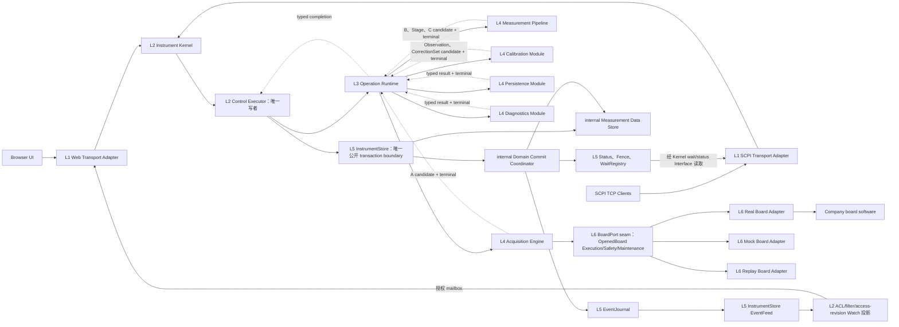
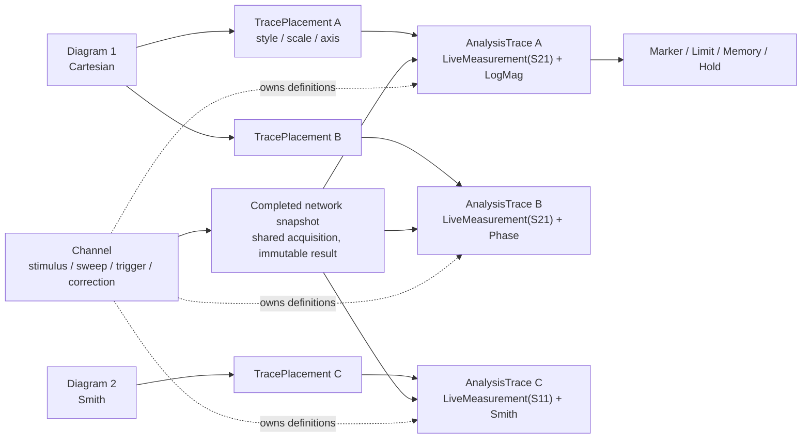
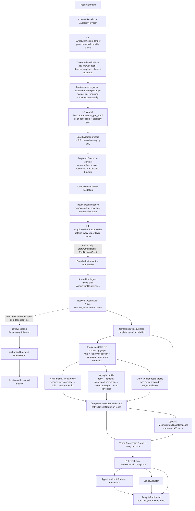
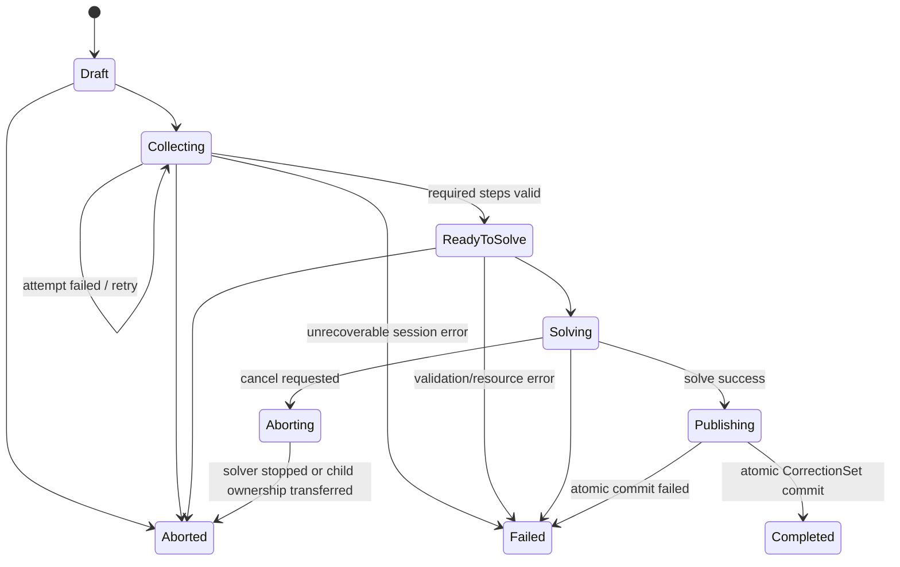
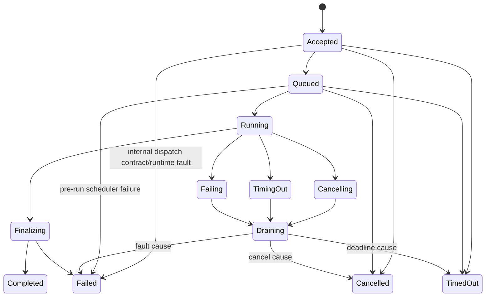

# VNA 上层软件整体架构设计

> 状态：候选架构 v0.1，176 项商用功能已完成官方证据归类，但兼容 Profile、算法/计量黄金数据、真实单板契约、公司 SDK/容量和少量产品范围尚未闭合，因此不得视为冻结或批准。

> 首次阅读请先看 [VNA 分层架构与跨层流动](layered-architecture.md)。方法级 accepted/terminal、lease 与错误规则见[跨层 Interface 契约](interface-contracts.md)，单板 seam 见 [Board Adapter 契约](board-adapter-contract.md)。本文在该六层地图之上展开完整领域模型、Module Interface、线程/内存与功能语义，不再让读者从实现节点反推分层。

## 1. 目标、证据与约束

本项目建设一套运行在公司定制 AArch64 GNU/Linux 5.10 PREEMPT 平台上的成熟 VNA 上层软件。软件不实现单板底软，但通过稳定的单板适配 seam 接入多种真实单板，并在 Windows MinGW 环境以 MOCK/回放适配器完成开发和测试。用户通过浏览器或 TCP Socket SCPI 操作同一台逻辑仪器。

设计依据不是对某一家闭源仪器内部实现的猜测，而是对 Keysight PNA/ENA、Rohde & Schwarz ZNA/ZNB、Copper Mountain VNA 的公开对象模型和外部行为进行归一化。详细证据见：

- [商用 VNA 外部行为基线](../research/commercial-vna-behavior-baseline.md)
- [商用 VNA 功能能力全景与首版范围基线](../research/commercial-vna-capability-catalog.md)
- [商用 VNA 对象、分析与控制行为的一手证据](../research/official-vna-object-and-analysis-evidence.md)
- [商用 VNA Sweep 与采集数据链一手证据](../research/official-vna-sweep-acquisition-evidence.md)
- [商用 VNA 校准与处理链一手证据](../research/official-vna-calibration-processing-evidence.md)
- [商用 VNA 控制、状态、文件、安全与平台一手证据](../research/official-vna-control-state-platform-evidence.md)
- [商用功能逐项对齐矩阵](feature-alignment-matrix.md)

已经确认的硬约束：

1. 生产版使用公司 AArch64 Linux SDK/交叉工具链；MinGW 用于 Windows MOCK、开发调试和自动化测试。
2. 底软负责硬件操作、接收机解调和逻辑扫描；适配层向上层交付逐实际刺激点、逐接收路径、未经用户校准的复数 `a/b` 接收机波量及质量信息。
3. Web 可显示扫频中的可丢弃预览；正式计算、Marker、Limit、保存和 SCPI 数据查询只消费成功完成后原子发布的完整快照。
4. 核心使用 C++17；Eigen3 可用于数值计算，cpp-httplib 只是待准入的 Web Transport 候选。cpp-httplib 官方当前明确只正式支持最新 Visual Studio，Cygwin/MSYS2（含 MinGW）未受支持或测试，因此必须先用项目锁定的 MinGW-w64 完成 HTTP 核心及 SSE/WebSocket 的编译、链接、运行验证，再独立通过公司 AArch64 SDK 与目标机验证；任一基础 HTTP 门禁失败都替换整个 Web HTTP Transport Adapter，不让依赖渗入 Instrument Kernel。
5. Linux `PREEMPT` 不自动等于 `PREEMPT_RT` 或硬实时。上层不承担 ADC、LO、触发边沿等硬实时闭环；网络、JSON、文件和复杂计算不得运行在底软采集线程。

## 2. 产品完整性原则

### 2.1 行为只有一份

Web、SCPI、启动恢复和内部自动操作最终都提交相同的类型化 Command/Query。范围校验、状态机、资源仲裁、校准适用性、错误和审计只在核心实现一次，协议适配器不得复制业务规则。

### 2.2 控制面单写，数据面不可变

仪器配置由一个 Control Executor 串行修改，每次成功修改形成新 revision。扫频在启动时捕获配置 revision；后续修改不会改变正在执行或已经发布结果的含义。所有正式数据和分析结果一经发布即不可变。

### 2.3 能力驱动，不伪装支持

上层根据 `BoardCapabilities + ProductProfile` 验证功能。单板或产品未支持的能力在 Web 中隐藏或禁用，在 SCPI 中返回稳定的 capability error；不得以空实现、零数组或 MOCK 成功冒充真实能力。

### 2.4 所有资源有界

Channel、Analysis Trace、Marker、Diagram、快照、连接、队列、日志和文件都有显式上限。正式结果和 Operation 终态必须先进入权威 Catalog；事件投递只传引用，允许因有界 retention 或慢客户端产生**显式** sequence gap 并要求 resync，不能静默伪装成连续，也不能反压 Control Executor。预览可以合并、抽稀或丢弃，并通过 gap/resync 通知客户端。

### 2.5 用 deep module 隐藏复杂度

不为每个领域名词创建一层 CRUD Manager。少量 Module 通过小 Interface 隐藏采集编译、数值处理、跨对象不变量、协议状态和持久化事务；真实 Adapter 与 MOCK Adapter 只出现在行为确实变化的 seam。

## 3. 产品能力分级

完整产品路线分为三层。Core/Pro/HW 是产品交付层级，不是“是否已经通过算法/平台验证”的状态；分级表示交付边界和硬件依赖，不表示 Pro 能力可以没有架构位置。

| 能力域 | 成熟核心 Core | 专业扩展 Pro | 硬件/选件 HW/Option |
|---|---|---|---|
| 仪器 | 身份、能力、Preset/Reset、State、健康、自检、RF 安全、登录、最小角色、变更审计 | 配方、合规审计导出、报告 | 外部测试集、开关矩阵、外设 |
| Channel/扫频 | 多 Channel；Linear、Log、Segmented、CW、能力受限的 Power；Single/Continuous/Hold/Groups；功率、IFBW、平均、触发 | 任意点表、Phase/FOM、二维/生产序列 | Fast CW、脉冲、多源、毫米波 |
| Measurement | 单端 `Sij`、receiver wave/ratio、常用派生量 | Mixed-mode、Z/Y/T 等网络变换、自定义表达式 | true-mode、变频、噪声、非线性 |
| 校准 | Response、1-port SOL、one-path 2-port、full 2-port SOLT、Cal Kit/Session/Correction Set | Unknown-Thru/SOLR、TRL/LRL/LRM、多端口、校准验证 | ECal、source/receiver power cal、外部功率计 |
| Trace/Diagram | 多图多迹线、常用格式、Memory/Math、Hold、Smoothing、沿 X 的单 Sweep Statistics、基础 frozen/reference trace | Ensemble 跨 Sweep Statistics（若启用 MATH-08）、任意表达式、跨 Channel 数学、多历史对比 | 高端应用专用视图 |
| Marker | Normal、Reference、Delta、Fixed/Tracking、Max/Min/Next/Target、Bandwidth/Q | Ripple、peak table、跨 Trace 耦合、复杂分析 | 专用应用 Marker |
| Limit | 上下限分段、Pass/Fail/Indeterminate、失败点和裕量报告 | Ripple/Mask、锁存、批次统计、自动报告 | Handler/继电器输出 |
| 信号处理 | Electrical delay、port extension、逐端口正实数 Z0 renormalization | complex/balanced Z0 与可选 wave theory、Time domain/window/gating、Touchstone embedding/de-embedding | AFR、眼图、增强 TDR |
| 控制/文件 | Web、Socket SCPI、IEEE 488.2 状态、State/Cal/Touchstone/CSV | HiSLIP/VXI-11、录制回放、报告模板 | 厂商测试系统集成 |

高端噪声系数、频谱、混频器、脉冲、IMD、增益压缩、眼图等必须保留 capability 扩展位置，但不进入基础 VNA 的虚假承诺。

## 4. 分层入口与详细系统全景

六层主干是：L1 协议 Adapter → L2 Instrument Kernel/Control Executor → L3 Operation Runtime → L4 采集或计算 Engine；L2 通过 L5 Instrument Store 读取并原子提交权威事实，L4 只经 L6 Resource Adapter 接触单板、文件和平台。A/B/Stage/C 是 L5 中的数据阶段，不是另外四个软件层。逐层职责、禁止事项和完整命令/数据时序见 [分层架构首读文档](layered-architecture.md)。

下面是进入实现钻取后的 Module 关系图；它刻意比六层首图更细：



图中的 L5→L2→L1 回程箭头表示已授权的数据流，不表示 L5 反向依赖协议层：Kernel 通过 `InstrumentStore::begin_event_feed` 建立 replay-cut→live feed，再进行 ACL/filter/access-revision 投影；Web Dispatcher 只编码授权 Watch mailbox，不读取 EventJournal。SCPI Adapter 通过 Kernel 的 wait/status Interface 消费 WaitReadyQueue 和状态事实。Web 和 SCPI 是 Transport Adapter，不是第二套应用。`httplib::Request`、JSON DOM、SCPI 字符串、Socket 句柄、厂商底软结构体和 Eigen 类型都不得穿过 Instrument Kernel 的 Interface。

## 5. 完整领域模型

```text
Instrument [instrument_revision]
├─ ProfileSet@revision
│  ├─ ProductProfileRevision -> licensed/enabled capabilities + capacity
│  ├─ BoardExecutionProfileRevision* -> RF order / average / trigger mapping
│  ├─ AnalysisCompatibilityProfileRevision -> processing / Marker / Limit policy
│  ├─ ScpiCompatibilityProfileRevision* -> selection / fence / delete / error dialect
│  └─ FileCompatibilityProfileRevision -> State / exchange behavior
├─ HardwareCatalog
│  ├─ BoardSlot -> BoardIdentity + BoardCapabilities@revision
│  └─ ResourceGraph
│     ├─ SourceResource
│     ├─ ReceiverResource
│     ├─ RouteResource
│     └─ Trigger/ClockResource
├─ Channel@revision
│  ├─ StimulusDefinition
│  ├─ AcquisitionPolicy
│  ├─ CorrectionBinding
│  ├─ ChannelMeasurementHead -> last-good B + latest attempt/status
│  ├─ ChannelAverageHead -> generation + accumulator + count/complete
│  └─ AnalysisTrace@revision*
│     ├─ TraceSourceSpec
│     │  ├─ LiveMeasurement(MeasurementSpec)
│     │  ├─ DerivedTrace(source refs)
│     │  ├─ FrozenSnapshot(snapshot ref)
│     │  └─ ImportedData(data ref)
│     ├─ TracePipelineRevision + AnalysisProjection
│     ├─ MarkerDefinition*
│     └─ LimitTestDefinition*
├─ CalibrationCatalog
│  ├─ ConnectorDefinition + CalibrationMethodSpec
│  ├─ CalKitRevision -> ClassAssignment -> StandardModelRevision*
│  ├─ StandardInstanceRevision*
│  ├─ CalibrationSession -> CalibrationStep -> AcquisitionAttempt
│  │  └─ CalibrationObservationSnapshot + QualityReport
│  ├─ CorrectionSetRevision -> ErrorTerms + ApplicabilityEnvelope
│  └─ VerificationPlanRevision -> VerificationArtifactRef + AcceptancePolicy
├─ AnalysisCatalog
│  ├─ TraceAnalysisHead* -> last-good C + latest attempted input/status
│  ├─ TraceMemoryEntry / FrozenTraceEntry -> immutable snapshot ref
│  ├─ TraceAccumulatorDefinition -> latest AccumulatorSnapshot ref
│  ├─ Fixture/DeembeddingProfileRevision
│  ├─ TimeDomain/GateProfileRevision
│  └─ MathExpressionRevision
├─ DisplayWorkspace@revision
│  └─ Diagram*
│     └─ TracePlacement* -> AnalysisTraceRef
│        └─ style / visibility / scale / axis / z-order / marker-limit presentation
├─ DiagramFrameCatalog
│  └─ DiagramFrameRefSet* -> exact AnalysisPublication refs
├─ OperationCatalog
│  ├─ SweepOperation / AverageSequenceOperation
│  ├─ ContinuousRun / GroupRun
│  ├─ MaterializeMeasurementStageOperation
│  ├─ EvaluateTraceOperation
│  ├─ CalibrationOperation / CalibrationVerificationOperation
│  ├─ SaveRecallOperation / ImportExportOperation / SelfTestOperation
│  ├─ BoardRecoveryOperation
│  └─ DrainOperation
├─ QueryTicketCatalog
│  └─ Pending -> Ready -> Reading -> Consumed|Failed|Abandoned；Pending/Ready -> Expired|Cancelled|Failed
└─ SnapshotCatalog
   ├─ CompletedSweepBundle*
   ├─ CompletedMeasurementBundle*
   ├─ MeasurementStageSnapshot*
   ├─ CalibrationObservationSnapshot*
   ├─ ImportedDataSnapshot* / TraceMemorySnapshot* / FrozenTraceSnapshot*
   ├─ AverageAccumulatorSnapshot* / AccumulatorSnapshot*
   ├─ CalibrationVerificationResultSnapshot*
   ├─ TraceEvaluationSnapshot*
   ├─ AnalysisPublication*
   ├─ MarkerEvaluationSnapshot*
   └─ LimitTestResultSnapshot* / LimitAggregationSnapshot*
```

### 5.1 身份与 revision

- 所有可持久化实体使用带类型的稳定 ID；显示名称允许重复，SCPI 数字索引是由方言规定作用域的外部标识，不是内部身份。
- Definition 表示用户意图，Snapshot 表示某个 revision 下已经产生的不可变事实。
- `DeletePlacement`、`DeleteAnalysisTrace`、`DeleteDiagram` 和 `DeleteChannel` 是不同 Command；任何当前对象删除都不改写 Correction Set 或历史快照。
- 删除仍被 Trace、校准、Math 或导出任务引用的对象时，必须拒绝、显式级联或形成失效引用；不得静默留下悬空指针。
- 编辑 Channel、Cal Kit、Gate、Fixture、Trace Pipeline、Marker 或 Limit 均生成新 revision。历史结果继续引用旧 revision。

以下是项目核心的 canonical policy，不宣称三家仪器具有相同删除副作用。默认对**同级或外部引用**采用“有引用则拒绝”；一个实体的私有 owned dependent，以及矩阵中明示的必然失效 Placement，可以由该目标的 canonical 删除 Command 原子清理。除此之外只有显式 cascade Command 才删除当前定义；内部 ID 不会重新绑定到另一个语义对象，兼容方言的显示编号可按其规则复用。最小所有权/删除矩阵：

| 目标 | 当前对象行为 | 历史行为 |
|---|---|---|
| TracePlacement | 从 Diagram 解除显示关联；不删除 AnalysisTrace | 已保存 Workspace revision 按保留策略存在 |
| Diagram | 默认要求为空；显式 `MoveTracesAndDelete` 或 `DeleteDiagramWithTraces` 才组合处理 Placement/Trace | 已保存 Workspace revision 按保留策略存在 |
| AnalysisTrace | `DeleteAnalysisTrace` 是明示的原子复合动作：无活动 Operation/Query 时清理其私有 Marker/Limit/Accumulator，并解除所有必然失效的 Placement；被其他 AnalysisTrace、Math 或 coupling 等同级对象引用时拒绝，除非调用另一个显式 cascade Command | Trace/Analysis Snapshot 不改写，按保留策略回收 |
| Channel | 活动 Operation 时拒绝或由显式 `CancelAndDelete` 处理；显式 cascade 当前 AnalysisTrace/Binding | 历史 Sweep/Measurement Snapshot 保留原 Channel ID/revision |
| Cal Kit/Standard | 被 Session/Correction Set 引用时只能 archive，不物理删除 | 历史校准继续解析旧 revision |
| Correction Set | 被 Channel Binding 或 Snapshot 引用时拒绝物理删除，可 unbind/archive | 历史 MatchReport 始终有效 |
| Memory/Frozen Trace | 被 Math/Profile 引用时拒绝；显式解除引用后删除当前目录项 | 已发布分析结果不改变 |
| Snapshot | 先 tombstone；retention 到期后，只有在不再被 `PinnedInputSet`、`TypedSnapshotLeaseSet`、`CandidateCommitLease`/待提交 candidate、`ResultPinLease`、`ReaderLease`、当前 last-good/average Head 或 CalibrationSession 已接受 Observation 引用时才回收 Buffer | ID 不复用，审计仍保留最小元数据 |

SCPI 方言需要的特殊级联行为由 Adapter 映射为上述显式 Command 或原子复合 Command，不能绕过 Kernel 的引用校验。

Retention 按 typed snapshot graph 计算闭包，而不是只数顶层 ID。已物化 child 的 `ResultClosure` 真正自包含时，只有在没有重算、校准会话、平均代次或其他生命周期承诺仍要求祖先 payload 的前提下，才允许回收祖先 Buffer；父 tombstone、strong digest、最小 provenance 与图边仍保留。任何 Head 或 lease 的切换/释放都与对应 retention delta 在同一个领域提交中生效，不能出现新引用已经可见而 payload 已被回收的窗口。

#### ProfileSet 与执行语义 revision

`ProfileSetRevision` 是可持久、不可变的语义组合，不是散落在 Adapter 中的运行开关。Product、Board execution、Analysis、SCPI 和 File profile 各有独立 ID/revision，ProfileSet 只保存经验证的组合引用。Instrument 指向当前默认 ProfileSet；每个 SCPI listener/session 在连接建立时再冻结一个允许的 `ScpiCompatibilityProfileRevision`。

Sweep、Average、Calibration、Trace evaluation、Query 和 Recall 在接受时固定与自己相关的 Profile revision；运行中切换当前 ProfileSet 只影响后续工作，不能重解释已接受 Operation、已发布 Snapshot 或正在传输的 Query。Profile 变更由正常 Command 完成，必须通过 capability、schema 和资源校验并产生 instrument revision；兼容 Adapter 不得私自切换 RF 顺序、Average stage、selection scope、完成 fence 或删除副作用。StatePackage 记录产生/恢复测量状态所需的 Profile 引用和兼容要求，但网络凭据、账号和部署密钥仍属于受保护的系统配置域。

### 5.2 Channel、Analysis Trace、Diagram 的关系

- `Channel` 是采集作用域，拥有 stimulus/sweep、功率、IFBW、平均、触发、资源路由、Analysis Trace 集合和 Correction Binding。
- `AnalysisTrace` 是稳定的用户分析对象。Live Source 内的 `MeasurementSpec` 表示“测什么”，例如 `S21`、`b2/a1` 或 `a1`；它是值对象而不是另一套独立 CRUD 实体。Math、Frozen/Memory Snapshot 和 Imported Data 使用其他 `TraceSourceSpec` 变体。
- `AnalysisTrace` 还拥有处理图、Analysis Projection、Marker、Limit、Memory/Accumulator 关系；它可以没有 Placement 而独立存在。修改 MeasurementSpec 保留 Trace ID、生成新 revision，并重新验证依赖设置。
- `TracePlacement` 只是 Diagram 对 AnalysisTrace 的显示关联，拥有颜色、线型、可见性、scale、reference value/position、所用轴、z-order，以及该 Placement 上 Marker/Limit overlay 的可见性和样式；不拥有 Marker/Limit 定义、判定或采集状态。Placement ID 与 Trace ID、Diagram ID 分开。
- `Diagram` 是实际绘图区，拥有坐标系、轴、网格、标题、legend、Placement 顺序和布局；它渲染各 Placement 的 Marker/Limit presentation，但不拥有这些分析定义或结果。
- `DiagramFrameRefSet` 是运行期 View Catalog 中的一次刷新选择，不写回持久 `DisplayWorkspace@revision`；它为每个 Placement 固定确切 `AnalysisPublicationId`。普通视觉叠加可以选择各 Placement 最新可用发布，但必须显示 generation/stale；Marker coupling、共享 Limit 或跨 Trace Math 使用更严格的同步政策并原子切帧。它是引用集合，不是新的测量层。
- `DisplayWorkspace` 管理多个页面或 Diagram 布局。前端绘图库可称为 Chart，但 `Chart` 不进入领域模型。
- 多条 AnalysisTrace 可以包含等价的 MeasurementSpec，并分别采用 LogMag、Phase、Smith、Math、Marker 或 Limit；Sweep Compiler 合并底层 observation 需求但绝不合并这些 Trace 的身份。核心允许零到多个 Placement，Product/Compatibility Profile 可限制为单 Placement、单 Channel Diagram 或至少保留一条 Trace。
- 同一 Diagram 可以叠加多个 Channel 的 Trace，但必须分别检查 X-domain、坐标系、Y-axis/scale 和结果代次；视觉 overlay 的条件可以宽于 Marker coupling 或共享 Limit 的条件。

对外映射不是一一照搬厂商名词：Keysight Measurement 映射 AnalysisTrace，Window Trace/FEED 映射 TracePlacement；R&S/CMT 的一个外部 Trace 通常同时映射 AnalysisTrace 设置和 Placement 设置。



图中的箭头表达引用而非数据所有权：AnalysisTrace 读取共享正式网络快照，Diagram 只经 Placement 呈现 Trace；Marker/Limit 始终读取 AnalysisTrace 的全分辨率正式求值，不读取浏览器像素或 Preview。相同 AnalysisTrace 出现在多个 Placement 时，定义和判定仍共享，而 overlay 可见性、颜色、标签位置和 reference level 等呈现属性由各 Placement 独立保存。

### 5.3 Session 不是仪器对象

每个连接拥有独立 `ClientSession`，保存身份/权限、输入输出、游标、parser context 和 selection 等协议状态，但它不直接拥有或改写 SCPI 错误/状态事实。每个 SCPI 连接对应的有界 error FIFO、ESR/ESE/SRE、overflow latch 和 read-clear revision 存在 `ScpiSessionStateCatalog`，由 Control Executor 唯一写入。Web 页面选择始终 session-local；SCPI Active/Selected Channel、AnalysisTrace、Placement、Diagram 或 Marker 的作用域由 Compatibility Profile 决定，可映射为共享仪器状态、每 Channel 共享状态或连接局部状态。Query 接受时先按该作用域解析并固定目标，之后的 selection 变化不得撕裂响应。

## 6. 从命令到正式结果的数据链

本节给出总览；Buffer 所有权、A/B/Stage/C 分支、校准、Diagram、Web/SCPI 查询和失败矩阵的完整契约见 [VNA 端到端数据流与生命周期契约](data-flow.md)。



顺序是强约束：L2 `SweepAdmissionPlanner` 从同一授权 Catalog cut 的冻结 Channel/Profile/Capability/Topology input 纯计算 `SweepAdmissionPlan`，产生 requested intent、observation plan、typed refs、Runtime claims 和覆盖最坏情况的 conservative claim；它不创建 Operation/lease、不调用 Board，也不在 Control Executor 上展开逐点大数组。第一次 Runtime dispatch 前，L2 先从 Runtime 分别取得 acquisition 与 purpose-specific 必达后继的 `ReservedWorkDispatch{WorkId, WorkDispatchPermit, RuntimeCompletionRegistration}`，再由 InstrumentStore 原子 pin 冻结依赖、预留输出与新 A join 的 pin/closure/quota slot，最后由**有状态** ResourceArbiter 按 canonical resource order/topology epoch 为单板或多板全有或全无地 `try_pre_admit`，同时保留逐板 prepare/run Adapter call/worker/queue slot 与 sink registrations，并封装 `ExactFinalizationCapability`。普通测量保活旧 accumulator、CorrectionSet、B graph/Profile 并预留 B MeasurementPublication；校准 Observation 保活 Session/Method/Standard 与独立 average closure且排除用户 Correction/DUT B；Verification 保活目标 Correction 与比较预算；只有授权 raw/diagnostic workflow 可 A-only。Store join owner 与 Runtime escrow 聚合成 `AcquisitionContinuationOwner`，再连同 Preview publisher 组成 move-only `PendingSweepAdmission/AcquisitionLeaseSet`，全部成功后才提交 Operation 并 dispatch；任何前置失败按统一逆序释放且不留下幽灵 Operation。L4 调用 `BoardExecutionPort::begin_prepare` 得到 actual Manifest 后，只能在该保守 envelope 内本地消费 finalization capability，做 Correction/capability validation 和无新分配的 exact finalization，收窄成 `AcquisitionRunResourceSet + StartAuthorization`；不得回调 L2/L5/Runtime 另取容量、换板或减少必要 observation。prepare 不得启动 RF、采集或持久提交；SDK staging 通过显式 discard terminal 收尾。Manifest 超界、epoch 变化或无法在 envelope 内成形时必须 discard 并失败；`StartAuthorization` 只证明 exact reservation ID/digest 仍有效，不携带 L4/L5 ownership，然后才可 `begin_run`。lazy Stage/C 仍是后续独立 admission；Continuous 每轮也重新取得 cut/plan/admission，父 Operation 不永久占用未来轮次资源。

上述 Store join owner + Runtime escrow 的聚合只适用于非 A-only variant；受策略授权的 raw/diagnostic A-only 使用 `AuthorizedAOnlyCompletionOwner`，不预留也不生成空的 Store/Runtime 后继 handoff。

所有这些 execution owner 齐备后，L2 还必须为即将可见的 SweepOperation 取得 `LifecycleTerminalReservationSet`，并与 Accepted fact 同批安装进 Store；该初始 commit 失败则释放完整 `PendingSweepAdmission`、不返回 OperationId且绝不 dispatch。reservation 在 Operation 可见期间留在 L5，保证之后 A/B publication commit 失败也能以 state-only commit 落到 Failed/AlreadyTerminal；普通资源错误不能让 Operation 永久停在 Publishing。

Adapter 每个 chunk 的 move-only `AcquisitionChunkLease` 只移动到有界 Acquisition Ingress，Network Observation Builder 是提交前的唯一长期拥有者。若底软 buffer 在回调返回后立即复用，Real Adapter 必须在边界复制一次到项目 BufferPool；只有底软 ABI 明确允许生命周期转移时才可包装原 buffer。Preview 只得到 Builder 生命周期内的有界只读 `ChunkReadView`，或独立复制/派生的 `PreviewTile`；Preview 队列满时丢 tile，不能阻塞 Builder 或延长 driver buffer 生命周期。最后一个 chunk 与唯一 terminal 建立 happens-before；terminal 后回调按 BoardRunId/generation 拒绝。账本闭合时，seal 后的只读 Buffer 随 A candidate 和 `CandidateCommitLease` 转交；提交成功后由 A/Data Store 拥有，只有失败/取消才归还未发布 Buffer，任何仍被 A 引用的内存都不得被 pool 复用。

Builder 为每个 BoardRun 维护 `SweepCompletionLedger`：它从该板 Manifest 展开 expected observation map，记录 `LogicalSweepId + BoardRunId + run_generation`、source-state/receiver/path/point coverage、chunk sequence 范围、重复/缺失、实际轴、terminal/readback 与质量汇总。A 的 `PublicationCandidateBatch` 用 `BoardRunEvidence[]` 把每个 ledger 与各自 `manifest_id/board_run_id/run_generation` 绑定；只有全部 ledger 闭合且 required observations 相容时，Builder 才向同层 `AcquisitionEngine` 返回 sealed A candidate + ledger。Engine 把自己从 `AcquisitionLeaseSet` 保留的 continuation/Preview owner 与 Builder 结果组装成 `AcquisitionTerminal` 交给 L3 Runtime，再由预留 registration 投递 `RuntimeWorkCompletion` 给 L2 Control Executor 形成原子提交；Builder 不拥有这些跨层 owner，也不能用“收到 terminal”代替完整性证明。

下列只是 Core Compatibility Profile 的候选默认图，不是跨板卡、跨误差模型和跨厂商都成立的唯一 RF 顺序：

```text
Receiver observations per required source state
→ profile-validated typed RF graph with explicit average input_stage and sample_boundary
→ ratio formation, optional factory/port correction, complex averaging and user error-model correction in the Profile-defined order
→ corrected network snapshot
→ profile-validated network / time-domain / trace processing nodes
→ typed analysis projection and full-resolution trace evaluation
→ marker / statistics / limit evaluation
→ display-only decimation
```

这里的 `S^m` 是测得的未校准网络观测，不等同于真实 DUT S 参数。Full 2-port correction 消费同一频点、同一逻辑 Sweep 的完整 forward/reverse 网络 bundle，而不是逐条修正当前显示 Trace；误差模型还可以要求 isolation、switch term 或其他辅助观测，因此 `BoardCapabilities` 必须声明 receiver topology、source state、wave definition、每端口参考阻抗和可用辅助量。

Processing Graph 的类型约束：

- Physical/Logical port identity 和 route 在 PreparedExecutionManifest 与校准匹配时冻结；矩阵 permutation 与 mixed-mode conversion 是不同节点。
- Port extension 是作用于完整网络矩阵和参考面的端口级变换；Trace electrical delay/phase offset 是分析显示功能，二者不得共用对象。
- Renormalization、fixture embedding/de-embedding、port extension 和 mixed-mode 的顺序由 Compatibility/Product Profile、fixture topology、reference plane、wave definition 和 Z0 决定，不全局硬编码。Fixture 节点必须报告逐点 conditioning，不能把病态矩阵当作有效大数。
- `TimeDomainTransform` 产生 time/distance-domain Trace；`FrequencyDomainGate` 执行频域→时域→gate→逆变换并产生新的 gated frequency-domain complex result，二者不是同一输出。
- Complex Data/Memory Math 可以在 formatting 前执行；Derived Quantity/Formatting、Smoothing、Hold 和 Statistics 是独立节点，各自声明输入类型、比较 metric、跨 Sweep 状态及 Compatibility Profile 位置。
- 每个节点声明输入/输出 stage、axis/domain、reference plane、port topology、Z0/wave definition、revision、内存需求、validity dependency、quality transform、conditioning metric 和是否 preview-capable。

Preview 不能从原始 a/b 直接画到浏览器。它运行同一 Processing Graph 中可流式执行的子图，至少形成当前 Measurement 和 format 的暂态结果；需要完整 forward/reverse bundle、完整轴或跨点上下文的 correction、group delay、time-domain、statistics 等节点尚不可用时，UI 必须显示明确的 provisional stage，或继续显示 last-good 正式结果。L4 Acquisition 只在 typed terminal 中归还 `PreviewFinalizationOwnerSet`；B/C 工作期间它由 L3 Runtime escrow 持有而不传入 MeasurementPipeline。L2 在目标 A/B/已独立 admission 的 exact C 正式 commit 成功后发送 `SupersededByFormalResult`，或在失败事实 commit 后发送 Discarded/Failed。C-target owner 在 B commit 后才尝试有界 exact-C admission；失败时按冻结 policy 以 B ref、`FormalUnavailable` 或 Discarded 立即终结，不无限等待 C。Preview 不进入 SnapshotCatalog、Average、校准、Marker、Limit、保存或 SCPI data query。

### 6.1 正式快照的最小溯源信息

三层正式结果共享软件 build、数据 schema、完成时间和相关 `ProfileSetRevision`，但不能把 Trace/Marker/Limit revision 错写到共享 A/B 数据上。最小 provenance 按层分开：

| 层 | 必须绑定的身份与 revision | 参数、质量与父引用 |
|---|---|---|
| A `CompletedSweepBundle` | producing `SweepOperationId`、`LogicalSweepId`、`BoardRunEvidence[] {manifest_id, board_run_id, run_generation, completion_ledger}`、instrument/channel config、Product/BoardExecution Profile、每块 board identity/capability/底软/Adapter revision | requested→actual stimulus/power/IFBW/dwell/route、每块板 expected/actual observation coverage、chunk sequence/terminal/readback ledger、source/receiver observations、点序、原始质量/诊断；父为 evidence 数组对应的 PreparedExecutionManifest 集合，单板时数组长度为 1 |
| B `CompletedMeasurementBundle` | `measurement_snapshot_id`、producing Sweep/Average Operation、有界 `AverageContributionRef`、RF graph/algorithm revision、Product/BoardExecution/Analysis Profile、CorrectionSet revision 与 MatchReport | average policy/generation/count/complete、网络 stage/axis/port topology/Z0/unit、派生质量；父为有限 A 集合或可审计的有界 accumulator 贡献摘要 |
| C `AnalysisPublication` | `analysis_publication_id`、producing `EvaluateTraceOperationId`、`AnalysisInputRefSet`、AnalysisTrace/TraceSourceSpec/pipeline/projection、Fixture/Gate/Math/Marker/Limit revision、Analysis Profile | Trace axis/format/unit、analysis quality、Marker/Limit result ID、上游 average generation/complete；父引用由 source 类型决定，显示 Placement 不进入判定 provenance |

协议相关 Query/Audit 另记录接受时的 `ScpiCompatibilityProfileRevision` 或 Web API schema revision；它不反向改变 A/B/C 数据语义。

`AnalysisInputRefSet` 是不可变、有类型的求值输入集合，包含恰好一个 primary source 和零到多个 supplemental refs，不能为了统一字段而伪造 B 层父对象：

- `LiveMeasurementInput{measurement_snapshot_id}`：恰好引用一个 B 层 `CompletedMeasurementBundle`；
- `MeasurementStageInput{measurement_stage_snapshot_id}`：引用一个由 canonical A/B roots 与完整 graph revision 物化的非 Trace Stage；
- `FrozenInput{frozen_trace_snapshot_id | trace_memory_snapshot_id}`：引用已捕获的不可变复数/Trace 数据；
- `ImportedInput{imported_data_snapshot_id, import_schema_revision}`：引用已验证并提交的导入数据快照；
- `DerivedInput{upstream_analysis_publication_ids[], synchronization_policy_revision, input_generation_vector}`：引用一个或多个上游 C 层/Trace 求值发布，并记录轴对齐、代次选择和同步政策。

Data/Memory Math 还加入 `MemoryInput{trace_memory_snapshot_id}`；Min/Max Hold 或 Ensemble Statistics 加入 `AccumulatorInput{accumulator_snapshot_id, clear_generation, input_generation_vector}`。这些 supplemental refs 同样进入 `AnalysisInputRefSet` canonical value/hash、TraceEvaluationSnapshot 和 AnalysisPublication provenance，不能只靠当前 Trace revision 或一个摘要暗示历史状态。

`analysis_input_ref_set_hash` 只允许作为索引提示：命中后必须对 canonical typed `AnalysisInputRefSet` 做全值 equality，比较 variant tag、ordered refs、generation/synchronization policy 和全部 supplemental refs；有顺序语义的 Derived 参数不得排序，禁止重复的 source 类型在 canonical validation 时拒绝。持久化/协议可使用固定 schema/version 的强 digest 辅助校验与缓存，但 digest 也不代替 equality。single-flight 共享的是授权无关的纯计算；每个 Query 在 join 前和 Ticket inspect/open_read 时仍独立验证其 actor 对全部输入与输出的访问权，不能因缓存命中跨权限读取。

Derived Trace 的定义引用稳定 AnalysisTrace ID，求值时再解析并冻结确切 upstream publication ID；依赖图必须无环。多输入 Math 不得用“最新”这个模糊词拼接不同代次，必须由 synchronization policy 选择同一 live B 父、显式 generation vector 或允许的静态/导入组合。Live 路径遵循 A→B→C；Frozen/Imported/Derived 路径从各自不可变输入进入 C，不伪造 Sweep、A 或 B。

修改当前配置、重新校准或覆盖外部 Touchstone 文件都不能改变历史快照的含义。

正式查询使用稳定的 `MeasurementDataStage`，至少区分 `ReceiverObservation`、`MeasuredReceiverQuantity`、`MeasuredRatio`、`RawNetworkObservation`、`CorrectedNetwork`、`ProcessedNetwork` 和 `TraceProjection`。某些 stage 可以按需惰性计算或不长期保留，但 Web/SCPI 命令必须明确映射到一个 stage；查询开始时 pin 住 snapshot ID、stage 和 axis，长数据传输过程中不得切换到下一 Sweep。

非 C 层惰性结果由 `MaterializeMeasurementStageOperation` 产生不可变 `MeasurementStageSnapshot{stage_snapshot_id, canonical_A_or_B_root_refs, requested_stage, complete_rf_or_network_graph_revision, profile_revisions, axis, port_topology, z0, unit, quality}`。Receiver/ratio/corrected-network stage 只绑定所需 A/B roots 与 RF graph；fixture、de-embedding、renormalization、mixed-mode 等仍保持完整矩阵语义的 `ProcessedNetwork` 再绑定 versioned network graph，但不带 AnalysisTrace、projection、Marker 或 Limit revision。Stage 不把另一个 Stage 当作正式父对象：多节点请求每次从 canonical roots 按完整 graph 运行到最终 stage，图内 intermediate 只允许作为可淘汰私有 cache。C 层 `EvaluateTraceOperation` 通过 `LiveMeasurementInput` 或 `MeasurementStageInput` 做逐 Trace pipeline/projection。由此 Touchstone/全矩阵导出和 receiver/raw/corrected SCPI query 可以 materialize 正确 stage，而不会被迫伪装成 C 层 Trace publication。

### 6.2 无效数据规则

- 缺点、NaN、除零、接收机过载、源未稳幅和失锁沿处理图显式传播；参考接收机过低或无效时，依赖它的 ratio 无效。
- Pointwise 节点传播对应点；phase unwrap 在 gap 处分段重启，group delay 使相邻依赖点无效，mixed-mode/矩阵 correction/de-embedding 可以使同频点多个参数无效。
- FFT、time-domain 和 gating 对输入有全局依赖：遇到缺点时默认整体拒绝；若 Product Profile 允许插补，算法和整个派生结果的 `imputed_input` 质量标志必须显式。
- Average 保存每点有效 sample count；未达到规定样本数时不发布“平均完成”。
- Marker 固定点遇到无效数据时返回 invalid；搜索是否跳过无效点、是否允许跨 gap 以及 gap 边缘峰值规则由 Analysis Projection 明确，不设静默默认。
- Limit 遇到参与判定的无效点不得误报 Pass；究竟在“任一参与点无效”还是“无法确定最终判定”时返回 `Indeterminate`，由 Limit Policy 固定，Product Profile 可选择更保守的 Fail。
- 绘图抽稀只影响像素，Marker、Limit、统计、保存和导出始终使用全分辨率 Trace 数据。

### 6.3 三层发布、完成栅栏与不重扫的派生分析链

“采集完成”“测量数据可读”和“某条 Trace 分析完成”是三个有父子引用、但失败隔离不同的事实：

| 层 | 不可变对象与父引用 | 终态/事件 | 默认等待者与失败边界 |
|---|---|---|---|
| A：逻辑采集 | `CompletedSweepBundle(completed_sweep_snapshot_id, logical_sweep_id, board_run_evidence[])`；每项 evidence 绑定自己的 Manifest、BoardRun generation 与完成 ledger，合起来覆盖一个逻辑 Sweep 所需全部 source-state receiver observations | `sweep.acquisition_completed`；只在全部必需 sub-sweep 成功后发布 | RF/Adapter 内部与 receiver-stage 查询；任一必需方向失败则不发布 A |
| B：正式测量 | `CompletedMeasurementBundle(measurement_snapshot_id, average_contribution_ref, average_generation/count, correction_match)` | `measurement.completed`；项目原生 `SweepOperation` completion fence | `INIT;*OPC?` 的原生 Profile、raw/corrected network 查询；RF graph/correction 失败会使本轮 SweepOperation 失败，但不改写 last-good B |
| C：Trace 分析 | `AnalysisPublication(analysis_publication_id, analysis_input_ref_set, trace_revision, marker/limit revisions)`；Live 输入引用一个 B 或 Stage，其他输入引用 Frozen/Imported/上游 C | `analysis.published` 或该 Trace 的 `EvaluateTraceOperation` 失败 | Marker/Limit/Trace projection 查询；单条派生 Trace 失败只使该发布失败或 stale，不回滚任何已有效父快照 |

Average 是 B publication 的显式序列语义：每个成功 LogicalSweep 先产生独立 A；`AverageMode` 是 `FiniteBatch | SlidingWindow | Cumulative | VendorRunning` 的 typed enum，最后一种还必须由 Compatibility Profile 冻结有界 update-kernel/state schema，不能用含糊的 running 布尔值。项目原生在每个被接受贡献后都发布一个新的正式 B：FiniteBatch 在 `count < factor` 时记录 `average_complete=false`，第 factor 个 B 置 true 并只发布一次 `average.completed`；SlidingWindow 在 warm-up 记录 `window_fill`，窗口满后以固定 ring 移出最老贡献并继续发布；Cumulative/VendorRunning 的终点与 fence 只由冻结 Profile 声明。Live C 是有界的 latest-wins/coalescible 派生结果，Continuous/Average 过载时不保证每个 B 都自动得到 C；有限平均完成的 B 提高调度优先级。要求某个确切 B 或 Stage 的自动化查询必须显式 pin 输入并启动不受 Live 合并影响的 `EvaluateTraceOperation`；相同确切 key 的并发查询仍可 single-flight，并得到绑定该输入的同一 C。要求完整 factor 的调用者等待 `AverageSequenceOperation`，不能靠 UI 本地计数猜测。

针对历史 B/Stage 的 exact query 默认只发布/返回它请求的 C，不提升 `TraceAnalysisHead`；这使自动化读取旧结果不会把 Diagram 的 current/last-good 指针倒退。

B 必须记录有界 `AverageContributionRef`，不能让 provenance 随 ContinuousRun 无界增长。该引用是有类型的 variant：FiniteBatch 保存受 ProductProfile/factor 上限约束的显式 `source_sweep_ids[]`；SlidingWindow 保存有界窗口 ID 与 `average_accumulator_snapshot_id`；Cumulative/VendorRunning 保存 accumulator snapshot ID、generation/count、首末 sweep sequence 范围和 rolling strong digest，详细逐 sweep 审计只按有界 retention 保留。`AverageAccumulatorSnapshot` 保存复数 aggregate sums/weights、每点有效 count/quality、实际轴、mode/update-kernel 和 policy revision，足以重现已发布平均值及验证代次；`ChannelAverageHead{generation,current_accumulator_snapshot_id,count,complete,revision}` 是下一贡献选择权威 accumulator 的唯一入口。一次 BuildMeasurement 成功产生的 B、AccumulatorSnapshot、`ChannelAverageHead`、`ChannelMeasurementHead`、Operation/fence 和对应事件必须进入同一个 `DomainCommitBundle` 原子提交，不能先发布 B 再更新 accumulator 或 Head；clear 也用同一机制原子开启新 generation。SlidingWindow 另由预留内存的 `SlidingWindowState` 持有固定容量、逐 sample 的复数 contribution/weight/quality ring，并通过不可变 pool segment/结构共享进入 accumulator snapshot；更新时减去最老 contribution，不依赖 A 层 retention 或一组可能已回收的 ID。failed/cancelled/incompatible Sweep 不改变 accumulator 或 accepted count；clear 后旧 generation 的 in-flight Stage/C 可以形成历史结果，但不得覆盖新 generation Head。Compatibility Profile 可以把 `*OPC?` 绑定到单轮 `SweepOperation` 或有限 Average sequence，但不能把永不结束的 ContinuousRun 或所有无关 Trace 分析暗中纳入 fence。

采集和分析是两条正交生命周期：

```text
AnalysisInputRefSet
  = LiveMeasurementInput(measurement_snapshot_id)
  | MeasurementStageInput(measurement_stage_snapshot_id)
  | FrozenInput(snapshot_id)
  | ImportedInput(data_snapshot_id)
  | DerivedInput(upstream_analysis_publication_ids[], generation policy)
  + AnalysisTrace@revision
→ EvaluateTraceOperation
→ TraceEvaluationSnapshot
  + Marker/Limit revision
→ AnalysisPublication
```

在 Hold 或 last-good 数据上修改 format、Math、Memory、Smoothing、Marker 或 Limit 时，系统直接启动有界的 `EvaluateTraceOperation`，不要求硬件重扫。连续扫频的后台 Live Trace 可以 latest-wins 并合并过期分析任务；显式查询某个确切 B/Stage 的 Operation 则冻结该输入、不可与其他代次合并。Derived/Frozen/Imported Trace 按各自冻结的输入集合调度。系统只发布相互兼容的 `analysis_input_ref_set_hash + trace_revision + marker/limit_revision` 组合；删除 Diagram 不影响这条分析链。正式 Marker/Limit query 会 pin 已有 C 层发布；若目标 revision 尚未求值，则在 query deadline 内启动对应 `EvaluateTraceOperation`，不会默认等待未来 Sweep。Web 分开发送 `measurement.completed`、`analysis.published` 和 `average.completed`，不得用一个含糊的 completed 事件覆盖三层。

一份 C 层发布采用私有 `PublicationCandidateBatch` 原子构造：EvaluateTrace worker 使用预分配的 `analysis_publication_id`，在尚不可见的 batch 中生成 TraceEvaluationSnapshot、MarkerEvaluationSnapshot、LimitTestResultSnapshot 及其双向 ID 引用，验证 typed input、revision 与引用闭包后，只经 L3 返回 `ProcessingSucceeded(batch)`。L2 Control Executor 再校验 terminal 与 expected cut，把 batch 连同 Operation/QueryTicket patch、事件和 retention delta 组装成 `DomainCommitBundle`，通过 InstrumentStore 原子提交；worker 不能直接调用 Store。只有后台当前 Live 求值可请求 `HeadPromotionPolicy::RequireCurrent{trace_revision, source_binding_revision, input_generation}`，Control Executor 才生成 compare-and-set `TraceAnalysisHead` patch；针对历史 B/Stage 的 exact query 使用 `HeadPromotionPolicy::None`，发布 C 并使自己的 Ticket Ready，但不倒退 Head。Marker 的 `Invalid/Incomplete` 和 Limit 的 `Indeterminate` 是成功求值的有类型领域结果，可以进入该 batch；只有 evaluator 内部失败、输入闭包不一致、资源失败或 commit 失败才使整批新 C 不可见。last-good publication 保留；可提升的当前 Live 失败才更新相应 Head attempt/status 并让 UI 显示 stale/失败原因。不得让查询观察到只有 publication 没有 Limit result，或反向引用尚不存在的短暂状态。

不可变 Snapshot 与“当前/last-good 选择”分开：`ChannelMeasurementHead{last_good_b, latest_attempt, status, revision}`、`ChannelAverageHead{generation,current_accumulator_snapshot_id,count,complete,revision}` 和 `TraceAnalysisHead{last_good_c, latest_attempted_input, status, revision}` 是 Control Executor 唯一更新的小型权威记录。Head patch 必须携带 expected revision/current-input token；历史 exact query 默认没有 Head patch，若用户要查看旧结果则显式切换 `DiagramFrameRefSet` 或 Trace Source。当前 last-good/average closure 是受 ProductProfile 上限约束的 retention root；运行期 `DiagramFrameRefSet` 只含软引用，不无限 pin 历史。失败只更新 Head/status/diagnostic，不改写历史 B/C。stale 是 Head、当前配置和最新 attempt 的关系，不是给旧 Snapshot 原地打补丁。

## 7. 六层内部的 deep modules、Interface 与 seam

本节是 [六层职责图](layered-architecture.md) 的实现钻取，不表示每个小标题都是一个对外软件层。`ControlExecutor` 是 Instrument Kernel 的 Implementation；Acquisition、Pipeline、Calibration、Persistence 和 Diagnostics 是 L4 内部的深 Module；Data Store 与 Domain Commit 共同实现 L5 权威事实层。

### 7.1 Instrument Kernel

这是 Web、SCPI 和内部自动操作唯一调用的核心 Module：

```cpp
SubmitResult submit(CommandEnvelope&& command,
                    const RequestContext& request) noexcept;
QueryAdmission admit(QueryEnvelope&& query,
                     const RequestContext& request) noexcept;
Result<QueryTicketView, QueryError> inspect(
    QueryTicketId ticket,
    const QueryAccessContext& access) const noexcept;
Result<QueryReadHandle, QueryError> open_read(
    QueryTicketId ticket,
    const QueryAccessContext& access) noexcept;
FinishReadResult finish_read(QueryReadHandle&& handle,
                             ReadTerminal terminal) noexcept;
CancelQueryResult cancel_query(
    QueryTicketId ticket,
    const QueryAccessContext& access) noexcept;
Result<InitialViewSnapshot, ViewError> initial_view(
    const InitialViewRequest& request) const noexcept;
WatchSubmission begin_watch(const WatchRequest& request,
                             WatchSinkRegistration&& sink) noexcept;
StopWatchResult stop_watch(WatchId watch,
                           const WatchAccessContext& access) noexcept;
PreviewSubmission begin_preview(const PreviewRequest& request,
                                const PreviewAccessContext& access,
                                PreviewSinkRegistration&& sink) noexcept;
StopPreviewResult stop_preview(PreviewSubscriptionId subscription,
                               const PreviewAccessContext& access) noexcept;
BlobWriteAdmission begin_blob_write(
    UploadIntent&& intent,
    const RequestContext& request,
    BlobWriteCompletionRegistration&& completion) noexcept;
BlobChunkWriteResult write_blob_chunk(
    BlobWriteHandle& handle,
    BlobChunkLease&& chunk) noexcept;
BlobWriteFinishResult finish_blob_write(
    BlobWriteHandle&& handle,
    BlobWriteTerminal terminal) noexcept;
```

它隐藏跨对象不变量、revision、Control Policy、Operation 生命周期、审计和事件发布。`submit` 对长操作只返回 Operation ID，不在网络线程中等待扫频。`admit` 在 Control Executor 上按 session/profile 解析目标并冻结 profile、对象 revision、typed data stage、父快照和 ticket deadline：已有物化结果且能原子取得覆盖完整 `ResultClosure` 的 `ResultPinLease` 时返回 `Ready(QueryTicket)`；需要从 A/B 父结果生成 `ReceiverObservation/MeasuredReceiverQuantity/MeasuredRatio/RawNetworkObservation/CorrectedNetwork/ProcessedNetwork` 等非 C 层 stage 时，提交或加入 `MaterializeMeasurementStageOperation`；只有需要 AnalysisTrace pipeline/projection/Marker/Limit revision 的 C 层结果才提交或加入 `EvaluateTraceOperation`。两类 Operation 都有独立有界 single-flight、预算和 provenance，非 Trace query 不得伪造 AnalysisTrace。Adapter 只观察 Ticket 绑定的具体 Operation，不等待未来 Sweep；完成后先用纯 `inspect` 查看 ticket，再调用一次性 `open_read` 把 Ready pin 原子转换为已物化不可变 Buffer 的 `ReaderLease`。`open_read` 只修改 QueryTicket/lease 资源状态，不改领域配置或结果；回调不在模型锁内执行。

`QueryTicketCatalog` 使 HTTP 202 与资源生命周期解耦。Ticket 主路径为 `Pending → Ready → Reading → Consumed | Failed | Abandoned`，并可从 Pending/Ready 进入 `Expired/Cancelled/Failed`；它冻结 owner/actor/session、授权摘要、Profile revision、目标 typed refs、独立 waiter deadline/TTL 和可选 shared OperationId（MaterializeMeasurementStage 或 EvaluateTrace）。需要 materialize/evaluate 的每个 caller 在加入 single-flight 前，先按 `{actor, session, target, output-claim upper bound}` 独立取得并随 Pending commit 安装 `PendingResultPinReservation`；配额不足时同步拒绝且不创建 Ticket。共享 publication 完成时，同一领域 commit 只把当前 cut 上仍为 Pending 的 reservation 转换为精确 `ResultPinLease` 并释放上界余量，因此普通 pin 容量不会在 worker terminal 后重新竞争；单个 caller 的 cancel、TTL、access revocation 或 quota failure 也不能回滚共享 publication 或其他 Ticket。实际 `ResultClosure` 超出冻结 claim、candidate validation/write failure 等 publication 错误会使该 bundle 全败，Control Executor 随即用已安装的 lifecycle terminal reservation 将相关可见 Ticket state-only 提交为 `Failed(mapped error)`，或确认其已被并发终结。精确 lease 覆盖 publication、Trace/Marker/Limit children、axis/quality 及全部结构共享 Buffer 的自包含 `ResultClosure`，不是只保活一个顶层 ID；ResultPin 与 Ready Ticket 始终共同保存在 Store。`open_read` 只携带绑定 ticket/actor/profile revision 的授权，Store 再原子执行 Ready→Reading 和 ResultPin→ReaderLease，不把 pin 先交给 L2 临时保存。传输完成、断线、timeout 或 codec failure 必须显式 `finish_read`，由 Store 同批完成 Reading→Consumed/Failed/Abandoned 与 lease 释放；析构不冒充终态。Ready 的 TTL、显式 cancel、session/access 失效或 Failed 均释放 ResultPinLease，失败重试重新申请 Ticket，不能复用已 Consumed capability。HTTP 202 正常结束只 detach 当前请求，**不**等于取消 Ticket；客户端用鉴权后的 inspect、一次性 open_read 或显式 cancel 继续。全局及每 actor/session 的 Pending/Ready/Reading 数和 pin bytes 都有硬上限。每个 Ticket 的等待 deadline 只移除自身 waiter；共享 materialize/evaluate Operation 使用独立的执行 deadline/cost policy，绝不继承第一个 waiter 的短 deadline，后来加入者也不能无限延长它。已物化 child 的 closure 自包含时允许祖先 payload 按 retention 回收，但保留 tombstone/digest/provenance；需要重算而祖先 payload 已过期时明确返回 `PayloadExpired/Gone`。

已有物化结果的 direct Ready admission 服从同一规则：先预留 Ticket lifecycle terminal capacity，再在一个 `DomainCommitBundle` 中安装 reservation、创建 Ready Ticket并取得精确 `ResultPinLease`；任一步失败都同步 Rejected且无 Ticket，不能把快速路径放到提交边界之外。

`open_read` 通过 Store `open_result(ticket, authorization, permit)` 原子完成 Ready→Reading 与 ResultPin→ReaderLease；Binary Transfer Lane 始终持有完整 `QueryReadHandle`，在完成、断线或 timeout 时把该 handle 连同 `ReadTerminal` 移回 L2，再由 Store `finish_result` 同批完成 Reading→Consumed/Failed/Abandoned 与 lease 释放并返回 `ReadFinishReceipt`。不得从 handle 拆出 ReaderLease 单独交还，也不能先释放 Buffer 再补写 Ticket 终态。

Preview 与 Blob 不是把协议对象塞进核心的例外。Preview 通过 access-revision 绑定的 `PreviewSinkRegistration` 消费有界 Hub mailbox；L4 Acquisition 只持 Operation/generation 绑定的 `AuthorizedPreviewPublisher`，队满可丢并报告 gap，权限变化立即终止该 consumer。publisher 终结能力以 `PreviewFinalizationOwnerSet` 随 Acquisition typed terminal 回到 L2；A commit 后 B-target 与依赖该 B 的 C-target 都进入 `RuntimeHeldPreviewEscrow`，由 L3 跨 MeasurementPipeline 调用持有并附加到 Runtime terminal/Drain，不传入 L4。只有 L2 可按目标正式 commit receipt 发送 Superseded/Unavailable/Discarded/Failed，Drain 则整体接管。大文件上传先通过 credit-based `BlobWriteHandle` 在 Binary Transfer Lane 形成 owner/purpose/TTL/digest 绑定的 `StagedBlobRef`，后续 Import/Recall Command 只携带该有界 ref；下载统一使用 snapshot/blob variant 的 `QueryReadHandle` 与同一 `finish_read`，不另暴露路径、FD 或 `BlobReadHandle`。完整 terminal/Drain 规则见[跨层 Interface 契约](interface-contracts.md)。

初次加载不能采用“先任意 GET、再从当前时刻订阅”的两步窗口。`initial_view` 在同一个授权 Catalog cut 上返回业务状态与 `InitialViewSnapshot{catalog_revision,event_cursor,boot_id,event_epoch}`；随后 `watch` 必须携带这四项和 filter/access，从 `event_cursor + 1` 开始重放并继续实时投递。注册期间新提交的事件仍按 sequence 重放，重放与实时交叠按 sequence 去重；Watch 的内部 cursor 会跨过无权查看或被 filter 排除的 sequence 而不暴露内容，客户端只把 Dispatcher/Journal 发出的显式 gap marker 当作缺口，不能把正常的可见序号跳跃误判为数据丢失。若 boot/epoch 不同、cursor 超出 retention 或收到显式 gap，Watch 不猜测缺失状态，而是返回 `ResnapshotRequired`，客户端重新调用 initial_view。由此 Snapshot 与 Watch 之间不存在永久漏事件窗口。

`WatchSinkRegistration` 是 move-only 的内部 mailbox/dispatcher 生命周期能力，不是跨异步周期保存的裸 `EventSink&`。Accepted 后即使 Socket 断线，Kernel 仍持有 registration 直到 stop/gap/shutdown 的唯一 Watch terminal；网络对象只负责消费 registration 中的有界投影。Rejected 则归还 registration 且零 callback。

Kernel 不直接摸 EventJournal 私有对象。每个 Watch admission 通过 `InstrumentStore::begin_event_feed` 以 `EventFeedPermit` 原子建立 replay cut → live feed，取得 move-only `EventFeedControlHandle`；Store 内层 registration 交付有序 Event/gap/feed terminal，Kernel 再做 ACL/filter 投影并驱动外层 Watch registration。`stop_event_feed` 移入 handle 并返回 `StopAccepted | AlreadyTerminal | StopRejected<ReclaimedEventFeedControlHandle>`；Accepted 不代表 feed terminal，Rejected 不得吞掉 control。只有内外两层都闭合后才能释放 registration。

`WatchRequest` 注册时按当前策略校验；Session 过期立即关闭，角色、对象 ACL 或其他 access-set **任何扩大或缩小**都关闭当前 Watch 并返回 `ResnapshotRequired`，客户端重新获取包含新可见对象集的授权快照后再订阅。不能只在降权时断开，也不能在升权后从旧 InitialViewSnapshot 继续接收引用未知对象的增量事件。每 actor/session 的 watcher 与投递队列有硬上限，诊断、审计、其他用户 Operation 等敏感事件使用单独权限。EventFilter 只能收窄已授权范围，不能凭可猜 ID 扩权；gap/resync 也必须重新执行相同授权。

Control Executor 仍是领域状态唯一写者，但入口不是单个无界 FIFO：`SafetyIngress` 为已经授权的 cancel/abort/RF-off/shutdown/故障锁存保留独立有界槽位和最大调度延迟；有界 `SessionStateIngress` 为每个已建立 SCPI Session 保留独立 control slot/partition，承载 parser error、execution/query error 和所有 destructive/read-clear 状态操作；`PriorityReadIngress` 只允许 health/readiness、`*STB?`/Condition 等读取已经发布且不产生副作用的 Catalog snapshot；`NormalIngress` 承载普通 Command、data Query admission 和任何可能触发惰性求值的读取，并在满载时立即拒绝。普通 data query 或 `SYST:ERR?`/`*ESR?`/`*CLS` 不能伪装成 PriorityRead。调度器优先处理到期的 Safety item，同时用有界配额保证正常工作不会被恶意重复 cancel 永久饿死；同一 Operation 的重复安全请求幂等合并。

每个协议 ingress item 带 `session_sequence + causal_predecessor`。Safety 可以越过其他 Session 或无关普通项，但不能越过同一 Session 尚未 commit 的前置命令；调度器可以优先完成其最小前置链后再执行安全项。例如同一连接 `INIT;ABORt` 必须先建立目标 Operation 再取消，不能先报“无目标”后又启动 Sweep。Parser 在 Transport 边界发现语法错误时提交 `RecordSessionError{session_id, session_sequence, error}`；`SYST:ERR?` pop、`*ESR?` read-clear、`*CLS` clear 及 ESE/SRE 写入也经 SessionStateIngress，并与同 Session 普通命令保持 causal 顺序。冻结的 SCPI Profile 决定 `*CLS` 只清 Session Error/ESR，还是还影响 Instrument Operation/Questionable Event；所有受影响 Catalog 必须在同一领域 commit 原子更新。Session error FIFO 达到上限时按该 Profile 设置确定性的 overflow sentinel/latch，旧/新错误的取舍也由 Profile 固定，绝不静默丢失。Watchdog、硬件 interlock/kill 和 Adapter 的 out-of-band fault action 不属于协议命令序列，可以立即越过全部队列。Transport 的 control lane 只解决网络线程饿死，不能替代 Kernel admission 隔离；这些 OOB 路径先执行安全动作，再把观察结果以保留槽位提交给唯一写者形成 revision/audit。

#### L3 Operation Runtime

`OperationRuntime` 是 Instrument Kernel 内部使用的调度 Module，不是第二个领域核心。它先用同步有界的 `reserve_work(WorkAdmissionClaim)` 同时预留固定 Acquisition/Processing/Solver/Persistence/Diagnostics lane/queue 与可靠 completion slot，返回 move-only `ReservedWorkDispatch{WorkId, WorkDispatchPermit, RuntimeCompletionRegistration}`；L2 保留 WorkId 映射，随后取得 Store input/output 和其他资源，全部成功后才提交 Operation/Pending，并把 permit 纳入 WorkPermitSet、单独 move registration 给 `dispatch(FrozenWorkItem, WorkPermitSet, RuntimeCompletionRegistration)`。dispatch 不再因普通队列或 completion 容量拒绝。Runtime 执行预算、deadline、取消、进度、真实 terminal 与 Drain/Quarantine 所有权转交，再把 typed completion 交回 Control Executor。它不得解释 Command、读取 current selection、修改 Catalog/Head/Ticket 或发布 Event；这些规则保证增加新 worker lane 不会产生第二个状态写者。详细有界 lane 与背压见 §12。

### 7.2 Acquisition Module

```cpp
AcquisitionTerminal run(FrozenSweepJob&& job,
                         AcquisitionLeaseSet&& leases,
                         ExecutionContext& context) noexcept;
```

`AcquisitionLeaseSet` 已在 dispatch 前持有 purpose-specific `AcquisitionContinuationOwner`（非 A-only 内含 StoreJoinOwner + RuntimeEscrow；A-only 只有 `AuthorizedAOnlyCompletionOwner`）、`PreAdmissionLease`、保守 A/ingress/required-continuation capacity、逐板预留的 prepare/run Adapter call slot 与 sink registrations、`AuthorizedPreviewPublisher` 和只能收窄该 envelope 的 `ExactFinalizationCapability`。L2 `SweepAdmissionPlanner` 已完成 requested intent/observation 编译，stateful ResourceArbiter 已完成全有或全无 pre-admission并签发 finalization capability；L4 实现只隐藏 actual Manifest validation/finalization、Composite Coordinator、Board prepare/start、Trigger、取消、超时、Receiver chunk 校验、预览 producer 和正式 Snapshot Builder。异步 Operation、lane 和 stop 由 L3 Runtime 管理；本 Interface 只在真实 worker terminal 返回 A candidate 或 typed failure/drain，不能直接修改 Operation/Catalog，也不能在 prepare 后反向申请新容量。

### 7.3 Board Adapter seam

Composition root 通过 `BoardProvider::discover/open` 完成发现、Interface 版本协商和底软打开，返回绑定同一 `BoardSessionId + session_epoch` 的 `OpenedBoard`。候选 Interface 采用显式 `prepare → actual Manifest admission → start`，但按权限拆成 Execution、Safety、Maintenance 三个分面；完整字段和合同测试见 [Board Adapter 契约](board-adapter-contract.md)。逻辑表面如下：

```cpp
class OpenedBoard {
public:
    BoardExecutionPort& execution() noexcept;
    BoardSafetyPort& safety() noexcept;
    BoardMaintenancePort& maintenance() noexcept;
private:
    OwnedBoardSession owner_; // 保证移动后分面引用仍稳定
};

class BoardExecutionPort {
public:
    CapabilitySnapshot capabilities() const noexcept;
    PrepareSubmission begin_prepare(PrepareCallId,
                                    SweepIntent,
                                    PrepareAuthorization&&,
                                    PrepareSinkRegistration&&) noexcept;
    RequestReceipt request_prepare_abort(PrepareCallId,
                                         const AbortRequest&) noexcept;
    DiscardSubmission begin_discard_prepared(PreparedStartToken&&,
                                               const DiscardPreparedRequest&) noexcept;
    RunSubmission begin_run(BoardRunId,
                            RunGeneration,
                            PreparedStartToken&&,
                            StartAuthorization&&,
                            RunDeliveryGrant&&,
                            BoardRunSinkRegistration&&) noexcept;
    RequestReceipt request_abort(BoardRunId,
                                 RunGeneration,
                                 const AbortRequest&) noexcept;
};

class BoardSafetyPort {
public:
    SafetySubmission begin_safe_state(... ) noexcept;
    KillSubmission begin_emergency_kill(... ) noexcept;
};

class BoardMaintenancePort {
public:
    HealthSnapshot cached_health() const noexcept;
    HealthSubmission begin_health_probe(... ) noexcept;
    RecoverySubmission begin_recovery(... ) noexcept;
    Result<RejoinResult, BoardError> rejoin(... ) noexcept;
    CloseSubmission begin_close(..., CloseAuthorization&&, ... ) noexcept;
};
```

Interface 保持在逻辑扫频层，不暴露寄存器、DMA、ADC/IQ、厂商结构体、线程句柄、Eigen、JSON 或 Socket。`PrepareAuthorization` 是从 L4 仍持有的 `PreAdmissionLease` 派生、绑定 conservative claim 与 topology/capability/operational epoch 的短期 opaque proof；`StartAuthorization` 绑定 `PreparedExecutionId + manifest digest + operational epoch + reservation attestations` 且只能消费一次，但同样不拥有 L4/L5 的 processing/output reservation。Acquisition Module 在派发 `begin_prepare` 前使用首次 admission 已预留的 `PrepareCallId`、Adapter call/worker/queue slot 和 `PrepareSinkRegistration`，所以尚未产生 Prepared token 或 `BoardRunId` 时也能从独立控制路径调用 `request_prepare_abort`。prepare 成功 terminal 返回可分别持有的 `PreparedStartToken + PreparedManifestLease`；purpose-specific 必达后继、A/ingress Buffer、worker/queue、prepare/run call/sink 和多板最坏情况已在首次 dispatch 前保守预留。L4 收到 actual Manifest 后只能完成 Correction match、可选多板 actual compatibility gate，并在既有 envelope 内无新分配地收窄出 `AcquisitionRunResourceSet`；它持有 Builder/ingress/continuation owner，仅向 L6 移交一个 producer `RunDeliveryGrant`，然后才调用 `begin_run`。普通测量的 continuation 是 B，校准/验证使用各自 closure，授权 raw/diagnostic 才是 A-only；Stage/C 之后独立 admission，不由 Board start token 担保。阻塞式底软调用由 Adapter 放到专属 Board Worker，回调式底软则在内部转换为统一事件。合法 pre-admission 的 `begin_prepare/begin_run` 不得因普通队列/池容量 Rejected；同步 Rejected 只允许 stale epoch/digest/capability 或契约错误，并必须零 callback 且完整归还 move-only 输入。Accepted 后必须恰好一个 matching terminal。abort/safe/kill 的直接返回只表示请求 accepted/rejected/already-terminal，绝不表示 worker、RF 或 Board 已停止/安全。正常成功时，`AcquisitionRunResourceSet`/Buffer/resource 只有在 run terminal 且声明的 post-run RF/resource state 已确认后释放或转入 candidate/下一工作 permit；cancel/timeout/fault 时还必须确认 safe-state/readback，或把完整 owner 原子转交给显式 Drain/Quarantine lease。早到 request result 不得触发复用。Adapter 不能反向调用 Instrument Kernel。

`BoardRunSink` 接受带 `AcquisitionChunkLease` 的 move-only chunk、单调 sequence，以及 `Starting/Armed/WaitingTrigger/Acquiring/Draining` phase event 和唯一 terminal event；`Preparing` 发生在 `begin_run` 之前，不属于 BoardRunSink。phase 是否由底软直接观测或由 Adapter 推导必须标在 capability 中。该 lease 只移动到 Acquisition Ingress，Builder 是唯一长期拥有者；Preview 只能获得有界 `ChunkReadView` 或独立 `PreviewTile`。正式 chunk 不得静默丢弃：Manifest/reservation 必须覆盖声明的最大在途量；意外 ingress/pool overflow 在无法按已声明能力背压时使 run 失败并走 abort/drain，只有 Preview tile 可以丢。Adapter 在 terminal 后不得再写，同一 generation 只能完成一次；最后 chunk happens-before terminal。Sink/Adapter 契约固定回调线程、底软 buffer 是否可转移、不可转移时的一次 BufferPool copy、最大块、背压和取消后的迟到事件处理。

`begin_prepare` 只接收 L4 从仍持有的 `PreAdmissionLease`/epoch 派生的 `PrepareAuthorization`，不接收、消费或保存 lease 本身；成功 terminal 必须交付 `PreparedStartToken + PreparedManifestLease`。Manifest 包含量化后的实际参数、精确资源声明、采集侧 buffer/chunk 上限、警告和拒绝原因，但 prepare 不得启动 RF、采集或持久提交硬件配置。生产 Real Adapter 的首选准入条件是 prepare 为可证明有界的纯计算；若 SDK 确实需要可能阻塞的板内 staging，则必须在首次 admission 已预留的独立有界 Prepare Worker/call slot 上执行，支持 `PrepareCallId` 定向 abort、唯一 terminal 和回滚。`request_prepare_abort` 的 RequestReceipt 只表示请求 accepted/rejected，绝不代表 prepare 已停止；受监控的同一个 prepare job 只有在原 SDK job 真实返回并由 Adapter 转成 Prepare terminal 时才完成。prepare 超时且 worker 不能 join 时，该 job、剩余工作及仍由 L4 持有的完整 admission owner 必须原子转交给显式子 DrainOperation/Quarantine lease，直到原 job return 才释放；OpenedBoard 不再接受新工作且不得通过不断补建 worker 假装恢复容量。只有该 worker 终止并完成回滚，或关闭并重建底软 Session、safe-state 与 health 全部验证后，资源才重新可用。`PreparedStartToken` 只在 Manifest lease 有效期内使用；`begin_run` 校验并消费匹配的 `PreparedStartToken + StartAuthorization + RunDeliveryGrant + manifest digest + epoch`，而 `AcquisitionRunResourceSet` 继续由 L4 持有，防止 prepare/start 间 TOCTOU 且不把上层 owner 移入 L6。未启动的 token 必须经 `begin_discard_prepared` 显式回滚；析构不承担外部清理。Capability 还必须声明 prepare/abort 上界、out-of-band abort、最大 run-abort latency、可观测 phase、外触发等待行为和 `RFOff/Safe` 过渡能力。Cancel、timeout、fault 和 shutdown 都进入相应 abort → drain/safe-state → terminal/quarantine 路径；若底软不能在 deadline 内停止或无法证明 RF safe/off，Operation 失败且 Board 隔离，只有 recover + health + safe-state 验证后才能重用。迟到回调通过 generation token 丢弃，不能污染下一次 Sweep。

“Board 被隔离”只阻止软件再次调度，不能证明物理 RF 已关闭。每块板必须预留不与 Acquisition/Prepare/Recovery worker 共用的 `BoardSafetyLane`；`BoardSafetyPort::begin_safe_state` 在该 lane 执行 RF-off 与 readback，并通过 BoardSafetySink 唯一终态报告。若底软调用阻塞，安全 call、lane 和相关资源转入 Drain/Quarantine，不能补建线程假装恢复；与该 lane 也物理独立的 interlock/kill path 仍可通过 `begin_emergency_kill` 接受幂等请求。任何可发射 RF 的 Real Adapter 进入生产 ProductProfile 前，必须对这两级路径、RFOff/Safe readback 及故障注入验收。Abort/timeout 后若 readback 在 deadline 内确认 RF safe，进入 `FaultSafe`，可经受控 recover；若无法确认或 SafetyLane 卡死，进入锁存的 `FaultUnsafeRf`：禁止全部新 RF Operation 和普通 recover，Web/SCPI/诊断持续给出高优先级告警，立即尝试独立 kill/interlock，并要求授权人员执行物理断电/隔离及独立 safe-state 验证后才能清除。没有独立安全路径或人工隔离方案的板卡只能进入明确标识的受监护工程 Profile，禁止无人值守和远程 RF 发射，不能冒充生产能力。

恢复不是直接调用一个同步 `recover()` 后清除隔离标志。授权的 `BoardRecoveryOperation` 在独立有界 Recovery/Acquisition lane 中执行 `Reopening → Reinitializing → VerifyingSafeState → VerifyingHealth → Rejoining`，拥有 deadline、进度和唯一 terminal；`BoardMaintenancePort::begin_recovery` 只是其中一个硬件步骤。Recovery terminal 成功后仍处于 `AwaitingRejoin`；只有 Session 重建、safe-state/RF readback 和 health/capability revision 三项全部成功并消费 `RejoinAuthorization`，Control Executor 才原子更新 ResourceGraph 并重新 admission。任何阶段阻塞/失败继续 Quarantined，剩余 worker 转 DrainOperation；`FaultUnsafeRf` 还必须先满足人工/物理清除政策，不能由普通 remote recover 绕过。`OwnedBoardSession` 的析构也不是 close/abort/safe-state；正常关闭必须先执行有终态的 Maintenance close 流程。

### 7.4 Measurement Pipeline

```cpp
struct ExecutionContext {
    StopToken stop;                       // project C++17 token
    MonotonicDeadline deadline;
    BudgetHandle budget;
    ProgressSink& progress;
};

ProcessingTerminal run(FrozenProcessingJob&& job,
                       PinnedInputSet&& inputs,
                       OutputReservation&& output,
                       ExecutionContext& context) noexcept;
```

`FrozenProcessingJob` 是 `BuildMeasurement | MaterializeStage | EvaluateAnalysis` 的有类型变体。Control Executor 在派发前通过 InstrumentStore 原子取得全部父数据的 `PinnedInputSet` 与 output reservation；worker 返回 `ProcessingSucceeded | ProcessingFailed | ProcessingDraining`，不能修改 Catalog、更新 Head 或发布 Event。Succeeded 中的 batch 可以一次携带相互依赖的多个 Snapshot/Publication candidate（例如 B 与 AverageAccumulatorSnapshot，或 C 与 Marker/Limit children），并从 worker return 起持有覆盖全部输出 Buffer 和输入闭包的 move-only `CandidateCommitLease`；Failed 必须证明资源已终止，Draining 则把完整 owner 交给 Runtime。candidate lease 只能在 `InstrumentStore::commit` 成功后转换为 Catalog/Head retention roots，或在显式 abort 后释放，禁止在 worker-return→commit 间出现无所有者窗口。`ExecutionContext` 携带项目 C++17 自有的 `StopToken`、`MonotonicDeadline`、`BudgetHandle` 和有界 `ProgressSink`；不依赖 C++20 `std::stop_token`。Pipeline 隐藏 Receiver Wave 提取、校准修正、Eigen3 运算、时域/门控、去嵌、Math、格式化、Marker、Statistics 和 Limit。Eigen 类型不穿出 Interface；外部使用项目自有的只读 Buffer/View、Axis、Unit 和 Quality 类型。可协作算法必须在声明的有界工作粒度检查 stop/deadline/budget，ProgressSink 只能限速发布且不得反压 worker；不可中断的第三方计算只能进入隔离 lane，并把 PinnedInputSet、output reservation 与容量一起转给 Drain/Quarantine，直到真实 terminal。

### 7.5 Calibration Module

```cpp
CalibrationTerminal run(FrozenCalibrationJob&& job,
                        PinnedInputSet&& observations,
                        OutputReservation&& output,
                        ExecutionContext& context) noexcept;
Result<CorrectionMatchReport, CalibrationError> match(
    const CorrectionSetView& correction,
    const PreparedExecutionManifestSet& execution) const noexcept;
```

`PreparedExecutionManifestSet` 是按冻结 logical board role 排序的非空集合，包含逐板 Manifest、identity/capability、route/path 条件和可选 coherence metadata；默认单板时长度为 1。`match` 必须产生逐板结论与聚合结论，不能只拿第一块板代表整个组合执行。

该 Module 隐藏标准件模型、误差方程、数值稳定性、插值和适用性判定。Calibration Session 的可变流程归 Instrument Kernel；Session 已接受的 `CalibrationObservationSnapshot` 是 retention root，直到 solve/abort 终态和冻结的保留策略完成交接。Control Executor 在求解前一次性 pin 全部 observation 并取得输出 reservation；Solver 返回 `CalibrationSucceeded | CalibrationFailed | CalibrationDraining`，只有 Succeeded 携带持有 `CandidateCommitLease`、内含 CorrectionSet candidate 的不可见 `PublicationCandidateBatch`，不能发布或覆盖现有 Set；Control Executor 验证后才把该批、CalibrationSession `DomainCatalogPatchSet`、Operation/Event/retention patches 装入 `DomainCommitBundle`。求解和 match 尽量保持纯计算，使用合成误差网络和商用标准数据进行黄金测试。可协作 solver 遵循同一 ExecutionContext；无法检查取消/期限的第三方 solver 只能在预留的 Solver Lane 执行，并通过 Draining 分支把 observations、输出 reservation、预算和 lane ownership 转交显式 DrainOperation，父终态不能提前释放。

### 7.6 Persistence Module

```cpp
PersistenceTerminal run(FrozenPersistenceJob&& job,
                        TypedSnapshotLeaseSet&& inputs,
                        PersistenceOutputReservation&& output,
                        ExecutionContext& context) noexcept;
```

`FrozenPersistenceJob` 是 ValidateStagedImport/Load/StateCommit/Export 等有类型变体；空输入也传入正式 empty lease set。它负责 schema/version、校验和、原子替换、崩溃恢复、配额和迁移。上传的大字节已经由 Kernel BlobWrite Interface 在 Binary Transfer lane 形成 actor/session/purpose/digest/TTL 绑定的 `StagedBlobRef`，Persistence job 只消费经 L2 再验证的 ref，不接收 Socket、路径或无界 Command payload。大文件 staging validation、migration、export 和 flush 在有界 Persistence Worker 中检查 ExecutionContext；Export 在整个生成/flush/rename 期间拥有确切 A/B/MeasurementStage/C typed input 的 `TypedSnapshotLeaseSet`，不能在导出中途切到新 Sweep。Succeeded 只返回待 L2 验证并提交的 `BlobResultRef` candidate；提交后由 QueryTicket 选择它，`open_read` 返回 opaque snapshot/blob variant `QueryReadHandle`，慢流式读取的内部 `BlobReadLease` 不穿出 Store/File Implementation。最终 rename/catalog commit 是短暂有硬上界的 `Finalizing` 原子区，进入后不响应 cancel；若文件系统调用无法中断，`PersistenceDraining` 把 worker、BudgetHandle、临时/output reservation、输入 lease 和 completion owner 整体转给 Runtime Drain，真实返回前不得复用。目标文件系统 Adapter 与内存 Adapter 运行同一契约测试；调用者不接触路径和临时文件。

### 7.7 Diagnostics Module

```cpp
DiagnosticsTerminal run(FrozenDiagnosticsJob&& job,
                        TypedSnapshotLeaseSet&& inputs,
                        DiagnosticsOutputReservation&& output,
                        ExecutionContext& context) noexcept;
```

Diagnostics Module 只计算测试步骤、聚合已授权 Catalog/快照并生成脱敏结果；需要独占 Board/RF 的步骤由 Instrument Kernel 编排成 SelfTestOperation 和子 Sweep/Board Operation，模块不得绕过 ResourceGraph。大诊断包在有界 Diagnostics Worker 上拥有输入 lease、output reservation 和预算，按 stop/deadline 取消；不可中断 OS/压缩调用通过 `DiagnosticsDraining` 把完整 owner 转给 Runtime Drain。`ProgressSink` 只发布有界进度，不把日志或包内容塞进 EventJournal。

### 7.8 Instrument Store Module

```cpp
struct DomainCommitBundle {
    PublicationCandidateBatch publications; // may be empty for a state-only commit
    DomainCatalogPatchSet domain;
    HeadPatchSet heads;
    OperationAndFencePatchSet operations;
    InstrumentStatusPatchSet instrument_status;
    ScpiSessionStatePatchSet scpi_sessions;
    WaitRegistryPatchSet wait_registry;
    QueryTicketPatchSet query_tickets;
    ResultPinRequestSet result_pins;
    LifecycleTerminalReservationInstallSet lifecycle_terminals;
    PendingResultPinReservationInstallSet pending_result_pins;
    ContinuationStoreJoinRequestSet acquisition_continuations;
    EventRecordBatch events;
    RetentionDeltaSet retention;
};

class InstrumentStore {
public:
    Result<CatalogCut, StoreError> read_catalog(
        const CatalogReadRequest& request,
        const CatalogReadPermit& permit) const noexcept;
    Result<PinnedInputSet, StoreError> pin_inputs(
        const TypedInputRefSet& refs,
        InputPinPermit&& permit) noexcept;
    Result<OutputReservation, StoreError> reserve_outputs(
        const OutputClaim& claim,
        OutputReservePermit&& permit) noexcept;
    Result<LifecycleTerminalReservationSet, StoreError>
    reserve_lifecycle_terminals(
        const LifecycleTerminalClaimSet& claims,
        LifecycleTerminalReservePermit&& permit) noexcept;
    Result<PendingResultPinReservation, StoreError>
    reserve_pending_result_pin(
        const PendingResultPinClaim& claim,
        ResultPinReservePermit&& permit) noexcept;
    CommitResult commit(DomainCommitBundle&& bundle,
                        DomainCommitPermit&& permit) noexcept;
    OpenResultReadResult open_result(
        QueryTicketId ticket,
        QueryReadAuthorization&& authorization,
        ReaderPermit&& permit) noexcept;
    ReadFinishReceipt finish_result(
        QueryReadHandle&& handle,
        ReadTerminal terminal) noexcept;
    EventFeedSubmission begin_event_feed(
        const EventFeedRequest& request,
        EventFeedPermit&& permit,
        EventFeedRegistration&& registration) noexcept;
    StopEventFeedResult stop_event_feed(
        EventFeedControlHandle&& control) noexcept;
};
```

`InstrumentStore` 是 L2 唯一依赖的公开 transaction boundary。其 Implementation 内部可以拆分 Measurement Data Store（Snapshot graph、不可变 Buffer、typed parent closure、QualityPlane、retention、tombstone、pin quota）和 Domain Commit Coordinator（Catalog/Head/Operation/Status/Wait/Ticket/Event 原子提交），但这两个内部对象不分别暴露给 Control Executor，也不再造只转发 facade。`DomainCatalogPatchSet` 只接受有类型 revision patch，不能退化成无 schema 的 key/value 更新。只有 Control Executor 可以取得 permit：产生正式 publication 的 Acquisition/Processing/Calibration worker 只在 Succeeded terminal 中返回 `PublicationCandidateBatch`；Persistence/Diagnostics worker 返回各自 typed terminal，由 Control Executor 验证并按需转成领域 candidate；两类 worker 都不能自行发布。Web/SCPI 只能经 QueryReadHandle 读取，不能拿内部 Buffer 指针。`pin_inputs` 必须对全部 typed refs 原子成功或完全失败，避免多输入计算只保活半套父数据。

任何异步 Operation、Pending Query 或 Drain 在首次可见前，L2 都先调用 `reserve_lifecycle_terminals`，并把返回 reservation 随初始 `DomainCommitBundle` 安装到 L5 lifecycle；可能 Draining 的 work claim 同时覆盖至多一个预分配 child Drain fact/terminal slot，handoff 时安装，未使用则在父 terminal 释放。初始 commit 失败不产生可见对象，L2 释放完整 admission owner 且不 dispatch。后续 publication commit 全败时，该 reservation 仍在旧 revision 中有效：Control Executor 必须 reconcile 已由 cancel/timeout 提交的终态，或在同一有界 turn 内提交不带 candidate 的 state-only Failed bundle，同批更新 Status、Wait/Fence 和失败 Event。普通 quota/revision/队列错误不能留下 Pending/Publishing；若 Store 完整性损坏到预留终态也无法提交，Instrument fail-stop 并阻断新工作。

`CommitResult` 的成功分支携带 `CommitReceipt + ContinuationStoreHandoffSet`。A commit 前，L2 把完整 continuation 拆成 Store-owned `ContinuationStoreJoinOwner` 与始终留在 commit 外的 `ContinuationRuntimeEscrow{ReservedWorkDispatch}`；前者包含 RF start 前按保守 A closure 上界取得的 `ContinuationJoinReservation`。同一 Store 事务先安装 A，再使用该 reservation 把新 A 与已保活的 purpose-specific inputs 合并为完整 `PinnedInputSet`，不再申请普通 pin/bytes/closure/quota 容量，并只返回 Store handoff。L2 再将它与 Runtime escrow 组合后派发 BuildMeasurement 或 Calibration Observation/Verification；A-only 不创建空 handoff。失败时 Store 消费 candidate/Store owner，L2 恰好一次释放 escrow并终结 Preview，随后以 SweepOperation 已安装的 terminal reservation 提交 Failed，且不发布 A。这仍保证 A 可见与新 A+parents 闭包转换原子，却不让 L5 接收/透传 `WorkDispatchPermit`、`RuntimeCompletionRegistration` 或 Preview owner。

`InstrumentStore::commit` 对 bundle 全部成功或完全失败，并在成功时消费 `CandidateCommitLease`：B + AverageAccumulatorSnapshot + 两个 Channel Head + Operation/fence/status/wait predicate/event、CorrectionSet publication + CalibrationSession domain revision + Operation/Event、可提升的当前 Live C closure + TraceAnalysisHead + event，以及 `QueryTicket (direct Ready admission | Pending→Ready) + ResultPinLease` 都分别由一个 bundle 原子生效。direct Ready 的精确 pin 配额在 commit 内检查；Pending Query 已在 join 前按 caller/target/output-claim 上界安装 `PendingResultPinReservation`，completion bundle 只转换同一 cut 上仍有效 Ticket 的 reservation 并退还余量。一个 Ticket 的 quota/cancel/TTL 不回滚共享 publication 或其他 waiter。publication commit 失败时 candidate 仍不可见，domain/lease/retention delta 按唯一 abort 路径保持旧 revision 或释放，并按上一段强制 terminalize 已有 lifecycle。EventJournal 只保存软引用，不取得 data pin。由此内存池、结构共享、磁盘后端和 retention 策略可以在不改变 Instrument Kernel、Pipeline 或 Transport Interface 的情况下替换。

## 8. BoardCapabilities、资源图和 MOCK

### 8.1 CapabilityDescriptor

必选能力信息：

- 单板身份、序列号、底软/Interface 版本；
- Physical/Logical Port、source state、receiver topology、reference/test wave label、可用 route 和辅助观测；
- `a/b` 的 wave definition、归一化、每端口参考阻抗，以及底软是否已经应用 factory tracking/receiver correction；
- 频率、功率、IFBW、点数、Segment 数及量化规则；
- Linear/Log/Segmented/CW/Power 等 sweep 能力；
- Trigger source/scope/granularity、trigger out、out-of-band abort、独立 safe-state/kill 路径、RFOff/Safe readback、最大安全关断时限及 `FaultSafe/FaultUnsafeRf` 恢复能力；
- 多 route/sub-sweep 并发与互斥关系；
- `ClockDomainId/CoherenceDomainId`、timebase source/lock 状态、phase-coherence 能力、同步 trigger/epoch、最大允许 skew，以及跨板 actual-axis 对齐保证；未知一律视为不相干；
- chunk 粒度、最大块、时间戳和实际参数回读能力；
- overload、unlock、unleveled、temperature 等 quality/health 项；
- 支持的 correction/error model 所需观测、route settling 和 forward/reverse 轴一致性保证；
- `supported / unsupported / temporarily unavailable / unknown` 状态及 capability revision。

一次逻辑 Sweep 可以由多个硬件 sub-sweep 组成，例如完整 2-port `S11/S21/S12/S22` 需要不同源端口路由。任一必需 sub-sweep 失败时，默认整次逻辑 Sweep 失败；若未来允许部分矩阵，必须作为显式的降级 Measurement 类型而不是偷偷补零。

### 8.2 ResourceGraph

Source、Receiver、Route、Trigger line、Clock/Coherence domain、共享总线和 Board 独占状态构成资源图。能力未声明可并行时默认串行；独立资源允许并行。项目默认不变量是一个 LogicalSweep/校准采集绑定一个 BoardSession；若某 ProductProfile 显式允许跨板组成同一 S-matrix、mixed-mode 或 Calibration bundle，Compiler 必须证明所有参与板属于同一 CoherenceDomain、共享或锁定 timebase、同步 trigger/epoch、实际轴兼容且 skew 在能力上界内，否则在 prepare/start 前拒绝。不同 coherence domain 仍可运行独立 Channel，但结果不能被标成同代相干矩阵。Continuous Channel 每完成一轮必须让出调度机会，避免 Single、校准或 SCPI 请求饥饿；校准采集可以申请独占租约。

可选跨板执行只能由 Acquisition Module 内的 `CompositeSweepCoordinator` 编排，不能让某个 Board Adapter 代表多块板。Coordinator 持有全组 `AcquisitionRunResourceSet`，其中逐板绑定 Prepared Manifest、board execution sublease、BoardRunId、Buffer/安全所有权；全组 conservative admission 与 local exact finalization 成功后才 start，任一成员失败则 fan-out abort/safe-state，并等待 all-terminal barrier。只有全部 terminal 后再次验证 actual axis、coverage、trigger epoch、timebase lock 与 skew，才允许发布一个绑定同一 `LogicalSweepId` 的 `CompletedSweepBundle`，其 `BoardRunEvidence[] {manifest_id, board_run_id, run_generation, completion_ledger}` 逐板保留证据且父 Manifest 集合完整；否则完全不发布组合 A。公司底软能力未签核前该 Product capability 关闭。

### 8.3 MOCK 不是理想曲线桩

`MockBoardAdapter` 至少支持：

- 可配置 N-port DUT S 矩阵、虚拟系统误差项和确定性随机种子；
- 噪声、漂移、延迟、温度、量化、overload/unlock/unleveled；
- 多种能力 Profile、参数量化和不支持错误；
- external trigger 等待、超时、取消、丢块、重复/迟到事件、底软卡死和热拔；
- 虚拟时钟与可重复的执行时序。

`ReplayBoardAdapter` 可重放现场 a/b 数据。Real/Mock/Replay Adapter 必须通过同一套 Interface 契约测试。

## 9. 核心仪器功能的完整语义

### 9.1 Sweep、Trigger 与 Average

- Sweep Plan 是有类型对象，不是 start/stop/points 三个字段；支持 Linear、Log、Segmented、CW，Power 和硬件特殊类型由 capability 开放。
- Segment 可独立声明 points、power、IFBW、dwell/delay；正式 Core 采用有序、单调、不重叠的共同子集，反向/重叠/任意点表作为显式 Pro/Compatibility capability；最终结果保存实际拼接轴和 Segment 边界。
- Sweep Mode 至少支持 Hold、Single、Continuous、Groups；`INIT` 只启动，`*OPC?` 等待绑定 Operation 的完成栅栏。
- Trigger 至少支持 Immediate/Internal、Manual/Bus；External/Point/Segment Trigger 由能力开放。状态区分 Armed、WaitingTrigger 和 Acquiring。
- 完整 N-port 逻辑 Sweep 由 PreparedExecutionManifest 指定所需 source state、receiver vector、route、可选 isolation/switch-term 观测和 trigger consumption policy。所有必需 sub-sweep 捕获同一 Channel revision、轴策略和资源 lease；调度器只能在完整 bundle 边界让出资源。
- Full 2-port 的 forward/reverse 实际轴必须在 prepare 阶段统一或拒绝；不能在 correction 时按数组下标拼接不同实际轴。任一必需方向失败时，不发布以该失败 Sweep 为父的新 A/B 或 Live C，也不推进它们对应的 Average/Hold/Marker/Limit；已有 B/C，以及 Frozen/Imported/Derived 或基于旧 B 的独立重算不受回滚。
- `AveragePolicy` 把维度正交化：`input_stage = ReceiverWaves | MeasuredRatio | FactoryCorrectedRatio | CorrectedNetwork`，`sample_boundary = Point | SourceState | LogicalSweep`，`mode = FiniteBatch | SlidingWindow | Cumulative | VendorRunning`，再加 factor/window、clear generation、update-kernel revision 和 trigger consumption。项目原生推荐 `MeasuredRatio + LogicalSweep + FiniteBatch`。Keysight ENA/PNA 的公开流程支持 ratio（ENA 可含端口/工厂特性修正）后做 sweep average，再应用用户 Error Terms；CMT 内部数组资料支持 receiver-wave average 后再形成 ratio，但仍须按目标型号/固件回归。R&S 或其他 Profile 只有在目标资料/黄金回归证明时才选择 `CorrectedNetwork`；任何 VendorRunning kernel 都必须用目标资料/黄金回归冻结，不能借名字猜公式。
- 任何 Profile 都只能在一个声明的 stage 执行复数平均，并明确区分 factory/port correction 与用户校准 Error Terms；不得平均显示格式标量，也不得同时启用底软和上层的未声明双重平均。一个 LogicalSweep sample 默认包含完整 forward/reverse bundle；每点有效计数和平均完成事件独立于单个硬件 sub-sweep。`F,R,F,R...`、`F×N,R×N` 以及一次 external trigger 覆盖整个逻辑 Sweep 还是每个 source state，由 Board/Compatibility Profile 冻结。校准标准件采集拥有独立 Average Policy，不隐式继承 DUT 连续平均状态。
- 连续扫频中修改配置：当前执行继续使用旧 revision，下一轮原子采用新 revision；涉及 RF 安全或显式 restart 的命令可取消后重启。

### 9.2 Calibration 生命周期



- Connector、Cal Kit、Class Assignment、Standard Model 和物理 Standard Instance 分离并版本化。每个 Calibration Step 可有多个 Acquisition Attempt、`CalibrationObservationSnapshot` 和 Quality Report。
- `CalibrationMethodSpec` 明确 required standards、required source directions、required receiver/auxiliary observations、solved error terms、目标 error model 和可修正的 Measurement 类型。Reflection/Transmission Response 分开；full 1-port SOL 求解 directivity/source-match/reflection-tracking；one-path 2-port 只修正一个激励方向；full 2-port SOLT 必须声明 12-term、8-term/switch-term 或板卡特定模型及 isolation policy。
- Session 冻结 method、ports、stimulus、power、IFBW、routing、逐板 identity/capability/path condition set、coherence metadata、kit/standard revision；每一步使用独立 Average Policy，不能隐式继承 DUT Continuous/Average 状态。成功 Attempt 只从本次 `AcquisitionAttempt` 的 canonical A 集合，以及 `CalibrationMethodSpec` 明确允许的 Stage/graph 原子发布 Observation；任何 Calibration Stage 的 canonical roots 必须恰好是这组完整 A 集合，且 graph 显式排除当前/用户 `CorrectionSet`、Channel last-good DUT B 和其他 DUT 处理链。`CalibrationObservationSnapshot{session/step/attempt, standard/model revisions, method, actual axis/route/topology, board identity/capability/evidence set, average policy/generation/count/complete, bounded contribution closure, quality, canonical A/Stage input refs}` 完整记录平均状态、逐板执行条件与有限贡献闭包；Solver 只消费这些明确 observation，绝不读取“当前 DUT B”。每一步保存质量报告并支持 repeat/back/abort。某次 `AcquisitionAttempt` 失败只记录 attempt 终态并返回该步骤等待重试，不自动把整个 Session 置为 Failed；只有不可恢复的会话、求解或提交错误才进入 Failed。
- Solving 在不可变 Correction Set 原子提交前都可接受 cancel：可协作取消的 solver 立即停；不可中断的第三方 solver 原子转移到有界 Solver Lane 的显式子 `DrainOperation`，其结果被丢弃。转交成功后 CalibrationOperation/Session 立即进入唯一终态 Aborted，Web/SCPI 的校准 waiter 只等待这个父终态；子 DrainOperation 由 Operation/Diagnostics API 单独显示 `Running/Draining → Completed/Failed`。该子任务、内存 reservation 和 lane capacity 在真实 worker terminal 前绝不能报告为空闲，父 Aborted 也不表示 solver 已停止；同一 Session 的重复 cancel 只幂等命中原子转交，不能不断产生新 worker。Publishing 是最小不可取消原子提交区；进入后收到的 cancel 只记入审计，Session 仍按提交结果进入 Completed 或 Failed，不得出现“文件已提交但状态为 Aborted”。
- Session 的 `Completed` 终态原子发布一个新的 CorrectionSetRevision；`Failed/Aborted` 不发布半成品。
- 求解失败或会话取消不得覆盖已有有效 Correction Set。
- Correction Set 不可变，包含 method、error terms、实际轴、端口/route、功率/IFBW、Kit/Standard、逐板 identity/capability/path condition set、coherence metadata、算法版本和可选温度。
- `Applied` 不属于 Session 或 Correction Set 状态。Channel 保存 `CorrectionBinding = Unbound | Bound{set_id, set_revision, enabled, policy_revision}`；选择 Set 与 correction on/off 是两个 revision-checked Command，`Bound(enabled=false)` 必须保留所选 Set。仓库可独立管理 archived/revoked 属性但不改变历史 Set 内容；实际是否应用再由 binding + MatchReport 共同决定。
- 每次执行以完整 `PreparedExecutionManifestSet` 产生正交的 `CorrectionMatchReport`：逐板 `identity/capability/path/condition` 结论、聚合 `axis_match`、`freshness`、`binding`、`overall` 和 `reasons[]`。一个 Set 可以同时是 frequency-interpolated、temperature-stale 但仍 `ApplicableWithWarning`，不能压成一个互斥枚举，也不能在多板执行时只匹配第一块板。
- 更换任一板卡、端口映射、coherence 条件或关键接收路径通常使当前 binding 被拒绝；频率适用性对实际目标轴逐点评估，而不是只比较点数。Power、IFBW、attenuator/range、temperature、time、firmware 和 sweep type 的 changed/degraded/rejected 规则由 error-model/Board Profile 决定。默认禁止静默外推，历史结果保留当时的逐板 MatchReport。
- Calibration Verification 是校准之后的独立 Pro 工作流，不是 SelfTest、重新求解或 CorrectionSet 状态。`VerificationPlanRevision` 固定被验证的 `CorrectionSetRevision`、独立 verification standard/artifact 的 characterization revision、端口/轴、所需 S 参数、tolerance/uncertainty policy 和算法 revision；不得把刚用于求解的同一标准件数据当成独立验证证据而不标明相关性。
- `CalibrationVerificationOperation` 编排独立标准件的正式 Sweep/B 层结果与比较计算；该 B 必须在 provenance 中明确应用被验证的目标 `CorrectionSetRevision`，不能借用当前 Channel 恰好 last-good 的 DUT B。Operation 原子发布 `CalibrationVerificationResultSnapshot{Pass|Fail|Indeterminate, residuals, margins, invalid_points, actual_acquisition_refs, plan/set/standard revisions}`。取消/失败只保留旧验证报告，不改变 CorrectionSet、Binding 或 RF 状态；Pass 只表示满足该冻结 Plan，不能冒充整机计量认证。Web 验证向导和 SCPI Compatibility 命令读取同一 Operation/Result；没有验证件 characterization 或阈值时明确 unsupported/Indeterminate。

### 9.3 Trace、Math、Memory、Hold 与 Statistics

- `AnalysisTrace@revision` 绑定 TraceSourceSpec、Processing Pipeline、Analysis Projection、Marker/Limit 和 accumulator 关系；`TraceEvaluationSnapshot` 是某次完整执行或派生重算后的全分辨率结果；`TracePlacement` 只保存外观、Marker/Limit presentation 和 Diagram 关联。
- Memory 是显式捕获的不可变复数快照，携带轴、单位和来源；不是当前数组别名。
- Core 支持 Data、Memory、Data±Memory、Data×/÷Memory；轴不一致默认拒绝，可由 Profile 显式允许覆盖范围内插值，禁止默认外推。
- Frozen/Reference Trace 保存独立的静态可显示结果；它与参与复数 Math 的 Memory 不是同一生命周期。
- Complex Math、phase unwrap/group delay、Smoothing、Min/Max Hold 和 Statistics 是不同类型节点。每个节点声明 complex/formatted/declared-metric 输入；复数没有默认大小关系，Hold 必须声明比较 metric。
- `TraceAccumulator` 保存 mode、pipeline revision、输入 sweep sequence、clear generation 和不可变 `AccumulatorSnapshotId`。每个成功兼容输入或 clear 都原子产生新 AccumulatorSnapshot；轴或 pipeline 不兼容时按 Profile reset 或 reject。沿 X 区间统计、同一点跨 Sweep ensemble 统计和复数矢量统计使用不同类型。消费其结果的 C 层 publication 必须把 AccumulatorInput 写入 provenance。
- 取消或失败 Sweep 不更新 Memory、Hold 或跨 Sweep 统计，也不推进 accumulator generation/input vector。

### 9.4 Diagram

- Diagram 管坐标系、轴、网格、标题、legend、布局和 TracePlacement z-order；Marker/Limit 的业务定义与判定属于 AnalysisTrace，逐 Placement 的 overlay 可见性、样式和标签位置属于 TracePlacement。稳定 AnalysisTrace 不由 Diagram 所有。
- Core 坐标支持 Cartesian、Smith、Polar、Time；格式支持 Complex/Real/Imag、LinMag/LogMag、Phase/Unwrapped Phase、Group Delay、SWR、Smith impedance/admittance、Polar。
- 兼容矩阵分别判断 X-domain/单位、coordinate system、每 Trace 的 Y-axis/scale 和 snapshot generation。LogMag 与 Phase 可以在独立 Y scale 下视觉叠加；Smith/Polar 与 Cartesian 不因单位可换算就自动兼容。不同实际 X 网格可以绘制，但 Marker coupling 或共享 Limit 使用更严格的轴一致性/显式插值规则。
- `DiagramFrameRefSet` 为每个 Placement 固定确切 C publication。普通视觉刷新可取各 Placement 最新可用值，但必须显示 generation、时间和 stale；跨 Trace Math、Marker coupling、共享 Limit 等先按更严格 synchronization policy 形成相容结果，再原子切换 FrameRefSet。Preview 只是带 provisional 样式的独立 overlay，失败/取消时丢弃，不能成为 FrameRefSet、Marker 或 Limit 输入。
- Zoom/Pan 可作为 session 临时状态；用户保存布局时才写入 Workspace revision。

### 9.5 Marker

Marker Definition 与 Marker Evaluation 分离。Core 至少包括：

- Normal、Reference、Delta、Fixed/Tracking；
- discrete/nearest-point 与 interpolated 读值；
- Max/Min、Next Left/Right、Target/Transition；
- peak polarity、threshold、excursion、search range；
- Bandwidth、center、Q、loss/notch 等复合结果；
- Marker coupling，以及按目标作用域拆分的 marker-to 命令。

Marker Evaluation 绑定 `trace_evaluation_snapshot_id + trace/pipeline/projection/marker revision`，由父 C 层 publication 的 `AnalysisInputRefSet` 追溯 Live、Frozen、Imported 或 Derived 来源，使用全分辨率数据。Tracking 在新的兼容正式输入发布后重新搜索；取消 Sweep 只影响依赖该 Sweep 的 Live 链，其他来源按自己的更新政策处理，所有类型都保留 last-good 并显示时间/输入快照 ID。Marker-to 操作必须提交正常 Command，接受 revision 冲突、审计和资源规则。`MarkerToStart/Stop/Center/Span` 目标是 Channel；`MarkerToElectricalDelay` 目标是 AnalysisTrace 的处理节点；`MarkerToReferenceLevel/Position` 目标必须是具体 TracePlacement。SCPI 方言未显式给 Placement 时由 Selection Context 解析唯一 Placement，存在多个候选且 Profile 未规定优先级时返回 ambiguous-target，不能静默改错图。

每个 Marker Evaluation 还保存 input node ID、Analysis Projection 和 `Valid / Invalid / Incomplete / Stale` 状态。Profile 必须冻结相等峰值的 deterministic tie-break、Next Left/Right 起点、搜索端点包含关系、Segment/反向/非单调轴遍历、phase wrap/unwrap、Smith/Polar 的搜索 metric，以及 reference/coupling 被删除或形成循环时的错误。Marker Definition 修改后立即基于 last-good 快照派生重算，不等待下一次 Sweep。

### 9.6 Limit Line 与 Limit Test

Limit 不是 Diagram 上的一条装饰线。至少分为：

- `LimitDefinition/LimitSet`：upper/lower、水平/斜线/single-point/off/分段/断开区间、X/Y 单位、端点、重叠优先级和插值规则；
- `LimitPresentation(placement_id, limit_id)`：该 Placement 上的颜色、可见性、标签和 overlay；删除 Placement 只删除这份呈现，不删除 LimitDefinition 或判定结果；
- `LimitTestResultSnapshot`：绑定 `analysis_publication_id + trace_evaluation_snapshot_id + trace/pipeline/limit revision` 的不可变判定；来源通过该 publication 的 typed `AnalysisInputRefSet` 追溯，不能强制所有 Trace 伪造一个 B 层 ID。

Core 输出 `Pass / Fail / Indeterminate`、每个失败点的 actual/limit/margin、失败区间、最坏点、最小裕量和失败数量。测试在全分辨率、已格式化且单位明确的有序标量 Trace 数据上执行；普通 Smith/Polar/Complex Trace 默认拒绝常规上下限，专用 mask 属于独立 Pro 类型。显示开关与测试开关分离；format/unit 改变必须 convert、reject 或使定义失配。NaN/无效点不得成为 Pass。`LimitAggregationSnapshot` 固定 `aggregation_policy_revision + ordered analysis_publication_ids[] + input_generation_vector`，并保存每条参与结果的 trace/limit revision；聚合器按 source-specific synchronization policy 验证一致性。全 Live 聚合可要求相同 `measurement_snapshot_id`，但不能把这个条件错误推广到 Frozen/Imported/Derived Trace，也不能混入任一 publication 的陈旧 revision。Web overlay、SCPI 查询和 Operation/Questionable 状态读取这些相同结果；锁存/清除副作用由冻结的 SCPI Profile revision 固定。

### 9.7 Reference Plane、Fixture、Mixed-mode 与 Time Domain

- Port extension 以端口级传播算子作用于完整 S matrix：反射包含相关端口往返传播，传输同时考虑输入/输出参考面；正负 delay、loss、velocity 和 wave convention 由 Profile 固定。它不等于 Trace electrical delay，也不等于任意 fixture 去嵌。
- Fixture embedding/de-embedding 是矩阵级网络处理，不是逐 Trace 数组运算。节点验证 Touchstone 端口顺序/方向、频率覆盖、Z0、wave definition 和 topology；2-port ABCD/T 参数法不得冒充任意 N-port 通用算法。矩阵病态时输出 `ill_conditioned` quality 和 condition metric。
- Mixed-mode 节点消费端口完整的 single-ended matrix，并明确 balanced pair、正负端口方向、每端口/差分 Z0 和 wave definition；它与 Physical/Logical port identity mapping 分离。节点位于 fixture 前还是后取决于 fixture topology 和目标参考面。
- TimeDomainTransform 默认要求满足算法公差的线性等间隔频率网格；Log、任意/分段轴和缺点默认拒绝，显式重采样必须记录算法与 `imputed_input`。Low-pass impulse/step 还需 harmonic grid 和 DC known/extrapolated policy。
- Time-domain metadata 包括 window/normalization、zero padding、alias-free range、time resolution、velocity factor 和 one-way/round-trip。Gate 定义包括 type/shape/start/stop 和 inverse normalization；Pro `FrequencyDomainGate` 对一条复数 AnalysisTrace 执行 transform→gate→inverse，输出 `GatedFrequencyTraceSnapshot`。对完整 S-matrix 同代一致门控是另一个显式 N-port Pro 节点，不能用这个逐 Trace 类型冒充。

## 10. 统一 Operation 与状态机

所有长操作共享 `OperationId`、kind、owner、deadline、progress、cancel 和通用终态；派发给 Measurement Pipeline、Calibration Solver 或文件/诊断 worker 时，把这些约束冻结为 `ExecutionContext`。Sweep、Calibration、State Recall、Import/Export、自检再提供各自的 phase。每种 kind 声明可取消点和不可取消的原子提交区。`Cancelling`、`TimingOut` 和 `Draining` 都是非终态；请求已受理不等于 worker、RF 或资源已经停止。



`Accepted/Queued` 尚未派发工作时可以直接 Cancelled/TimedOut；一旦派发，只有在 worker 已停止且全部 lease 已释放，或剩余不可中断工作与资源已原子转交给可见的子 `DrainOperation`/Quarantine lease 后，父 Operation 才能进入唯一终态。转交不等于容量释放：子 drain 终止前队列、内存、Board 或 Solver Lane 继续计入占用。不可取消的 Finalizing 原子区必须短且有硬上界；期间收到 cancel/deadline 只审计，最终按提交事实进入 Completed 或 Failed。任何终态都不得掩盖仍锁存的 `FaultUnsafeRf`，后者继续作为独立 Instrument/Board 健康状态阻断 RF。

Operation commit 前的不可见 `AdmissionAttemptPhase` 使用 `Planning / ReservingRuntimeAndStore / PreAdmitting`；任一失败只返回 admission rejection，不创建 SweepOperation。可见 SweepOperation 从 `Queued / Preparing / FinalizingAdmission / Starting / Armed / WaitingTrigger / Acquiring / MeasurementProcessing / MeasurementPublishing` 开始，其中 `FinalizingAdmission` 只按 actual Manifest 在既有 envelope 内收窄、零新分配。Starting/Armed/WaitingTrigger/Acquiring 来自 `start` 后的 BoardRun phase event，不能由 UI 猜测，Preparing 则属于 pre-start `PrepareCallId`。Accepted 后的 Board/worker failure、publication commit failure、cancel/deadline 或 dispatch contract/runtime fault 都通过已安装 terminal reservation 进入 Failed/Cancelled/TimedOut/Drain handoff，不再叫 admission 失败，也不能停在中间 phase。A/B 派生 stage 使用独立 `MaterializeMeasurementStageOperation` 的 `ResolvingInputs / Materializing / Publishing`；Trace 分析使用 `EvaluateTraceOperation` 的 `Evaluating / Publishing`，两者都不混进 Sweep phase。Calibration 父 Operation 使用 `WaitingStandard / AcquiringStep / Solving / Publishing`；Calibration Verification 使用 `WaitingVerificationStandard / Acquiring / Comparing / Publishing`；不可中断 solver/compare 转交后的 `Draining` 只属于显式子 DrainOperation。文件操作使用 `Reading / Validating / Writing / Committing`，诊断包使用 `Collecting / Redacting / Packaging / Committing`。因此文件 Recall 不会被错误地迫使经历 Armed/Acquiring。

Continuous/Groups 使用父子 Operation：`ContinuousRun` 或 `GroupRun` 表达模式生命周期，每一轮完整逻辑扫描都是独立 `SweepOperation`，拥有自己的逐板 PreparedExecutionManifest set、A 层 `CompletedSweepBundle/BoardRunEvidence[]`、B 层 `CompletedMeasurementBundle` 和终态；默认单板时集合长度为 1。父 Operation 只负责调度、累计计数和 Hold/Cancel；Average 需要时再建立有 factor 终点的 `AverageSequenceOperation`。网络数据查询和 Live Trace 分析 pin 具体 B 层 measurement snapshot；Frozen/Imported/Derived Trace pin typed `AnalysisInputRefSet`，C 层分析另有子 Operation。SCPI fence 默认不等待一个永不主动结束的 ContinuousRun，除非目标方言的命令明确把该父 Operation 纳入 pending 集合。

Instrument 生命周期为 `Booting → SelfTesting → Ready/Degraded/Fault → ShuttingDown`。故障 Board 进入 Quarantined，完成 reinitialize + health check 后才重新加入资源图。所有等待者观察同一个 Operation 终态；last-good 快照可以继续显示，但必须标记 stale，不能伪装成刚完成的数据。

## 11. Web 与 SCPI

### 11.1 共同 Command/Query/Event 模型

- Command 带 Actor、Session、Deadline；Web mutation 还带 `expected_revision`。
- 批量设置用原子的 `ApplyChannelPatch`，避免网页发送几十个单字段 setter 形成半套配置。
- Query 读取 authoritative state 或不可变快照。
- Event 带单调序号和 revision；Web 初次读取使用同一 Catalog cut 的 `InitialViewSnapshot`，从其 cursor+1 订阅；客户端发现 epoch/retention gap 后获取新快照 resync。
- Instrument 级 `StatusRegisterCatalog`（Condition/Event/Enable/Summary）、每连接 `ScpiSessionStateCatalog`（error FIFO、ESR/ESE/SRE、overflow/read-clear revision）与 `WaitRegistry` completion predicate 在领域 commit/Operation terminal 时由唯一写者同步更新；SCPI Adapter 消费 Event 只作 wake hint。Journal gap 后重读这些权威 Status/Session/Fence Catalog，绝不能靠易失 Event 回放重建锁存位；raw TCP 不主动插入 unsolicited response 字节。
- 多步骤校准、State Recall、Preset 等持有明确 owner/resource lease；普通读操作不被阻止。

### 11.2 Web Transport

推荐协议形态：

- HTTP REST/Command：配置、查询、文件、操作控制；
- WebSocket：revision/event、Operation progress 和限速 preview；
- HTTP binary endpoint：全分辨率复数/迹线数组和大文件，避免 JSON 文本膨胀；
- 静态 HTML/CSS/TypeScript/JavaScript 在开发机生成 bundle，目标机只托管静态文件，不需要 Node 运行时。

当前 [cpp-httplib 官方仓库](https://github.com/yhirose/cpp-httplib) 已提供 HTTP、SSE、WebSocket 和流式响应，但使用阻塞 Socket I/O；WebSocket 每个连接长期占用线程并使用心跳线程。上游还明确只正式支持最新 Visual Studio，Cygwin/MSYS2（含 MinGW）未受支持或测试，因此“用户允许使用”不等于本项目 MinGW 构建已经成立。必须固定精确版本，以锁定的 MinGW-w64 验证 HTTP 核心、SSE、WebSocket、文件/二进制传输和停机，再以公司 AArch64 SDK/目标机独立验证，并固定 Web 客户端上限、线程池、每连接队列和超时。Web 长 mutation 立即返回 HTTP 202 + `operation_id`；`QueryAdmission` 返回 Pending 时也返回 HTTP 202 + `query_ticket_id + operation_id`，浏览器通过 Operation/Event 或有界轮询 inspect，Ready 后一次性 open_read。202 请求结束只 detach，不释放 Ticket；显式 cancel、会话/授权失效、独立 TTL/expire 或读取终结才释放其引用。普通 HTTP worker 不做长时间同步等待。只有单独计量的短等待路径可以在 Profile 上界内阻塞，并消耗专门 waiter budget。

Web 运行时必须维持硬不变量：`active_websocket_connections + blocking_data_waiters < data_lane_capacity`，且 control/abort/health/readiness 使用不被 WebSocket、下载或 Pending Query 占满的独立 control lane/pool；若单个 cpp-httplib server 无法提供可证明的容量隔离，就用独立 listener/server instance 实现该 lane。达到 data lane、WS、下载或 waiter 上限时明确返回 busy/429/503 与重试信息，不允许排入无界队列。若只是所选版本的 WebSocket 不合格，可在同一 HTTP Adapter 内切换为 SSE + REST；若 MinGW 或公司 SDK 的基础 HTTP 编译、链接或运行门禁失败，则替换整个 Web HTTP Transport Adapter，而不改变 Instrument Kernel。

浏览器只做编辑、渲染和交互；校准、Marker、Limit 和正式数学计算全部在 C++ 核心完成。慢客户端只丢/合并 preview，completed/failed/control 事件不可静默丢失；超过硬上限时断开并要求 resync。

### 11.3 Socket SCPI

Core 至少实现：

- 大小写不敏感的长/短关键字、层级/相对路径、分号链、字符串、数值单位、查询和行终止；
- ASCII 与 IEEE definite-length binary block、`FORM:DATA` 和明确字节序；
- 每连接独立 parser context、input/output buffer 和响应顺序；selected object 的共享作用域由 Compatibility Profile 决定；
- 每 Session 有界 FIFO error queue，保存该连接产生的 command/execution/query error；权威队列与 ESR/ESE/SRE/read-clear revision 位于 `ScpiSessionStateCatalog`，只能由 Control Executor 经 `SessionStateIngress` 修改。全局 Device Fault 进入 Instrument Questionable/诊断，并由选定兼容 Profile 决定是否复制为 session device error。`SYST:ERR?` pop、`*ESR?` read-clear、`*CLS` clear 及 ESE/SRE 写入保持 `session_sequence`；满队列按 Profile 产生确定性的 overflow sentinel/latch，绝不静默丢失；
- `*IDN?/*RST/*CLS/*TST?/*OPC/*OPC?/*WAI/*ESR?/*ESE/*STB?/*SRE`；
- Operation/Questionable Condition/Event/Enable、Status Byte 和标准事件寄存器；
- `INIT/ABORt/CONTinuous/HOLD/Single/Groups` 与实际 Operation 状态映射；
- 大数组从不可变 Buffer 流式发送，慢连接不能复制或 pin 住无限历史。

SCPI Session 为 `*OPC/*OPC?/*WAI` 维护 pending-operation fence：fence 捕获该 Session 在同步命令之前已经提交且按协议应等待的 Operation 集合，不等待后来无关的 Continuous Sweep。数据 query 在接受时先按 Compatibility Profile 的 selection scope 解析目标：receiver/network query 固定 A/B typed stage 与 `completed_sweep_snapshot_id`/`measurement_snapshot_id`；Trace/Marker/Limit query 固定 C 层 `analysis_publication_id + AnalysisInputRefSet`。即使传输期间 selection 改变或新 Sweep/Derived publication 完成，也继续发送被 pin 的旧结果。若目标方言要求不同的“当前/最近结果”语义，由 SCPI Compatibility Profile 覆盖并加入兼容测试。

SCPI 对客户端保持同步协议语义，但实现不得让 session worker 阻塞等待 Pending Query 或 operation fence：Session 状态机把 waiter 注册到有界全局 WaitRegistry，同时为其在 `WaitReadyQueue` 预留一个 completion slot，暂停该连接的命令推进并立即归还 worker。Operation terminal/Query ready 的同一领域 commit 或 monotonic deadline timer 在更新 predicate 时，直接把已满足 waiter 原子、幂等地从 Registry 移入 WaitReadyQueue；固定 event-loop worker 从该队列恢复 Session 并按原响应顺序发送。EventJournal 完全不参与等待正确性，暂停 Dispatcher 也不能推迟 fence。accept 与授权 control/abort dispatch 拥有独立保留容量；大数组/慢 Socket 写位于有界 transfer lane，不占用 control worker。WaitRegistry、WaitReadyQueue、每 Session outstanding query 和 transfer lane 都有硬上限；达到预算时在注册前按 Profile 返回明确 resource/query error，不排无界等待。terminal/timeout/cancel 竞态只能完成/入队一次；断线释放 waiter、预留 completion slot 和传输 lease，共享 single-flight Operation 是否继续由其所有权/孤儿策略决定。由此即使所有普通 Session 都在等待 `*OPC?`，另一连接的 `ABORt`、health/status polling 仍能在规定上界内进入 SafetyIngress。

基础单连接 raw TCP Profile 只承诺寄存器和 `*STB?` polling，不自动宣称异步 SRQ。R&S RawSocket 官方行为没有 VISA control channel；Keysight PNA 则公开了专有第二 TCP control connection，可接收 SRQ 和 Device Clear。因此 PNA control socket、HiSLIP/VXI-11 或项目事件协议必须作为独立 Transport capability 实现和测试，不能从“使用 raw Socket”一概推导有或没有 SRQ。首版必须选择一个主 SCPI 方言或明确的项目方言+兼容子集，不能把 Keysight/R&S/CMT 命令随意拼成“全兼容”。

### 11.4 多会话控制策略（推荐默认）

- 所有领域 mutation 最终在同一 Control Executor 中有序提交；入口使用有保留容量的 SafetyIngress、每 SCPI Session 保留分区的 SessionStateIngress、只读 PriorityReadIngress 和有界 NormalIngress。安全动作优先且有最大调度延迟，但遵守同 Session causal predecessor；普通队列满载不能阻塞跨 Session `ABORt`/Cancel/RF-off/shutdown、SCPI error/status 的有序记录/read-clear，或不可变 health/status/readiness 读取。
- Web 用 optimistic revision 防止旧页面覆盖新配置。
- SCPI 按连接内顺序执行；跨连接冲突根据当前资源 lease 返回 execution error。
- 校准、Preset/Recall、网络设置和恢复类操作取得独占 lease；普通 Channel 编辑使用对象 revision，不使用全局永久锁。
- Web selected Channel/Trace/Marker 为 session-local；SCPI selection 按 Compatibility Profile 使用共享或连接局部状态。真实 Channel、Trace 定义和正式数据始终属于同一台 instrument。
- owner 断开不自动杀死共享 Sweep；校准等交互 Operation 进入可配置的 grace period，之后取消或由管理员接管。

## 12. 线程、内存和背压

建议固定、有界的运行任务：

- 1 × Control Executor：领域状态唯一写者；独立有界 Safety/SessionState/PriorityRead/Normal ingress、按 SCPI Session 保留 error/status control slot、保留安全与健康读取槽位、幂等合并、因果顺序、优先级与最大派发延迟均受监控；
- 每个物理 Board 或互斥资源组 1 × Acquisition Worker；若 `prepare` 不是已证明有界的纯计算，再配置有界 Prepare Worker；每块可发射 RF 的 Board 另有不与 Acquisition/Prepare/Recovery 共用的保留 `BoardSafetyLane`，硬件 interlock/kill path 还必须能越过 SafetyLane 卡死；
- 固定 N × Processing Worker，由有界 ProcessingScheduler 分成 `MeasurementPublication`、`InteractiveMaterializationAndAnalysis`、`BackgroundDerived` 三类；每个派发项带 `ExecutionContext`。已启动 Sweep 的 B 层 MeasurementPublication 拥有预留 queue/worker/BudgetHandle，交互 stage materialize/Trace analysis 与后台任务不能侵占，类别间再用配额保证后台最终进展；stop/deadline 只能推动 Cancelling/TimingOut/Drain，真实 worker terminal 或显式所有权转交前不能提前释放容量；
- 固定 M × Solver Lane：校准求解与不可中断第三方 solver，拥有独立队列、reservation、drain 计数和并发上限，不占用一般 Processing Worker；
- 有界 Recovery lane：BoardRecoveryOperation/reinitialize；卡死步骤转 Drain/Quarantine，不以补建线程恢复容量；
- 固定大小 Web data lane，加独立 control/abort/health lane；WebSocket、阻塞 waiter、下载和排队请求均有硬上限；
- SCPI acceptor + 有界 session worker/event loop + WaitRegistry/预留容量 WaitReadyQueue + 独立 control dispatch/transfer lane；同步等待以挂起/恢复状态机实现，不占住 worker，terminal commit 直接就绪而不依赖 Event；
- 有界 Persistence Worker：所有 load/recall/import/export/write/flush 带 ExecutionContext、文件/输入 lease 与临时空间预算；卡死调用转 Drain；
- 有界 Diagnostics Worker + 独立 Watchdog：SelfTest/诊断包带 ExecutionContext 和输入 lease；Watchdog/OOB kill 不依赖 Diagnostics Worker；
- Event Dispatcher 不执行慢网络写，也不拥有正式事实；它只从 L2 持有的授权 Watch mailbox 按 sequence 取得已投影引用，不直读 EventJournal。

内存规则：

- 第一次 dispatch 前先取得 acquisition/必达后继的 `ReservedWorkDispatch{WorkId, WorkDispatchPermit, RuntimeCompletionRegistration}`、purpose-specific frozen pins、`LifecycleTerminalReservationSet`、PreAdmissionLease、`PreReservedBoardCallSet`，以及按 Intent/Profile/Capability 上界保守预留的 A Builder/ingress/required-continuation capacity，并装入初始 admission owner；只有 Accepted commit 成功后 terminal reservation 进入 L5、execution owner 才可 dispatch。Board `prepare` 只给出 actual axis、精确硬件资源和采集 bounds；L4 随后只能在既有 envelope 内消费 `ExactFinalizationCapability`，无新分配地收窄成 `AcquisitionRunResourceSet`，并保留首次准入时已聚合的 `AcquisitionContinuationOwner`。`StartAuthorization` 只绑定 exact reservation 的 ID/digest，不把 ownership 移给 L6；Board 只取得 `RunDeliveryGrant` producer capability。Manifest 超界或 finalization 失败就显式 discard 并等待 terminal。Continuous 每轮也必须重新取得这套预算，不能靠父 Operation 越过 admission。
- Receiver chunk 来自固定 Buffer Pool，禁止逐点动态分配。
- 正式快照使用只读共享 Buffer；派生阶段按需物化并共享未改变的数据，避免“不可变”退化成每层整数组复制。
- 每 Channel 仅保留 ProductProfile 规定数量的正式快照；被 `PinnedInputSet`、`TypedSnapshotLeaseSet`、`CandidateCommitLease`/待提交 candidate、`PendingResultPinReservation`、`ResultPinLease`、`ReaderLease`、当前 Head 或活动 CalibrationSession Observation 闭包引用的数据不回收。direct Ready 若无法取得精确 closure pin则同步 Rejected 且无 Ticket；Pending caller 在 join 前按上界独立预留，失败不加入 shared Operation，Ready 时只转换仍有效 reservation。Graph-aware retention 只在 child closure 自包含且无重算/平均/校准承诺依赖祖先 payload 时回收祖先 Buffer，并始终保留父 tombstone/digest/provenance。
- 每次领域提交都通过公开 `InstrumentStore::commit` 消费一个 `DomainCommitBundle`；内部 Coordinator 把 candidate、typed domain/Head/Operation/Ticket/ResultPin/Status/Wait/Event/retention 全部原子写入 Catalog + 固定容量 `EventJournal`，任一校验或资源步骤失败则整包不可见。若该 bundle 对应已有 lifecycle，Control Executor 必须立即使用已安装 terminal reservation reconcile 或 state-only commit Failed；预留终态仍失败意味着 Store integrity fault 和 Instrument fail-stop。WaitRegistry 的预留 bucket/ready slot 使 terminal commit 只做有界幂等 splice；Control Executor 不等待 Dispatcher/客户端。L2 经 EventFeed 做 ACL 投影，L1 只编码授权 mailbox；Journal gap 不影响正式事实、SCPI status/fence/wakeup，也不取得 data pin。
- Preview 按 `channel_id + logical_sweep_id` 合并/抽稀；与正式 EventJournal 分开，可丢并显式 gap。
- SCPI binary block 和 HTTP binary response 从快照流式输出，设置连接级字节上限、write timeout 和最大 pin 时间。
- 记录队列高水位、Buffer Pool 使用量、preview gap、处理耗时和慢客户端滞后。

惰性求值分成两个有界单航班注册表。`MeasurementStageKey` 至少包含 canonical ordered A/B root refs、requested stage、完整 RF/network graph revision、Correction/BoardExecution/Analysis Profile revision、axis/topology/Z0 schema；它不含另一个 stage parent、AnalysisTrace、Marker 或 Limit，并共享 `MaterializeMeasurementStageOperation`。`TraceEvaluationKey` 至少包含 `analysis_input_ref_set_hash + analysis_trace_revision + pipeline_revision + projection_revision + marker_revision + limit_revision + AnalysisProfileRevision + requested_stage`；Live 输入的 canonical value 包含 `measurement_snapshot_id` 或明确 `MeasurementStageInput`，Derived 输入包含有序 upstream publication 与 generation policy，Hold/ensemble 输入还包含 `accumulator_snapshot_id + clear_generation + input_generation_vector`，并共享 `EvaluateTraceOperation`。两种索引命中后都比较完整 canonical typed value，hash 只作提示。Control Executor 在提交前先预留该 key 所需处理内存和 lane capacity，并对全部父 refs 原子取得 `PinnedInputSet`；同一完整 key 的并发 Query 不重复计算和占用峰值内存。每个 Pending Ticket 独立持有 waiter 与 admission 时已计入 global/per-actor/session 配额的 `PendingResultPinReservation`；Pending→Ready 的同一 commit 只把仍有效 reservation 转换并登记为覆盖完整 `ResultClosure` 的精确 `ResultPinLease`，不在 worker terminal 后重新申请普通 pin capacity；`open_read` 再原子转换为 ReaderLease。HTTP 202 transport detach 不改变 Ticket；显式 cancel、session/access 失效、ticket waiter deadline/Ready TTL 或 Failed 只释放该 Ticket 的 waiter/reservation/ResultPinLease，Reading 的 write/pin timeout 则终结该 Ticket 并释放 ReaderLease。任何单个 Ticket 终结都不能擅自取消其他调用者共享的 Operation。最后一个 waiter 消失后，孤儿 materialize/evaluate 任务按自身冻结的执行 deadline/cost policy 继续完成或进入 Cancelling/Draining；无论哪种都在真实 terminal 前保持 PinnedInputSet 与 execution/output reservation，不能提前向 admission 报告容量已释放。

命中已经物化 closure 的 direct Ready admission 不进入 single-flight，但仍必须在同一个 commit 中创建 Ready Ticket、检查 pin 配额并取得 `ResultPinLease`；它与 Pending→Ready 的 retention 保证完全相同。

这里 Pending→Ready 的“取得”是把 Ticket admission 时已计费的 `PendingResultPinReservation` 转成精确 `ResultPinLease`，不是在共享 worker terminal 后重新竞争普通 pin pool。每个 waiter 的 reservation 独立绑定 actor/session/target/上界；cancel、deadline、TTL 或 access revocation 只释放自己的 reservation。Control Executor 在唯一写者顺序下从 completion cut 排除已终止 Ticket，所以单个 waiter 的 revision race 不会使共享 candidate 或其他 Ticket 的 Ready 转换失败。

所有 timeout、deadline、lease expiry、waiter TTL、abort SLA 和调度上界使用 `PlatformClock::monotonic_now()`，并携带当前 `boot_id`；UTC wall clock 只用于显示/审计，同时记录可信度、同步源和 clock-step 事件。持久包不得跨 reboot 直接复用 monotonic tick：boot_id 不同的待执行 deadline 按各对象政策立即过期或基于明确 duration 重新 admission。生产 PlatformClock 与 Mock VirtualClock 共享同一契约；NTP/人工校时前后跳不能改变安全 deadline，tick wrap/整数溢出必须使用饱和检查。

性能和容量必须形成可量化的 ProductProfile；在不知道目标 RAM/Flash、最大点数和扫频率之前，文档不虚构数字。

## 13. 持久化与数据交换

需要持久化：

- Instrument/Channel/AnalysisTrace 配置，其中 Live source 内嵌 `MeasurementSpec` 值对象；
- Workspace/Diagram/TracePlacement/Marker/Limit presentation；
- Cal Kit、标准件采集、Correction Set，以及按 retention policy 保存的 Verification Plan/Result；
- Fixture、Deembedding、Time-domain、Gate、Math Profile；
- Preset、State Save/Recall；
- Trace Memory 和按策略选择的正式结果历史；
- 网络/用户配置与测量 State 分开保存。

`StatePackage` 提供显式 inclusion profile：`SettingsOnly`、`StateAndCalibration`、`StateAndTraceMemory`、`All`，未指定时默认 `SettingsOnly`；包含 Calibration 的 Profile 还显式声明 CalSet 是 reference 还是 embedded blob。Manifest 同时记录保存时的 Product/BoardExecution/Analysis/File Profile revision 和所需 compatibility constraints；Recall 上传先由 BlobWrite Interface 形成 `StagedBlobRef`，再在 Persistence staging 中完成读取、schema/CRC、引用、Profile migration/compatibility 和当前 BoardCapabilities 验证，最后一次性 commit。SCPI selection/profile、网络账号、凭据和密钥不作为普通测量 State 偷带恢复。任一步失败保持原仪器状态。

State/启动恢复必须显式携带 `RecallActivationPolicy = RestoreInHoldSafeOff | ExplicitRestoreRunState`，默认且普通权限唯一允许前者：配置 commit 后所有 Channel 为 Hold、RF safe/off，不恢复 Continuous/Groups、Armed/WaitingTrigger、未完成 Operation 或 RF-on；frozen/static Trace 也保持 Hold。`ExplicitRestoreRunState` 不是在 commit 中直接发射 RF，而是需要额外授权和单独审计：先同样恢复到 HoldSafeOff，再对目标 Channel 重新做当前 safe-state/readback、capability/Profile 校验，执行 `SweepAdmissionPlanner → Runtime/Store conservative reservation → ResourceArbiter pre-admission → new Operation dispatch → Board prepare → local exact finalization → start`；启动失败时保留已恢复配置但仍 HoldSafeOff。异常重启永远采用 HoldSafeOff；无人值守 auto-run 只能由普通 State 外的签名部署政策、硬件 interlock 与启动前安全验收启用，不能由用户 State 文件偷偷恢复。

`MeasurementPreset`、`*RST`、用户启动 State、`FactoryReset` 和“删除持久数据”是不同 Command，必须用所有权/删除矩阵明确各自影响；FactoryReset 也不能未经明确授权删除计量或工厂校准数据。

Persistence Module 内部分离受事务保护的 `StateStore` 与用户可见、路径受限的 `ExchangeFileStore`。State、Cal/Cal Kit、Limit、Segment、Fixture、Touchstone、CSV 和 frozen trace 是独立 schema 的交换对象；Web 下载和 SCPI `MMEMory` 只访问 ExchangeFileStore 的沙箱，不暴露内部 blob 路径。

推荐内部格式使用版本化 manifest + 二进制 blob：manifest 保存 ID/revision/引用/单位/校验和，复杂数组保存为明确字节序和浮点格式的 blob。提交采用临时文件、flush、校验和、原子替换并保留上一有效版本；空间不足或掉电不得破坏旧 State。

跨产品交换至少支持 Touchstone、CSV/TSV、SCPI binary data；Touchstone 明确版本、端口顺序、参考阻抗和 RI/MA/DB。恢复 State 时先对当前 BoardCapabilities 做完整验证；缺板或换板时可以恢复显示布局，但校准必须明确失效，禁止部分配置静默截断。

JSON manifest 的具体库待公司 AArch64 SDK 冒烟。[nlohmann/json 官方仓库](https://github.com/nlohmann/json) 列出了 GCC/MinGW 支持，但目标 SDK、异常策略、峰值内存和许可证仍需在依赖准入报告中确认。

## 14. 错误、诊断和安全

统一错误至少包含：

```text
stable_code
category: Command | Execution | Device | Query | Resource | Data | Calibration
severity / retryable
origin
operation_id / logical_sweep_id / board_run_id / entity_id / revision
message + structured_context
```

SCPI 将它映射到 error FIFO、ESR/STB 和规范文本；Web 映射为 HTTP/Command 响应；Diagnostics 保存完整上下文。

成熟诊断至少提供：Board identity/底软版本/能力清单、启动与按需自检、当前 Operation 历史、各阶段耗时、请求值与实际值差异、质量标志、校准匹配报告、队列/内存/连接统计、Watchdog 和脱敏诊断包。Quick startup test 与 intrusive self-test 明确测试范围；侵入式测试申请独占资源并按需关闭 RF，输出不可变 `SelfTestResult`。故障可锁存并要求 acknowledge/clear；capability revision 改变时重新验证 Channel，取消不再可执行的 Operation。诊断包有配额、保留期和脱敏清单。`*TST?` 只能报告真实执行过的测试范围。日志按 Sweep/chunk 聚合，禁止逐点日志耗尽存储。

安全边界必须显式：默认绑定地址、Web 登录和角色、session timeout、CSRF/Origin、Cookie、SCPI 认证或可信管理网/IP allowlist、TLS 在设备或反向代理终止、请求/连接/上传/导出限制、文件根沙箱、路径清理、密钥存储和审计。SCPI、HTTP、JSON、Touchstone 和状态包解析器都进入 fuzz 范围。

## 15. 双目标构建与依赖准入

```text
vna-core       纯 C++17；领域、Command/Query、revision、Operation
vna-compute    Eigen3；校准、处理图、Marker、Limit
vna-acquire    Sweep 编译、资源仲裁、Board Adapter seam
vna-storage    State/blob/文件交换
vna-transport  Web/SCPI 与平台 Socket Adapter
vna-app        composition root，只在此选择具体 Adapter
```

- MinGW-w64 和公司 AArch64 SDK 使用独立 CMake toolchain file，共享核心源码和测试。
- 异常不得穿越 Module Interface/seam；第三方异常在 Adapter 内捕获并转换。是否全局关闭异常须在目标 SDK 和 JSON 方案验证后决定。
- 不依赖不稳定的 C++ 动态插件 ABI；Pro/HW 能力通过静态注册和 ProductProfile 启用。
- Eigen 仅在 compute implementation 内使用。
- 所有新增目标依赖执行：交叉编译、链接、目标启动、基本功能、峰值内存、许可证和漏洞更新评估。
- MinGW 运行单元/契约/黄金数据/Mock 端到端；AArch64 至少运行目标启动、Socket、文件系统、Eigen 数值、长 Sweep、取消和压力冒烟。

## 16. 验证策略与系统验收链

Interface 就是主要测试表面，不以“每个类都有单测”宣布完成。成熟核心至少跑通：

1. **完整双向 2-port**：一个 Channel 创建 `S11/S21/S12/S22`，调度最少的硬件 sub-sweep，完成 SOLT correction，并在多个 Diagram 显示 LogMag/Phase/Smith。
2. **Web/SCPI 同源**：Web 修改后 SCPI 查询一致，SCPI 修改后 Web 通过 revision/event 更新；复杂数组和快照 ID 相同。
3. **连续扫频配置切换**：运行中改变 points/power，旧执行不撕裂，下一执行原子采用新 revision。
4. **校准失败回滚**：已有有效校准时开始新 Guided Cal，中途取消/拔板，旧 Correction Set 继续有效且新 Set 不发布。
5. **Trace/Marker/Limit**：Data-Memory、LogMag/Phase/Smith、多 Marker search、Bandwidth 和 Limit Fail 全部绑定同一正式快照，Web/SCPI 一致。
6. **多 Channel/多板资源**：共享源串行、独立板并行、Continuous 不饿死 Single/Cal。
7. **多会话冲突**：Web 正在校准，多个 SCPI 会话读写；lease、revision、selected context 和错误可预测。
8. **故障与恢复**：扫频 60% 时超时/热拔，所有 waiter 得到同一终态，last-good 保留，资源不死锁，Board 自检后才恢复。
9. **State/掉电/换板**：原子保存后模拟损坏回退；换板恢复布局但校准显式失效；Touchstone 回读与复数结果一致。
10. **最大负载与慢客户端**：最大点数、多个 Trace/Web/SCPI 大查询下内存有界，preview 可降级，正式事实先提交；事件投递过载显式 gap/resync，控制不被反压。
11. **协议健壮性**：SCPI、HTTP、JSON、Touchstone、状态包 fuzz；畸形输入不崩溃、不泄漏、不阻塞采集。
12. **安全**：未授权写、连接洪泛、超长命令、路径穿越和超大文件被有界拒绝。
13. **控制面饱和**：填满 NormalIngress、Web data lane 和 SCPI 普通会话后，授权 `ABORt`/Cancel、health 与 out-of-band safe-state 仍在规定上界内执行；重复安全请求不扩张队列，普通请求随后恢复公平进展。
14. **SCPI 等待饱和**：填满 WaitRegistry/WaitReadyQueue 预留和慢传输 lane 后，第二连接的 `ABORt`/status/health 仍在规定上界内处理；超额 query 得到稳定错误，Operation 完成后原 Session 按序恢复，重复 terminal/timeout/cancel 只恢复一次。
15. **事件投递停滞**：暂停 Dispatcher、填满 per-client queue 并跨越 Journal retention，Cancel/terminal 仍能提交；客户端观察显式 gap，重连后由权威 Snapshot/Operation Catalog 恢复一致状态。
16. **QueryTicket 生命周期**：HTTP 202 返回并断开后 Ticket 仍可 inspect/open_read；direct Ready 同批取得精确 ResultPinLease，Pending caller 在 join 前各自安装 `PendingResultPinReservation` 并在 Ready 转换，open_read 再无缝转 ReaderLease；显式 cancel、会话失效、Ready TTL、Reading 断线各自只释放正确 reservation/lease，首个 waiter 超时不杀共享求值。
17. **处理池饱和**：填满 interactive/background lazy evaluation 后，已取得完整 `PendingSweepAdmission/AcquisitionRunResourceSet` 的 Sweep 仍携带冻结的 ExecutionContext，在预算上界内完成 B 层发布；stop/deadline 故障注入不会在 worker terminal/Drain transfer 前释放 BudgetHandle，后台任务通过配额最终前进，Continuous 每轮重新 admission。
18. **SCPI 锁存跨 gap**：暂停 Dispatcher 并让 EventJournal cursor 被淘汰期间注入瞬时 fault、完成 Operation；挂起 fence 仍由 WaitReadyQueue 立即恢复，重连后的 `*STB?`、Session `*ESR?` read-clear 与 Instrument Questionable Event 从权威 Catalog 正确读取。
19. **时钟与重启**：UTC 前跳/后跳不改变 monotonic cancel/timeout；测试 tick wrap/overflow、boot_id 改变和持久 deadline 的过期/重建政策。
20. **协议因果与安全抢占**：同一 Session `配置;INIT;ABORt` 保持顺序，另一 Session 的 ABORt 可越过无关 Normal queue；watchdog/interlock 不等待任何协议 predecessor。
21. **订阅授权**：猜测其他 Channel/Operation ID、角色升级/降级、对象 ACL 改变、Session 过期、cursor gap 和敏感诊断订阅都不能越权；任一 access-set 变化关闭旧 Watch 并要求带新授权快照 resnapshot，watcher/queue 超限有界拒绝。
22. **恢复 Operation**：Quarantined Board 的 reopen/reinitialize/safe-state/health 任一步失败都不回 ResourceGraph；卡死恢复转 Drain，FaultUnsafeRf 不能被普通远程恢复清除。
23. **C 层批发布**：在 Trace/Marker/Limit 各构造点和 Catalog commit 注入失败，只观察旧 publication 或完整新 batch，绝不出现半套双向引用。
24. **输入 identity 碰撞**：构造相同索引 hash 但不同 typed refs、不同 Derived 顺序和重复 ref；single-flight 必须 full-value 区分/拒绝，跨 actor cache hit 仍重新鉴权。
25. **Abort 请求与终态竞态**：让 `request_abort` 先返回 accepted、BoardRunSink terminal 迟到；期间 `AcquisitionRunResourceSet`/Buffer/Board 不可复用，safe-state 失败时转 FaultUnsafeRf/Quarantine，重复 terminal 只接受一次。
26. **Web Snapshot/Watch 原子边界**：在 initial_view cut 后、watch 注册前连续提交多次配置/Operation 终态；从 cursor+1 replay 与实时交叠只按 sequence 观察一次且不漏，boot/epoch 改变、retention gap 和 access-set 升/降权必须返回 ResnapshotRequired 并重新鉴权/取快照。
27. **Ready pin、retention 与多 waiter 竞态**：direct Ready 在 retention 点要么同批取得精确 pin，要么 Rejected 且无 Ticket；三个 caller join 同一 Pending single-flight 时先独立预留 pin 上界，让其中一个 quota 失败、cancel 或 TTL，shared publication 与另两个 Ready 不受影响；每个 reservation/ResultPin/ReaderLease 只转换或释放一次。
28. **SCPI Session 状态因果**：parser syntax error 后依次验证 ESR/STB、`SYST:ERR?` pop、`*ESR?` read-clear 与 `*CLS`；填满普通队列和 session error FIFO 时仍经保留 SessionStateIngress 有序提交，并产生 Profile 规定的唯一 overflow sentinel/latch而非静默丢失。
29. **连续平均元数据上界**：运行远大于 retention/factor 的 Cumulative、VendorRunning 与 SlidingWindow；B 的 `AverageContributionRef` 和 accumulator metadata 大小保持 ProductProfile 上界，generation/count/sequence range/digest 与每点有效 count 仍正确。强制回收窗口 A snapshots 后 SlidingWindow 仍用自有固定 ring 正确减去最老 contribution；clear 不混代。
30. **计算取消与期限**：在 RF graph/B 发布、Trace evaluate 与 calibration solve 的各个有界轮询点触发 StopToken/deadline/budget exhaustion；可协作路径按唯一终态结束，不可中断路径转隔离 Drain，ProgressSink 饱和不反压且容量不提前释放。
31. **A/B Stage 惰性物化**：在没有任何 AnalysisTrace 时分别查询 receiver、ratio、corrected 与 full-matrix ProcessedNetwork；只产生 MaterializeMeasurementStageOperation/MeasurementStageSnapshot，single-flight key 不含 Trace/Marker/Limit，Touchstone/SCPI 导出引用同一 stage provenance；C 求值失败不回滚 stage。
32. **独立 RF Safety lane**：让 Acquisition Worker 和 SDK safe-state 调用分别卡死；BoardSafetyCallId 仍只有一个终态，SafetyLane 卡死后转 Drain/Quarantine，物理独立 emergency kill 仍可触发，未取得可信 RFOff readback 前保持 FaultUnsafeRf 且不复用 Board。
33. **文件/诊断长操作**：最大 State/Touchstone/诊断包在 Reading/Validating/Writing/Packaging 各阶段触发 cancel/deadline/断线；ExecutionContext、临时空间预算和 TypedSnapshotLeaseSet 直到 worker terminal/Drain 才释放，Finalizing rename 不产生半文件且导出全程 hash 对应同一 typed snapshot。
34. **Recall RF 激活安全**：构造保存了 RF-on/Continuous/WaitingTrigger 的 State，普通 Recall 与崩溃启动只能恢复 HoldSafeOff；ExplicitRestoreRunState 先安全恢复再以新 Operation 完整 admission，缺授权、safe readback 或 capability 时不得发射 RF。
35. **Calibration Verification**：用独立 verification artifact 的 characterization 与已知 residual 注入验证 Pass/Fail/Indeterminate、invalid point、过期/缺模型和阈值；取消/失败不改变 CorrectionSet/Binding，报告绑定确切 B 输入/Plan/Set/算法 revision，Web/SCPI 一致。
36. **跨板相干边界**：两个 Mock Board 分别测试同/异 CoherenceDomain、timebase unlock、trigger skew 和实际轴不一致；只有全部保证满足时才能组成一个逻辑 S-matrix/mixed-mode/calibration bundle，否则编译/prepare 前拒绝，独立 Channel 仍可运行。
37. **publication commit 失败终态**：对 A/B/C、Calibration、Export、Query result bundle 注入 validation/write failure；candidate/Head/Event 全败且 last-good 保留，已有 Operation/Ticket 必须以安装的 lifecycle terminal reservation state-only 转 Failed 或确认 AlreadyTerminal，Wait/Fence 不悬挂；再破坏 Store integrity 时 Instrument fail-stop并拒绝新 admission。

## 17. 尚待闭合的责任包

以下 A-D 内容已经逐项进入功能矩阵。它们不是一组让用户判断“架构对不对”的问题，而是由不同责任方关闭的门禁：A 由底软/硬件接口事实关闭，B 由兼容 Profile 与算法/计量黄金数据关闭，C 只保留真正的协议兼容和产品控制策略，D 由公司 SDK、目标机和部署环境关闭。未知事实保持显式 TBD，不得由实现者静默猜测。

### A. 硬件与容量 Profile

- 首版物理端口数、source/receiver/route 拓扑；是否必须交付完整双向 `S11/S21/S12/S22`。
- `a/b` wave definition、每端口 Z0、底软 factory correction，以及 full 2-port error model 所需 isolation/switch-term/辅助观测。
- 最大 points/segments、Channel/AnalysisTrace/TracePlacement/Diagram/Marker/Limit 数量；MeasurementSpec 不设独立 CRUD 或容量计数。
- 最大 Web/SCPI 会话、正式快照保留数、RAM/Flash、目标扫频率和延迟。
- 底软 prepare/cancel/timeout/health 能力及实际 quality flags。

推荐默认：软件内部 N-port，首个成熟 Profile 以完整 2-port 为最小交付；能力未声明并行时串行。

### B. 测量与算法 Profile

- 已确定的 Core Sweep/Trigger/Average 语义及各 Board/Compatibility Profile 的能力参数。
- Core Calibration 方法、Cal Kit 来源和精度/计量验收数据。
- Full 2-port forward/reverse trigger/route/average 顺序、error-term 插值算法和逐维 Correction Match Matrix。
- Network Processing Profile：Core 正实数 per-port renormalization 与 Pro complex/balanced renormalization、port extension、fixture、mixed-mode 的默认顺序与允许重排；reference plane、Z0 和 wave convention。
- Time-domain 算法：网格容差、重采样、DC、window、zero-padding、gate inverse transform 和无效点策略。
- Trace Hold/Smoothing/Statistics stage、Memory/Frozen Trace 语义、Marker tie-break/search metric 和 Limit 边界/无效点政策。
- Time Domain/Gating、Touchstone de-embedding、mixed-mode、TRL/Unknown-Thru 已固定为 Pro；分别通过算法/计量、完整同代矩阵和硬件 capability 门禁后才暴露，未通过时返回 capability error，不形成额外产品范围决策。
- Marker、Limit、Math/Memory/Statistics 中需要与哪家仪器兼容到命令和边界行为。

推荐默认：Core 包含本文件列出的完整 Marker/Limit/Memory、Response/SOL/SOLT 和 port extension；时域、去嵌、mixed-mode、TRL 作为已设计好的 Pro Module 分阶段交付，不以空菜单占位。

### C. 控制与兼容 Profile

- 首版 SCPI 主方言：Keysight PNA 风格、CMT 风格或项目原生方言+兼容子集。
- Web/多 SCPI 的写控制、校准 owner、断线接管和 destructive command 策略。
- 浏览器前端是否允许 TypeScript/JavaScript 构建，目标端只托管静态 bundle。

推荐默认：项目内部类型化 Command；外部优先采用 Keysight PNA 风格公共子集并记录差异；对象 revision + 复合 Operation lease，不使用全局永久独占锁。

### D. 平台、存储与安全 Profile

- 公司 AArch64 SDK 的 compiler/sysroot/libc、异常/RTTI、filesystem、pthread、Socket、时钟和 TLS 能力。
- WebSocket/SSE、JSON、TLS 的依赖准入结果。
- State/Cal/历史数据配额、掉电保证和文件根。
- 部署网络、认证、TLS 终止和 SCPI 访问边界。

推荐默认：REST + WebSocket + HTTP binary；仅 WebSocket 线程/长稳门禁不合格时可切换 SSE + REST，若 MinGW 或目标 SDK 的基础 HTTP 门禁不合格则替换整个 Web HTTP Transport Adapter。版本化 manifest + binary blob 原子存储；Web 需要身份认证，SCPI 至少限制在可信管理网或 allowlist。

统一术语已经写入 `CONTEXT.md`。官方证据归类完成后，下一冻结门槛是逐项关闭上述兼容、算法计量、硬件与平台证据；只有 10 项真正的产品范围/部署取舍仍需要产品责任人决定。真实单板相关功能只有在 A、B、D 的对应参数、契约测试和黄金计量数据补齐后才能宣称 supported。
