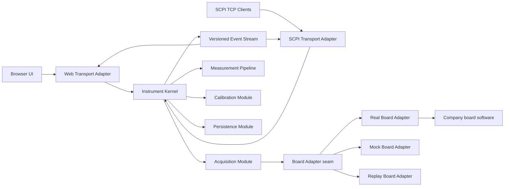
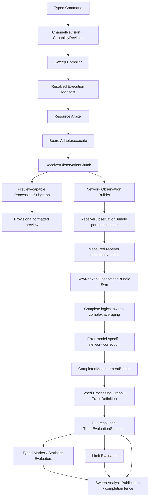
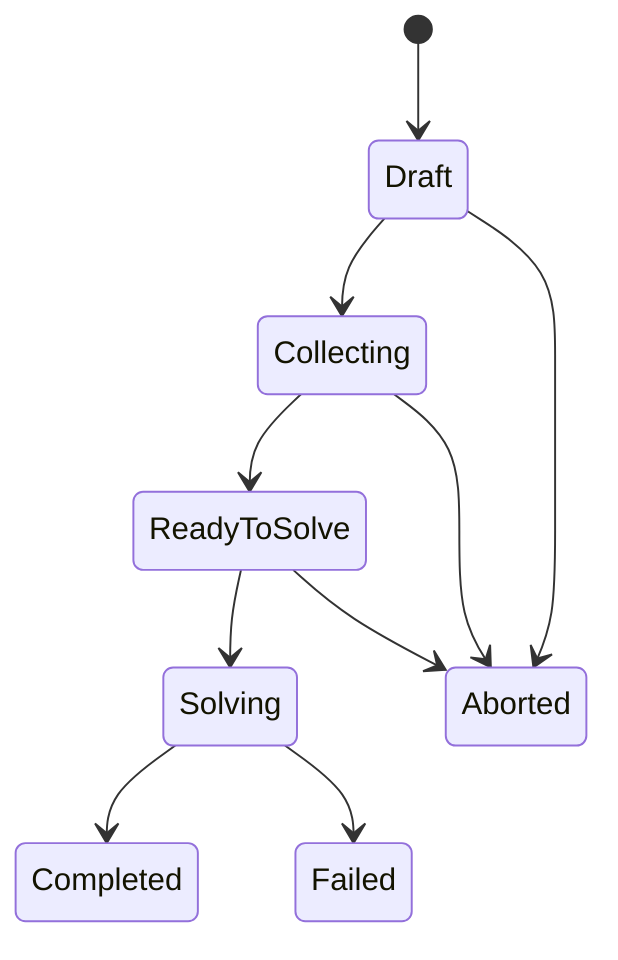
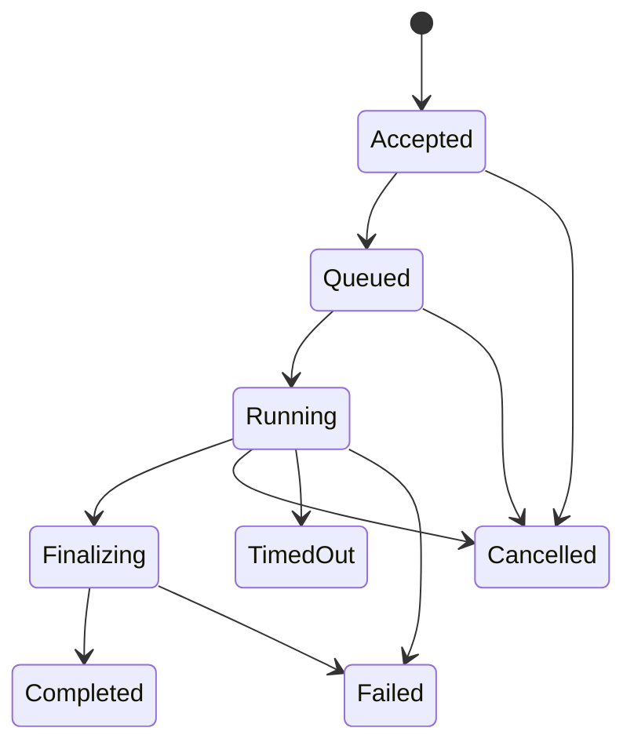

# VNA 上层软件整体架构设计

> 状态：架构基线 v0.1，已于 2026-07-17 完成整体确认。本文冻结产品能力、领域关系、架构边界和 A-D 决策包的推荐默认值；真实单板容量、误差模型和公司 SDK 能力仍须通过 Board Profile 与平台验证补齐。

## 1. 目标、证据与约束

本项目建设一套运行在公司定制 AArch64 GNU/Linux 5.10 PREEMPT 平台上的成熟 VNA 上层软件。软件不实现单板底软，但通过稳定的单板适配 seam 接入多种真实单板，并在 Windows MinGW 环境以 MOCK/回放适配器完成开发和测试。用户通过浏览器或 TCP Socket SCPI 操作同一台逻辑仪器。

设计依据不是对某一家闭源仪器内部实现的猜测，而是对 Keysight PNA/ENA、Rohde & Schwarz ZNA/ZNB、Copper Mountain VNA 的公开对象模型和外部行为进行归一化。详细证据见：

- [商用 VNA 外部行为基线](../research/commercial-vna-behavior-baseline.md)
- [商用 VNA 功能能力全景与首版范围基线](../research/commercial-vna-capability-catalog.md)

已经确认的硬约束：

1. 生产版使用公司 AArch64 Linux SDK/交叉工具链；MinGW 用于 Windows MOCK、开发调试和自动化测试。
2. 底软负责硬件操作、接收机解调和逻辑扫描；适配层向上层交付逐实际刺激点、逐接收路径、未经用户校准的复数 `a/b` 接收机波量及质量信息。
3. Web 可显示扫频中的可丢弃预览；正式计算、Marker、Limit、保存和 SCPI 数据查询只消费成功完成后原子发布的完整快照。
4. 核心使用 C++17；Eigen3 可用于数值计算，cpp-httplib 可用于 Web。任何新增目标端 C/C++ 依赖必须先通过 MinGW 和公司 AArch64 工具链的编译、链接和目标机冒烟验证。
5. Linux `PREEMPT` 不自动等于 `PREEMPT_RT` 或硬实时。上层不承担 ADC、LO、触发边沿等硬实时闭环；网络、JSON、文件和复杂计算不得运行在底软采集线程。

## 2. 产品完整性原则

### 2.1 行为只有一份

Web、SCPI、启动恢复和内部自动操作最终都提交相同的类型化 Command/Query。范围校验、状态机、资源仲裁、校准适用性、错误和审计只在核心实现一次，协议适配器不得复制业务规则。

### 2.2 控制面单写，数据面不可变

仪器配置由一个 Control Executor 串行修改，每次成功修改形成新 revision。扫频在启动时捕获配置 revision；后续修改不会改变正在执行或已经发布结果的含义。所有正式数据和分析结果一经发布即不可变。

### 2.3 能力驱动，不伪装支持

上层根据 `BoardCapabilities + ProductProfile` 验证功能。单板或产品未支持的能力在 Web 中隐藏或禁用，在 SCPI 中返回稳定的 capability error；不得以空实现、零数组或 MOCK 成功冒充真实能力。

### 2.4 所有资源有界

Channel、Measurement、Trace、Marker、Diagram、快照、连接、队列、日志和文件都有显式上限。正式结果和完成/失败事件不得静默丢弃；预览可以合并、抽稀或丢弃，并通过 gap/resync 通知客户端。

### 2.5 用 deep module 隐藏复杂度

不为每个领域名词创建一层 CRUD Manager。少量 Module 通过小 Interface 隐藏采集编译、数值处理、跨对象不变量、协议状态和持久化事务；真实 Adapter 与 MOCK Adapter 只出现在行为确实变化的 seam。

## 3. 产品能力分级

完整产品路线分为三层。分级表示交付顺序和硬件依赖，不表示 Pro 能力可以没有架构位置。

| 能力域 | 成熟核心 Core | 专业扩展 Pro | 硬件/选件 HW/Option |
|---|---|---|---|
| 仪器 | 身份、能力、Preset/Reset、State、健康、自检、RF 安全、登录、最小角色、变更审计 | 配方、合规审计导出、报告 | 外部测试集、开关矩阵、外设 |
| Channel/扫频 | 多 Channel；Linear、Log、Segmented、CW、能力受限的 Power；Single/Continuous/Hold/Groups；功率、IFBW、平均、触发 | 任意点表、Phase/FOM、二维/生产序列 | Fast CW、脉冲、多源、毫米波 |
| Measurement | 单端 `Sij`、receiver wave/ratio、常用派生量 | Mixed-mode、Z/Y/T 等网络变换、自定义表达式 | true-mode、变频、噪声、非线性 |
| 校准 | Response、1-port SOL、one-path 2-port、full 2-port SOLT、Cal Kit/Session/Correction Set | Unknown-Thru/SOLR、TRL/LRL/LRM、多端口、校准验证 | ECal、source/receiver power cal、外部功率计 |
| Trace/Diagram | 多图多迹线、常用格式、Memory/Math、Hold、Smoothing、Statistics、基础 frozen/reference trace | 任意表达式、跨 Channel 数学、多历史对比 | 高端应用专用视图 |
| Marker | Normal、Reference、Delta、Fixed/Tracking、Max/Min/Next/Target、Bandwidth/Q | Ripple、peak table、跨 Trace 耦合、复杂分析 | 专用应用 Marker |
| Limit | 上下限分段、Pass/Fail/Indeterminate、失败点和裕量报告 | Ripple/Mask、锁存、批次统计、自动报告 | Handler/继电器输出 |
| 信号处理 | Electrical delay、port extension | Time domain/window/gating、Touchstone embedding/de-embedding、renormalization | AFR、眼图、增强 TDR |
| 控制/文件 | Web、Socket SCPI、IEEE 488.2 状态、State/Cal/Touchstone/CSV | HiSLIP/VXI-11、录制回放、报告模板 | 厂商测试系统集成 |

高端噪声系数、频谱、混频器、脉冲、IMD、增益压缩、眼图等必须保留 capability 扩展位置，但不进入基础 VNA 的虚假承诺。

## 4. 系统全景



Web 和 SCPI 是 Transport Adapter，不是第二套应用。`httplib::Request`、JSON DOM、SCPI 字符串、Socket 句柄、厂商底软结构体和 Eigen 类型都不得穿过 Instrument Kernel 的 Interface。

## 5. 完整领域模型

```text
Instrument [instrument_revision]
├─ ProductProfile
│  ├─ licensed/enabled capabilities
│  └─ numeric capacity and resource limits
├─ HardwareCatalog
│  ├─ BoardSlot -> BoardIdentity + BoardCapabilities@revision
│  └─ ResourceGraph
│     ├─ SourceResource
│     ├─ ReceiverResource
│     ├─ RouteResource
│     └─ Trigger/ClockResource
├─ Channel@revision
│  ├─ StimulusDefinition
│  ├─ AcquisitionPolicy
│  ├─ CorrectionBinding
│  └─ MeasurementDefinition*
├─ CalibrationCatalog
│  ├─ ConnectorDefinition + CalibrationMethodSpec
│  ├─ CalKitRevision -> ClassAssignment -> StandardModelRevision*
│  ├─ StandardInstanceRevision*
│  ├─ CalibrationSession -> CalibrationStep -> AcquisitionAttempt + QualityReport
│  └─ CorrectionSetRevision -> ErrorTerms + ApplicabilityEnvelope
├─ AnalysisCatalog
│  ├─ TraceDefinition@revision
│  │  ├─ MeasurementSourceRef
│  │  ├─ TracePipelineRevision + AnalysisProjection
│  │  ├─ MarkerDefinition*
│  │  └─ LimitTestDefinition*
│  ├─ TraceMemorySnapshot / FrozenTraceSnapshot
│  ├─ TraceAccumulatorDefinition + AccumulatorSnapshot
│  ├─ Fixture/DeembeddingProfileRevision
│  ├─ TimeDomain/GateProfileRevision
│  └─ MathExpressionRevision
├─ DisplayWorkspace@revision
│  └─ Diagram*
│     └─ TracePresentation* -> TraceDefinitionRef
│        └─ style / visibility / scale / axis / z-order
├─ OperationCatalog
│  ├─ SweepOperation
│  ├─ CalibrationOperation
│  ├─ SaveRecallOperation
│  └─ ImportExportOperation
└─ SnapshotCatalog
   ├─ ReceiverObservationBundle*
   ├─ MeasurementStageSnapshot*
   ├─ CompletedSweepBundle*
   ├─ TraceDataSnapshot*
   ├─ AnalysisPublication*
   ├─ MarkerEvaluationSnapshot*
   └─ LimitTestResultSnapshot*
```

### 5.1 身份与 revision

- 所有可持久化实体使用稳定 ID；显示名称允许重复，SCPI 数字索引只是会话映射，不是内部身份。
- Definition 表示用户意图，Snapshot 表示某个 revision 下已经产生的不可变事实。
- 删除 Diagram 或 Trace 不删除 Measurement、Correction Set 或历史快照。
- 删除仍被 Trace、校准、Math 或导出任务引用的对象时，必须拒绝、显式级联或形成失效引用；不得静默留下悬空指针。
- 编辑 Channel、Cal Kit、Gate、Fixture、Trace Pipeline、Marker 或 Limit 均生成新 revision。历史结果继续引用旧 revision。

默认删除策略是“有引用则拒绝”，只有明确的 cascade Command 才删除聚合内的当前定义；稳定 ID 永不复用。最小所有权/删除矩阵：

| 目标 | 当前对象行为 | 历史行为 |
|---|---|---|
| Diagram | 删除其 TracePresentation；不删除 TraceDefinition | 已保存 Workspace revision 按保留策略存在 |
| TraceDefinition | 无活动 Operation/Query 时级联其 Marker/Limit/Accumulator 定义和所有 Presentation；被其他 Math/coupling 引用时拒绝 | Trace/Analysis Snapshot 不改写，按保留策略回收 |
| MeasurementDefinition | 被 TraceDefinition、Calibration Step 或活动 Sweep 引用时拒绝 | Measurement Snapshot 不改写 |
| Channel | 活动 Operation 时拒绝或由显式 `CancelAndDelete` 处理；cascade 当前 Measurement/Binding | 历史 Sweep/Measurement Snapshot 保留原 Channel ID/revision |
| Cal Kit/Standard | 被 Session/Correction Set 引用时只能 archive，不物理删除 | 历史校准继续解析旧 revision |
| Correction Set | 被 Channel Binding 或 Snapshot 引用时拒绝物理删除，可 unbind/archive | 历史 MatchReport 始终有效 |
| Memory/Frozen Trace | 被 Math/Profile 引用时拒绝；显式解除引用后删除当前目录项 | 已发布分析结果不改变 |
| Snapshot | 先 tombstone，待 retention 到期且无 Reader Lease 后回收 Buffer | ID 不复用，审计仍保留最小元数据 |

SCPI 方言需要的特殊级联行为由 Adapter 映射为上述显式 Command，不能绕过 Kernel 的引用校验。

### 5.2 Channel、Measurement、Trace、Diagram 的关系

- `Channel` 是采集作用域，拥有 stimulus/sweep、功率、IFBW、平均、触发、资源路由、Measurement 集合和 Correction Binding。
- `MeasurementDefinition` 表示“测什么”，例如 `S21`、`b2/a1` 或 `a1`；它独立于显示存在。
- `TraceDefinition` 是稳定的分析对象，引用 Measurement、处理图和 Analysis Projection，并拥有 Marker、Limit、Memory/Accumulator 关系；它可以不显示而独立存在。
- `TracePresentation` 只是 Diagram 对 TraceDefinition 的显示绑定，拥有颜色、线型、可见性、scale、reference position、所用轴和 z-order；不拥有分析或采集状态。
- `Diagram` 是实际绘图区，拥有坐标系、轴、网格、标题、legend、Trace 顺序及 Marker/Limit overlay。
- `DisplayWorkspace` 管理多个页面或 Diagram 布局。前端绘图库可称为 Chart，但 `Chart` 不进入领域模型。
- 同一 Measurement 可以形成多个 TraceDefinition；同一 TraceDefinition 可以显示在多个 Diagram。删除 Diagram 只删除 TracePresentation，不删除 TraceDefinition、Marker、Limit 或正式分析结果。
- 同一 Diagram 可以叠加多个 Channel 的 Trace，但必须分别检查 X-domain、坐标系、Y-axis/scale 和结果代次；视觉 overlay 的条件可以宽于 Marker coupling 或共享 Limit 的条件。

### 5.3 Session 不是仪器对象

每个 Web/SCPI 连接拥有独立 `ClientSession`：身份/权限、selected Channel/Measurement/Trace/Marker、输出游标和协议状态。选中对象不写入共享仪器状态，避免一个客户端的点击改变另一个客户端的 SCPI 上下文。

## 6. 从命令到正式结果的数据链



下列只是 Core Compatibility Profile 的候选默认图，不是跨板卡、跨误差模型和跨厂商都成立的唯一 RF 顺序：

```text
Receiver observations per required source state
→ measured receiver quantities and ratios
→ complete raw network observation bundle S^m
→ complete-logical-sweep complex averaging
→ error-model-specific correction of the network bundle
→ corrected network snapshot
→ profile-validated network / time-domain / trace processing nodes
→ typed analysis projection and full-resolution trace evaluation
→ marker / statistics / limit evaluation
→ display-only decimation
```

这里的 `S^m` 是测得的未校准网络观测，不等同于真实 DUT S 参数。Full 2-port correction 消费同一频点、同一逻辑 Sweep 的完整 forward/reverse 网络 bundle，而不是逐条修正当前显示 Trace；误差模型还可以要求 isolation、switch term 或其他辅助观测，因此 `BoardCapabilities` 必须声明 receiver topology、source state、wave definition、每端口参考阻抗和可用辅助量。

Processing Graph 的类型约束：

- Physical/Logical port identity 和 route 在 Execution Manifest 与校准匹配时冻结；矩阵 permutation 与 mixed-mode conversion 是不同节点。
- Port extension 是作用于完整网络矩阵和参考面的端口级变换；Trace electrical delay/phase offset 是分析显示功能，二者不得共用对象。
- Renormalization、fixture embedding/de-embedding、port extension 和 mixed-mode 的顺序由 Compatibility/Product Profile、fixture topology、reference plane、wave definition 和 Z0 决定，不全局硬编码。Fixture 节点必须报告逐点 conditioning，不能把病态矩阵当作有效大数。
- `TimeDomainTransform` 产生 time/distance-domain Trace；`FrequencyDomainGate` 执行频域→时域→gate→逆变换并产生新的 gated frequency-domain complex result，二者不是同一输出。
- Complex Data/Memory Math 可以在 formatting 前执行；Derived Quantity/Formatting、Smoothing、Hold 和 Statistics 是独立节点，各自声明输入类型、比较 metric、跨 Sweep 状态及 Compatibility Profile 位置。
- 每个节点声明输入/输出 stage、axis/domain、reference plane、port topology、Z0/wave definition、revision、内存需求、validity dependency、quality transform、conditioning metric 和是否 preview-capable。

Preview 不能从原始 a/b 直接画到浏览器。它运行同一 Processing Graph 中可流式执行的子图，至少形成当前 Measurement 和 format 的暂态结果；需要完整 forward/reverse bundle、完整轴或跨点上下文的 correction、group delay、time-domain、statistics 等节点尚不可用时，UI 必须显示明确的 provisional stage，或继续显示 last-good 正式结果。

### 6.1 正式快照的最小溯源信息

每份正式结果至少绑定：

- `operation_id`、`sweep_id`；
- instrument/channel/measurement/processing graph revision；
- board identity、capability revision、底软/Adapter 版本；
- 请求参数和底软实际采用的刺激轴、功率、IFBW、dwell、端口路由；
- Correction Set、Cal Kit、Fixture、Gate、Math、Marker、Limit revision；
- 点序、单位、质量标志、无效点原因、过载/失锁/未稳幅等诊断；
- 完成时间、软件构建版本、数据格式版本和父快照引用。

修改当前配置、重新校准或覆盖外部 Touchstone 文件都不能改变历史快照的含义。

正式查询使用稳定的 `MeasurementDataStage`，至少区分 `ReceiverObservation`、`MeasuredReceiverQuantity`、`MeasuredRatio`、`RawNetworkObservation`、`CorrectedNetwork`、`ProcessedNetwork` 和 `TraceProjection`。某些 stage 可以按需惰性计算或不长期保留，但 Web/SCPI 命令必须明确映射到一个 stage；查询开始时 pin 住 snapshot ID、stage 和 axis，长数据传输过程中不得切换到下一 Sweep。

### 6.2 无效数据规则

- 缺点、NaN、除零、接收机过载、源未稳幅和失锁沿处理图显式传播；参考接收机过低或无效时，依赖它的 ratio 无效。
- Pointwise 节点传播对应点；phase unwrap 在 gap 处分段重启，group delay 使相邻依赖点无效，mixed-mode/矩阵 correction/de-embedding 可以使同频点多个参数无效。
- FFT、time-domain 和 gating 对输入有全局依赖：遇到缺点时默认整体拒绝；若 Product Profile 允许插补，算法和整个派生结果的 `imputed_input` 质量标志必须显式。
- Average 保存每点有效 sample count；未达到规定样本数时不发布“平均完成”。
- Marker 固定点遇到无效数据时返回 invalid；搜索是否跳过无效点、是否允许跨 gap 以及 gap 边缘峰值规则由 Analysis Projection 明确，不设静默默认。
- Limit 遇到参与判定的无效点不得误报 Pass；究竟在“任一参与点无效”还是“无法确定最终判定”时返回 `Indeterminate`，由 Limit Policy 固定，Product Profile 可选择更保守的 Fail。
- 绘图抽稀只影响像素，Marker、Limit、统计、保存和导出始终使用全分辨率 Trace 数据。

### 6.3 不重扫的派生分析链

采集和分析是两条正交生命周期：

```text
CompletedMeasurementBundle(sweep_id)
  + TraceDefinition@revision
→ EvaluateTraceOperation
→ TraceEvaluationSnapshot
  + Marker/Limit revision
→ AnalysisPublication
```

在 Hold 或 last-good 数据上修改 format、Math、Memory、Smoothing、Marker 或 Limit 时，系统直接启动有界的 `EvaluateTraceOperation`，不要求硬件重扫。连续扫频下，调度器合并过期分析任务，只发布相互兼容的 `sweep_id + trace_revision + marker/limit_revision` 组合；删除 Diagram 不影响这条分析链。

## 7. deep modules、Interface 与 seam

### 7.1 Instrument Kernel

这是 Web、SCPI 和内部自动操作唯一调用的核心 Module：

```cpp
SubmitResult submit(const CommandEnvelope& command);
QueryResult read(const QueryEnvelope& query) const;
WatchHandle watch(const EventFilter& filter, EventSink& sink);
```

它隐藏跨对象不变量、revision、Control Policy、Operation 生命周期、审计和事件发布。`submit` 对长操作只返回 Operation ID，不在网络线程中等待扫频；`read` 只读取不可变状态或快照；回调不在模型锁内执行。

### 7.2 Acquisition Module

```cpp
StartResult start(const SweepExecutionRequest& request);
CancelResult cancel(OperationId operation);
```

实现内部隐藏 Sweep 编译/量化、ResourceGraph 仲裁、连续扫频公平调度、Trigger、Average、取消、超时、Receiver chunk 校验、预览和正式 Snapshot Builder。

### 7.3 Board Adapter seam

Composition root 通过 `BoardAdapterFactory::open(BoardOpenRequest)` 完成发现、Interface 版本协商和底软打开，返回 RAII `BoardSession`；Session 析构关闭资源。下面是 BoardSession 的逻辑 Interface：

```cpp
CapabilityDescriptor describe() const;
PrepareResult prepare(const SweepIntent& intent);
RunResult execute(const PreparedSweep& sweep,
                  ReceiverWaveSink& sink,
                  CancellationToken& cancellation);
HealthResult health() const;
RecoveryResult recover(const RecoveryRequest& request);
```

Interface 保持在逻辑扫频层，不暴露寄存器、DMA、ADC/IQ、厂商结构体、线程句柄、Eigen、JSON 或 Socket。`execute` 可以在专属 Board Worker 上阻塞；真实底软若是回调式，Adapter 在内部转换为有序 chunk/sweep event。Adapter 不能反向调用 Instrument Kernel。

`ReceiverWaveSink` 接受带 Buffer Lease 的 move-only chunk、单调 sequence 和显式 terminal event；Adapter 在 terminal 后不得再写，同一 generation 只能完成一次。Sink/Adapter 契约固定回调线程、chunk 所有权、最大块、背压和取消后的迟到事件处理。

`prepare` 必须返回量化后的实际参数、资源声明、内存上限、警告和拒绝原因。取消后若底软不能在 deadline 内停止，Operation 失败并隔离该 Board；迟到回调通过 generation token 丢弃，不能污染下一次 Sweep。

### 7.4 Measurement Pipeline

```cpp
EvaluationResult evaluate(const ProcessingRequest& request,
                          const SnapshotRefs& inputs,
                          MemoryReservation& reservation);
```

它隐藏 Receiver Wave 提取、校准修正、Eigen3 运算、时域/门控、去嵌、Math、格式化、Marker、Statistics 和 Limit。Eigen 类型不穿出 Interface；外部使用项目自有的只读 Buffer/View、Axis、Unit 和 Quality 类型。

### 7.5 Calibration Module

```cpp
SolveResult solve(const CalibrationProblem& problem);
MatchReport match(const CorrectionSet& correction,
                  const SweepManifest& sweep) const;
```

它隐藏标准件模型、误差方程、数值稳定性、插值和适用性判定。Calibration Session 的可变流程归 Instrument Kernel；求解和 match 尽量保持纯计算，使用合成误差网络和商用标准数据进行黄金测试。

### 7.6 Persistence Module

```cpp
LoadResult load();
CommitResult commit(const AtomicStateBatch& batch);
BlobReader open_blob(BlobId id) const;
```

它负责 schema/version、校验和、原子替换、崩溃恢复、配额和迁移。目标文件系统 Adapter 与内存 Adapter 运行同一契约测试；调用者不接触路径和临时文件。

## 8. BoardCapabilities、资源图和 MOCK

### 8.1 CapabilityDescriptor

必选能力信息：

- 单板身份、序列号、底软/Interface 版本；
- Physical/Logical Port、source state、receiver topology、reference/test wave label、可用 route 和辅助观测；
- `a/b` 的 wave definition、归一化、每端口参考阻抗，以及底软是否已经应用 factory tracking/receiver correction；
- 频率、功率、IFBW、点数、Segment 数及量化规则；
- Linear/Log/Segmented/CW/Power 等 sweep 能力；
- Trigger source/scope/granularity、trigger out、abort 能力；
- 多 route/sub-sweep 并发与互斥关系；
- chunk 粒度、最大块、时间戳和实际参数回读能力；
- overload、unlock、unleveled、temperature 等 quality/health 项；
- 支持的 correction/error model 所需观测、route settling 和 forward/reverse 轴一致性保证；
- `supported / unsupported / temporarily unavailable / unknown` 状态及 capability revision。

一次逻辑 Sweep 可以由多个硬件 sub-sweep 组成，例如完整 2-port `S11/S21/S12/S22` 需要不同源端口路由。任一必需 sub-sweep 失败时，默认整次逻辑 Sweep 失败；若未来允许部分矩阵，必须作为显式的降级 Measurement 类型而不是偷偷补零。

### 8.2 ResourceGraph

Source、Receiver、Route、Trigger line、共享总线和 Board 独占状态构成资源图。能力未声明可并行时默认串行；独立资源允许并行。Continuous Channel 每完成一轮必须让出调度机会，避免 Single、校准或 SCPI 请求饥饿；校准采集可以申请独占租约。

### 8.3 MOCK 不是理想曲线桩

`MockBoardAdapter` 至少支持：

- 可配置 N-port DUT S 矩阵、虚拟系统误差项和确定性随机种子；
- 噪声、漂移、延迟、温度、量化、overload/unlock/unleveled；
- 多种能力 Profile、参数量化和不支持错误；
- external trigger 等待、超时、取消、丢块、重复/迟到事件、底软卡死和热拔；
- 虚拟时钟与可重复的执行时序。

`ReplayBoardAdapter` 可重放现场 a/b 数据。Real/Mock/Replay Adapter 必须通过同一套 Interface 契约测试。

## 9. 核心仪器功能的完整语义

### 9.1 Sweep、Trigger 与 Average

- Sweep Plan 是有类型对象，不是 start/stop/points 三个字段；支持 Linear、Log、Segmented、CW，Power 和硬件特殊类型由 capability 开放。
- Segment 可独立声明 points、power、IFBW、dwell/delay；最终结果保存实际拼接轴和 Segment 边界。
- Sweep Mode 至少支持 Hold、Single、Continuous、Groups；`INIT` 只启动，`*OPC?` 等待绑定 Operation 的完成栅栏。
- Trigger 至少支持 Immediate/Internal、Manual/Bus；External/Point/Segment Trigger 由能力开放。状态区分 Armed、WaitingTrigger 和 Acquiring。
- 完整 N-port 逻辑 Sweep 由 Execution Manifest 指定所需 source state、receiver vector、route、可选 isolation/switch-term 观测和 trigger consumption policy。所有必需 sub-sweep 捕获同一 Channel revision、轴策略和资源 lease；调度器只能在完整 bundle 边界让出资源。
- Full 2-port 的 forward/reverse 实际轴必须在 prepare 阶段统一或拒绝；不能在 correction 时按数组下标拼接不同实际轴。任一必需方向失败时，不更新任何 `Sij`、Average、Hold、Marker 或 Limit。
- Average 默认对“完整逻辑 Sweep 形成的复数 measured-ratio/raw-network arrays”做矢量平均，而不是分别 `average(a)`、`average(b)` 后再相除。一个 average sample 必须包含完整 forward/reverse bundle；factor、clear/restart、每点有效计数和完成事件独立于单个硬件 sub-sweep。
- `F,R,F,R...`、`F×N,R×N` 或板卡内部平均，以及一次 external trigger 覆盖整个逻辑 Sweep 还是每个 source state，由 Board/Compatibility Profile 冻结。校准标准件采集拥有独立 Average Policy，不隐式继承 DUT 连续平均状态。
- 连续扫频中修改配置：当前执行继续使用旧 revision，下一轮原子采用新 revision；涉及 RF 安全或显式 restart 的命令可取消后重启。

### 9.2 Calibration 生命周期



- Connector、Cal Kit、Class Assignment、Standard Model 和物理 Standard Instance 分离并版本化。每个 Calibration Step 可有多个 Acquisition Attempt 和 Quality Report。
- `CalibrationMethodSpec` 明确 required standards、required source directions、required receiver/auxiliary observations、solved error terms、目标 error model 和可修正的 Measurement 类型。Reflection/Transmission Response 分开；full 1-port SOL 求解 directivity/source-match/reflection-tracking；one-path 2-port 只修正一个激励方向；full 2-port SOLT 必须声明 12-term、8-term/switch-term 或板卡特定模型及 isolation policy。
- Session 冻结 method、ports、stimulus、power、IFBW、routing、board identity、kit/standard revision；每一步保存正式标准件采集和质量报告，支持 repeat/back/abort。
- Session 的 `Completed` 终态原子发布一个新的 CorrectionSetRevision；`Failed/Aborted` 不发布半成品。
- 求解失败或会话取消不得覆盖已有有效 Correction Set。
- Correction Set 不可变，包含 method、error terms、实际轴、端口/route、功率/IFBW、Kit/Standard、板卡、算法版本和可选温度。
- `Applied` 不属于 Session 或 Correction Set 状态。Channel 只保存 `CorrectionBinding = Off | Bound(set_id)`；仓库可独立管理 archived/revoked 属性，但不改变历史 Set 内容。
- 每次执行产生正交的 `CorrectionMatchReport`：`axis_match`、`path_match`、`condition_match`、`freshness`、`binding`、`overall` 和 `reasons[]`。一个 Set 可以同时是 frequency-interpolated、temperature-stale 但仍 `ApplicableWithWarning`，不能压成一个互斥枚举。
- 更换板卡、端口映射或关键接收路径通常使当前 binding 被拒绝；频率适用性对实际目标轴逐点评估，而不是只比较点数。Power、IFBW、attenuator/range、temperature、time、firmware 和 sweep type 的 changed/degraded/rejected 规则由 error-model/Board Profile 决定。默认禁止静默外推，历史结果保留当时的 MatchReport。

### 9.3 Trace、Math、Memory、Hold 与 Statistics

- `TraceDefinition@revision` 绑定 MeasurementSource、Processing Pipeline、Analysis Projection、Marker/Limit 和 accumulator 关系；`TraceDataSnapshot` 是某次完整执行或派生重算后的全分辨率结果；`TracePresentation` 只保存外观。
- Memory 是显式捕获的不可变复数快照，携带轴、单位和来源；不是当前数组别名。
- Core 支持 Data、Memory、Data±Memory、Data×/÷Memory；轴不一致默认拒绝，可由 Profile 显式允许覆盖范围内插值，禁止默认外推。
- Frozen/Reference Trace 保存独立的静态可显示结果；它与参与复数 Math 的 Memory 不是同一生命周期。
- Complex Math、phase unwrap/group delay、Smoothing、Min/Max Hold 和 Statistics 是不同类型节点。每个节点声明 complex/formatted/declared-metric 输入；复数没有默认大小关系，Hold 必须声明比较 metric。
- `TraceAccumulator` 保存 mode、pipeline revision、输入 sweep sequence、clear generation 和不可变 accumulator snapshot。轴或 pipeline 不兼容时按 Profile reset 或 reject；沿 X 区间统计、同一点跨 Sweep ensemble 统计和复数矢量统计使用不同类型。
- 取消或失败 Sweep 不更新 Memory、Hold 或跨 Sweep 统计。

### 9.4 Diagram

- Diagram 管坐标系、轴、网格、标题、legend、布局、TracePresentation z-order 和 overlay；稳定 TraceDefinition 不由 Diagram 所有。
- Core 坐标支持 Cartesian、Smith、Polar、Time；格式支持 Complex/Real/Imag、LinMag/LogMag、Phase/Unwrapped Phase、Group Delay、SWR、Smith impedance/admittance、Polar。
- 兼容矩阵分别判断 X-domain/单位、coordinate system、每 Trace 的 Y-axis/scale 和 snapshot generation。LogMag 与 Phase 可以在独立 Y scale 下视觉叠加；Smith/Polar 与 Cartesian 不因单位可换算就自动兼容。不同实际 X 网格可以绘制，但 Marker coupling 或共享 Limit 使用更严格的轴一致性/显式插值规则。
- Zoom/Pan 可作为 session 临时状态；用户保存布局时才写入 Workspace revision。

### 9.5 Marker

Marker Definition 与 Marker Evaluation 分离。Core 至少包括：

- Normal、Reference、Delta、Fixed/Tracking；
- discrete/nearest-point 与 interpolated 读值；
- Max/Min、Next Left/Right、Target/Transition；
- peak polarity、threshold、excursion、search range；
- Bandwidth、center、Q、loss/notch 等复合结果；
- Marker coupling 和 marker-to start/stop/center/span/reference/electrical-delay 命令。

Marker Evaluation 绑定 `trace_id + pipeline_revision + completed_snapshot_id`，使用全分辨率数据。Tracking 在新正式快照发布后重新搜索；取消 Sweep 保持 last-good 结果并显示其时间/快照 ID。Marker-to 操作必须提交正常 Command，接受 revision 冲突、审计和资源规则。

每个 Marker Evaluation 还保存 input node ID、Analysis Projection 和 `Valid / Invalid / Incomplete / Stale` 状态。Profile 必须冻结相等峰值的 deterministic tie-break、Next Left/Right 起点、搜索端点包含关系、Segment/反向/非单调轴遍历、phase wrap/unwrap、Smith/Polar 的搜索 metric，以及 reference/coupling 被删除或形成循环时的错误。Marker Definition 修改后立即基于 last-good 快照派生重算，不等待下一次 Sweep。

### 9.6 Limit Line 与 Limit Test

Limit 不是 Diagram 上的一条装饰线。至少分为：

- `LimitDefinition/LimitSet`：upper/lower、水平/斜线/single-point/off/分段/断开区间、X/Y 单位、端点、重叠优先级和插值规则；
- `LimitPresentation`：颜色、可见性和 overlay；
- `LimitTestResultSnapshot`：绑定 Trace、pipeline、Limit revision 和 completed sweep 的不可变判定。

Core 输出 `Pass / Fail / Indeterminate`、每个失败点的 actual/limit/margin、失败区间、最坏点、最小裕量和失败数量。测试在全分辨率、已格式化且单位明确的有序标量 Trace 数据上执行；普通 Smith/Polar/Complex Trace 默认拒绝常规上下限，专用 mask 属于独立 Pro 类型。显示开关与测试开关分离；format/unit 改变必须 convert、reject 或使定义失配。NaN/无效点不得成为 Pass。Channel/Instrument 聚合只使用同一 `sweep_id + analysis_revision`，Web overlay、SCPI 查询和 Operation/Questionable 状态读取同一结果；锁存/清除副作用由 SCPI Profile 固定。

### 9.7 Reference Plane、Fixture、Mixed-mode 与 Time Domain

- Port extension 以端口级传播算子作用于完整 S matrix：反射包含相关端口往返传播，传输同时考虑输入/输出参考面；正负 delay、loss、velocity 和 wave convention 由 Profile 固定。它不等于 Trace electrical delay，也不等于任意 fixture 去嵌。
- Fixture embedding/de-embedding 是矩阵级网络处理，不是逐 Trace 数组运算。节点验证 Touchstone 端口顺序/方向、频率覆盖、Z0、wave definition 和 topology；2-port ABCD/T 参数法不得冒充任意 N-port 通用算法。矩阵病态时输出 `ill_conditioned` quality 和 condition metric。
- Mixed-mode 节点消费端口完整的 single-ended matrix，并明确 balanced pair、正负端口方向、每端口/差分 Z0 和 wave definition；它与 Physical/Logical port identity mapping 分离。节点位于 fixture 前还是后取决于 fixture topology 和目标参考面。
- TimeDomainTransform 默认要求满足算法公差的线性等间隔频率网格；Log、任意/分段轴和缺点默认拒绝，显式重采样必须记录算法与 `imputed_input`。Low-pass impulse/step 还需 harmonic grid 和 DC known/extrapolated policy。
- Time-domain metadata 包括 window/normalization、zero padding、alias-free range、time resolution、velocity factor 和 one-way/round-trip。Gate 定义包括 type/shape/start/stop 和 inverse normalization；FrequencyDomainGate 的输出是新的频域复数快照。

## 10. 统一 Operation 与状态机

所有长操作共享 `OperationId`、kind、owner、deadline、progress、cancel 和通用终态；Sweep、Calibration、State Recall、Import/Export、自检再提供各自的 phase。每种 kind 声明可取消点和不可取消的原子提交区。



Sweep phase 使用 `Preparing / Armed / WaitingTrigger / Acquiring / Processing / Publishing`；Calibration 使用 `WaitingStandard / AcquiringStep / Solving / Publishing`；文件操作使用 `Reading / Validating / Committing`。因此文件 Recall 不会被错误地迫使经历 Armed/Acquiring。

Instrument 生命周期为 `Booting → SelfTesting → Ready/Degraded/Fault → ShuttingDown`。故障 Board 进入 Quarantined，完成 reinitialize + health check 后才重新加入资源图。所有等待者观察同一个 Operation 终态；last-good 快照可以继续显示，但必须标记 stale，不能伪装成刚完成的数据。

## 11. Web 与 SCPI

### 11.1 共同 Command/Query/Event 模型

- Command 带 Actor、Session、Deadline；Web mutation 还带 `expected_revision`。
- 批量设置用原子的 `ApplyChannelPatch`，避免网页发送几十个单字段 setter 形成半套配置。
- Query 读取 authoritative state 或不可变快照。
- Event 带单调序号和 revision；客户端发现 gap 后获取完整快照 resync。
- SCPI Adapter 消费 Event 只用于更新状态寄存器和唤醒 pending-operation fence；raw TCP 不主动插入 unsolicited response 字节。
- 多步骤校准、State Recall、Preset 等持有明确 owner/resource lease；普通读操作不被阻止。

### 11.2 Web Transport

推荐协议形态：

- HTTP REST/Command：配置、查询、文件、操作控制；
- WebSocket：revision/event、Operation progress 和限速 preview；
- HTTP binary endpoint：全分辨率复数/迹线数组和大文件，避免 JSON 文本膨胀；
- 静态 HTML/CSS/TypeScript/JavaScript 在开发机生成 bundle，目标机只托管静态文件，不需要 Node 运行时。

当前 [cpp-httplib 官方仓库](https://github.com/yhirose/cpp-httplib) 已提供 HTTP、SSE、WebSocket 和流式响应，但使用阻塞 Socket I/O；WebSocket 每个连接长期占用线程并使用心跳线程。因此必须固定并 pin 经过验证的版本、Web 客户端上限、线程池、每连接队列和超时。若公司 SDK 对所选版本的 WebSocket 冒烟失败，Transport Adapter 可替换为 SSE + REST，而不改变 Instrument Kernel。

浏览器只做编辑、渲染和交互；校准、Marker、Limit 和正式数学计算全部在 C++ 核心完成。慢客户端只丢/合并 preview，completed/failed/control 事件不可静默丢失；超过硬上限时断开并要求 resync。

### 11.3 Socket SCPI

Core 至少实现：

- 大小写不敏感的长/短关键字、层级/相对路径、分号链、字符串、数值单位、查询和行终止；
- ASCII 与 IEEE definite-length binary block、`FORM:DATA` 和明确字节序；
- 每连接独立 parser context、selected object、input/output buffer 和响应顺序；
- 每 Session 有界 FIFO error queue，保存该连接产生的 command/execution/query error；全局 Device Fault 进入 Instrument Questionable/诊断，并由选定兼容 Profile 决定是否复制为 session device error。`SYST:ERR?` 读取并弹出；`*CLS` 的 session/global 副作用必须在该 Profile 中固定；
- `*IDN?/*RST/*CLS/*TST?/*OPC/*OPC?/*WAI/*ESR?/*ESE/*STB?/*SRE`；
- Operation/Questionable Condition/Event/Enable、Status Byte 和标准事件寄存器；
- `INIT/ABORt/CONTinuous/HOLD/Single/Groups` 与实际 Operation 状态映射；
- 大数组从不可变 Buffer 流式发送，慢连接不能复制或 pin 住无限历史。

SCPI Session 为 `*OPC/*OPC?/*WAI` 维护 pending-operation fence：fence 捕获该 Session 在同步命令之前已经提交且按协议应等待的 Operation 集合，不等待后来无关的 Continuous Sweep。数据 query 在接受时固定 selected object、`MeasurementDataStage` 和最近一次兼容的 completed snapshot ID；即使传输期间新 Sweep 完成，也继续发送被 pin 的旧快照。若目标方言要求不同的“当前/最近结果”语义，由 SCPI Compatibility Profile 覆盖并加入兼容测试。

Raw TCP 没有独立的 GPIB SRQ 通道；寄存器和 `*STB?` polling 可以完整实现，但不能宣称具备真正异步 SRQ。首版必须选择一个主 SCPI 方言或明确的项目方言+兼容子集，不能把 Keysight/R&S/CMT 命令随意拼成“全兼容”。

### 11.4 多会话控制策略（推荐默认）

- 所有 mutation 在 Control Executor 中有序执行。
- Web 用 optimistic revision 防止旧页面覆盖新配置。
- SCPI 按连接内顺序执行；跨连接冲突根据当前资源 lease 返回 execution error。
- 校准、Preset/Recall、网络设置和恢复类操作取得独占 lease；普通 Channel 编辑使用对象 revision，不使用全局永久锁。
- selected Channel/Trace/Marker 为 session-local；真实 Channel/Measurement 数据为 instrument-global。
- owner 断开不自动杀死共享 Sweep；校准等交互 Operation 进入可配置的 grace period，之后取消或由管理员接管。

## 12. 线程、内存和背压

建议固定、有界的运行任务：

- 1 × Control Executor：领域状态唯一写者；
- 每个物理 Board 或互斥资源组 1 × Acquisition Worker；
- 固定 N × Processing Worker：Eigen、校准、时域、Math、Marker、Limit；
- 固定大小 cpp-httplib 线程池及明确 Web 连接上限；
- SCPI acceptor + 有界 session worker/event loop；
- 1 × Persistence Worker；
- 1 × Diagnostics/Watchdog；
- Event Dispatcher 不执行慢网络写。

内存规则：

- Sweep 启动前按 Execution Manifest 预留正式结果和必要计算内存；无法预留则拒绝启动。
- Receiver chunk 来自固定 Buffer Pool，禁止逐点动态分配。
- 正式快照使用只读共享 Buffer；派生阶段按需物化并共享未改变的数据，避免“不可变”退化成每层整数组复制。
- 每 Channel 仅保留 ProductProfile 规定数量的正式快照；有 Reader Lease 的 Buffer 不回收，新查询在容量不足时得到明确错误。
- Preview 按 `channel_id + sweep_id` 合并/抽稀；正式事件不可丢。
- SCPI binary block 和 HTTP binary response 从快照流式输出，设置连接级字节上限、write timeout 和最大 pin 时间。
- 记录队列高水位、Buffer Pool 使用量、preview gap、处理耗时和慢客户端滞后。

性能和容量必须形成可量化的 ProductProfile；在不知道目标 RAM/Flash、最大点数和扫频率之前，文档不虚构数字。

## 13. 持久化与数据交换

需要持久化：

- Instrument/Channel/Measurement 配置；
- Workspace/Diagram/Trace/Marker/Limit；
- Cal Kit、标准件采集、Correction Set；
- Fixture、Deembedding、Time-domain、Gate、Math Profile；
- Preset、State Save/Recall；
- Trace Memory 和按策略选择的正式结果历史；
- 网络/用户配置与测量 State 分开保存。

`StatePackage` 提供显式 inclusion profile：`SettingsOnly`、`StateAndCalibration`、`StateAndTraceMemory`、`All`。Recall 先在 staging 区完成读取、schema/CRC、引用和当前 BoardCapabilities 验证，再一次性 commit；任一步失败保持原仪器状态。恢复 frozen/static Trace 的 Package 默认进入 Hold，避免 Continuous Sweep 立即覆盖用户刚恢复的结果。

`MeasurementPreset`、`*RST`、用户启动 State、`FactoryReset` 和“删除持久数据”是不同 Command，必须用所有权/删除矩阵明确各自影响；FactoryReset 也不能未经明确授权删除计量或工厂校准数据。

Persistence Module 内部分离受事务保护的 `StateStore` 与用户可见、路径受限的 `ExchangeFileStore`。State、Cal/Cal Kit、Limit、Segment、Fixture、Touchstone、CSV 和 frozen trace 是独立 schema 的交换对象；Web 下载和 SCPI `MMEMory` 只访问 ExchangeFileStore 的沙箱，不暴露内部 blob 路径。

推荐内部格式使用版本化 manifest + 二进制 blob：manifest 保存 ID/revision/引用/单位/校验和，复杂数组保存为明确字节序和浮点格式的 blob。提交采用临时文件、flush、校验和、原子替换并保留上一有效版本；空间不足或掉电不得破坏旧 State。

跨产品交换至少支持 Touchstone、CSV/TSV、SCPI binary data；Touchstone 明确版本、端口顺序、参考阻抗和 RI/MA/DB。恢复 State 时先对当前 BoardCapabilities 做完整验证；缺板或换板时可以恢复显示布局，但校准必须明确失效，禁止部分配置静默截断。

JSON manifest 的具体库待公司 AArch64 SDK 冒烟。[nlohmann/json 官方仓库](https://github.com/nlohmann/json) 列出了 GCC/MinGW 支持，但目标 SDK、异常策略、峰值内存和许可证仍需在依赖准入报告中确认。

## 14. 错误、诊断和安全

统一错误至少包含：

```text
stable_code
category: Command | Execution | Device | Query | Resource | Data | Calibration
severity / retryable
origin
operation_id / sweep_id / entity_id / revision
message + structured_context
```

SCPI 将它映射到 error FIFO、ESR/STB 和规范文本；Web 映射为 HTTP/Command 响应；Diagnostics 保存完整上下文。

成熟诊断至少提供：Board identity/底软版本/能力清单、启动与按需自检、当前 Operation 历史、各阶段耗时、请求值与实际值差异、质量标志、校准匹配报告、队列/内存/连接统计、Watchdog 和脱敏诊断包。Quick startup test 与 intrusive self-test 明确测试范围；侵入式测试申请独占资源并按需关闭 RF，输出不可变 `SelfTestResult`。故障可锁存并要求 acknowledge/clear；capability revision 改变时重新验证 Channel，取消不再可执行的 Operation。诊断包有配额、保留期和脱敏清单。`*TST?` 只能报告真实执行过的测试范围。日志按 Sweep/chunk 聚合，禁止逐点日志耗尽存储。

安全边界必须显式：默认绑定地址、Web 登录和角色、session timeout、CSRF/Origin、Cookie、SCPI 认证或可信管理网/IP allowlist、TLS 在设备或反向代理终止、请求/连接/上传/导出限制、文件根沙箱、路径清理、密钥存储和审计。SCPI、HTTP、JSON、Touchstone 和状态包解析器都进入 fuzz 范围。

## 15. 双目标构建与依赖准入

```text
vna-core       纯 C++17；领域、Command/Query、revision、Operation
vna-compute    Eigen3；校准、处理图、Marker、Limit
vna-acquire    Sweep 编译、资源仲裁、Board Adapter seam
vna-storage    State/blob/文件交换
vna-transport  Web/SCPI 与平台 Socket Adapter
vna-app        composition root，只在此选择具体 Adapter
```

- MinGW-w64 和公司 AArch64 SDK 使用独立 CMake toolchain file，共享核心源码和测试。
- 异常不得穿越 Module Interface/seam；第三方异常在 Adapter 内捕获并转换。是否全局关闭异常须在目标 SDK 和 JSON 方案验证后决定。
- 不依赖不稳定的 C++ 动态插件 ABI；Pro/HW 能力通过静态注册和 ProductProfile 启用。
- Eigen 仅在 compute implementation 内使用。
- 所有新增目标依赖执行：交叉编译、链接、目标启动、基本功能、峰值内存、许可证和漏洞更新评估。
- MinGW 运行单元/契约/黄金数据/Mock 端到端；AArch64 至少运行目标启动、Socket、文件系统、Eigen 数值、长 Sweep、取消和压力冒烟。

## 16. 验证策略与系统验收链

Interface 就是主要测试表面，不以“每个类都有单测”宣布完成。成熟核心至少跑通：

1. **完整双向 2-port**：一个 Channel 创建 `S11/S21/S12/S22`，调度最少的硬件 sub-sweep，完成 SOLT correction，并在多个 Diagram 显示 LogMag/Phase/Smith。
2. **Web/SCPI 同源**：Web 修改后 SCPI 查询一致，SCPI 修改后 Web 通过 revision/event 更新；复杂数组和快照 ID 相同。
3. **连续扫频配置切换**：运行中改变 points/power，旧执行不撕裂，下一执行原子采用新 revision。
4. **校准失败回滚**：已有有效校准时开始新 Guided Cal，中途取消/拔板，旧 Correction Set 继续有效且新 Set 不发布。
5. **Trace/Marker/Limit**：Data-Memory、LogMag/Phase/Smith、多 Marker search、Bandwidth 和 Limit Fail 全部绑定同一正式快照，Web/SCPI 一致。
6. **多 Channel/多板资源**：共享源串行、独立板并行、Continuous 不饿死 Single/Cal。
7. **多会话冲突**：Web 正在校准，多个 SCPI 会话读写；lease、revision、selected context 和错误可预测。
8. **故障与恢复**：扫频 60% 时超时/热拔，所有 waiter 得到同一终态，last-good 保留，资源不死锁，Board 自检后才恢复。
9. **State/掉电/换板**：原子保存后模拟损坏回退；换板恢复布局但校准显式失效；Touchstone 回读与复数结果一致。
10. **最大负载与慢客户端**：最大点数、多个 Trace/Web/SCPI 大查询下内存有界，preview 可降级，正式事件与控制不丢。
11. **协议健壮性**：SCPI、HTTP、JSON、Touchstone、状态包 fuzz；畸形输入不崩溃、不泄漏、不阻塞采集。
12. **安全**：未授权写、连接洪泛、超长命令、路径穿越和超大文件被有界拒绝。

## 17. 已确认的默认基线与待接入参数

2026-07-17 整体评审确认采用以下 A-D 推荐默认值。各清单中只能由真实单板、公司 SDK、计量指标或部署环境提供的数值继续保留为显式 TBD；它们是后续 Profile 的接入参数，不重新打开已经确认的领域边界，也不得由实现者静默猜测。

### A. 硬件与容量 Profile

- 首版物理端口数、source/receiver/route 拓扑；是否必须交付完整双向 `S11/S21/S12/S22`。
- `a/b` wave definition、每端口 Z0、底软 factory correction，以及 full 2-port error model 所需 isolation/switch-term/辅助观测。
- 最大 points/segments、Channel/Measurement/Trace/Diagram/Marker/Limit 数量。
- 最大 Web/SCPI 会话、正式快照保留数、RAM/Flash、目标扫频率和延迟。
- 底软 prepare/cancel/timeout/health 能力及实际 quality flags。

推荐默认：软件内部 N-port，首个成熟 Profile 以完整 2-port 为最小交付；能力未声明并行时串行。

### B. 测量与算法 Profile

- Core Sweep/Trigger/Average 的最终清单。
- Core Calibration 方法、Cal Kit 来源和精度/计量验收数据。
- Full 2-port forward/reverse trigger/route/average 顺序、error-term 插值算法和逐维 Correction Match Matrix。
- Network Processing Profile：renormalization、port extension、fixture、mixed-mode 的默认顺序与允许重排；reference plane、Z0 和 wave convention。
- Time-domain 算法：网格容差、重采样、DC、window、zero-padding、gate inverse transform 和无效点策略。
- Trace Hold/Smoothing/Statistics stage、Memory/Frozen Trace 语义、Marker tie-break/search metric 和 Limit 边界/无效点政策。
- Time Domain/Gating、Touchstone de-embedding、mixed-mode、TRL/Unknown-Thru 是首版交付还是 Pro 路线。
- Marker、Limit、Math/Memory/Statistics 中需要与哪家仪器兼容到命令和边界行为。

推荐默认：Core 包含本文件列出的完整 Marker/Limit/Memory、Response/SOL/SOLT 和 port extension；时域、去嵌、mixed-mode、TRL 作为已设计好的 Pro Module 分阶段交付，不以空菜单占位。

### C. 控制与兼容 Profile

- 首版 SCPI 主方言：Keysight PNA 风格、CMT 风格或项目原生方言+兼容子集。
- Web/多 SCPI 的写控制、校准 owner、断线接管和 destructive command 策略。
- 浏览器前端是否允许 TypeScript/JavaScript 构建，目标端只托管静态 bundle。

推荐默认：项目内部类型化 Command；外部优先采用 Keysight PNA 风格公共子集并记录差异；对象 revision + 复合 Operation lease，不使用全局永久独占锁。

### D. 平台、存储与安全 Profile

- 公司 AArch64 SDK 的 compiler/sysroot/libc、异常/RTTI、filesystem、pthread、Socket、时钟和 TLS 能力。
- WebSocket/SSE、JSON、TLS 的依赖准入结果。
- State/Cal/历史数据配额、掉电保证和文件根。
- 部署网络、认证、TLS 终止和 SCPI 访问边界。

推荐默认：REST + WebSocket + HTTP binary，失败时可替换 SSE；版本化 manifest + binary blob 原子存储；Web 需要身份认证，SCPI 至少限制在可信管理网或 allowlist。

稳定术语已经写入 `CONTEXT.md`，难以反转的取舍已经形成 ADR。进入实现前，先建立可运行的完整 2-port Mock Profile；真实单板相关验收只有在 A、B、D 中的对应参数和黄金计量数据补齐后才能启用。
